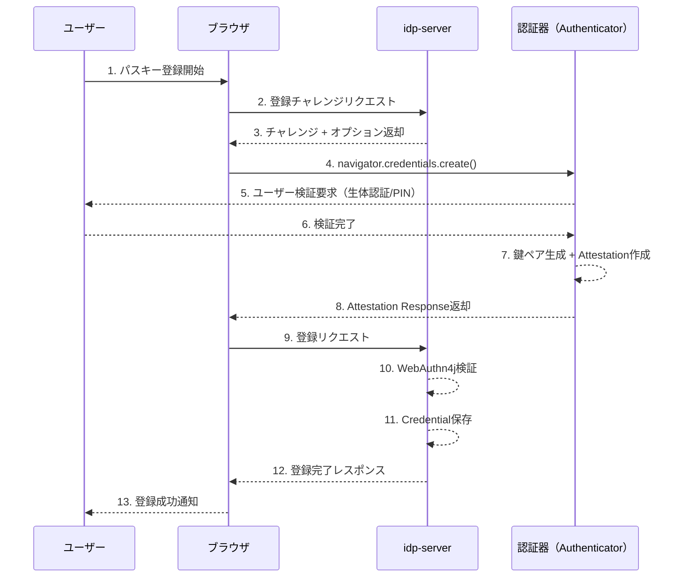
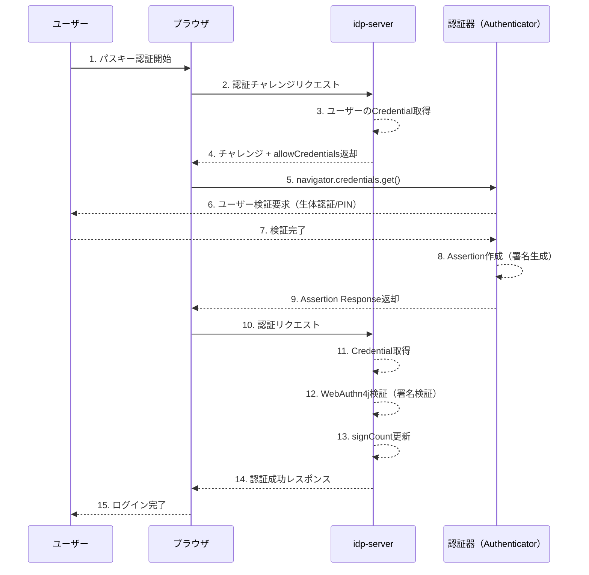

# FIDO2 / WebAuthn 認証フロー

---

## 前提知識

このドキュメントを理解するには、以下の基礎知識が役立ちます：

- [OAuth 2.0の基本](../content_03_concepts/basic/basic-06-oauth2-authorization.md) - OAuth 2.0の認可の仕組み
- [認可コードグラントフロー](../content_03_concepts/basic/basic-08-oauth2-authorization-code-flow.md) - 認可フロー内での認証
- 公開鍵暗号の基本 - WebAuthnの暗号化の仕組み

---

## 概要

`idp-server` は、W3C WebAuthn および FIDO2 仕様に準拠したパスキー認証をサポートしています。

WebAuthn（Web Authentication API）は、公開鍵暗号方式を用いた強力な認証メカニズムであり、以下のような特徴があります：

- **フィッシング耐性**: 公開鍵認証により、パスワード漏洩のリスクを排除
- **パスワードレス認証**: 生体認証やPINを用いた認証でユーザー体験を向上
- **多様な認証器サポート**: セキュリティキー、スマートフォン、PC内蔵認証器に対応

### ユースケース

| ユースケース | 認証器タイプ | ユーザー体験 |
|---------|---------|---------|
| **パスワードレスログイン** | Platform（TouchID/FaceID/Windows Hello） | デバイス生体認証のみで即座にログイン |
| **2要素認証（2FA）** | Cross-platform（USB/NFCセキュリティキー） | パスワード + セキュリティキータップ |
| **高セキュリティ認証** | FIDO2認定セキュリティキー | PIN入力 + セキュリティキータップ |
| **スマホ連携認証** | Hybrid（QRコード経由） | QRコード読み取り + スマホ生体認証 |

---

## WebAuthn仕様準拠

`idp-server` は以下の仕様に準拠しています：

- [W3C WebAuthn Level 2](https://www.w3.org/TR/webauthn-2/)
- [FIDO CTAP2.1](https://fidoalliance.org/specs/fido-v2.1-ps-20210615/fido-client-to-authenticator-protocol-v2.1-ps-errata-20220621.html)
- [WebAuthn4j 0.30.0.RELEASE](https://github.com/webauthn4j/webauthn4j) - サーバー側検証ライブラリ

---

## シーケンス

### 登録フロー（Registration）



**主要ステップ**:

1. **チャレンジ取得（1-3）**: ユーザーが登録開始 → サーバーがチャレンジ生成
2. **認証器操作（4-8）**: ブラウザが認証器を呼び出し → 鍵ペア生成 → 公開鍵返却
3. **サーバー検証・保存（9-13）**: サーバーが署名検証 → 公開鍵をデータベース保存

---

### 認証フロー（Authentication）



**主要ステップ**:

1. **チャレンジ取得（1-4）**: ユーザーが認証開始 → サーバーが保存済みCredential ID返却
2. **認証器操作（5-9）**: ブラウザが認証器を呼び出し → 秘密鍵で署名生成
3. **サーバー検証（10-15）**: サーバーが公開鍵で署名検証 → 認証成功

---

## ユーザー体験に影響するパラメータ

WebAuthnでは、以下のパラメータがユーザーの認証体験に直接影響します。

### 主要パラメータ

| パラメータ | 設定値 | ユーザー体験 | ユースケース |
|-----------|--------|-------------|-------------|
| **residentKey** | `required` | ユーザー名入力不要 | パスワードレスログイン |
|  | `discouraged` | ユーザー名入力必須 | 2要素認証 |
| **userVerification** | `required` | 毎回PIN/生体認証 | 高セキュリティ認証 |
|  | `discouraged` | タップのみ | UX優先 |
| **authenticatorAttachment** | `platform` | デバイス内蔵認証器のみ | TouchID/FaceID |
|  | `cross-platform` | 外部セキュリティキーのみ | YubiKey等 |
|  | 未指定 | 全認証器から選択可能 | 柔軟な認証 |

**詳細**:
- [FIDO2 / WebAuthn 登録フロー詳細](protocol-04-fido2-webauthn-detail-registration.md) - 登録時のパラメータと挙動
- [FIDO2 / WebAuthn 詳細ガイド](protocol-04-fido2-webauthn-detail.md) - 認証時のパラメータと挙動

---

## パラメータの設定箇所と制御

WebAuthn の設定項目は、**サーバーが制御する項目**と**クライアントが制御する項目**に分類されます。
これを理解することで、適切な設計とセキュリティ実装が可能になります。

### サーバーが決定する項目（クライアントは変更不可）

サーバーが `PublicKeyCredentialCreationOptions` で返す項目。クライアントはそのまま使用し、変更は検証時にエラーとなります。

| カテゴリ | 項目 | 説明 | 例 |
|---------|------|------|---|
| **必須** | `challenge` | ランダムチャレンジ（リプレイ攻撃対策） | `"Y2hhbGxlbmdl..."` |
|  | `rp.id` | Relying Party ID（フィッシング対策の要） | `"example.com"` |
|  | `rp.name` | Relying Party 表示名 | `"Example Service"` |
|  | `user.id` | ユーザーID（バイナリ、ユーザー識別の要） | `"dXNlcjEyMw"` |
|  | `user.name` | ユーザー名（識別子） | `"user@example.com"` |
|  | `user.displayName` | ユーザー表示名 | `"User Name"` |
|  | `pubKeyCredParams` | 許可する署名アルゴリズム | `[{type: "public-key", alg: -7}]` |
| **推奨** | `timeout` | タイムアウト（ミリ秒） | `60000` |
|  | `authenticatorSelection.authenticatorAttachment` | 認証器タイプ制限 | `"platform"` / `"cross-platform"` |
|  | `authenticatorSelection.residentKey` | Resident Key要件 | `"required"` / `"preferred"` / `"discouraged"` |
|  | `authenticatorSelection.userVerification` | User Verification要件 | `"required"` / `"preferred"` / `"discouraged"` |
|  | `attestation` | Attestation要件 | `"none"` / `"indirect"` / `"direct"` |
| **オプション** | `excludeCredentials` | 除外するCredential ID | `[{id: "...", type: "public-key"}]` |

**重要な設計原則**:
- ✅ これらはサーバーのセキュリティポリシーとして設定
- ✅ クライアントによる変更は検証時に検出され、エラーとなる
- ❌ 絶対にクライアントに委ねてはいけない: `rp.id`, `challenge`, `user.id`

---

### クライアントが決定/追加できる項目

サーバーから受け取った設定に**クライアント側で追加**できる項目。

#### Extensions（クライアント専用）

**サーバーは指定できません**。クライアントのJavaScriptで設定します。

```javascript
const credential = await navigator.credentials.create({
  publicKey: {
    ...serverOptions,  // サーバーから受け取った設定
    extensions: {      // ← クライアント側で追加
      credProtect: 2,
      enforceCredentialProtectionPolicy: false,
      credProps: true,
      largeBlob: {
        support: "required"
      }
    }
  }
});
```

**主要なExtensions**:

| Extension | 説明 | 設定箇所 | 用途 |
|-----------|------|---------|------|
| **credProtect** | 認証時のUV要求レベル（1/2/3） | クライアント | 認証時のセキュリティレベル制御 |
| **credProps** | Credential情報取得（rk等） | クライアント | Resident Key状態の確認 |
| **largeBlob** | 大容量データ保存 | クライアント | 追加データの認証器保存 |
| **minPinLength** | 最小PIN長取得 | クライアント | PIN要件の確認 |
| **hmacSecret** | HMAC秘密鍵生成 | クライアント | 鍵派生 |

**参考**: [FIDO2 登録詳細 - credProtect](protocol-04-fido2-webauthn-detail-registration.md#14-credential-protection-credprotect)

---

#### Transports（認証器が決定）

サーバーは指定できません。認証器が返す情報をクライアントが取得してサーバーに送信します。

```javascript
const credential = await navigator.credentials.create({...});

// 認証器が返すTransports
const transports = credential.response.getTransports();
// 例: ["internal"], ["usb", "nfc"], ["hybrid"]

// サーバーに保存（次回認証時の allowCredentials で使用）
```

**Transports の用途**:
- 認証時のブラウザUI最適化（"セキュリティキーを挿入" vs "TouchIDを使用"）
- `allowCredentials` のヒント情報として利用

---

### サーバー設定の上書き（非推奨）

**理論上は可能ですが、実用上は非推奨**です。

```javascript
const serverOptions = await fetch('/challenge').then(r => r.json());

// ❌ 非推奨: サーバー設定を上書き
serverOptions.timeout = 120000;  // サーバーは60000を期待
serverOptions.authenticatorSelection.residentKey = "discouraged";  // サーバーは"required"を期待

const credential = await navigator.credentials.create({
  publicKey: serverOptions
});

// サーバー検証時にエラーの可能性あり
```

**エラーとなる理由**:
- サーバーが検証時に「送信した設定」と「実際の結果」を比較
- 期待値との不一致で検証失敗

---

### 設定責任の分類まとめ

| カテゴリ | 項目 | 設定箇所 | 備考 |
|---------|------|---------|------|
| **セキュリティポリシー** | `rp.id`, `challenge`, `user.id`, `pubKeyCredParams` | サーバー必須 | クライアント変更不可 |
| **認証体験制御** | `userVerification`, `residentKey`, `authenticatorAttachment`, `timeout` | サーバー推奨 | クライアント変更は非推奨 |
| **認証器拡張機能** | `credProtect`, `credProps`, `largeBlob` | クライアント専用 | サーバーは指定不可 |
| **認証器固有情報** | `transports`, `aaguid`, `flags` | 認証器決定 | クライアント取得→サーバー保存 |

**設計ガイドライン**:
- 🔒 **サーバーが制御**: セキュリティポリシー、ユーザー体験、信頼性要件
- 🖥️ **クライアントが制御**: 認証器拡張機能、デバイス固有設定
- ⚠️ **絶対禁止**: クライアントへのセキュリティポリシー委譲

---

## 設定

### テナント設定項目

| 項目 | 説明 | デフォルト値 |
|------|------|------------|
| `rpId` | Relying Party ID（ドメイン名） | テナントドメイン |
| `origin` | 許可するOriginリスト | テナントURL |
| `timeout` | チャレンジ有効期限（ミリ秒） | 120000（2分） |
| `authenticatorSelection.residentKey` | Resident Key要件 | `preferred` |
| `authenticatorSelection.userVerification` | ユーザー検証要件 | `preferred` |
| `authenticatorSelection.authenticatorAttachment` | 認証器タイプ制約 | 未指定 |

### 設定例: パスワードレスログイン

```json
{
  "rpId": "example.com",
  "origin": "https://example.com",
  "timeout": 120000,
  "authenticatorSelection": {
    "residentKey": "required",
    "userVerification": "required",
    "authenticatorAttachment": "platform"
  }
}
```

**動作**: ユーザー名入力不要 + TouchID/FaceID認証のみ

---

### 設定例: 2要素認証（セキュリティキー）

```json
{
  "authenticatorSelection": {
    "residentKey": "discouraged",
    "userVerification": "discouraged",
    "authenticatorAttachment": "cross-platform"
  }
}
```

**動作**: ユーザー名入力 + セキュリティキータップ

---

## 認証ポリシー連携

WebAuthn認証は、認可コードフロー内の認証ステップとして利用できます。

### 認証ポリシー設定例

```json
{
  "authentication_policy": {
    "id": "policy-fido2",
    "conditions": {
      "acr_values": ["fido2"]
    },
    "available_methods": [
      {
        "type": "fido2",
        "configuration": {
          "authenticatorSelection": {
            "residentKey": "required",
            "userVerification": "required"
          }
        }
      }
    ],
    "success_conditions": {
      "required_methods": ["fido2"]
    }
  }
}
```

### 多要素認証フロー

```json
{
  "authentication_policy": {
    "available_methods": [
      {"type": "password"},
      {"type": "fido2"}
    ],
    "success_conditions": {
      "required_methods": ["password", "fido2"],
      "order": "sequential"
    }
  }
}
```

**動作**: パスワード認証成功 → FIDO2認証 → ログイン完了

---

## セキュリティ

### 主要な検証項目

`idp-server` は WebAuthn4j を使用して以下を自動検証します：

| 検証項目 | 目的 |
|---------|------|
| **Origin検証** | フィッシング攻撃防止（異なるドメインからの認証を拒否） |
| **Challenge検証** | 再利用攻撃防止（チャレンジは1回のみ有効） |
| **署名検証** | 秘密鍵の所有証明（公開鍵で署名を検証） |
| **signCount検証** | Credentialクローン検出（カウンタ増加を確認） |

### FAPI準拠

FAPI 1.0 Advanced準拠のための設定：

```json
{
  "authenticatorSelection": {
    "userVerification": "required"
  },
  "timeout": 300000
}
```

**追加要件**:
- TLS 1.2以上
- MTLS（Mutual TLS）推奨

---

## トラブルシューティング

### よくある問題

| 問題 | 原因 | 解決策 |
|------|------|--------|
| **登録時**"認証器が見つかりません" | authenticatorAttachment制約 | [登録詳細 3.1](protocol-04-fido2-webauthn-detail-registration.md#31-認証器が見つかりません) |
| **登録時**"ユーザー検証に失敗" | userVerification="required"だが認証器非対応 | [登録詳細 3.2](protocol-04-fido2-webauthn-detail-registration.md#32-ユーザー検証に失敗しました) |
| **認証時**"認証器が見つかりません" | allowCredentialsとCredential不一致 | [認証詳細 5.1](protocol-04-fido2-webauthn-detail.md#51-認証器が見つかりません) |
| **認証時**パスワードレスログイン不可 | rk=falseでallowCredentials=[] | [認証詳細 5.3](protocol-04-fido2-webauthn-detail.md#53-パスワードレスログインできない) |

**詳細**:
- [FIDO2 / WebAuthn 登録フロー詳細 - トラブルシューティング](protocol-04-fido2-webauthn-detail-registration.md#3-登録時のトラブルシューティング)
- [FIDO2 / WebAuthn 詳細ガイド - トラブルシューティング](protocol-04-fido2-webauthn-detail.md#5-トラブルシューティング)

---

## 参考資料

### 標準仕様
- [W3C WebAuthn Level 2 Recommendation](https://www.w3.org/TR/webauthn-2/)
- [FIDO CTAP2.1 Specification](https://fidoalliance.org/specs/fido-v2.1-ps-20210615/fido-client-to-authenticator-protocol-v2.1-ps-errata-20220621.html)
- [FAPI 1.0 Advanced](https://openid.net/specs/openid-financial-api-part-2-1_0.html)

### ライブラリ
- [WebAuthn4j GitHub](https://github.com/webauthn4j/webauthn4j)
- [WebAuthn4j Documentation](https://webauthn4j.github.io/webauthn4j/en/)

### 関連ドキュメント
- [FIDO2 / WebAuthn 登録フロー詳細](protocol-04-fido2-webauthn-detail-registration.md) - 登録時のパラメータ・トラブルシューティング
- [FIDO2 / WebAuthn 詳細ガイド](protocol-04-fido2-webauthn-detail.md) - 認証時のパラメータ・トラブルシューティング
- [認証設定ガイド](../content_06_developer-guide/05-configuration/authn/webauthn.md) - テナント設定方法
- [AI開発者向けガイド](../content_10_ai_developer/ai-14-authentication-federation.md) - 実装クラス詳細

---
