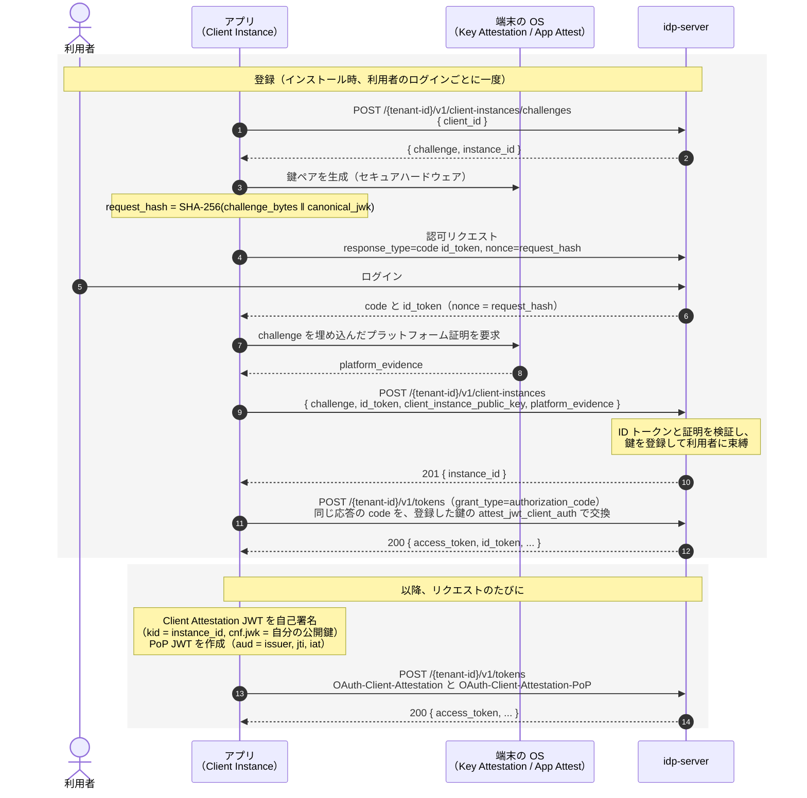
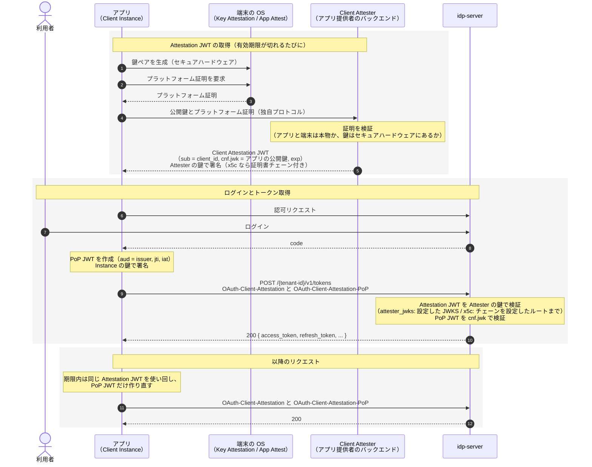

# Attestation-Based Client Authentication

---

## 前提知識

- [クライアント認証](./protocol-06-client-authentication.md) - `idp-server` がサポートする他の認証方式
- [Attestation-Based Client Authentication（仕様編）](../content_11_learning/16-oauth-oidc-rfc/client-auth/attestation-based-client-auth.md) - draft-10 の解説
- [同（実践編）](../content_11_learning/16-oauth-oidc-rfc/client-auth/attestation-based-client-auth-practice.md) - モバイル側の鍵管理とデバイス証明の取得

---

## 概要

`attest_jwt_client_auth` は、**シークレットを配布せずにネイティブアプリを認証する**クライアント認証方式です（[draft-ietf-oauth-attestation-based-client-auth-11](https://www.ietf.org/archive/id/draft-ietf-oauth-attestation-based-client-auth-11.html)）。

モバイルアプリは配布物であり、埋め込んだシークレットは取り出せます。そのため従来は Public Client（`none`）として扱うしかありませんでした。この方式は、**アプリのインスタンスごとに端末内で生成した鍵**（Client Instance Key）で認証します。鍵は端末のセキュアハードウェアから出ないため、アプリを複製しても他の端末では使えません。

認証は2つの JWT をヘッダで送ることで行います。

| ヘッダ | JWT | 署名する鍵 | 主張する内容 |
|--------|-----|-----------|-------------|
| `OAuth-Client-Attestation` | Client Attestation JWT | Client Attester の鍵、または登録済み Client Instance Key | この client_id のインスタンスがこの公開鍵を持っている |
| `OAuth-Client-Attestation-PoP` | Client Attestation PoP JWT | Client Instance Key | その鍵を**いま**保持している |

前者が「鍵の持ち主は正当なアプリである」、後者が「その鍵で今このリクエストを出している」を担当します。片方だけでは成立しません。

---

## シーケンス

Attestation JWT に誰が署名するかで、流れが 2 つに分かれます（どちらを選ぶかは[信頼モデル](#信頼モデル-誰が-attestation-jwt-に署名するか)）。

| 形 | `client_attestation_trust_source` | Attestation JWT の署名者 | 認可サーバーへのインスタンス登録 |
|---|---|---|---|
| [自己署名](#自己署名registered_instance_key) | `registered_instance_key` | アプリ自身 | 必要 |
| [Attester をバックエンドに持つ](#attester-をバックエンドに持つattester_jwks--x5c) | `attester_jwks` / `x5c` | アプリ提供者のバックエンド（Client Attester） | 不要 |

### 自己署名（registered_instance_key）

インストールから最初のトークン取得まで。



Android Key Attestation では、証明書チェーンは鍵の生成時に得られます（手順 3 と 7〜8 が一度に済みます）。どちらの場合も、鍵は challenge を受け取ってから作ります。証明に challenge を埋め込むためです。

### Attester をバックエンドに持つ（attester_jwks / x5c）

アプリ提供者が **Client Attester**（バックエンド）を運用する形です。端末とアプリが本物かを確かめるのは Attester で、認可サーバーは Attester の署名を信頼します。認可サーバーへのインスタンス登録はありません。



- **アプリと Attester のやりとり**（証明の送り方、チャレンジの出し方）は ABCA の範囲外で、アプリ提供者が決めます。Attester が発行した使い捨てのチャレンジを証明に含めさせ、過去の証明の使い回しを防ぐのが一般的です。
- **Attestation JWT の期限が切れたら**、アプリは Attester から取り直します。期限切れのまま送ると `use_fresh_attestation` が返ります。
- **特定のインスタンスを止める手段は、Attestation JWT の有効期限だけです。** インスタンスは認可サーバーに登録されていないので、認可サーバーからは止められません。Attester が次の Attestation JWT を出さなければ、期限切れで止まります。`idp-server` はこの形では有効期限に上限を掛けない（自己署名は 24 時間まで）ので、Attester 側で短くしてください。
- 利用者への束縛はありません。Attestation JWT が保証するのは「本物のアプリの、この鍵」までで、誰が使っているかはログインで決まります。

Challenge を必須にしている場合は、リクエスト前に `POST /{tenant-id}/v1/client-attestation/challenges` で取得した値を PoP JWT の `challenge` クレームに入れます。

---

## エンドポイント体系

### クライアント（アプリ）側

| エンドポイント | 用途 |
|---|---|
| `POST /{tenant-id}/v1/client-instances/challenges` | インスタンス登録用チャレンジの取得。`{ client_id }` を送り、`{ challenge, instance_id }` を受け取る |
| `POST /{tenant-id}/v1/client-instances` | Client Instance Key の登録。`{ challenge, id_token, client_instance_public_key, platform_evidence }` |
| `POST /{tenant-id}/v1/client-attestation/challenges` | PoP 用チャレンジの取得。レスポンスの `attestation_challenge` を PoP JWT に入れる |

登録系の2つは**クライアント認証を要求しません**（インストール直後で、まだ認証に使う鍵が無いため）。チャレンジ取得は無認証、登録は **ID トークン**（誰か）と**プラットフォーム証明**（どの端末・鍵か）で認証されます。詳しくは [Client Instance 登録の認証](#client-instance-登録の認証)。

なお2つのヘッダは、リクエストごとに**それぞれ厳密に1個**です。同じヘッダを複数送ると拒否されます。

### クライアント認証を行うエンドポイント

2つのヘッダは、クライアント認証が発生する経路すべてで受け付けます。

| エンドポイント | |
|---|---|
| トークン | `POST /{tenant-id}/v1/tokens` |
| Pushed Authorization Request | `POST /{tenant-id}/v1/authorizations/push` |
| CIBA backchannel authentication | `POST /{tenant-id}/v1/backchannel/authentications` |
| Introspection | `POST /{tenant-id}/v1/tokens/introspection` |
| Revocation | `POST /{tenant-id}/v1/tokens/revocation` |

### 管理API側

| エンドポイント | 用途 |
|---|---|
| `GET /v1/management/tenants/{tenant-id}/client-instances` | テナント内のインスタンスの検索 |
| `POST /v1/management/tenants/{tenant-id}/client-instances` | 登録（`client_id` はボディで指定） |
| `GET\|DELETE /v1/management/tenants/{tenant-id}/client-instances/{id}` | 取得・削除 |
| `POST /v1/management/tenants/{tenant-id}/client-instances/{id}/revoke` | 失効（→ [失効と削除](#client-instance-の失効と削除)） |

上はシステムレベル（管理テナントのトークン）のパスです。組織の管理者は、同じ操作を組織レベルのパス `/v1/management/organizations/{organization-id}/tenants/{tenant-id}/client-instances` で使います。

どちらも専用権限 `idp:client-instance:create` / `:read` / `:revoke` / `:delete` で保護されています。詳細は [Client Instance 管理API](/docs/content_07_reference/cp-client-instance-api-ja) を参照してください。登録は、アプリからの登録を使わず運用側で鍵を登録する場合に使います。

インスタンスはクライアントの下ではなくテナントの直下に置いています。運用で手元にあるのは利用者・鍵・証明書のシリアルで、どのクライアントのものかは調べるまで分からないためです。`id` は UUID で、テナント内で 1 件に決まります。

検索条件（すべて任意、組み合わせ可）:

| パラメータ | 使う場面 |
|---|---|
| `client_id` | クライアントで絞る |
| `user_id` | 利用者の問い合わせ（その人の端末の一覧） |
| `status` / `revocation_reason` | 有効なもの、失効したものと理由（`active` / `revoked`、`operator` / `superseded`） |
| `certificate_serial` | 証明書の漏えい時に、その証明書を経由して登録したインスタンスを探す（`attestation_evidence` のチェーンのシリアル。大文字でも可） |
| `platform` | 証明の種類（`android-key-attestation` / `ios-app-attest` など） |
| `instance_key_thumbprint` | 鍵（RFC 7638 サムプリント）からインスタンスを引く |
| `from` / `to` | 登録日時の範囲 |
| `limit` / `offset` | ページング。レスポンスに `total_count` が付きます |

取りうる値が決まっている条件（`status`、`revocation_reason`、UUID の `user_id`）に合わない値は 400 を返します。空の一覧を返すと「該当なし」と読み違えるためです。

---

## 2つの JWT の作り方

### Client Attestation JWT

```
{
  "typ": "oauth-client-attestation+jwt",
  "alg": "ES256",
  "kid": "<instance_id>"
}
.
{
  "sub": "<client_id>",
  "exp": 1735689600,
  "iat": 1735686000,
  "cnf": {
    "jwk": { "kty": "EC", "crv": "P-256", "x": "...", "y": "..." }
  }
}
```

| 項目 | 要件 |
|---|---|
| `typ` | `oauth-client-attestation+jwt` 固定 |
| `alg` | `client_attestation_signing_alg_values_supported` に含まれる値。`none` と MAC 系（HS*）は拒否されます |
| `sub` | 認証する `client_id` と一致すること |
| `exp` | 必須。期限内であること |
| `cnf.jwk` | Client Instance Key の**公開鍵**。`d` などの秘密鍵成分を含めてはいけません |
| `kid` | `registered_instance_key` では**必須**。登録時に受け取った `instance_id` を入れます |

:::danger registered_instance_key では kid が無いと必ず 401 になります
自己署名モードでは、認可サーバーは **JOSE ヘッダの `kid` を `instance_id` として**登録済みの鍵を引きます。`kid` が無いと鍵を解決できず、署名検証に到達する前に失敗します。

`instance_id` はチャレンジ取得（`POST /{tenant-id}/v1/client-instances/challenges`）のレスポンスで返る値です。**登録時に受け取ったら保存し、以降すべての Client Attestation JWT の `kid` に入れてください。**

偽の `kid` を入れても、選ばれた鍵で署名が検証できないため通りません。

`attester_jwks` では `kid` は鍵の選択に使われません（`client_attestation_attester_jwks` の鍵で検証します）。Attester の鍵を複数並べてローテーションする場合は、JWKS 側と Attestation JWT 側で `kid` を揃えてください。

**PoP JWT の `kid` は見ていません。** PoP の検証鍵は Attestation JWT の `cnf.jwk` から決まるためです。
:::

自己署名の場合は追加で、`cnf.jwk` が登録済みの鍵と一致すること（RFC 7638 thumbprint 比較）、`exp - iat` が **24時間以内**であることが必要です。

**Client Attestation JWT は有効期限まで使い回せます**（draft-11 Section 10.2）。リクエストごとに作り直す必要があるのは PoP JWT の方だけです。`attester_jwks` では Attester への往復を有効期限のあいだ省けます。

### Client Attestation PoP JWT

```
{
  "typ": "oauth-client-attestation-pop+jwt",
  "alg": "ES256"
}
.
{
  "aud": "<認可サーバーの issuer identifier>",
  "jti": "<リクエストごとに一意>",
  "iat": 1735686000,
  "challenge": "<attestation_challenge>"
}
```

| 項目 | 要件 |
|---|---|
| 署名鍵 | Attestation JWT の `cnf.jwk` に対応する秘密鍵 |
| `typ` | `oauth-client-attestation-pop+jwt` 固定 |
| `aud` | 認可サーバーの issuer identifier（テナントの `issuer`） |
| `jti` | 必須。リクエストごとに一意な値 |
| `iat` | 必須。現在時刻から**±5分以内**であること |
| `challenge` | `client_attestation_challenge_required` が有効なテナントでは必須 |
| `iss` | draft-11 は PoP JWT に定義していません。載せても §5.1 の「MAY contain other claims」として無視されます |
| `exp` | 同上。有効範囲は `iat` の窓が決めます |

:::tip 実装のポイント
PoP JWT は**リクエストごとに新しく作ります**。`jti` はリプレイ検出のための識別子で、`iat` の窓とあわせて PoP の有効範囲を絞ります。

ただし現時点の実装は **`jti` の存在を確認するだけで、使用済み `jti` の記録は行っていません**。同じ PoP JWT を `iat` の ±5分窓内で再送すると通ります。検出を前提にした設計にはせず、毎回新しく作ってください。
:::

---

## 信頼モデル: 誰が Attestation JWT に署名するか

draft-11 は**Client Attester への信頼の確立を仕様の範囲外**としています（Section 10.8「Trust Management and Key Resolution」）。ただし同じ節で取りうる形は示しており、`attester_jwks` と `x5c` はそのうちの 2 つです。`idp-server` はクライアント設定 `client_attestation_trust_source` で切り替えます。

| | `attester_jwks`（既定） | `x5c` | `registered_instance_key` |
|---|---|---|---|
| Attestation JWT の署名者 | Client Attester | Client Attester | Client Instance（自己署名） |
| 認可サーバーが信頼する鍵 | `client_attestation_attester_jwks` に登録した公開鍵 | `x5c` のチェーンを `client_attestation_trusted_root_certificates` まで検証したリーフ | 事前登録した Client Instance Key |
| インスタンスの事前登録 | 不要 | 不要 | 必要 |
| Client Attester の運用 | 必要 | 必要 | 不要 |
| 「正当なアプリか」の判断 | Attester がプラットフォーム証明を検証 | 同左 | 登録時のみ。以降は鍵の所持が根拠 |
| Attester の鍵交代 | **全クライアント設定の更新が必要** | ルートが変わらなければ設定変更不要 | 該当なし |

### どちらを選ぶか

**アプリ提供者がサーバーを持っている**なら `attester_jwks` か `x5c`。App Attest / Play Integrity の検証を Attester 側に集約でき、認可サーバーはプラットフォームごとの差異を知らずに済みます。アプリが複数の認可サーバーに接続する場合も、Attestation JWT を1か所で発行できます。

そのうえで、**証明書の階層を持っているなら `x5c`**。違いは鍵交代を誰が負担するかです。`attester_jwks` は Attester が署名鍵を替えるたびに、その Attester を信頼している全クライアント設定を更新して回る必要があります。`x5c` ならルートを1つ登録しておけば、リーフの交代は認可サーバー側の設定変更なしに吸収されます。

**Attester を運用しない**なら `registered_instance_key`。認可サーバーへの登録が信頼の起点になるため、**登録経路の強度がそのまま全体の強度**になります。アプリからの登録は ID トークンで認証し、インスタンスを利用者に束縛します（`client_instance_registration_policy: user_bound`）。

1 つのインスタンスを複数の利用者が使う端末（窓口の端末など）や、Attester が別の事業者であるウォレット型のクライアントは、利用者に束縛できないため `registered_instance_key` の対象外です。`attester_jwks` か `x5c` を使います。ウォレットについては、HAIP がインスタンスに固有の識別子を持ち込まないことを求めている点も理由です（`registered_instance_key` は `kid` にインスタンスの ID を入れるため、インスタンスごとに固有の値が認可サーバーに渡ります）。

### `x5c` の設定

```json
"extension": {
  "client_attestation_trust_source": "x5c",
  "client_attestation_trusted_root_certificates": ["<ルート証明書 DER の base64>"]
}
```

ピン留めするのは**ルート**であって Attester の証明書ではありません。ルートがリーフより長生きすることが、この方式の利点の前提だからです。

チェーンは信頼できない入力です。**ルートまでの検証だけが意味を与えます** — 単にパースできるチェーンは送ってきた者が書いたもので、そのリーフ鍵は自分の署名を検証できてしまいます。したがって検証に失敗したチェーンからは鍵を返さず、認証は「信頼できる鍵が無い」として失敗します。

:::tip トラストアンカーはチェーンに含めても含めなくても動きます
HAIP は `x5c` に**トラストアンカーを含めてはならない**としています。認可サーバーはルートを設定から持っているため、リーフだけのチェーンでも、ルートまで含むチェーンでも検証できます。
:::

:::danger x5c では JWKS に alg を書く必要がありません
`attester_jwks` では、JWKS の鍵に `kid` も `alg` も無いと**署名検証に到達する前に 401 になります**（`kid` が無ければ `alg` で鍵を引くため）。`x5c` では証明書から鍵を取り出す際に、提示された `alg` をその鍵に付けてから返すので、この落とし穴がありません。
:::

### 2つの設定の関係

`client_instance_registration_policy` が効くのは、**`registered_instance_key` を選んでインスタンス登録を行うときだけ**です。`attester_jwks` では登録した鍵が認証時に参照されないため、設定しても効きません。

```
 attester_jwks / x5c
   └ 登録エンドポイントを使わない
        → client_instance_registration_policy は不要

 registered_instance_key
   ├ アプリから登録させる
   │    └ user_bound … ID トークンで登録を認証し、インスタンスを利用者に束縛する
   └ 運用側が管理APIで登録する
        → policy は参照されない
```

| 登録経路 | policy | 挙動 |
|---|---|---|
| アプリから | `user_bound` | ID トークンとプラットフォーム証明を検証し、ID トークンの利用者に束縛する |
| アプリから | **未設定・未知の値** | **登録を拒否**します |
| 管理APIから | 何でも | policy に関係なく登録できます（利用者には束縛されません） |

---

## Client Instance 登録の認証

アプリからの登録は、2 つのもので認証します。

| 何で | 何を示すか |
|---|---|
| **ID トークン** | 誰がログインしたか（インスタンスを束縛する利用者） |
| **プラットフォーム証明** | どの端末の、どのアプリの、どの鍵か |

2 つを結びつけるのが `request_hash` です。

```
request_hash = base64url_nopad( SHA-256( challenge_bytes || canonical_jwk_utf8 ) )
canonical_jwk = RFC 7638 thumbprint の入力（必須メンバのみ・辞書順・空白なし）
```

アプリはこの値を**認可リクエストの `nonce`** に指定してログインします。返ってくる ID トークンの `nonce` は、このチャレンジとこの鍵にしか合いません。

```json
{
  "challenge": "<チャレンジ取得で得た値>",
  "id_token": "<nonce に request_hash を指定して取得した ID トークン>",
  "client_instance_public_key": { "kty": "EC", "crv": "P-256", "x": "...", "y": "..." },
  "platform_evidence": {
    "platform": "<プラットフォーム識別子>",
    "...": "<プラットフォームごとの証明>"
  }
}
```

:::info nonce に鍵まで含める理由
`nonce` がチャレンジだけだと、漏れた ID トークンと**攻撃者自身の本物の端末**の証明を組み合わせて、被害者の利用者に攻撃者の鍵を束縛できてしまいます。鍵を含めた `request_hash` なら、被害者の端末の中にある鍵が無い限り一致しません。
:::

### 1 人の利用者に有効なインスタンスは 1 つ

登録が成功すると、**同じ利用者の同じクライアントの、他の有効なインスタンスを失効させます**。失効と新しいインスタンスの登録は同じトランザクションで行います。

- 端末が同じかどうかは判定しません。インスタンスは端末ではなく、鍵の登録の単位です。アプリを入れ直しても、2 台目の端末に入れても、前のインスタンスは失効します
- 失効したインスタンスは `revocation_reason: superseded` として残り、失効したインスタンスごとにセキュリティイベント `client_instance_revoked`（`superseded_by` に新しいインスタンス）を出します。利用者への通知に使えます
- 旧い端末のアプリは次のリクエストで `401 invalid_client_attestation` を受け取ります。登録し直すには鍵を作り直してログインからやり直します（失効した鍵は再登録できません）。そうすると今度は新しい端末の方が失効します
- **置き換えられたインスタンスのトークンは削除しません。** 失効した時点で旧い端末は次のクライアント認証（リフレッシュを含む）で止まります。トークンまで消すのは「他の端末からログアウトさせる」操作で、端末の紛失や盗難のときに管理API の失効・削除で明示的に行います（→ [インスタンスに発行したトークン](#インスタンスに発行したトークン)）。アクセストークンは有効期限まで使えます
- 同じ利用者の登録が同時に 2 件走っても、有効なインスタンスが 2 つ残ることはありません。データベースの一意制約で後の方が失敗します

### 1 つの鍵は 1 つのインスタンスだけ

同じテナントの中では、1 つの鍵を登録できるインスタンスは 1 つだけです。クライアントが違っても、失効したインスタンスの鍵でも、同じ鍵はもう一度登録できません（削除したインスタンスの鍵は除きます）。アプリからの登録でも管理API からの登録でも同じです。

リフレッシュトークンは鍵に束縛されます。同じ鍵が 2 つのインスタンスに載ると、片方を失効させても鍵がもう片方の経路で使え続けてしまうためです。範囲をテナントに留めているのは、テナントをまたぐ制約にすると、あるテナントの登録が別のテナントの鍵の有無を明かしたり、妨げたりできてしまうためです。

### ID トークンの検証

| # | 検証 |
|---|---|
| 1 | この認可サーバーが署名した JWS であること（暗号化された ID トークンは受け付けません） |
| 2 | `iss` がこの認可サーバーで、`exp` を過ぎていないこと |
| 3 | `aud` が登録先のクライアント、またはその `client_instance_registration_clients` に載ったクライアントであること |
| 4 | `nonce` が、チャレンジと `client_instance_public_key` から計算した `request_hash` と一致すること |
| 5 | `iat` がチャレンジの発行より後であること（この登録のためのログインであること） |
| 6 | `sub` の利用者が存在し、有効であること |

### ID トークンの取り方

ID トークンは**クライアント認証なしで**取得する必要があります。登録が済むまで、アプリはクライアント認証に使う鍵を持たないからです。

| 経路 | 取得のしかた | 使いどころ |
|---|---|---|
| **同じクライアント** | ハイブリッドフロー（`response_type=code id_token`）。認可応答で ID トークンとコードが同時に返る。登録後、同じコードを登録した鍵の `attest_jwt_client_auth` で交換する | 基本。ログイン 1 回で登録とトークン取得が済む |
| **登録用クライアント** | 登録先クライアントの `client_instance_registration_clients` に載せたパブリッククライアントでログインする | **PAR 必須のテナント**。PAR にはクライアント認証が要るため、登録先クライアント自身では ID トークンを取れない |

```json
"extension": {
  "client_attestation_trust_source": "registered_instance_key",
  "client_instance_registration_policy": "user_bound",
  "client_instance_registration_clients": ["<登録用パブリッククライアントの client_id>"]
}
```

:::warning 登録用クライアントは明示したものだけ
`client_instance_registration_clients` に載っていないクライアントの ID トークンは拒否します。載せていないクライアント（利用者がログインしただけの第三者アプリなど）の ID トークンで、登録先クライアントのインスタンスを登録できないようにするためです。登録用クライアントには `openid` 以外のスコープを与えないでください。
:::

パブリッククライアントを置けないテナント（FAPI 2.0 など）では、どちらの経路も使えません。

:::warning request_hash の計算で間違えやすいところ
1. `challenge` を base64url デコードせず文字列のまま連結している
2. JWK のキー順が辞書順でない
3. JSON に空白が入っている
4. `alg` / `use` / `kid` を含めてしまっている（必須メンバのみ）

固定ベクタ: `challenge=Zm9vYmFyLWNoYWxsZW5nZS0wMQ` → `request_hash=YY-nDEK6JHQLVe893qieCiyyQ2kW5fBmIPNlVdflj1I`
:::

### プラットフォーム証明の検証

`platform_evidence` を検証するのは `PlatformAttestationVerifier` の実装で、プラットフォームごとにモジュールが提供します。**実装が1つも登録されていなければ、登録はすべて拒否されます**（安全側の既定）。

Android Key Attestation の検証は次の順で行います。


証明書チェーンは攻撃者が自由に作れる入力なので、**ピン留めしたルートまで検証しない限り以降の判定は意味を持ちません**。攻撃者は自分で拡張を書けるため、チャレンジもアプリ名も望みどおりに入れられます。

リンクの署名が繋がっているだけでは足りず、**発行者の位置に現れる証明書が実際に発行権限を持つか**（`BasicConstraints cA=TRUE` / `pathLenConstraint` / `KeyUsage keyCertSign`）まで確認します。署名鍵は署名する相手を選ばないため、末端証明書の鍵でも別の証明書を作れてしまうからです。

検査順序とプラットフォーム別の差は [証明書チェーンの検証](./protocol-09-certificate-chain-verification.md)、考え方は [証明書チェーンをどこまで信じるか](../content_03_concepts/06-security-extensions/concept-05-certificate-chain-trust.md) を参照。

設定はクライアントの `client_instance_platform_config` に置きます。

```json
"client_instance_platform_config": {
  "android_key_attestation": {
    "package_names": ["com.example.wallet"],
    "signature_digests": ["<署名証明書の SHA-256（base64url）>"],
    "min_security_level": "trusted_environment"
  }
}
```

| フィールド | 既定 | 内容 |
|---|---|---|
| `package_names` | 必須 | 許可するパッケージ名 |
| `signature_digests` | 必須 | 署名証明書のダイジェスト。**提示された値がすべてここに含まれること**が条件 |
| `min_security_level` | `trusted_environment` | `trusted_environment` / `strong_box`。`software` は常に拒否。**`attestationSecurityLevel` と `keyMintSecurityLevel` の両方**に適用されます |
| `verified_boot_states` | `["verified"]` | 受け入れる起動状態。`verified` / `self_signed` / `unverified`。`failed` は指定できない |
| `require_device_locked` | `true` | ブートローダーがロックされていることを要求する |
| `min_os_patch_level` | なし | OS のセキュリティパッチの下限（`YYYYMM` の数値。例: `202406`） |
| `trusted_root_certificates` | — | ルートの上書き。設定すると WARN ログが出ます（実質そのルートの持ち主を信頼することになるため） |

`signature_digests` が必須なのは、パッケージ名が秘密ではないためです。攻撃者は自分の端末で同じパッケージ名のアプリを名乗れるので、**再署名を見分けるのは署名証明書のダイジェストだけ**です。

設定できない、常に要求する条件が 2 つあります。

| 条件 | 無いと通ってしまうもの |
|---|---|
| `origin` が `KM_ORIGIN_GENERATED` | 外部で生成して取り込んだ鍵。セキュアハードウェア内にあっても生成元に複製が存在するため、所持を示しても「どの端末か」を示せない。`KM_ORIGIN_SECURELY_IMPORTED` も同様に拒否します（ラップした側は平文を持っていたため） |
| `purpose` が `KM_PURPOSE_SIGN` を含む | 署名に使えない鍵。登録は通り、最初の PoP で署名検証に落ちる |

**起動状態も要求します。** パッケージ名と署名ダイジェスト（`attestationApplicationId`）を書くのは Android プラットフォームで、KeyMint ではありません。改造した OS はどのアプリの名前でも名乗れます。KeyMint がブートローダーの計測から書く `rootOfTrust`（`verifiedBootState` と `deviceLocked`）で、正規に検証された OS が起動し、ブートローダーがロックされていることを確かめて初めて、アプリの名乗りを信用できます。既定では `verified` かつロック済みだけを受け入れます。開発端末やカスタム OS（`self_signed`）を通したい配備は、`verified_boot_states` と `require_device_locked` で明示的に緩めます。

鍵の性質（`origin` / `purpose`）も起動状態（`rootOfTrust` / `osPatchLevel`）も、`hardwareEnforced` 側の `AuthorizationList` から読みます。鍵自身の性質を知っているのは KeyMint だけで、`softwareEnforced` に同じ値があっても、それはプラットフォームの申告にすぎないためです。端末が報告しなかった場合も拒否します（判定の材料が無いことは、条件を満たす証拠にはなりません）。


### 登録時に残す証跡

検証で確かめたことは、登録したインスタンスの `attestation_evidence` に残ります。管理API の Client Instance 一覧・取得で読めます。

```json
{
  "platform": "android-key-attestation",
  "verified_at": "2026-09-24T12:00:00.000",
  "key": {
    "attestation_security_level": "strong_box",
    "keymint_security_level": "strong_box",
    "origin": "generated"
  },
  "app": { "package_names": ["com.example.wallet"], "signature_digests": ["..."] },
  "device": { "verified_boot_state": "verified", "device_locked": true, "os_patch_level": 202409 },
  "chain": {
    "certificates": [
      { "serial": "1", "not_after": "2036-01-01T00:00:00Z", "sha256": "<証明書の SHA-256（16進）>" }
    ]
  }
}
```

iOS App Attest では `key` と `device` を持たず、`app` が `{ "app_id": "...", "environment": "production" }` になります。

残す目的は 3 つです。

| 目的 | 使う項目 |
|---|---|
| **まとめて失効する** | `chain.certificates` の `serial`。提示されたチェーンの証明書をすべて、Google の失効リストと同じ形（小文字の 16 進）で残すので、漏洩した鍵や中間証明書に連なるインスタンスを後から探せる |
| **監査** | `key`（セキュリティレベル、生成元）、`app`（一致したアプリ） |
| **方針を厳しくしたときの再評価** | `key`。たとえば StrongBox を必須にしたとき、対象のインスタンスを引ける |

チェーンそのものと、端末を一意に識別する値は残しません。

---

## Client Instance の失効と削除

インスタンスを止める操作と、消す操作は別です。

| | 失効（`POST .../client-instances/{id}/revoke`） | 削除（`DELETE .../client-instances/{id}`） |
|---|---|---|
| 意味 | 信頼をやめる | 記録を消す |
| インスタンスの記録 | 残る（`status: revoked`、`revoked_at`、`revocation_reason`、登録時の証跡） | 消える |
| その鍵での認証 | 401 `invalid_client_attestation` | 401 `invalid_client_attestation` |
| 発行済みのトークン | 削除 | 削除 |
| 同じ鍵の再登録 | できない | できる（別のインスタンスになり、旧いトークンは引き継がない） |
| 使う場面 | 端末の紛失、鍵の漏えい、不正の発覚 | 誤って登録したものの片付け、保持期間を過ぎた記録の整理 |

端末を止めたいときは失効を使います。記録が残るので、誰のどの端末を、いつ、なぜ止めたかを後から追えます。`revocation_reason` は、管理API からの失効が `operator`、同じ利用者の新しい登録に置き換わった失効が `superseded` です。

利用者を削除すると、その利用者のインスタンスは全クライアント分が削除されます。トークンも利用者の削除で消えます。

**失効は元に戻せません。** 失効したインスタンスを有効に戻す操作はありません。すでに失効しているインスタンスをもう一度失効させようとすると 400 を返し、最初の `revoked_at` を保ちます。見つかった端末をもう一度信頼するときは、アプリが新しい鍵を作り、ログインから登録し直します。鍵が手元を離れていたあいだに何があったかは分からないため、ログインとプラットフォーム証明で確かめ直すところから始めます。

### インスタンスに発行したトークン

`registered_instance_key` で発行したトークンは、鍵（draft-11 Section 10.3）に加えて**インスタンス**に束縛されます。

- **リフレッシュは同じインスタンスから。** 同じ鍵でも、削除後に登録し直したインスタンスは別物として扱い、`invalid_grant` を返します
- **利用者に束縛したインスタンスは、その利用者のトークンだけを受け取ります。** 別の利用者の認可コード・CIBA の `auth_req_id`・リフレッシュトークンは `invalid_grant` です
- **`client_instance_registration_policy: user_bound` のクライアントは `client_credentials` を使えません**（`400 unauthorized_client`）。利用者のいるグラントは、ログイン・リフレッシュのたびに利用者が有効かを確かめますが、`client_credentials` のトークンには利用者がいないため、利用者を削除・無効化しても端末がトークンを取り続けられてしまうからです。グラントの可否は他のグラントと同じくクライアント単位で決まり、管理API から登録した（利用者の無い）インスタンスも同じ扱いです。利用者のいない端末やサーバーで `client_credentials` が必要なら、別のクライアントにします。ABCA の仕様の要件ではなく `idp-server` の方針です。先行事例も同じ方向で、IT-Wallet の Credential Issuer はトークンエンドポイントのグラントを `authorization_code` と `refresh_token` に限り、EUDI の PID Issuer は Attestation で認証するクライアントの `client_credentials` を無効にし、バックエンド用の別クライアントにだけ許しています
- **管理API で失効・削除するとトークンも削除します。** リフレッシュトークンと、introspection で確かめるアクセストークンはその時点で止まります。新しい登録で置き換えられた（`superseded`）インスタンスのトークンは削除しません。JWT をリソースサーバーが手元で検証する場合は有効期限まで通るため、即座に止めたいならアクセストークンの有効期限を短くするか introspection を使います

---

## Challenge

PoP JWT の `challenge` クレームは、その PoP がこの認可サーバー向けに作られたことを示します（draft-11 Section 7.2 item 5）。

### 有効化

| 設定 | 既定 | 意味 |
|------|------|------|
| `client_attestation_challenge_required` | `false` | `challenge` を必須にするか |
| `client_attestation_challenge_duration` | `300`（秒） | 発行した Challenge の有効期間 |

エンドポイントの公開と強制を分けてあるため、**先にエンドポイントだけ公開してクライアントの対応を待ち、揃ってから必須化する**移行ができます。

**Challenge は単回消費ではありません。** 有効期間のあいだ何度でも使えます。CIBA のポーリングのように短時間に何度もリクエストする経路で、そのつど取得し直さずに済むようにするためです。既定の 300 秒は `backchannel_authentication_request_expires_in` に合わせてあります。Challenge を短命にしてもリプレイは防げません。現時点で有効範囲を絞っているのは `iat` の時間窓だけで、`jti` の記録は行っていないためです。

### 必須化後に Challenge が無いとき

`400 Bad Request` で次のエラーが返ります（draft-11 Section 6.1）。

```json
{
  "error": "use_attestation_challenge",
  "error_description": "..."
}
```

このエラーには**新しく発行された Challenge が同梱されます**（Section 6.1 / 7.4）。レスポンスヘッダ `OAuth-Client-Attestation-Challenge` に載るため、失敗したリクエストがそのまま次の Challenge の受け渡しを兼ねます。クライアントは Challenge エンドポイントを別途叩かずに、その値で PoP JWT を作り直して再送できます。

---

## 設定

### クライアント

| フィールド | 必須 | 内容 |
|-----------|------|------|
| `token_endpoint_auth_method` | ✅ | `attest_jwt_client_auth` |
| `client_attestation_trust_source` | ✅ | `attester_jwks` / `x5c` / `registered_instance_key` |
| `client_attestation_attester_jwks` | `attester_jwks` 時 | 信頼する Client Attester の公開鍵（JWK Set）。秘密鍵・共通鍵を含めてはならない |
| `client_instance_registration_policy` | 登録エンドポイント使用時 | `user_bound` |
| `client_instance_registration_clients` | — | 登録を認証する ID トークンを受け付ける、ほかのクライアントの `client_id`。自分自身の ID トークンは常に受け付ける |

### 認可サーバー

| フィールド | 既定 | 内容 |
|-----------|------|------|
| `client_attestation_signing_alg_values_supported` | — | Attestation JWT に許可する `alg` |
| `client_attestation_pop_signing_alg_values_supported` | — | PoP JWT に許可する `alg` |
| `client_attestation_challenge_required` | `false` | Challenge の強制 |
| `client_attestation_challenge_duration` | `300` | Challenge の有効期間（秒） |

discovery（`/.well-known/openid-configuration`）には次が出力されます。クライアントはここから対応 alg とチャレンジエンドポイントを知ります。

| キー | 内容 |
|---|---|
| `client_attestation_signing_alg_values_supported` | Attestation JWT に許可する alg |
| `client_attestation_pop_signing_alg_values_supported` | PoP JWT に許可する alg |
| `challenge_endpoint` | チャレンジエンドポイントの URL |

`challenge_endpoint` は**広告するかどうかだけ**を決めます（`userinfo_endpoint` などと同じ扱い）。未設定でもエンドポイント自体は応答します。ただし §6.3 は、エンドポイントを提供するサーバーに `challenge_endpoint` の広告を求めています（MUST）。未設定のまま応答している状態はこれに沿いません。段階導入は `client_attestation_challenge_required` で行います。

---

## エラー

| エラーコード | HTTP | 意味 | クライアントの対応 |
|-------------|------|------|------------------|
| `invalid_client_attestation` | 401 | Attestation JWT / PoP JWT の検証に失敗した | JWT の内容を見直す。再送しても通らない |
| `use_attestation_challenge` | 400 | Challenge が必須だが含まれていない、または発行していない・期限切れの Challenge が含まれている | 同梱された Challenge で PoP を作り直して再送する |
| `use_fresh_attestation` | 401 | Attestation JWT が期限切れ、または有効期間が長すぎる | Attestation JWT を取り直す（`attester_jwks` なら Attester へ、自己署名なら作り直す） |

`use_attestation_challenge` だけが 400 なのは、draft-11 Section 6.1 が認可サーバーにそう定めているためです。ただしイントロスペクション（拡張エンドポイントを含む）と PAR はクライアント認証の失敗をすべて 400 で返すため、そこでは 3 つとも 400 です。

`invalid_client` ではなく専用コードを返すことで、「認証情報が違う」のか「Challenge を付ければ通る」のかを区別できます。

---

## 準拠状況

準拠対象は **draft-11**（2026-09-03 公開、2026-09-08 から WG Last Call）です。draft-11 の章立てに沿った E2E 仕様準拠テストがあります。

| テスト | 内容 | 状況 |
|--------|------|------|
| `e2e/src/tests/spec/oauth_attestation_based_client_auth.test.js` | draft-11 の要件 | 52 実装 / 34 未対応（`xit` で列挙） |
| `e2e/src/tests/spec/oauth_attestation_registered_instance_key.test.js` | 自己署名モード | 10 |
| `e2e/src/tests/spec/oauth_attestation_x5c.test.js` | 証明書チェーンモード | 7 |
| `e2e/src/tests/spec/oauth_attestation_instance_registration.test.js` | インスタンス登録フロー | 17 |

draft-11 のうち、次は対応していません。

| 項目 | 状況 |
|------|------|
| DPoP 結合モード（`attest_jwt_client_auth_dpop`、§5.2 / §7.3） | 未対応。`OAuth-Client-Attestation` と DPoP があって PoP ヘッダが無いリクエストは、§7 のとおり `invalid_client` で拒否します |
| Challenge エンドポイントでの `DPoP-Nonce` 返却（§6.3） | 未対応。DPoP のサーバー発行 nonce 自体を持たないため、現状は該当しません |
| 成功レスポンスでの Challenge 返却（§6.2、MAY） | 未対応。Challenge を返すのは `use_attestation_challenge` のエラー時だけです |
| クライアントメタデータ（§9） | 未対応。`client_attestation_signing_alg_values_supported` などをクライアント設定に持てません |
| 追加のセキュリティシグナルとしての利用（§7.6） | 未対応 |
| プロファイル（§13） | 未対応。`typ` / `sub` の読み替えやリフレッシュトークン束縛の変更は受け付けません |

未対応の要件は削除せず `xit` で残してあるため、「カバー済み / 未対応 / 欠落」がテストファイルから読み取れます。

仕様準拠テストはリクエスト単位の台帳なので、運用の一周は別層で通しています。

| テスト | 内容 | 状況 |
|--------|------|------|
| `e2e/src/tests/usecase/abca/abca-01-attester-jwks.test.js` | Attester が JWKS を公開するモデルの一生（起動・CAJ 再利用・期限切れからの回復・Attester 鍵ローテーション） | 7 |
| `e2e/src/tests/usecase/abca/abca-02-client-instance-registration.test.js` | 自己署名モデルの一生（初回登録・再インストール・端末紛失時の失効）。Challenge を強制したテナントで実行 | 7 |

設定を実際に組んで動かす手順は [ユースケーステンプレート](https://github.com/hirokazu-kobayashi-koba-hiro/idp-server/tree/main/config/templates/use-cases/attestation-based-client-auth) にあります。

---

## 本番で確認すること

| 項目 | 確認すること |
|---|---|
| プラットフォーム証明のルート | `client_instance_platform_config` の `trusted_root_certificates` は設定しない（組み込みの Google / Apple のルートを使う）。設定すると WARN ログが出る。テストで自前のルートを信頼させるための設定なので、本番のクライアントに残っていないか確かめる |
| `x5c` のルート | `client_attestation_trusted_root_certificates` に Attester の**ルート**をピン留めする |
| アクセストークン | リソースサーバーが JWT を手元で検証するなら有効期限を短くするか introspection を使う。失効・削除でトークンを消しても、手元で検証する JWT は期限まで通る |
| `ENCRYPTION_KEY` | Challenge の HMAC 鍵を兼ねる。変更すると発行済みの Challenge は通らなくなる（クライアントは `use_attestation_challenge` で取り直せる） |
| 流量制御 | Challenge エンドポイントとインスタンス登録用のチャレンジは認証なしで呼べる。エッジで絞る（[運用ガイダンス](../content_08_ops/commercial-deployment/05-operational-guidance.md#6-認証なしで呼べるエンドポイントの流量制御)） |

---

## セキュリティ考慮事項

- **Client Instance Key は端末のセキュアハードウェアに置く。** ソフトウェア保管では、アプリのコピーで認証が通ってしまい、この方式を採用する意味が薄れます
- **`attester_jwks` では Client Attester の検証が信頼の起点。** 認可サーバーはプラットフォーム証明を見ません。Attester が App Attest / Play Integrity を正しく検証していることが前提です
- **`registered_instance_key` は自己署名。** 「正当なアプリか」の裏付けは登録時のみで、以降は鍵の所持だけが根拠です。登録経路の強度がそのまま全体の強度になります
- **PoP のリプレイ検出は未実装。** `jti` は存在チェックのみで、使用済みの記録は持ちません。同じ PoP JWT は `iat` の ±5分窓内で再利用できてしまいます
- **Challenge は単回消費ではない。** 有効期間内は再利用できます。サーバーは発行した Challenge を保存せず、テナントと有効期限を含む HMAC 付きの値として発行し、戻ってきた値が自身の発行したものかを照合します。インスタンス登録用のチャレンジは別物で、こちらは原子的に消費されます

---

## 関連仕様

- [OAuth 2.0 Attestation-Based Client Authentication draft-11](https://www.ietf.org/archive/id/draft-ietf-oauth-attestation-based-client-auth-11.html)
- [RFC 7638: JSON Web Key (JWK) Thumbprint](https://www.rfc-editor.org/rfc/rfc7638.html)
- [RFC 7800: Proof-of-Possession Key Semantics for JWTs](https://www.rfc-editor.org/rfc/rfc7800.html)

---

## 参考

- [クライアント認証](./protocol-06-client-authentication.md)
- [デバイス認証を伴う認可コードフロー](./protocol-07-authorization-code-device-authentication.md)
