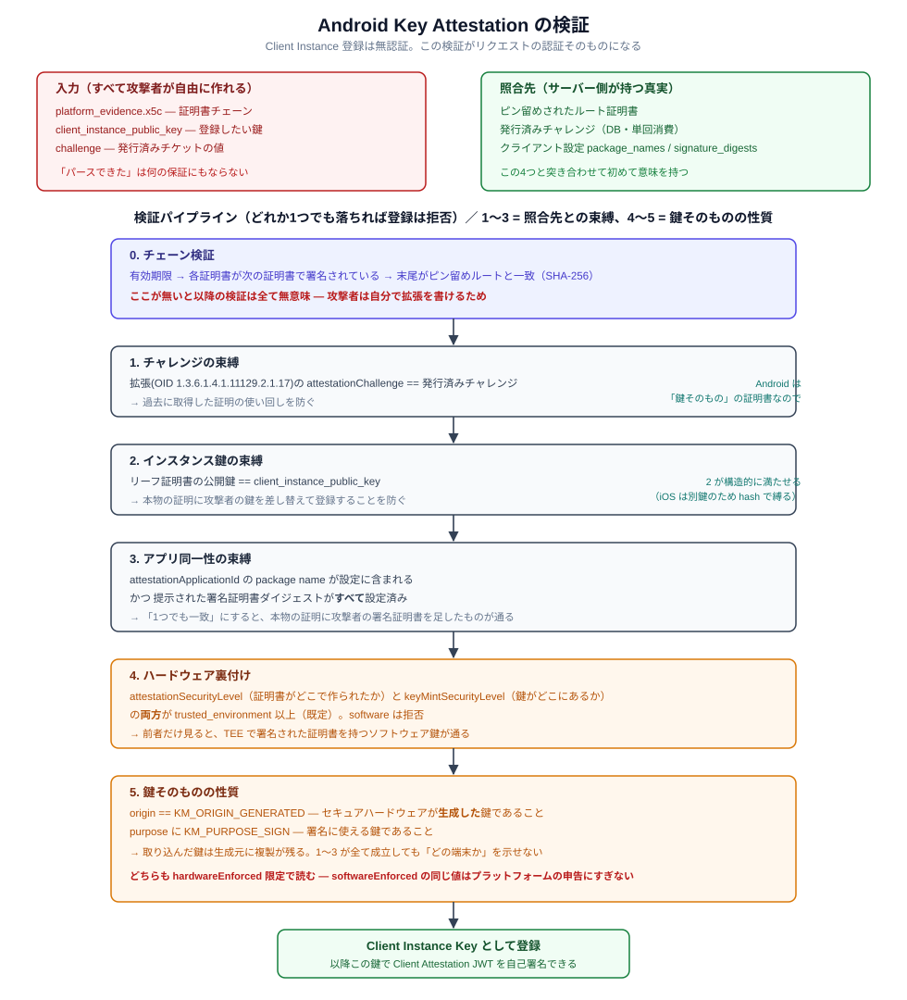

# Attestation-Based Client Authentication

---

## 前提知識

- [クライアント認証](./protocol-06-client-authentication.md) - `idp-server` がサポートする他の認証方式
- [Attestation-Based Client Authentication（仕様編）](../content_11_learning/16-oauth-oidc-rfc/client-auth/attestation-based-client-auth.md) - draft-10 の解説
- [同（実践編）](../content_11_learning/16-oauth-oidc-rfc/client-auth/attestation-based-client-auth-practice.md) - モバイル側の鍵管理とデバイス証明の取得

---

## 概要

`attest_jwt_client_auth` は、**シークレットを配布せずにネイティブアプリを認証する**クライアント認証方式です（[draft-ietf-oauth-attestation-based-client-auth-10](https://datatracker.ietf.org/doc/draft-ietf-oauth-attestation-based-client-auth/)）。

モバイルアプリは配布物であり、埋め込んだシークレットは取り出せます。そのため従来は Public Client（`none`）として扱うしかありませんでした。この方式は、**アプリのインスタンスごとに端末内で生成した鍵**（Client Instance Key）で認証します。鍵は端末のセキュアハードウェアから出ないため、アプリを複製しても他の端末では使えません。

認証は2つの JWT をヘッダで送ることで行います。

| ヘッダ | JWT | 署名する鍵 | 主張する内容 |
|--------|-----|-----------|-------------|
| `OAuth-Client-Attestation` | Client Attestation JWT | Client Attester の鍵、または登録済み Client Instance Key | この client_id のインスタンスがこの公開鍵を持っている |
| `OAuth-Client-Attestation-PoP` | Client Attestation PoP JWT | Client Instance Key | その鍵を**いま**保持している |

前者が「鍵の持ち主は正当なアプリである」、後者が「その鍵で今このリクエストを出している」を担当します。片方だけでは成立しません。

---

## シーケンス

インストールから最初のトークン取得まで。`registered_instance_key`（自己署名）の場合です。

```
 アプリ                              idp-server
 （Client Instance）
   │
   │  === インストール時に一度だけ ===
   ├─ 端末内で鍵ペアを生成（セキュアハードウェア）
   │
   ├─ POST /{tenant-id}/v1/client-instances/challenges ─────▶
   │     { client_id, device_id }
   │◀──── { challenge, instance_id }
   │
   ├─ request_hash = SHA-256(challenge_bytes || canonical_jwk)
   │
   ├─ POST /{tenant-id}/v1/client-instances ────────────────▶
   │     { challenge, client_instance_public_key, platform_evidence }
   │◀──── 201                                 鍵を client_instance に登録
   │
   │  === 以降、リクエストのたびに ===
   ├─ Client Attestation JWT を自己署名で作成（cnf.jwk = 自分の公開鍵）
   ├─ Client Attestation PoP JWT を作成（aud = issuer, jti, iat）
   │
   ├─ POST /{tenant-id}/v1/tokens ──────────────────────────▶
   │     OAuth-Client-Attestation: <Attestation JWT>
   │     OAuth-Client-Attestation-PoP: <PoP JWT>
   │     grant_type=...&client_id=...
   │◀──── 200 { access_token, ... }
```

`attester_jwks` の場合は、インストール時の登録の代わりに **Client Attester から Attestation JWT を受け取る**ステップが入ります（デバイス証明を Attester に提示し、Attester が署名した JWT を受け取る）。認可サーバーへの事前登録は不要です。

Challenge を必須にしている場合は、リクエスト前に `POST /{tenant-id}/v1/client-attestation/challenges` で取得した値を PoP JWT の `challenge` クレームに入れます。

---

## エンドポイント体系

### クライアント（アプリ）側

| エンドポイント | 用途 |
|---|---|
| `POST /{tenant-id}/v1/client-instances/challenges` | インスタンス登録用チャレンジの取得。`{ client_id, device_id }` を送り、`{ challenge, instance_id }` を受け取る |
| `POST /{tenant-id}/v1/client-instances` | Client Instance Key の登録。`{ challenge, client_instance_public_key, platform_evidence }` |
| `POST /{tenant-id}/v1/client-attestation/challenges` | PoP 用チャレンジの取得。レスポンスの `attestation_challenge` を PoP JWT に入れる |

登録系の2つは**無認証**です（インストール直後でトークンを持たないため）。所有証明はチャレンジと `request_hash` が担います。

なお2つのヘッダは、リクエストごとに**それぞれ厳密に1個**です。同じヘッダを複数送ると拒否されます。

### クライアント認証を行うエンドポイント

2つのヘッダは、クライアント認証が発生する経路すべてで受け付けます。

| エンドポイント | |
|---|---|
| トークン | `POST /{tenant-id}/v1/tokens` |
| Pushed Authorization Request | `POST /{tenant-id}/v1/authorizations/push` |
| CIBA backchannel authentication | `POST /{tenant-id}/v1/backchannel/authentications` |
| Introspection | `POST /{tenant-id}/v1/tokens/introspection` |
| Revocation | `POST /{tenant-id}/v1/tokens/revocation` |

### 管理API側

| エンドポイント | 用途 |
|---|---|
| `POST\|GET\|DELETE /v1/management/tenants/{tenant-id}/clients/{client-id}/instances` | Client Instance の登録・一覧・削除 |

専用権限 `idp:client-instance:create` / `:read` / `:delete` で保護されています。アプリからの登録を使わず、運用側で鍵を登録する場合に使います。

---

## 2つの JWT の作り方

### Client Attestation JWT

```
{
  "typ": "oauth-client-attestation+jwt",
  "alg": "ES256",
  "kid": "<instance_id>"
}
.
{
  "sub": "<client_id>",
  "exp": 1735689600,
  "iat": 1735686000,
  "cnf": {
    "jwk": { "kty": "EC", "crv": "P-256", "x": "...", "y": "..." }
  }
}
```

| 項目 | 要件 |
|---|---|
| `typ` | `oauth-client-attestation+jwt` 固定 |
| `alg` | `client_attestation_signing_alg_values_supported` に含まれる値。`none` と MAC 系（HS*）は拒否されます |
| `sub` | 認証する `client_id` と一致すること |
| `exp` | 必須。期限内であること |
| `cnf.jwk` | Client Instance Key の**公開鍵**。`d` などの秘密鍵成分を含めてはいけません |
| `kid` | `registered_instance_key` では**必須**。登録時に受け取った `instance_id` を入れます |

:::danger registered_instance_key では kid が無いと必ず 401 になります
自己署名モードでは、認可サーバーは **JOSE ヘッダの `kid` を `instance_id` として**登録済みの鍵を引きます。`kid` が無いと鍵を解決できず、署名検証に到達する前に失敗します。

`instance_id` はチャレンジ取得（`POST /{tenant-id}/v1/client-instances/challenges`）のレスポンスで返る値です。**登録時に受け取ったら保存し、以降すべての Client Attestation JWT の `kid` に入れてください。**

偽の `kid` を入れても、選ばれた鍵で署名が検証できないため通りません。

`attester_jwks` では `kid` は鍵の選択に使われません（`client_attestation_attester_jwks` の鍵で検証します）。Attester の鍵を複数並べてローテーションする場合は、JWKS 側と Attestation JWT 側で `kid` を揃えてください。

**PoP JWT の `kid` は見ていません。** PoP の検証鍵は Attestation JWT の `cnf.jwk` から決まるためです。
:::

自己署名の場合は追加で、`cnf.jwk` が登録済みの鍵と一致すること（RFC 7638 thumbprint 比較）、`exp - iat` が **24時間以内**であることが必要です。

**Client Attestation JWT は有効期限まで使い回せます**（draft-10 Section 9.2）。リクエストごとに作り直す必要があるのは PoP JWT の方だけです。`attester_jwks` では Attester への往復を有効期限のあいだ省けます。

### Client Attestation PoP JWT

```
{
  "typ": "oauth-client-attestation-pop+jwt",
  "alg": "ES256"
}
.
{
  "aud": "<認可サーバーの issuer identifier>",
  "jti": "<リクエストごとに一意>",
  "iat": 1735686000,
  "challenge": "<attestation_challenge>"
}
```

| 項目 | 要件 |
|---|---|
| 署名鍵 | Attestation JWT の `cnf.jwk` に対応する秘密鍵 |
| `typ` | `oauth-client-attestation-pop+jwt` 固定 |
| `aud` | 認可サーバーの issuer identifier（テナントの `issuer`） |
| `jti` | 必須。リクエストごとに一意な値 |
| `iat` | 必須。現在時刻から**±5分以内**であること |
| `challenge` | `client_attestation_challenge_required` が有効なテナントでは必須 |
| `iss` | draft-10 は PoP JWT に定義していません。載せても §5.1 の「MAY contain other claims」として無視されます |
| `exp` | 同上。有効範囲は `iat` の窓が決めます |

:::tip 実装のポイント
PoP JWT は**リクエストごとに新しく作ります**。`jti` はリプレイ検出のための識別子で、`iat` の窓とあわせて PoP の有効範囲を絞ります。

ただし現時点の実装は **`jti` の存在を確認するだけで、使用済み `jti` の記録は行っていません**。同じ PoP JWT を `iat` の ±5分窓内で再送すると通ります。検出を前提にした設計にはせず、毎回新しく作ってください。
:::

---

## 信頼モデル: 誰が Attestation JWT に署名するか

draft-10 は**鍵の管理と信頼の確立を仕様の範囲外**としています（Section 9.8）。`idp-server` はクライアント設定 `client_attestation_trust_source` で切り替えます。

| | `attester_jwks`（既定） | `registered_instance_key` |
|---|---|---|
| Attestation JWT の署名者 | Client Attester | Client Instance（自己署名） |
| 認可サーバーが信頼する鍵 | `client_attestation_attester_jwks` に登録した公開鍵 | 事前登録した Client Instance Key |
| インスタンスの事前登録 | 不要 | 必要 |
| Client Attester の運用 | 必要 | 不要 |
| 「正当なアプリか」の判断 | Attester がプラットフォーム証明を検証 | 登録時のみ。以降は鍵の所持が根拠 |

### どちらを選ぶか

**アプリ提供者がサーバーを持っている**なら `attester_jwks`。App Attest / Play Integrity の検証を Attester 側に集約でき、認可サーバーはプラットフォームごとの差異を知らずに済みます。アプリが複数の認可サーバーに接続する場合も、Attestation JWT を1か所で発行できます。

**Attester を運用しない**なら `registered_instance_key`。認可サーバーへの登録が信頼の起点になるため、**登録経路の強度がそのまま全体の強度**になります。誰でも鍵を登録できる状態にしないよう、`client_instance_registration_policy` を併せて設計します。

### 2つの設定の関係

`client_instance_registration_policy` が効くのは、**`registered_instance_key` を選んでインスタンス登録を行うときだけ**です。`attester_jwks` では登録した鍵が認証時に参照されないため、設定しても効きません。

```
 attester_jwks
   └ 登録エンドポイントを使わない
        → client_instance_registration_policy は不要

 registered_instance_key
   ├ アプリから登録させる
   │    ├ require_authentication_device … 端末が認証デバイスとして登録済みであることを要求
   │    └ attestation_only             … デバイスを介さない（ウォレット系）
   └ 運用側が管理APIで登録する
        → policy は参照されない
```

| 登録経路 | policy | 挙動 |
|---|---|---|
| アプリから | `require_authentication_device` | `device_id` がこのサーバーに登録済みの認証デバイスであることを検証。未登録・未指定なら拒否 |
| アプリから | `attestation_only` | デバイス検証なし。プラットフォーム証明のみが裏付け |
| アプリから | **未設定** | **登録を拒否**。弱い側にフォールバックしません |
| 管理APIから | 何でも | policy に関係なく登録できます |

---

## Client Instance 登録の所有証明

アプリからの登録は無認証のため、**チャレンジと `request_hash`** で「いま鍵を持っている」ことを示します。

```
request_hash = base64url_nopad( SHA-256( challenge_bytes || canonical_jwk_utf8 ) )
canonical_jwk = RFC 7638 thumbprint の入力（必須メンバのみ・辞書順・空白なし）
```

```json
{
  "challenge": "<チャレンジ取得で得た値>",
  "client_instance_public_key": { "kty": "EC", "crv": "P-256", "x": "...", "y": "..." },
  "platform_evidence": {
    "platform": "<プラットフォーム識別子>",
    "request_hash": "<上記の計算結果>"
  }
}
```

:::warning request_hash の計算で間違えやすいところ
1. `challenge` を base64url デコードせず文字列のまま連結している
2. JWK のキー順が辞書順でない
3. JSON に空白が入っている
4. `alg` / `use` / `kid` を含めてしまっている（必須メンバのみ）

固定ベクタ: `challenge=Zm9vYmFyLWNoYWxsZW5nZS0wMQ` → `request_hash=YY-nDEK6JHQLVe893qieCiyyQ2kW5fBmIPNlVdflj1I`
:::

### プラットフォーム証明の検証

`platform_evidence` を検証するのは `PlatformAttestationVerifier` の実装で、プラットフォームごとにモジュールが提供します。**実装が1つも登録されていなければ、登録はすべて拒否されます**（無認証エンドポイントに対する安全側の既定）。

Android Key Attestation の検証は次の順で行います。



証明書チェーンは攻撃者が自由に作れる入力なので、**ピン留めしたルートまで検証しない限り以降の判定は意味を持ちません**。攻撃者は自分で拡張を書けるため、チャレンジもアプリ名も望みどおりに入れられます。

設定はクライアントの `client_instance_platform_config` に置きます。

```json
"client_instance_platform_config": {
  "android_key_attestation": {
    "package_names": ["com.example.wallet"],
    "signature_digests": ["<署名証明書の SHA-256（base64url）>"],
    "min_security_level": "trusted_environment"
  }
}
```

| フィールド | 既定 | 内容 |
|---|---|---|
| `package_names` | 必須 | 許可するパッケージ名 |
| `signature_digests` | 必須 | 署名証明書のダイジェスト。**提示された値がすべてここに含まれること**が条件 |
| `min_security_level` | `trusted_environment` | `trusted_environment` / `strong_box`。`software` は常に拒否 |
| `trusted_root_certificates` | — | ルートの上書き。設定すると WARN ログが出ます（実質そのルートの持ち主を信頼することになるため） |

`signature_digests` が必須なのは、パッケージ名が秘密ではないためです。攻撃者は自分の端末で同じパッケージ名のアプリを名乗れるので、**再署名を見分けるのは署名証明書のダイジェストだけ**です。

登録をどこまでデバイスに紐づけるかは `client_instance_registration_policy` で決めます。

| 値 | 意味 |
|----|------|
| `require_authentication_device` | `device_id` がこの認可サーバーに登録済みの認証デバイスであること。FIDO UAF 登録が生体認証を伴うため、ユーザーが承認したデバイスに登録が結び付く |
| `attestation_only` | デバイスを介さず、プラットフォーム証明だけを裏付けとする |

---

## Challenge

PoP JWT の `challenge` クレームは、その PoP がこの認可サーバー向けに作られたことを示します（draft-10 Section 7.2 item 5）。

### 有効化

| 設定 | 既定 | 意味 |
|------|------|------|
| `client_attestation_challenge_required` | `false` | `challenge` を必須にするか |
| `client_attestation_challenge_duration` | `300`（秒） | 発行した Challenge の有効期間 |

エンドポイントの公開と強制を分けてあるため、**先にエンドポイントだけ公開してクライアントの対応を待ち、揃ってから必須化する**移行ができます。

**Challenge は単回消費ではありません。** 有効期間のあいだ何度でも使えます。CIBA のポーリングのように短時間に何度もリクエストする経路で、そのつど取得し直さずに済むようにするためです。既定の 300 秒は `backchannel_authentication_request_expires_in` に合わせてあります。Challenge を短命にしてもリプレイは防げません。現時点で有効範囲を絞っているのは `iat` の時間窓だけで、`jti` の記録は行っていないためです。

### 必須化後に Challenge が無いとき

```json
{
  "error": "use_attestation_challenge",
  "error_description": "..."
}
```

このエラーには**新しく発行された Challenge が同梱されます**（Section 7.4）。レスポンスヘッダ `OAuth-Client-Attestation-Challenge` に載るため、失敗したリクエストがそのまま次の Challenge の受け渡しを兼ねます。クライアントは Challenge エンドポイントを別途叩かずに、その値で PoP JWT を作り直して再送できます。

---

## 設定

### クライアント

| フィールド | 必須 | 内容 |
|-----------|------|------|
| `token_endpoint_auth_method` | ✅ | `attest_jwt_client_auth` |
| `client_attestation_trust_source` | ✅ | `attester_jwks` / `registered_instance_key` |
| `client_attestation_attester_jwks` | `attester_jwks` 時 | 信頼する Client Attester の公開鍵（JWK Set）。秘密鍵・共通鍵を含めてはならない |
| `client_instance_registration_policy` | 登録エンドポイント使用時 | `require_authentication_device` / `attestation_only` |

### 認可サーバー

| フィールド | 既定 | 内容 |
|-----------|------|------|
| `client_attestation_signing_alg_values_supported` | — | Attestation JWT に許可する `alg` |
| `client_attestation_pop_signing_alg_values_supported` | — | PoP JWT に許可する `alg` |
| `client_attestation_challenge_required` | `false` | Challenge の強制 |
| `client_attestation_challenge_duration` | `300` | Challenge の有効期間（秒） |

discovery（`/.well-known/openid-configuration`）には次が出力されます。クライアントはここから対応 alg とチャレンジエンドポイントを知ります。

| キー | 内容 |
|---|---|
| `client_attestation_signing_alg_values_supported` | Attestation JWT に許可する alg |
| `client_attestation_pop_signing_alg_values_supported` | PoP JWT に許可する alg |
| `challenge_endpoint` | チャレンジエンドポイントの URL |

---

## エラー

| エラーコード | 意味 | クライアントの対応 |
|-------------|------|------------------|
| `invalid_client_attestation` | Attestation JWT / PoP JWT の検証に失敗した | JWT の内容を見直す。再送しても通らない |
| `use_attestation_challenge` | Challenge が必須だが含まれていない | 同梱された Challenge で PoP を作り直して再送する |
| `use_fresh_attestation` | Attestation JWT が期限切れ、または有効期間が長すぎる | Attestation JWT を取り直す（`attester_jwks` なら Attester へ、自己署名なら作り直す） |

`invalid_client` ではなく専用コードを返すことで、「認証情報が違う」のか「Challenge を付ければ通る」のかを区別できます。

---

## 準拠状況

draft-10 の章立てに沿った E2E 仕様準拠テストがあります。

| テスト | 内容 | 状況 |
|--------|------|------|
| `e2e/src/tests/spec/oauth_attestation_based_client_auth.test.js` | draft-10 の要件 | 40 実装 / 13 未対応（`xit` で列挙） |
| `e2e/src/tests/spec/oauth_attestation_registered_instance_key.test.js` | 自己署名モード | 8 |
| `e2e/src/tests/spec/oauth_attestation_instance_registration.test.js` | インスタンス登録フロー | 14 |

未対応の要件は削除せず `xit` で残してあるため、「カバー済み / 未対応 / 欠落」がテストファイルから読み取れます。

仕様準拠テストはリクエスト単位の台帳なので、運用の一周は別層で通しています。

| テスト | 内容 | 状況 |
|--------|------|------|
| `e2e/src/tests/usecase/abca/abca-01-attester-jwks.test.js` | Attester が JWKS を公開するモデルの一生（起動・CAJ 再利用・期限切れからの回復・Attester 鍵ローテーション） | 7 |
| `e2e/src/tests/usecase/abca/abca-02-client-instance-registration.test.js` | 自己署名モデルの一生（初回登録・再インストール・端末紛失時の失効）。Challenge を強制したテナントで実行 | 6 |

設定を実際に組んで動かす手順は [ユースケーステンプレート](https://github.com/hirokazu-kobayashi-koba-hiro/idp-server/tree/main/config/templates/use-cases/attestation-based-client-auth) にあります。

---

## セキュリティ考慮事項

- **Client Instance Key は端末のセキュアハードウェアに置く。** ソフトウェア保管では、アプリのコピーで認証が通ってしまい、この方式を採用する意味が薄れます
- **`attester_jwks` では Client Attester の検証が信頼の起点。** 認可サーバーはプラットフォーム証明を見ません。Attester が App Attest / Play Integrity を正しく検証していることが前提です
- **`registered_instance_key` は自己署名。** 「正当なアプリか」の裏付けは登録時のみで、以降は鍵の所持だけが根拠です。登録経路の強度がそのまま全体の強度になります
- **PoP のリプレイ検出は未実装。** `jti` は存在チェックのみで、使用済みの記録は持ちません。同じ PoP JWT は `iat` の ±5分窓内で再利用できてしまいます
- **Challenge は単回消費ではない。** 有効期間内は再利用できます。インスタンス登録用のチャレンジは別物で、こちらは原子的に消費されます

---

## 関連仕様

- [OAuth 2.0 Attestation-Based Client Authentication draft-10](https://datatracker.ietf.org/doc/draft-ietf-oauth-attestation-based-client-auth/)
- [RFC 7638: JSON Web Key (JWK) Thumbprint](https://www.rfc-editor.org/rfc/rfc7638.html)
- [RFC 7800: Proof-of-Possession Key Semantics for JWTs](https://www.rfc-editor.org/rfc/rfc7800.html)

---

## 参考

- [クライアント認証](./protocol-06-client-authentication.md)
- [デバイス認証を伴う認可コードフロー](./protocol-07-authorization-code-device-authentication.md)
