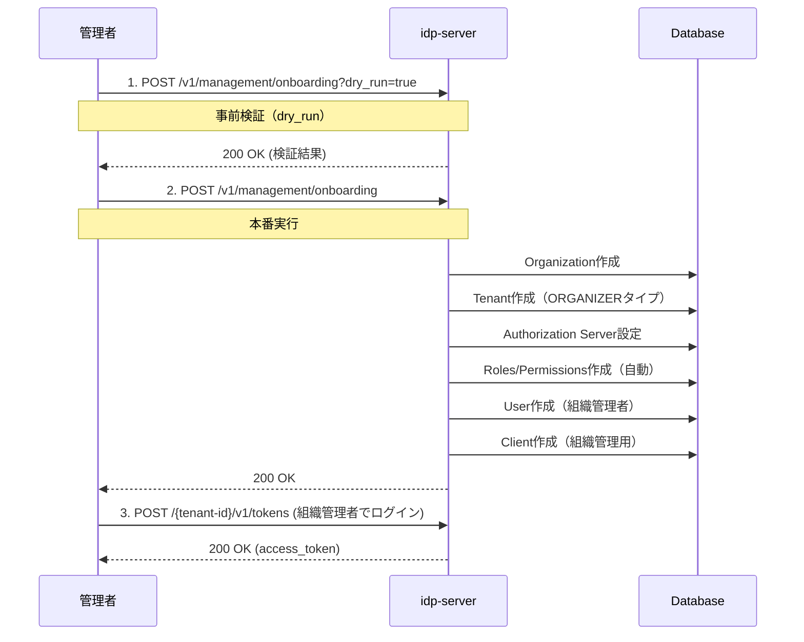

# 組織初期化ガイド

## このドキュメントの目的

**新しい組織とテナントを作成し、管理者としてログインできるようになる**ことが目標です。

### 所要時間
⏱️ **約10分**（スクリプト使用）/ **約20分**（API直接呼び出し）

### このドキュメントの位置づけ

**Phase 1**: 最小構成で動作確認（Step 1/5）

**次のドキュメント**:
- [how-to-02 テナント設定](./how-to-03-tenant-setup.md) - ビジネステナント作成

### 前提条件
- idp-serverが起動している
- Admin Tenant（システム管理用テナント）が存在する
- 管理者トークンを取得できる

---

## 組織初期化とは

組織初期化は、**エンタープライズレベルのマルチテナント運用を開始するための最初のステップ**です。1つのAPIリクエストで以下をまとめて作成できます：

1. **Organization** - 組織本体
2. **Tenant** - 組織管理用テナント（ORGANIZERタイプ）
3. **Authorization Server** - 認可サーバー設定
4. **User** - 組織管理者ユーザー
5. **Client** - 組織管理用クライアント

**用途**:
- 新規エンタープライズ顧客のオンボーディング
- 開発/ステージング環境の組織セットアップ
- マルチテナントSaaSの組織作成

---

## 方法1: スクリプトを使用（推奨）

**最も簡単な方法**は、提供されているスクリプトを使用することです。

スクリプトは内部で **`/v1/management/onboarding` API**を使用し、以下を自動的に処理します：
- ✅ 管理者トークンの取得（Bearer認証）
- ✅ デフォルト管理者ロール・権限の自動作成
- ✅ 組織・テナント・ユーザー・クライアントの一括作成

**注**: 旧API (`/v1/admin/organization/initialization`) は非推奨です。新規実装では必ず `/v1/management/onboarding` を使用してください。

### 実行手順

1. **環境変数の設定**

`.env`ファイルに管理者認証情報を設定します：

```bash
# Admin Tenant設定（管理者ユーザーでログイン）
IDP_SERVER_DOMAIN=http://localhost:8080/
ADMIN_TENANT_ID=67e7eae6-62b0-4500-9eff-87459f63fc66
ADMIN_USERNAME=ito.ichiro
ADMIN_PASSWORD=successUserCode001
ADMIN_CLIENT_ID=17deb0de-a05f-46c3-b99b-e4e2e5f614ca
ADMIN_CLIENT_SECRET=clientSecretPostPassword1234567890123456789012345678901234567890123456789012345678901234567890
```

2. **スクリプト実行**

```bash
../../../scripts/create-organization.sh
```

3. **対話形式で情報入力**

スクリプトが以下の情報を順番に聞いてきます（デフォルト値あり）：

```
Organization Name [Test Organization]: ACME Corporation
Tenant Name [Test Organizer Tenant]: ACME Organizer
Admin Email [admin@test-org.com]: admin@acme.com
Admin Username [org.admin]: acme.admin
Admin Password [TestOrgPassword123!]: ****
Client Name [Test Organization Client]: ACME Admin Client
Redirect URI [http://localhost:8081/callback]: https://admin.acme.com/callback
Domain [http://localhost:8080]: https://auth.acme.com
```

4. **Dry Run検証 → 確認 → 実行**

スクリプトが自動的に：
- ✅ 環境変数を検証
- ✅ 管理者アクセストークンを取得（Bearer認証）
- ✅ UUIDを4つ生成
- ✅ **JWKS暗号鍵ペアを生成（EC P-256、組織ごとにユニーク）**
- ✅ テンプレート(`config/templates/organization-initialization-template.json`)から設定JSONを生成
- ✅ onboarding.sh経由でDry Run検証を実行
- ✅ 結果を表示して確認を求める
- ✅ onboarding.sh経由で組織を作成
- ✅ ログイン情報を表示

### 出力例

```
✅ Organization created successfully!

=== Login Information ===
Organization ID: 72cf4a12-8da3-40fb-8ae4-a77e3cda95e2
Tenant ID: 952f6906-3e95-4ed3-86b2-981f90f785f9
Token Endpoint: https://auth.acme.com/952f6906-3e95-4ed3-86b2-981f90f785f9/v1/tokens

Admin Credentials:
  Username: acme.admin
  Email: admin@acme.com
  Password: SecurePassword123!

Client Credentials:
  Client ID: c2b59f68-071e-4fbe-b37d-1374d1b868dd
  Client Secret: test-org-secret-a3f9e82c...

=== Environment Variables (Copy & Paste) ===
export ORGANIZATION_ID='72cf4a12-8da3-40fb-8ae4-a77e3cda95e2'
export TENANT_ID='952f6906-3e95-4ed3-86b2-981f90f785f9'
export ADMIN_EMAIL='admin@acme.com'
export ADMIN_PASSWORD='SecurePassword123!'
export CLIENT_ID='c2b59f68-071e-4fbe-b37d-1374d1b868dd'
export CLIENT_SECRET='test-org-secret-a3f9e82c...'
```

### スクリプトの利点

- ✅ **公式テンプレート使用** - `config/templates/organization-initialization-template.json`を使用
- ✅ **セキュアな鍵生成** - 組織ごとにユニークなJWKS暗号鍵ペアを動的生成（EC P-256）
- ✅ **既存ツール活用** - `onboarding.sh`と`envsubst`を再利用し、保守性向上
- ✅ **Bearer認証** - 管理者トークン自動取得・認証処理を自動化
- ✅ **UUID自動生成** - 手動での生成不要
- ✅ **Dry Run検証** - 本番実行前に必ず検証
- ✅ **エラーチェック** - 各ステップで検証
- ✅ **情報保存** - `config/tmp/org-init-{org-id}.json`に設定を保存

---

## 動作確認：作成した組織管理者でログイン

スクリプト実行後、**作成した組織管理者でアクセストークンを取得**して、正常に動作していることを確認します。

### 1. スクリプト出力から必要な情報を取得

スクリプトの最後に表示された情報を使います：

```
=== Login Information ===
Organization ID: 734487a6-ab2b-43c6-b178-50ef79068cab
Tenant ID: 70ffa986-bdc5-4532-8457-8fcda6e1b091
Token Endpoint: http://localhost:8080/70ffa986-bdc5-4532-8457-8fcda6e1b091/v1/tokens

Admin Credentials:
  Username: org.admin
  Email: admin@test-org.com
  Password: TestOrgPassword123!

Client Credentials:
  Client ID: 8ff28e6b-dac4-47bb-bc74-900e1473a881
  Client Secret: test-org-secret-79baf7c54d9e9210ed4b964b21ed34b6
```

### 2. 環境変数に設定

スクリプトが最後に出力する**「Environment Variables (Copy & Paste)」セクション**をそのままコピー&ペーストします：

```bash
# スクリプト出力の「Environment Variables」セクションをコピー&ペースト
export ORGANIZATION_ID='72cf4a12-8da3-40fb-8ae4-a77e3cda95e2'
export TENANT_ID='952f6906-3e95-4ed3-86b2-981f90f785f9'
export ADMIN_EMAIL='admin@acme.com'
export ADMIN_PASSWORD='SecurePassword123!'
export CLIENT_ID='c2b59f68-071e-4fbe-b37d-1374d1b868dd'
export CLIENT_SECRET='test-org-secret-a3f9e82c...'
```

**ポイント**:
- スクリプト出力をそのままコピーするだけなので、手動で入力する必要はありません
- **シングルクォート**を使用しているため、パスワードに`!`や`$`などの特殊文字が含まれていても正しく設定されます

### 3. トークン取得リクエスト

```bash
# ⚠️ パスワードに特殊文字(!,$,\等)が含まれる可能性があるため --data-urlencode
curl -X POST "http://localhost:8080/${TENANT_ID}/v1/tokens" \
  -H 'Content-Type: application/x-www-form-urlencoded' \
  --data-urlencode 'grant_type=password' \
  --data-urlencode "username=${ADMIN_EMAIL}" \
  --data-urlencode "password=${ADMIN_PASSWORD}" \
  --data-urlencode "client_id=${CLIENT_ID}" \
  --data-urlencode "client_secret=${CLIENT_SECRET}" \
  --data-urlencode 'scope=management' | jq .
```

**重要**:
- usernameには**Email**を使用（Username `org.admin`ではない）
- パスワードに特殊文字が含まれる場合は変数展開で対応

### 4. 成功レスポンス

```json
{
  "access_token": "eyJhbGciOiJFUzI1NiIsInR5cCI6IkpXVCIsImtpZCI6InNpZ25pbmdf...",
  "token_type": "Bearer",
  "expires_in": 3600,
  "refresh_token": "eyJhbGciOiJFUzI1NiIsInR5cCI6IkpXVCIsImtpZCI6InNpZ25pbmdf...",
  "scope": "management"
}
```

✅ **成功！** `access_token`が取得できれば、組織初期化は正常に完了しています。

### 5. トークンを環境変数に保存

次のステップ（how-to-02以降）で使うため、トークンを保存します：

```bash
# トークンを環境変数に保存
export ORG_ADMIN_TOKEN=$(curl -sS -X POST "http://localhost:8080/${TENANT_ID}/v1/tokens" \
  -H 'Content-Type: application/x-www-form-urlencoded' \
  --data-urlencode 'grant_type=password' \
  --data-urlencode "username=${ADMIN_EMAIL}" \
  --data-urlencode "password=${ADMIN_PASSWORD}" \
  --data-urlencode "client_id=${CLIENT_ID}" \
  --data-urlencode "client_secret=${CLIENT_SECRET}" \
  --data-urlencode 'scope=management' | jq -r '.access_token')

# 確認
echo "Token: ${ORG_ADMIN_TOKEN:0:50}..."
echo "Organization ID: $ORGANIZATION_ID"
echo "Tenant ID: $TENANT_ID"
```

### トラブルシューティング

#### ❌ エラー: `does not found user by token request, or invalid password`

**原因**: ユーザー名またはパスワードが間違っている

**解決策**:
1. ユーザー名は**Email**を使用（`Username`ではなく`Email`）
2. 環境変数が正しく設定されているか確認
3. スクリプト出力の情報を正確にコピー

```bash
# ✅ 正しい: Emailを使用（シングルクォート）
export ADMIN_EMAIL='admin@test-org.com'
-d "username=${ADMIN_EMAIL}"

# ❌ 間違い: Usernameを使用
export ADMIN_USERNAME='org.admin'  # これは使わない
-d "username=${ADMIN_USERNAME}"

# 環境変数の確認
echo "Email: $ADMIN_EMAIL"
echo "Password: ${ADMIN_PASSWORD:0:5}..."
```

#### ❌ エラー: `invalid_client`

**原因**: Client IDまたはClient Secretが間違っている

**解決策**: 環境変数を確認してスクリプト出力の値と一致しているか確認

```bash
# 環境変数の確認
echo "Client ID: $CLIENT_ID"
echo "Client Secret: ${CLIENT_SECRET:0:20}..."

# スクリプト出力と比較して、正しい値を再設定（シングルクォート）
export CLIENT_ID='8ff28e6b-dac4-47bb-bc74-900e1473a881'
export CLIENT_SECRET='test-org-secret-79baf7c54d9e9210ed4b964b21ed34b6'
```

---

## 方法2: Management API直接呼び出し（詳細制御が必要な場合）

**`/v1/management/onboarding` API**を直接呼び出して組織を作成する方法です。カスタマイズや自動化が必要な場合に使用します。

### 前提条件

#### 1. 管理者権限のアクセストークン

Onboarding APIは**management スコープを持つ管理者専用**です。Admin Tenantで管理者トークンを取得します。

```bash
# Admin Tenantでトークン取得
curl -X POST "http://localhost:8080/${TENANT_ID}/v1/tokens" \
  -H 'Content-Type: application/x-www-form-urlencoded' \
  --data-urlencode 'grant_type=password' \
  --data-urlencode "username=${ADMIN_EMAIL}" \
  --data-urlencode "password=${ADMIN_PASSWORD}" \
  --data-urlencode "client_id=${CLIENT_ID}" \
  --data-urlencode "client_secret=${CLIENT_SECRET}" \
  --data-urlencode 'scope=management' | jq .
```

**レスポンス例**:
```json
{
  "access_token": "eyJhbGc...",
  "token_type": "Bearer",
  "expires_in": 3600
}
```

### 2. 必要な情報の準備

- 組織ID（UUID v4）
- テナントID（UUID v4）
- ユーザーID（UUID v4）
- クライアントID（UUID v4）
- RSA/EC鍵ペア（JWKS形式）

---

## 🧭 全体の流れ

1. 組織初期化リクエストの準備
2. Dry Run検証（オプション）
3. 組織初期化の実行
4. 組織管理者としてログイン確認

---

## 🔁 初期化フロー図（Mermaid）



---

## 1. 組織初期化リクエストの準備

### リクエスト

```http
POST /v1/management/onboarding
Authorization: Bearer {admin_access_token}
Content-Type: application/json

{
  "organization": {
    "id": "72cf4a12-8da3-40fb-8ae4-a77e3cda95e2",
    "name": "ACME Corporation",
    "description": "Enterprise organization for ACME Corp"
  },
  "tenant": {
    "id": "952f6906-3e95-4ed3-86b2-981f90f785f9",
    "name": "ACME Organizer Tenant",
    "domain": "https://auth.acme.com",
    "authorization_provider": "idp-server",
    "database_type": "postgresql",
    "attributes": {
      "cookie_name": "ACME_ORG_SESSION",
      "use_secure_cookie": true,
      "allow_origins": [
        "https://admin.acme.com",
        "https://app.acme.com"
      ],
      "security_event_log_format": "structured_json",
      "security_event_log_persistence_enabled": true
    }
  },
  "authorization_server": {
    "issuer": "https://auth.acme.com/952f6906-3e95-4ed3-86b2-981f90f785f9",
    "authorization_endpoint": "https://auth.acme.com/952f6906-3e95-4ed3-86b2-981f90f785f9/v1/authorizations",
    "token_endpoint": "https://auth.acme.com/952f6906-3e95-4ed3-86b2-981f90f785f9/v1/tokens",
    "userinfo_endpoint": "https://auth.acme.com/952f6906-3e95-4ed3-86b2-981f90f785f9/v1/userinfo",
    "jwks_uri": "https://auth.acme.com/952f6906-3e95-4ed3-86b2-981f90f785f9/v1/jwks",
    "jwks": "{\"keys\":[{\"kty\":\"RSA\",\"n\":\"...\",\"e\":\"AQAB\",\"kid\":\"signing_key_1\",\"use\":\"sig\"}]}",
    "token_signed_key_id": "signing_key_1",
    "id_token_signed_key_id": "signing_key_1",
    "scopes_supported": [
      "openid",
      "profile",
      "email",
      "org-management",
      "account",
      "management"
    ],
    "response_types_supported": ["code"],
    "grant_types_supported": [
      "authorization_code",
      "refresh_token",
      "password"
    ],
    "token_endpoint_auth_methods_supported": [
      "client_secret_post",
      "client_secret_basic"
    ],
    "subject_types_supported": ["public"],
    "extension": {
      "access_token_type": "JWT",
      "access_token_duration": 3600,
      "id_token_duration": 3600,
      "refresh_token_duration": 86400
    }
  },
  "user": {
    "sub": "8d8822f0-cf68-455a-aa82-3ccfbc07b060",
    "provider_id": "idp-server",
    "name": "admin.user",
    "email": "admin@acme.com",
    "email_verified": true,
    "raw_password": "SecurePassword123!",
    "role": "Administrator"
  },
  "client": {
    "client_id": "c2b59f68-071e-4fbe-b37d-1374d1b868dd",
    "client_id_alias": "acme-org-client",
    "client_secret": "acme-org-secret-001",
    "redirect_uris": [
      "https://admin.acme.com/callback"
    ],
    "response_types": ["code"],
    "grant_types": [
      "authorization_code",
      "refresh_token",
      "password"
    ],
    "scope": "openid profile email org-management account management",
    "client_name": "ACME Organization Client",
    "token_endpoint_auth_method": "client_secret_post",
    "application_type": "web"
  }
}
```

### パラメータ説明

#### organization設定項目

| 項目 | 型 | 必須 | 説明 |
|-----|---|------|------|
| `id` | string (UUID) | ✅ | 組織の一意識別子 |
| `name` | string | ✅ | 組織名 |
| `description` | string | - | 組織の説明 |

#### tenant設定項目

| 項目 | 型 | 必須 | 説明 |
|-----|---|------|------|
| `id` | string (UUID) | ✅ | テナントの一意識別子 |
| `name` | string | ✅ | テナント名 |
| `domain` | string | ✅ | テナントのドメインURL |
| `authorization_provider` | string | ✅ | 認可プロバイダー（`idp-server`固定） |
| `database_type` | string | ✅ | データベース種別（`postgresql`/`mysql`） |
| `attributes` | object | - | テナント属性（カスタム設定） |

#### authorization_server設定項目

| 項目 | 型 | 必須 | 説明 |
|-----|---|------|------|
| `issuer` | string | ✅ | 発行者識別子（URL） |
| `authorization_endpoint` | string | ✅ | 認可エンドポイントURL |
| `token_endpoint` | string | ✅ | トークンエンドポイントURL |
| `userinfo_endpoint` | string | ✅ | ユーザー情報エンドポイントURL |
| `jwks_uri` | string | ✅ | JWKSエンドポイントURL |
| `jwks` | string | ✅ | **JSON Web Key Set（JSON文字列としてエスケープ必須）** |
| `token_signed_key_id` | string | ✅ | アクセストークン署名用のKey ID |
| `id_token_signed_key_id` | string | ✅ | IDトークン署名用のKey ID |
| `scopes_supported` | array | ✅ | サポートするスコープ一覧 |
| `response_types_supported` | array | ✅ | サポートするレスポンスタイプ |
| `grant_types_supported` | array | ✅ | サポートするグラントタイプ |
| `token_endpoint_auth_methods_supported` | array | ✅ | トークンエンドポイント認証方式 |
| `subject_types_supported` | array | ✅ | サポートするsubject識別子タイプ |
| `extension` | object | - | 拡張設定（トークン有効期限等） |

**`extension`設定項目**:

| 項目 | 型 | 説明 |
|-----|---|------|
| `access_token_type` | string | アクセストークンタイプ（`JWT`推奨） |
| `access_token_duration` | number | アクセストークン有効期限（秒）デフォルト: 3600 |
| `id_token_duration` | number | IDトークン有効期限（秒）デフォルト: 3600 |
| `refresh_token_duration` | number | リフレッシュトークン有効期限（秒）デフォルト: 86400 |

詳細は[認可サーバー設定ガイド](how-to-03-tenant-setup.md)を参照してください。

#### user設定項目

| 項目 | 型 | 必須 | 説明 |
|-----|---|------|------|
| `sub` | string (UUID) | ✅ | ユーザーの一意識別子（subject） |
| `provider_id` | string | ✅ | 認証プロバイダーID（`idp-server`固定） |
| `name` | string | ✅ | ユーザー名 |
| `email` | string | ✅ | メールアドレス |
| `email_verified` | boolean | - | メール検証済みフラグ |
| `raw_password` | string | ✅ | 初期パスワード（平文） |
| `role` | string | ✅ | ロール（`Administrator`推奨） |

#### client設定項目

| 項目 | 型 | 必須 | 説明 |
|-----|---|------|------|
| `client_id` | string (UUID) | ✅ | クライアントの一意識別子 |
| `client_id_alias` | string | - | クライアントのエイリアス名 |
| `client_secret` | string | ✅ | クライアントシークレット |
| `redirect_uris` | array | ✅ | リダイレクトURI一覧 |
| `response_types` | array | ✅ | サポートするレスポンスタイプ |
| `grant_types` | array | ✅ | サポートするグラントタイプ |
| `scope` | string | ✅ | デフォルトスコープ（スペース区切り） |
| `client_name` | string | ✅ | クライアント表示名 |
| `token_endpoint_auth_method` | string | ✅ | トークンエンドポイント認証方式 |
| `application_type` | string | - | アプリケーション種別（`web`/`native`） |

---

## 2. Dry Run検証（推奨）

本番実行前に必ず検証します。

### リクエスト

```http
POST /v1/management/onboarding?dry_run=true
Authorization: Bearer {admin_access_token}
Content-Type: application/json

{
  "organization": { ... },
  "tenant": { ... },
  "authorization_server": { ... },
  "user": { ... },
  "client": { ... }
}
```

### レスポンス

```json
{
  "dry_run": true,
  "validation_result": {
    "valid": true,
    "warnings": [],
    "checks": [
      "Organization ID uniqueness: OK",
      "Tenant ID uniqueness: OK",
      "User email uniqueness: OK",
      "Client ID uniqueness: OK",
      "JWKS format: OK"
    ]
  }
}
```

---

## 3. 組織初期化の実行

### リクエスト

```http
POST /v1/management/onboarding
Authorization: Bearer {admin_access_token}
Content-Type: application/json

{
  "organization": { ... },
  "tenant": { ... },
  "authorization_server": { ... },
  "user": { ... },
  "client": { ... }
}
```

### レスポンス

```json
{
  "dry_run": false,
  "result": {
    "organization_id": "72cf4a12-8da3-40fb-8ae4-a77e3cda95e2",
    "tenant_id": "952f6906-3e95-4ed3-86b2-981f90f785f9",
    "user_id": "8d8822f0-cf68-455a-aa82-3ccfbc07b060",
    "client_id": "c2b59f68-071e-4fbe-b37d-1374d1b868dd",
    "created_at": "2025-01-15T10:00:00Z"
  }
}
```

---

## 4. 組織管理者としてログイン確認

### リクエスト

```bash
# ⚠️ パスワードに特殊文字(!,$,\等)が含まれる場合は必ずシングルクォートを使用
curl -X POST "http://localhost:8080/${ADMIN_TENANT_ID}/v1/tokens" \
  -H 'Content-Type: application/x-www-form-urlencoded' \
  -d 'grant_type=password' \
  -d "username=${ADMIN_USER_EMAIL}" \
  -d "password='${ADMIN_USER_PASSWORD}'" \
  -d "client_id='${ADMIN_CLIENT_ID}'" \
  -d "client_secret='${ADMIN_CLIENT_SECRET}'" \
  -d 'scope=management' | jq .
```

### レスポンス

```json
{
  "access_token": "eyJhbGc...",
  "token_type": "Bearer",
  "expires_in": 3600,
  "refresh_token": "eyJhbGc...",
  "scope": "openid profile email org-management"
}
```

---

## 実践例：マルチテナントSaaS組織の作成

### ユースケース

SaaS事業者が新規エンタープライズ顧客用の組織を作成します。

### シェルスクリプトでの実行

```bash
#!/bin/bash

# 環境変数設定
ADMIN_TOKEN="eyJhbGc..."
BASE_URL="https://auth.example.com"
ORG_ID=$(uuidgen)
TENANT_ID=$(uuidgen)
USER_ID=$(uuidgen)
CLIENT_ID=$(uuidgen)

# JWKS生成（実際の本番環境では適切な鍵管理を実施）
# ここではサンプル用に既存のJWKSファイルを使用
JWKS_CONTENT=$(cat config/secrets/local/jwks.json | jq -c '.')
ESCAPED_JWKS=$(echo "$JWKS_CONTENT" | jq -Rs '.')

# JSONファイル生成
cat > org-init.json <<EOF
{
  "organization": {
    "id": "${ORG_ID}",
    "name": "New Enterprise Customer",
    "description": "Customer onboarded on $(date)"
  },
  "tenant": {
    "id": "${TENANT_ID}",
    "name": "Enterprise Organizer",
    "domain": "${BASE_URL}",
    "authorization_provider": "idp-server",
    "database_type": "postgresql"
  },
  "authorization_server": {
    "issuer": "${BASE_URL}/${TENANT_ID}",
    "authorization_endpoint": "${BASE_URL}/${TENANT_ID}/v1/authorizations",
    "token_endpoint": "${BASE_URL}/${TENANT_ID}/v1/tokens",
    "userinfo_endpoint": "${BASE_URL}/${TENANT_ID}/v1/userinfo",
    "jwks_uri": "${BASE_URL}/${TENANT_ID}/v1/jwks",
    "jwks": ${ESCAPED_JWKS},
    "token_signed_key_id": "access_token",
    "id_token_signed_key_id": "id_token_nextauth",
    "scopes_supported": ["openid", "profile", "email", "org-management"],
    "response_types_supported": ["code"],
    "grant_types_supported": ["authorization_code", "refresh_token", "password"],
    "token_endpoint_auth_methods_supported": ["client_secret_post"],
    "subject_types_supported": ["public"],
    "extension": {
      "access_token_type": "JWT",
      "access_token_duration": 3600,
      "id_token_duration": 3600,
      "refresh_token_duration": 86400
    }
  },
  "user": {
    "sub": "${USER_ID}",
    "provider_id": "idp-server",
    "name": "org.admin",
    "email": "admin@customer.com",
    "email_verified": true,
    "raw_password": "TempPassword123!",
    "role": "Administrator"
  },
  "client": {
    "client_id": "${CLIENT_ID}",
    "client_id_alias": "enterprise-org-client",
    "client_secret": "$(openssl rand -hex 32)",
    "redirect_uris": ["https://admin.customer.com/callback"],
    "response_types": ["code"],
    "grant_types": ["authorization_code", "refresh_token", "password"],
    "scope": "openid profile email org-management",
    "client_name": "Enterprise Admin Client",
    "token_endpoint_auth_method": "client_secret_post",
    "application_type": "web"
  }
}
EOF

# Dry Run検証
echo "🔍 Dry Run検証中..."
curl -X POST "${BASE_URL}/v1/management/onboarding?dry_run=true" \
  -H "Authorization: Bearer ${ADMIN_TOKEN}" \
  -H "Content-Type: application/json" \
  -d @org-init.json

# 本番実行
echo "🚀 組織初期化実行中..."
curl -X POST "${BASE_URL}/v1/management/onboarding" \
  -H "Authorization: Bearer ${ADMIN_TOKEN}" \
  -H "Content-Type: application/json" \
  -d @org-init.json

echo "✅ 組織初期化完了"
echo "Organization ID: ${ORG_ID}"
echo "Tenant ID: ${TENANT_ID}"
```

---

## トラブルシューティング

### ❌ ID重複エラー

**エラー**:
```json
{
  "error": "conflict",
  "error_description": "Organization ID already exists"
}
```

**原因**: 組織ID、テナントID、ユーザーID、クライアントIDのいずれかが既存のものと重複。

**解決策**: 新しいUUIDを生成
```bash
# UUIDv4生成
uuidgen
# または
python3 -c "import uuid; print(uuid.uuid4())"
```

---

### ❌ JWKS形式エラー

**エラー**:
```json
{
  "error": "invalid_request",
  "error_description": "Invalid JWKS format"
}
```

**原因**: `jwks`フィールドのJSON形式が不正、またはJSON文字列エスケープが不完全。

**解決策**: JWKS形式とエスケープを確認

**正しい例** - JSON文字列としてエスケープ:
```json
{
  "jwks": "{\"keys\":[{\"kty\":\"RSA\",\"n\":\"abc123...\",\"e\":\"AQAB\",\"kid\":\"signing_key_1\",\"use\":\"sig\"}]}"
}
```

**JWKS生成例**:
```bash
# JWKSをJSON文字列に変換（エスケープ）
jwks_content=$(cat jwks.json | jq -c '.')  # コンパクトJSON化
escaped_jwks=$(echo "$jwks_content" | jq -Rs '.')  # JSON文字列としてエスケープ

# authorization_serverに設定
cat > request.json <<EOF
{
  "authorization_server": {
    "jwks": $escaped_jwks,
    ...
  }
}
EOF
```

**チェックポイント**:
- ✅ `keys`配列が存在
- ✅ 各鍵に`kid`（Key ID）が設定されている
- ✅ JSON文字列としてダブルクォートがエスケープされている（`\"`）

---

### ❌ システム管理者権限不足

**エラー**:
```json
{
  "error": "forbidden",
  "error_description": "System administrator access required"
}
```

**原因**: Admin Tenantの管理者権限がない。

**解決策**:
1. Admin Tenantで`management`スコープを含むトークン取得
2. 適切な権限を持つユーザーで実行

---

### ❌ Dry Run結果を無視して実行

**症状**: Dry Run検証でwarningが出たが本番実行してエラー。

**原因**: 検証結果を確認せずに実行。

**解決策**: 必ずDry Run結果を確認
```bash
# Dry Run実行
response=$(curl -s "...?dry_run=true" -d @org-init.json)

# 検証結果確認
echo "$response" | jq '.validation_result.valid'

# validがtrueの場合のみ本番実行
if [ "$(echo "$response" | jq -r '.validation_result.valid')" == "true" ]; then
  curl "..." -d @org-init.json
fi
```

---

## ベストプラクティス

### 1. 必ずDry Runで事前検証

本番環境では必ず`dry_run=true`で検証してから実行します。

```bash
# ✅ 推奨
curl "...?dry_run=true" && curl "..."

# ❌ 非推奨
curl "..."  # いきなり本番実行
```

### 2. 初期パスワードは複雑に

組織管理者の初期パスワードは十分に複雑にし、初回ログイン後に変更を促します。

```json
{
  "user": {
    "raw_password": "Temp!Pass$(openssl rand -hex 8)",  // ランダム生成
    // 初回ログイン時にパスワード変更を強制する設定
  }
}
```

### 3. スコープの最小権限化

組織管理用クライアントには必要最小限のスコープのみ付与します。

```json
{
  "client": {
    "scope": "openid profile email org-management"  // 必要最小限
  }
}
```

### 4. 組織初期化後の作業

初期化後、以下の作業を実施します：

1. **組織管理者のパスワード変更**
2. **MFA設定の有効化**
3. **追加の管理者ユーザー作成**
4. **監査ログ設定の確認**
5. **ビジネステナントの作成**（[認可サーバー設定ガイド](how-to-03-tenant-setup.md)参照）

---

---

## 次のステップ

✅ 組織初期化が完了しました！

### Phase 1を完了しよう

**次に必要な設定**:
- [how-to-02 テナント設定](./how-to-03-tenant-setup.md) - ビジネス用テナント作成
- [how-to-03 クライアント登録](./how-to-04-client-registration.md) - アプリケーションクライアント登録

### 関連ドキュメント
- [Concept: エンタープライズID](../content_03_concepts/concept-16-enterprise-id.md) - 組織・テナント概念
- [Concept: マルチテナント](../content_03_concepts/concept-01-multi-tenant.md) - マルチテナント設計
- [Configuration: Tenant設定](../content_06_developer-guide/05-configuration/tenant.md) - テナント設定詳細

### 参考資料
- [OpenID Connect Discovery 1.0](https://openid.net/specs/openid-connect-discovery-1_0.html)
- [RFC 7517: JSON Web Key (JWK)](https://datatracker.ietf.org/doc/html/rfc7517)
- [RFC 7591: OAuth 2.0 Dynamic Client Registration](https://datatracker.ietf.org/doc/html/rfc7591)

---

**最終更新**: 2025-01-15
**難易度**: ⭐⭐☆☆☆（初級）
**対象**: システム管理者、DevOpsエンジニア
**習得スキル**: 組織・テナント作成、Onboarding API使用
