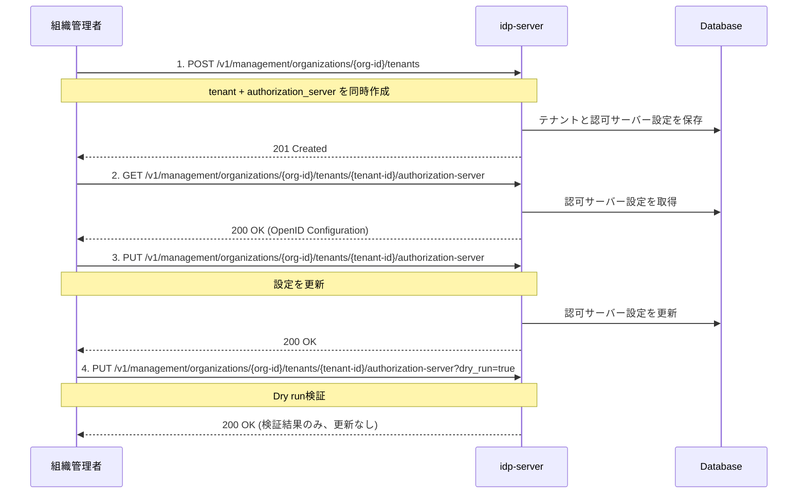

# OAuth/OIDC認証の最小設定ガイド

## このドキュメントの目的

**OAuth 2.0/OpenID Connect認証が動作する環境を構築する**ことが目標です。

具体的には、**アプリケーション用テナント（Public Tenant）**を作成し、OpenID Connect Discovery準拠の**認可サーバー設定**を行います。

### 学べること

✅ **OAuth/OIDC認証を動かすために必要な最小設定**
- アプリケーション用テナント（Public Tenant）の作成方法
- OpenID Connect Discovery準拠の認可サーバー設定
- 必須設定項目（issuer, endpoints, scopes, grant_types等）
- 設定の取得・更新・検証方法

✅ **実践的な知識**
- 金融グレード（FAPI）対応設定例
- Dry Run機能による安全な設定変更
- トラブルシューティング

### 所要時間
⏱️ **約15分**

### このドキュメントの位置づけ

**Phase 1**: 最小構成で動作確認（Step 2/5）

**前提ドキュメント**:
- [how-to-01 組織初期化](./how-to-01-organization-initialization.md) - 組織とOrganizerテナント作成済み

**次のドキュメント**:
- [how-to-03 クライアント登録](./how-to-03-client-registration.md) - クライアント登録

### 前提条件
- [how-to-01](./how-to-01-organization-initialization.md)で組織初期化完了
- 組織管理者トークンを取得済み
- 組織ID（organization-id）を確認済み

---

## アプリケーション用テナント（Public Tenant）とは

**Public Tenant（アプリケーション用テナント）**は、**アプリケーション用のOAuth/OIDC認証ドメイン**です。

### 組織内のテナント構成

```
Organization (企業A)
├─ Organizer Tenant（管理用）      ← how-to-01で作成済み
├─ Public Tenant A（Webアプリ用）   ← このドキュメントで作成
└─ Public Tenant B（モバイルアプリ用）
```

### テナント種別の違い

| テナント種別 | 用途 | 作成タイミング |
|------------|------|--------------|
| **ORGANIZER** | 組織管理専用 | how-to-01で自動作成 |
| **PUBLIC** | アプリケーション用 | このドキュメントで作成 |

---

## 認可サーバー設定とは

**Authorization Server Configuration**は、OpenID Connect Discoveryで定義されている**認可サーバーのメタデータ**です。

### 最小限の必須設定項目

OAuth/OIDC認証を動作させるために、以下の設定が必要です：

#### 1. エンドポイント設定
- `issuer`: 認可サーバーの識別子（URL）
- `authorization_endpoint`: 認可リクエストを受け付けるURL
- `token_endpoint`: トークン発行を行うURL
- `jwks_uri`: 公開鍵（JWKS）を提供するURL

#### 2. サポート機能の宣言
- `scopes_supported`: サポートするスコープ（`openid`, `profile`, `email`等）
- `response_types_supported`: サポートするレスポンスタイプ（`code`, `token`等）
- `grant_types_supported`: サポートするグラントタイプ（`authorization_code`, `refresh_token`等）
- `token_endpoint_auth_methods_supported`: クライアント認証方式（`client_secret_post`等）

**重要**: これらの設定は**OpenID Connect Discovery仕様**に準拠しており、クライアントが自動的に認可サーバーの機能を発見できるようにします。

---

## このドキュメントで行うこと

テナント作成時に以下を設定します：

### 1. 組織管理者権限のアクセストークン

**前提**: [how-to-01](./how-to-01-organization-initialization.md)で設定した環境変数を使用します。

まだ設定していない場合は、以下を実行してください：

```bash
# how-to-01で出力された環境変数をコピー&ペースト
export ORGANIZATION_ID='your-organization-id'
export TENANT_ID='your-tenant-id'
export ADMIN_EMAIL='admin@test-org.com'
export ADMIN_PASSWORD='TestOrgPassword123!'
export CLIENT_ID='your-client-id'
export CLIENT_SECRET='your-client-secret'
```

トークンを取得して環境変数に保存：

```bash
# 組織管理者トークンを取得して保存
export ORG_ADMIN_TOKEN=$(curl -sS -X POST "http://localhost:8080/${TENANT_ID}/v1/tokens" \
  -H 'Content-Type: application/x-www-form-urlencoded' \
  -d 'grant_type=password' \
  -d "username=${ADMIN_EMAIL}" \
  -d "password=${ADMIN_PASSWORD}" \
  -d "client_id=${CLIENT_ID}" \
  -d "client_secret=${CLIENT_SECRET}" \
  -d 'scope=management' | jq -r '.access_token')

# 確認
echo "Token: ${ORG_ADMIN_TOKEN:0:50}..."
```

**レスポンス例**:
```json
{
  "access_token": "eyJhbGc...",
  "token_type": "Bearer",
  "expires_in": 3600,
  "scope": "management"
}
```

✅ これで`$ORG_ADMIN_TOKEN`が設定されました。以降のManagement API呼び出しで使用します。

### 2. 組織IDとテナントIDの確認

環境変数が正しく設定されているか確認します：

```bash
# 環境変数の確認
echo "Organization ID: $ORGANIZATION_ID"
echo "Tenant ID: $TENANT_ID"
echo "Admin Token: ${ORG_ADMIN_TOKEN:0:50}..."
```

これらの値を以降のAPI呼び出しで使用します。

---

## 🧭 全体の流れ

1. テナント作成時に認可サーバー設定を同時登録
2. 認可サーバー設定の取得
3. 認可サーバー設定の更新

---

## 🔁 操作フロー図（Mermaid）



---

## 動作確認：アプリケーション用テナントを作成する

実際にアプリケーション用テナント（Public Tenant）を作成して、設定が正しく動作することを確認しましょう。

### 1. 環境変数の準備

まず、how-to-01で設定した環境変数が有効か確認します：

```bash
# 環境変数の確認
echo "Organization ID: $ORGANIZATION_ID"
echo "Tenant ID (Organizer): $TENANT_ID"
echo "Admin Token: ${ORG_ADMIN_TOKEN:0:50}..."
```

### 2. テナント用の情報を準備

```bash
# テナントIDを生成（UUIDv4形式）
export PUBLIC_TENANT_ID=$(uuidgen | tr '[:upper:]' '[:lower:]')

# テナント情報を設定
export PUBLIC_TENANT_NAME="My App"
export PUBLIC_TENANT_DOMAIN="https://app.example.com"

# 確認
echo "Public Tenant ID: $PUBLIC_TENANT_ID"
echo "Public Tenant Name: $PUBLIC_TENANT_NAME"
echo "Public Tenant Domain: $PUBLIC_TENANT_DOMAIN"
```

### 3. アプリケーション用テナントを作成

```bash
curl -X POST "http://localhost:8080/v1/management/organizations/${ORGANIZATION_ID}/tenants" \
  -H 'Content-Type: application/json' \
  -H "Authorization: Bearer ${ORG_ADMIN_TOKEN}" \
  -d "{
  \"tenant\": {
    \"id\": \"${PUBLIC_TENANT_ID}\",
    \"name\": \"${PUBLIC_TENANT_NAME}\",
    \"domain\": \"${PUBLIC_TENANT_DOMAIN}\",
    \"description\": \"Public tenant for application\",
    \"authorization_provider\": \"idp-server\"
  },
  \"authorization_server\": {
    \"issuer\": \"${PUBLIC_TENANT_DOMAIN}/${PUBLIC_TENANT_ID}\",
    \"authorization_endpoint\": \"${PUBLIC_TENANT_DOMAIN}/${PUBLIC_TENANT_ID}/v1/authorizations\",
    \"token_endpoint\": \"${PUBLIC_TENANT_DOMAIN}/${PUBLIC_TENANT_ID}/v1/tokens\",
    \"userinfo_endpoint\": \"${PUBLIC_TENANT_DOMAIN}/${PUBLIC_TENANT_ID}/v1/userinfo\",
    \"jwks_uri\": \"${PUBLIC_TENANT_DOMAIN}/${PUBLIC_TENANT_ID}/v1/jwks\",
    \"scopes_supported\": [
      \"openid\",
      \"profile\",
      \"email\"
    ],
    \"response_types_supported\": [
      \"code\"
    ],
    \"response_modes_supported\": [
      \"query\",
      \"fragment\"
    ],
    \"subject_types_supported\": [
      \"public\"
    ],
    \"grant_types_supported\": [
      \"authorization_code\",
      \"refresh_token\"
    ],
    \"token_endpoint_auth_methods_supported\": [
      \"client_secret_post\",
      \"client_secret_basic\"
    ]
  }
}" | jq .
```

**期待されるレスポンス**:
```json
{
  "dry_run": false,
  "result": {
    "id": "your-public-tenant-id",
    "name": "My App",
    "domain": "https://app.example.com",
    "description": "Public tenant for application",
    "authorization_provider": "idp-server",
    "type": "PUBLIC",
    "attributes": {}
  }
}
```

### 4. 作成したテナントの認可サーバー設定を確認

```bash
curl -X GET "http://localhost:8080/v1/management/organizations/${ORGANIZATION_ID}/tenants/${PUBLIC_TENANT_ID}/authorization-server" \
  -H "Authorization: Bearer ${ORG_ADMIN_TOKEN}" | jq .
```

**確認ポイント**:
- `issuer`, `authorization_endpoint`, `token_endpoint`等が正しく設定されているか
- `scopes_supported`に`openid`, `profile`, `email`が含まれているか
- `extension.access_token_duration`等のデフォルト値が設定されているか
- レスポンスの`type`フィールドが`"PUBLIC"`であることを確認

✅ **成功**: 認可サーバー設定が正しく取得できれば、アプリケーション用テナント（Public Tenant）の作成に成功しています。

**詳細な設定内容については、後述の「2. 認可サーバー設定の取得」セクションを参照してください。**

### トラブルシューティング

#### ❌ トークンが期限切れ

**症状**: `{"error": "invalid_token"}` エラー

**解決策**: トークンを再取得してください

```bash
export ORG_ADMIN_TOKEN=$(curl -sS -X POST "http://localhost:8080/${TENANT_ID}/v1/tokens" \
  -H 'Content-Type: application/x-www-form-urlencoded' \
  -d 'grant_type=password' \
  -d "username=${ADMIN_EMAIL}" \
  -d "password=${ADMIN_PASSWORD}" \
  -d "client_id=${CLIENT_ID}" \
  -d "client_secret=${CLIENT_SECRET}" \
  -d 'scope=management' | jq -r '.access_token')
```

#### ❌ UUIDフォーマットエラー

**症状**: `{"error": "invalid_request", "error_description": "id must be UUID format"}`

**解決策**: `uuidgen`コマンドで正しいUUID形式を生成してください

```bash
# macOS/Linux
export PUBLIC_TENANT_ID=$(uuidgen | tr '[:upper:]' '[:lower:]')

# 確認（xxxxxxxx-xxxx-xxxx-xxxx-xxxxxxxxxxxx 形式であることを確認）
echo $PUBLIC_TENANT_ID
```

---

# API Reference

このセクションでは、各APIの詳細仕様を説明します。

---

## 1. テナント作成と認可サーバー設定の同時登録

### リクエスト

```http
POST /v1/management/organizations/{organization-id}/tenants
Authorization: Bearer {access_token}
Content-Type: application/json

{
  "tenant": {
    "id": "550e8400-e29b-41d4-a716-446655440000",
    "name": "My Application Tenant",
    "domain": "https://app.example.com",
    "description": "Production tenant for my application",
    "authorization_provider": "idp-server"
  },
  "authorization_server": {
    "issuer": "https://app.example.com/550e8400-e29b-41d4-a716-446655440000",
    "authorization_endpoint": "https://app.example.com/550e8400-e29b-41d4-a716-446655440000/v1/authorizations",
    "token_endpoint": "https://app.example.com/550e8400-e29b-41d4-a716-446655440000/v1/tokens",
    "userinfo_endpoint": "https://app.example.com/550e8400-e29b-41d4-a716-446655440000/v1/userinfo",
    "jwks_uri": "https://app.example.com/550e8400-e29b-41d4-a716-446655440000/v1/jwks",
    "scopes_supported": [
      "openid",
      "profile",
      "email"
    ],
    "response_types_supported": [
      "code"
    ],
    "response_modes_supported": [
      "query",
      "fragment"
    ],
    "subject_types_supported": [
      "public"
    ],
    "grant_types_supported": [
      "authorization_code",
      "refresh_token"
    ],
    "token_endpoint_auth_methods_supported": [
      "client_secret_post",
      "client_secret_basic"
    ]
  }
}
```

### パラメータ説明

#### tenant設定項目（リクエスト）

| 項目 | 型 | 必須 | 説明 |
|-----|---|------|------|
| `id` | string (UUID) | ✅ | テナントの一意識別子 |
| `name` | string | ✅ | テナント名 |
| `domain` | string | ✅ | テナントのドメインURL |
| `description` | string | - | テナントの説明 |
| `authorization_provider` | string | ✅ | 認可プロバイダー（`idp-server`固定） |

**注意**:
- 作成されるテナントは常に`type: "PUBLIC"`として作成されます（リクエストで`tenant_type`を指定しても無視されます）
- レスポンスでは`type`フィールドに`"PUBLIC"`が返されます

#### authorization_server設定項目（OpenID Discovery準拠）

| 項目 | 型 | 必須 | 説明 |
|-----|---|------|------|
| `issuer` | string | ✅ | Issuer識別子（URL） |
| `authorization_endpoint` | string | ✅ | 認可エンドポイントURL |
| `token_endpoint` | string | ✅ | トークンエンドポイントURL |
| `userinfo_endpoint` | string | - | UserInfoエンドポイントURL |
| `jwks_uri` | string | ✅ | JWKS（公開鍵）エンドポイントURL |
| `scopes_supported` | array | ✅ | サポートするスコープ一覧 |
| `response_types_supported` | array | ✅ | サポートするレスポンスタイプ |
| `response_modes_supported` | array | - | サポートするレスポンスモード |
| `grant_types_supported` | array | ✅ | サポートするグラントタイプ |
| `token_endpoint_auth_methods_supported` | array | ✅ | サポートするクライアント認証方式 |
| `subject_types_supported` | array | - | サポートするsubject識別子タイプ |

### レスポンス

```http
HTTP/1.1 201 Created
Content-Type: application/json

{
  "dry_run": false,
  "result": {
    "id": "550e8400-e29b-41d4-a716-446655440000",
    "name": "My Application Tenant",
    "domain": "https://app.example.com",
    "description": "Production tenant for my application",
    "database_type": "POSTGRESQL",
    "authorization_provider": "idp-server",
    "type": "PUBLIC",
    "attributes": {}
  }
}
```

---

## 2. 認可サーバー設定の取得

### リクエスト

```http
GET /v1/management/organizations/{organization-id}/tenants/{tenant-id}/authorization-server
Authorization: Bearer {access_token}
```

### レスポンス（OpenID Discovery形式 + 拡張設定）

```json
{
  "issuer": "https://app.example.com/550e8400-e29b-41d4-a716-446655440000",
  "authorization_endpoint": "https://app.example.com/550e8400-e29b-41d4-a716-446655440000/v1/authorizations",
  "token_endpoint": "https://app.example.com/550e8400-e29b-41d4-a716-446655440000/v1/tokens",
  "userinfo_endpoint": "https://app.example.com/550e8400-e29b-41d4-a716-446655440000/v1/userinfo",
  "jwks_uri": "https://app.example.com/550e8400-e29b-41d4-a716-446655440000/v1/jwks",
  "scopes_supported": ["openid", "profile", "email"],
  "response_types_supported": ["code"],
  "response_modes_supported": ["query", "fragment"],
  "subject_types_supported": ["public"],
  "grant_types_supported": ["authorization_code", "refresh_token"],
  "token_endpoint_auth_methods_supported": ["client_secret_post", "client_secret_basic"],
  "enabled": true,
  "request_parameter_supported": true,
  "request_uri_parameter_supported": true,
  "require_request_uri_registration": true,
  "claims_parameter_supported": true,
  "extension": {
    "access_token_type": "opaque",
    "access_token_duration": 1800,
    "id_token_duration": 3600,
    "refresh_token_duration": 3600,
    "refresh_token_strategy": "FIXED",
    "rotate_refresh_token": true,
    "authorization_code_valid_duration": 600,
    "authorization_response_duration": 60,
    "oauth_authorization_request_expires_in": 1800,
    "default_max_age": 86400,
    "id_token_strict_mode": false,
    "custom_claims_scope_mapping": false,
    "fapi_baseline_scopes": [],
    "fapi_advance_scopes": []
  }
}
```

**レスポンスのポイント**:
- **OpenID Discovery準拠**: `issuer`, `authorization_endpoint`等の標準フィールド
- **拡張設定**: `extension`オブジェクトにidp-server固有の設定
- **デフォルト値**: トークン有効期限、認可コード有効期限等が自動設定される

### 📋 デフォルト値の詳細

レスポンスの`extension`オブジェクトには、OAuth/OIDC認証の動作を制御する重要なデフォルト値が含まれています。

#### トークン関連設定

| 設定項目 | デフォルト値 | 説明 |
|---------|------------|------|
| `access_token_type` | `opaque` | アクセストークン形式（`opaque` または `jwt`） |
| `access_token_duration` | `1800`秒 (30分) | アクセストークンの有効期限 |
| `id_token_duration` | `3600`秒 (60分) | IDトークンの有効期限 |
| `refresh_token_duration` | `3600`秒 (60分) | リフレッシュトークンの有効期限 |
| `rotate_refresh_token` | `true` | リフレッシュトークンをローテーションするか |
| `refresh_token_strategy` | `FIXED` | リフレッシュトークン戦略（`FIXED`/`EXTENDS`） |

#### 認可フロー設定

| 設定項目 | デフォルト値 | 説明 |
|---------|------------|------|
| `authorization_code_valid_duration` | `600`秒 (10分) | 認可コードの有効期限 |
| `oauth_authorization_request_expires_in` | `1800`秒 (30分) | 認可リクエストの有効期限 |
| `authorization_response_duration` | `60`秒 (1分) | 認可レスポンスの有効期限 |
| `default_max_age` | `86400`秒 (24時間) | デフォルトの最大認証有効期間 |

#### 💡 各設定の意味と推奨値

**`access_token_type: "opaque"`**
- `opaque`: 不透明な文字列（デフォルト、高速）
- `jwt`: JWT形式（クライアントがトークン内容を検証可能）

**`rotate_refresh_token: true`**
- リフレッシュトークン使用時に新しいリフレッシュトークンを発行
- セキュリティ向上のため推奨設定

**`refresh_token_strategy: "FIXED"`**
- `FIXED`: 固定期限（発行時から一定時間で失効）
- `EXTENDS`: 有効期限延長（リフレッシュの度に期限延長）

**`authorization_code_valid_duration: 600`**
- 認可コードの有効期限は10分
- RFC 6749推奨: 10分以内（短い方がセキュア）

これらの設定は次の「3. 認可サーバー設定の更新」で変更可能です。

---

## 3. 認可サーバー設定の更新

### 通常の更新

```http
PUT /v1/management/organizations/{organization-id}/tenants/{tenant-id}/authorization-server
Authorization: Bearer {access_token}
Content-Type: application/json

{
  "issuer": "https://app.example.com/550e8400-e29b-41d4-a716-446655440000",
  "authorization_endpoint": "https://app.example.com/550e8400-e29b-41d4-a716-446655440000/v1/authorizations",
  "token_endpoint": "https://app.example.com/550e8400-e29b-41d4-a716-446655440000/v1/tokens",
  "userinfo_endpoint": "https://app.example.com/550e8400-e29b-41d4-a716-446655440000/v1/userinfo",
  "jwks_uri": "https://app.example.com/550e8400-e29b-41d4-a716-446655440000/v1/jwks",
  "scopes_supported": ["openid", "profile", "email", "address"],
  "response_types_supported": ["code"],
  "grant_types_supported": ["authorization_code", "refresh_token", "client_credentials"],
  "token_endpoint_auth_methods_supported": ["client_secret_post", "client_secret_basic", "private_key_jwt"]
}
```

### Dry Run（検証のみ、更新なし）

```http
PUT /v1/management/organizations/{organization-id}/tenants/{tenant-id}/authorization-server?dry_run=true
Authorization: Bearer {access_token}
Content-Type: application/json

{
  "issuer": "https://app.example.com/550e8400-e29b-41d4-a716-446655440000",
  "scopes_supported": ["openid", "profile", "email", "custom:admin"],
  ...
}
```

**レスポンス**:
```json
{
  "dry_run": true,
  "validation_result": {
    "valid": true,
    "warnings": []
  }
}
```

**注意**: `dry_run=true`の場合、実際の更新は行わず検証結果のみ返却されます。

---

## トラブルシューティング

### ❌ 組織アクセス権限エラー

**エラー**:
```json
{
  "error": "forbidden",
  "error_description": "組織へのアクセス権限がありません"
}
```

**原因**: ユーザーが組織メンバーではない、または適切な権限スコープがない。

**解決策**:
1. トークン取得時に`org-management`スコープを含める
2. ユーザーが対象組織のメンバーであることを確認

```bash
# 正しいスコープでトークン取得
curl -d "scope=org-management account management" ...
```

---

### ❌ グラントタイプが認可リクエストで拒否される

**エラー**:
```json
{
  "error": "unsupported_grant_type",
  "error_description": "client_credentials is not supported"
}
```

**原因**: 認可サーバー設定の`grant_types_supported`に含まれていません。

**解決策**: 設定を更新してグラントタイプを追加
```json
{
  "grant_types_supported": ["authorization_code", "refresh_token", "client_credentials"]
}
```

---

### ❌ Dry Run検証エラー

**症状**: `dry_run=true`でも実際に更新されてしまう。

**原因**: クエリパラメータの形式が不正。

**解決策**: URLエンコードを確認
```bash
# ✅ 正しい
curl -X PUT ".../authorization-server?dry_run=true"

# ❌ 間違い
curl -X PUT ".../authorization-server" -d "dry_run=true"
```

---

## ベストプラクティス

### 1. テナント作成時に必ず認可サーバー設定を含める

テナント作成APIでは`authorization_server`は必須です。後から追加することはできません。

```json
{
  "tenant": { ... },
  "authorization_server": { ... }  // 必須
}
```

### 2. Dry Runで事前検証

本番環境の設定変更前に必ず`dry_run=true`で検証します。

```bash
# 検証のみ
curl -X PUT ".../authorization-server?dry_run=true" -d '{...}'

# 問題なければ本番更新
curl -X PUT ".../authorization-server" -d '{...}'
```

### 3. スコープの慎重な設計

一度設定した`scopes_supported`を削除すると、既存クライアントが動作しなくなる可能性があります。

```json
{
  "scopes_supported": [
    "openid",      // 必須
    "profile",     // 標準
    "email",       // 標準
    "custom:read"  // 追加は可能、削除は慎重に
  ]
}
```

### 4. クライアント認証方式の適切な選択

| 用途 | 推奨方式 |
|-----|---------|
| Webアプリケーション | `client_secret_post`, `client_secret_basic` |
| ネイティブアプリ | `none`（PKCE必須） |
| 金融グレード | `private_key_jwt`, `tls_client_auth` |

---

## 関連ドキュメント

- [認可コードフロー](../content_04_protocols/authorization-code-flow.md) - プロトコル仕様詳細
- [マルチテナント](../content_03_concepts/multi-tenant.md) - テナント概念の理解
- [組織管理](../content_03_concepts/enterprise-id.md) - 組織レベルAPI概要

---

## 参考資料

- [OpenID Connect Discovery 1.0](https://openid.net/specs/openid-connect-discovery-1_0.html) - メタデータ仕様
- [RFC 6749: OAuth 2.0 Authorization Framework](https://datatracker.ietf.org/doc/html/rfc6749)
- [OpenID Connect Core 1.0](https://openid.net/specs/openid-connect-core-1_0.html)
- [FAPI 1.0 Advanced Profile](https://openid.net/specs/openid-financial-api-part-2-1_0.html)
