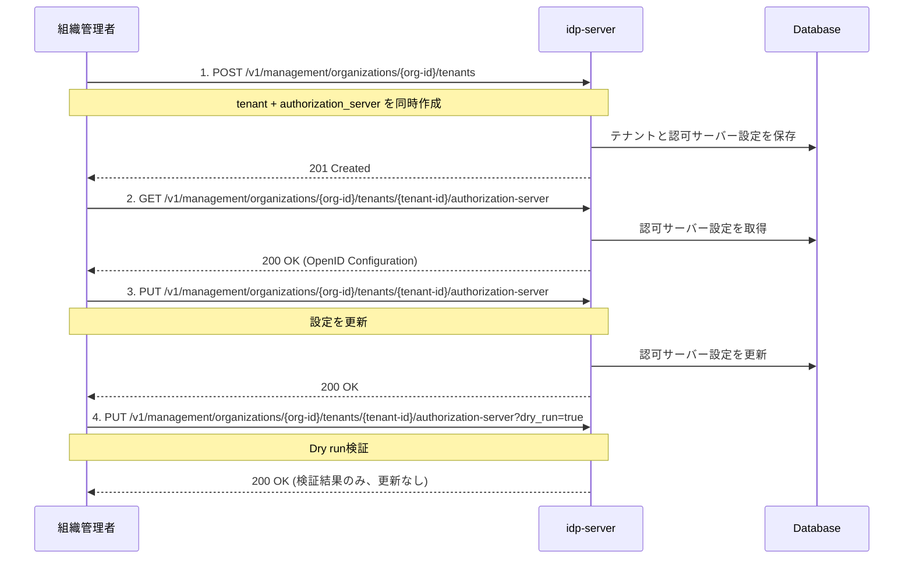

# テナント設定ガイド

## このドキュメントの目的

**ビジネス用テナント（アプリケーション用）を作成し、OAuth/OIDC認証が動作する環境を構築する**ことが目標です。

### 所要時間
⏱️ **約15分**

### このドキュメントの位置づけ

**Phase 1**: 最小構成で動作確認（Step 2/5）

**前提ドキュメント**:
- [how-to-01 組織初期化](./how-to-01-organization-initialization.md) - 組織とOrganizerテナント作成済み

**次のドキュメント**:
- [how-to-03 クライアント登録](./how-to-03-client-registration.md) - クライアント登録

### 前提条件
- [how-to-01](./how-to-01-organization-initialization.md)で組織初期化完了
- 組織管理者トークンを取得済み
- 組織ID（organization-id）を確認済み

---

## テナントとは

**Tenant（テナント）**は、OAuth 2.0/OpenID Connectの**独立した認証・認可ドメイン**です。

**組織内のテナント構成例**:
```
Organization (企業A)
├─ Organizer Tenant（管理用）
├─ Business Tenant A（Webアプリ用）
└─ Business Tenant B（モバイルアプリ用）
```

**Organizerテナント**: 組織管理専用（how-to-01で作成済み）
**Businessテナント**: アプリケーション用（このドキュメントで作成）

---

## テナント設定の内容

テナント作成時に以下を設定します：

### 1. 組織管理者権限のアクセストークン

**前提**: [how-to-01](./how-to-01-organization-initialization.md)で設定した環境変数を使用します。

まだ設定していない場合は、以下を実行してください：

```bash
# how-to-01で出力された環境変数をコピー&ペースト
export ORGANIZATION_ID='your-organization-id'
export TENANT_ID='your-tenant-id'
export ADMIN_EMAIL='admin@test-org.com'
export ADMIN_PASSWORD='TestOrgPassword123!'
export CLIENT_ID='your-client-id'
export CLIENT_SECRET='your-client-secret'
```

トークンを取得して環境変数に保存：

```bash
# 組織管理者トークンを取得して保存
export ORG_ADMIN_TOKEN=$(curl -sS -X POST "http://localhost:8080/${TENANT_ID}/v1/tokens" \
  -H 'Content-Type: application/x-www-form-urlencoded' \
  -d 'grant_type=password' \
  -d "username=${ADMIN_EMAIL}" \
  -d "password=${ADMIN_PASSWORD}" \
  -d "client_id=${CLIENT_ID}" \
  -d "client_secret=${CLIENT_SECRET}" \
  -d 'scope=management' | jq -r '.access_token')

# 確認
echo "Token: ${ORG_ADMIN_TOKEN:0:50}..."
```

**レスポンス例**:
```json
{
  "access_token": "eyJhbGc...",
  "token_type": "Bearer",
  "expires_in": 3600,
  "scope": "management"
}
```

✅ これで`$ORG_ADMIN_TOKEN`が設定されました。以降のManagement API呼び出しで使用します。

### 2. 組織IDとテナントIDの確認

環境変数が正しく設定されているか確認します：

```bash
# 環境変数の確認
echo "Organization ID: $ORGANIZATION_ID"
echo "Tenant ID: $TENANT_ID"
echo "Admin Token: ${ORG_ADMIN_TOKEN:0:50}..."
```

これらの値を以降のAPI呼び出しで使用します。

---

## 🧭 全体の流れ

1. テナント作成時に認可サーバー設定を同時登録
2. 認可サーバー設定の取得
3. 認可サーバー設定の更新

---

## 🔁 操作フロー図（Mermaid）



---

## 1. テナント作成と認可サーバー設定の同時登録

### リクエスト

```http
POST /v1/management/organizations/{organization-id}/tenants
Authorization: Bearer {access_token}
Content-Type: application/json

{
  "tenant": {
    "id": "550e8400-e29b-41d4-a716-446655440000",
    "name": "My Application Tenant",
    "domain": "https://app.example.com",
    "description": "Production tenant for my application",
    "authorization_provider": "idp-server",
    "tenant_type": "BUSINESS"
  },
  "authorization_server": {
    "issuer": "https://app.example.com/550e8400-e29b-41d4-a716-446655440000",
    "authorization_endpoint": "https://app.example.com/550e8400-e29b-41d4-a716-446655440000/v1/authorizations",
    "token_endpoint": "https://app.example.com/550e8400-e29b-41d4-a716-446655440000/v1/tokens",
    "userinfo_endpoint": "https://app.example.com/550e8400-e29b-41d4-a716-446655440000/v1/userinfo",
    "jwks_uri": "https://app.example.com/550e8400-e29b-41d4-a716-446655440000/v1/jwks",
    "scopes_supported": [
      "openid",
      "profile",
      "email"
    ],
    "response_types_supported": [
      "code"
    ],
    "response_modes_supported": [
      "query",
      "fragment"
    ],
    "subject_types_supported": [
      "public"
    ],
    "grant_types_supported": [
      "authorization_code",
      "refresh_token"
    ],
    "token_endpoint_auth_methods_supported": [
      "client_secret_post",
      "client_secret_basic"
    ]
  }
}
```

### パラメータ説明

#### tenant設定項目

| 項目 | 型 | 必須 | 説明 |
|-----|---|------|------|
| `id` | string (UUID) | ✅ | テナントの一意識別子 |
| `name` | string | ✅ | テナント名 |
| `domain` | string | ✅ | テナントのドメインURL |
| `description` | string | - | テナントの説明 |
| `authorization_provider` | string | ✅ | 認可プロバイダー（`idp-server`固定） |
| `tenant_type` | string | ✅ | テナント種別（`BUSINESS`/`PERSONAL`） |

#### authorization_server設定項目（OpenID Discovery準拠）

| 項目 | 型 | 必須 | 説明 |
|-----|---|------|------|
| `issuer` | string | ✅ | Issuer識別子（URL） |
| `authorization_endpoint` | string | ✅ | 認可エンドポイントURL |
| `token_endpoint` | string | ✅ | トークンエンドポイントURL |
| `userinfo_endpoint` | string | - | UserInfoエンドポイントURL |
| `jwks_uri` | string | ✅ | JWKS（公開鍵）エンドポイントURL |
| `scopes_supported` | array | ✅ | サポートするスコープ一覧 |
| `response_types_supported` | array | ✅ | サポートするレスポンスタイプ |
| `response_modes_supported` | array | - | サポートするレスポンスモード |
| `grant_types_supported` | array | ✅ | サポートするグラントタイプ |
| `token_endpoint_auth_methods_supported` | array | ✅ | サポートするクライアント認証方式 |
| `subject_types_supported` | array | - | サポートするsubject識別子タイプ |

### レスポンス

```http
HTTP/1.1 201 Created
Content-Type: application/json

{
  "dry_run": false,
  "result": {
    "id": "550e8400-e29b-41d4-a716-446655440000",
    "name": "My Application Tenant",
    "domain": "https://app.example.com",
    "description": "Production tenant for my application",
    "tenant_type": "BUSINESS",
    "created_at": "2025-01-15T10:00:00Z"
  }
}
```

---

## 2. 認可サーバー設定の取得

### リクエスト

```http
GET /v1/management/organizations/{organization-id}/tenants/{tenant-id}/authorization-server
Authorization: Bearer {access_token}
```

### レスポンス（OpenID Discovery形式）

```json
{
  "issuer": "https://app.example.com/550e8400-e29b-41d4-a716-446655440000",
  "authorization_endpoint": "https://app.example.com/550e8400-e29b-41d4-a716-446655440000/v1/authorizations",
  "token_endpoint": "https://app.example.com/550e8400-e29b-41d4-a716-446655440000/v1/tokens",
  "userinfo_endpoint": "https://app.example.com/550e8400-e29b-41d4-a716-446655440000/v1/userinfo",
  "jwks_uri": "https://app.example.com/550e8400-e29b-41d4-a716-446655440000/v1/jwks",
  "scopes_supported": ["openid", "profile", "email"],
  "response_types_supported": ["code"],
  "response_modes_supported": ["query", "fragment"],
  "subject_types_supported": ["public"],
  "grant_types_supported": ["authorization_code", "refresh_token"],
  "token_endpoint_auth_methods_supported": ["client_secret_post", "client_secret_basic"]
}
```

---

## 3. 認可サーバー設定の更新

### 通常の更新

```http
PUT /v1/management/organizations/{organization-id}/tenants/{tenant-id}/authorization-server
Authorization: Bearer {access_token}
Content-Type: application/json

{
  "issuer": "https://app.example.com/550e8400-e29b-41d4-a716-446655440000",
  "authorization_endpoint": "https://app.example.com/550e8400-e29b-41d4-a716-446655440000/v1/authorizations",
  "token_endpoint": "https://app.example.com/550e8400-e29b-41d4-a716-446655440000/v1/tokens",
  "userinfo_endpoint": "https://app.example.com/550e8400-e29b-41d4-a716-446655440000/v1/userinfo",
  "jwks_uri": "https://app.example.com/550e8400-e29b-41d4-a716-446655440000/v1/jwks",
  "scopes_supported": ["openid", "profile", "email", "address"],
  "response_types_supported": ["code"],
  "grant_types_supported": ["authorization_code", "refresh_token", "client_credentials"],
  "token_endpoint_auth_methods_supported": ["client_secret_post", "client_secret_basic", "private_key_jwt"]
}
```

### Dry Run（検証のみ、更新なし）

```http
PUT /v1/management/organizations/{organization-id}/tenants/{tenant-id}/authorization-server?dry_run=true
Authorization: Bearer {access_token}
Content-Type: application/json

{
  "issuer": "https://app.example.com/550e8400-e29b-41d4-a716-446655440000",
  "scopes_supported": ["openid", "profile", "email", "custom:admin"],
  ...
}
```

**レスポンス**:
```json
{
  "dry_run": true,
  "validation_result": {
    "valid": true,
    "warnings": []
  }
}
```

**注意**: `dry_run=true`の場合、実際の更新は行わず検証結果のみ返却されます。

---

## 実践例：金融グレード設定

### ユースケース

金融機関向けにFAPI準拠の高セキュリティ認可サーバー設定を作成します。

### 設定内容

```json
{
  "tenant": {
    "id": "banking-tenant-001",
    "name": "Online Banking Platform",
    "domain": "https://banking.example.com",
    "description": "FAPI-compliant banking tenant",
    "authorization_provider": "idp-server",
    "tenant_type": "BUSINESS"
  },
  "authorization_server": {
    "issuer": "https://banking.example.com/banking-tenant-001",
    "authorization_endpoint": "https://banking.example.com/banking-tenant-001/v1/authorizations",
    "token_endpoint": "https://banking.example.com/banking-tenant-001/v1/tokens",
    "userinfo_endpoint": "https://banking.example.com/banking-tenant-001/v1/userinfo",
    "jwks_uri": "https://banking.example.com/banking-tenant-001/v1/jwks",
    "scopes_supported": [
      "openid",
      "profile",
      "email",
      "openbanking:accounts",
      "openbanking:transactions"
    ],
    "response_types_supported": ["code"],
    "response_modes_supported": ["query", "jwt"],
    "grant_types_supported": ["authorization_code", "refresh_token"],
    "token_endpoint_auth_methods_supported": [
      "private_key_jwt",
      "tls_client_auth"
    ],
    "subject_types_supported": ["pairwise"]
  }
}
```

### 特徴

- **FAPI準拠スコープ**: `openbanking:*`スコープでFAPI検証適用
- **強力な認証**: `private_key_jwt`, `tls_client_auth`のみ許可
- **プライバシー保護**: `pairwise` subject typeでユーザー識別子を分離

---

## トラブルシューティング

### ❌ 組織アクセス権限エラー

**エラー**:
```json
{
  "error": "forbidden",
  "error_description": "組織へのアクセス権限がありません"
}
```

**原因**: ユーザーが組織メンバーではない、または適切な権限スコープがない。

**解決策**:
1. トークン取得時に`org-management`スコープを含める
2. ユーザーが対象組織のメンバーであることを確認

```bash
# 正しいスコープでトークン取得
curl -d "scope=org-management account management" ...
```

---

### ❌ グラントタイプが認可リクエストで拒否される

**エラー**:
```json
{
  "error": "unsupported_grant_type",
  "error_description": "client_credentials is not supported"
}
```

**原因**: 認可サーバー設定の`grant_types_supported`に含まれていません。

**解決策**: 設定を更新してグラントタイプを追加
```json
{
  "grant_types_supported": ["authorization_code", "refresh_token", "client_credentials"]
}
```

---

### ❌ Dry Run検証エラー

**症状**: `dry_run=true`でも実際に更新されてしまう。

**原因**: クエリパラメータの形式が不正。

**解決策**: URLエンコードを確認
```bash
# ✅ 正しい
curl -X PUT ".../authorization-server?dry_run=true"

# ❌ 間違い
curl -X PUT ".../authorization-server" -d "dry_run=true"
```

---

## ベストプラクティス

### 1. テナント作成時に必ず認可サーバー設定を含める

テナント作成APIでは`authorization_server`は必須です。後から追加することはできません。

```json
{
  "tenant": { ... },
  "authorization_server": { ... }  // 必須
}
```

### 2. Dry Runで事前検証

本番環境の設定変更前に必ず`dry_run=true`で検証します。

```bash
# 検証のみ
curl -X PUT ".../authorization-server?dry_run=true" -d '{...}'

# 問題なければ本番更新
curl -X PUT ".../authorization-server" -d '{...}'
```

### 3. スコープの慎重な設計

一度設定した`scopes_supported`を削除すると、既存クライアントが動作しなくなる可能性があります。

```json
{
  "scopes_supported": [
    "openid",      // 必須
    "profile",     // 標準
    "email",       // 標準
    "custom:read"  // 追加は可能、削除は慎重に
  ]
}
```

### 4. クライアント認証方式の適切な選択

| 用途 | 推奨方式 |
|-----|---------|
| Webアプリケーション | `client_secret_post`, `client_secret_basic` |
| ネイティブアプリ | `none`（PKCE必須） |
| 金融グレード | `private_key_jwt`, `tls_client_auth` |

---

## 関連ドキュメント

- [認可コードフロー](../content_04_protocols/authorization-code-flow.md) - プロトコル仕様詳細
- [マルチテナント](../content_03_concepts/multi-tenant.md) - テナント概念の理解
- [組織管理](../content_03_concepts/enterprise-id.md) - 組織レベルAPI概要

---

## 参考資料

- [OpenID Connect Discovery 1.0](https://openid.net/specs/openid-connect-discovery-1_0.html) - メタデータ仕様
- [RFC 6749: OAuth 2.0 Authorization Framework](https://datatracker.ietf.org/doc/html/rfc6749)
- [OpenID Connect Core 1.0](https://openid.net/specs/openid-connect-core-1_0.html)
- [FAPI 1.0 Advanced Profile](https://openid.net/specs/openid-financial-api-part-2-1_0.html)
