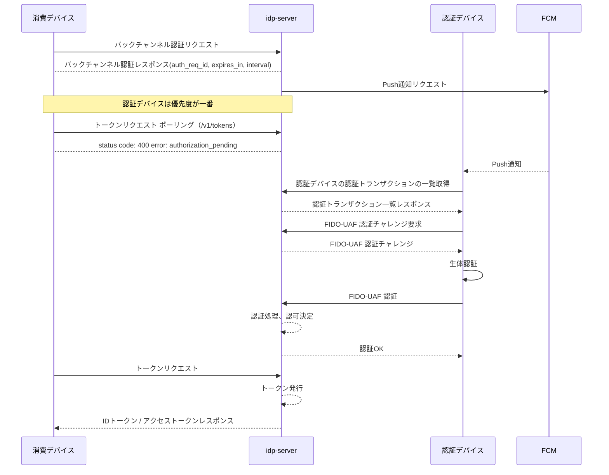

# CIBA + FIDO-UAF

## このドキュメントの目的

**CIBAフローでFIDO-UAF認証を利用し、モバイルデバイスでの生体認証を実装する**ことが目標です。

### 学べること

✅ **CIBA + FIDO-UAFの基礎**
- CIBAフローの概要（デカップルドフロー）
- FIDO-UAF認証の仕組み
- 消費デバイスと認証デバイスの役割分担

✅ **実践的な知識**
- Backchannel Authentication リクエストの実行
- 認証デバイスでのFIDO-UAF認証フロー
- トークン取得までの一連の流れ

### 所要時間
⏱️ **約20分**

### 前提条件
- [how-to-11: FIDO-UAF登録](./how-to-13-fido-uaf-registration.md)でデバイス登録完了
- テナントでCIBAが有効化されている
- FCM（Firebase Cloud Messaging）の設定完了

---

## フロー全体の流れ（概要）

* 消費デバイスと認証デバイスが異なる一般的なCIBAフロー（デカップルドフロー）



※ idp-serverとFIDOサーバーのシーケンスは、フローを簡略化するために省略しています。

## CIBAフロー概要

[CIBAフロー概要](content_04_protocols/protocol-02-ciba-flow.md)はこちらのドキュメントを参照ください。

---

## ステップ詳細

### Backchannel Authentication リクエスト（消費デバイス）

CIBA（Client-Initiated Backchannel Authentication）フローのバックチャンネル認証リクエストエンドポイント。
OpenID Connect Client-Initiated Backchannel Authentication Flow - Core 1.0 に準拠しています。

```
POST {tenant-id}/v1/backchannel/authentications
Content-Type: application/x-www-form-urlencoded

client_id=...&client_secret=...&scope=openid profile phone email&login_hint=...&binding_message=...&user_code=...&acr_values=urn:mace:incommon:iap:gold
```

#### クライアント認証

このBackchannel Authentication リクエストはクライアント認証を必要とします。
以下のクライアント認証方式に対応しています

| 認証方式                          | 説明                                                                   | 
|-------------------------------|----------------------------------------------------------------------|
| `client_secret_basic`         | AuthorizationヘッダにBasic認証形式で `client_id` / `client_secret` を送信（デフォルト） | 
| `client_secret_post`          | `client_id` と `client_secret` をリクエストボディに含めて送信                        |
| `client_secret_jwt`           | `client_secret` を使って署名したJWTを `client_assertion` に含めて送信               |
| `private_key_jwt`             | 秘密鍵で署名したJWTを `client_assertion` に含めて送信。公開鍵は事前に登録されている必要あり            | 
| `tls_client_auth`（mTLS）       | クライアント証明書で相互TLS認証。サーバーは証明書のSubject DNやSANでクライアントを識別                  | 
| `self_signed_tls_client_auth` | 自己署名クライアント証明書でTLS認証。証明書のフィンガープリントを事前に登録して認証を成立させる                    |

#### リクエストパラメータ

| パラメータ名                  | 型               | 必須   | 説明                                                                 |
|-------------------------|-----------------|------|--------------------------------------------------------------------|
| `client_id`             | `string`        | 条件付き | クライアントの識別子。クライアント認証方式が client_secret_basicの場合は省略可能。                |
| `client_secret`         | `string`        | 条件付き | クライアントシークレット。クライアント認証方式が client_secret_postの場合は必須。                 |
| `scope`                 | `string`        | ✅    | `openid` を含める必要がある。例：`openid profile email`                        |
| `login_hint`            | `string`        | 条件付き | ユーザーを識別するヒント。例：sub:ユーザーID `login_hint` または `id_token_hint` のいずれか必須 |
| `id_token_hint`         | `string`        | 条件付き | 過去のID Token。`login_hint` または `id_token_hint` のいずれか必須               |
| `binding_message`       | `string`        | -    | ユーザー端末に表示されるメッセージ（最大20文字）                                            |
| `requested_expiry`      | `integer`       | -    | `auth_req_id` の有効期限（秒）                                             |
| `request_context`       | `string`        | -    | 認証時に使う追加情報。ユーザー通知に含めることも可                                          |
| `acr_values`            | `string`        | -    | 要求する認証強度（ACR値）                                                     |
| `authorization_details` | `array<object>` | -    | トランザクションの詳細要求。Rich Authorization Request対応など                       |

login_hintの形式に関しては、[CIBA フロー](content_04_protocols/protocol-02-ciba-flow.md)を参照ください。

#### レスポンス

* 正常応答

例

```json
{
  "auth_req_id": "90f3a4f2-bffe-4c1b-9abc-89f48c58e067",
  "interval": 5,
  "expires_in": 300
}
```

| フィールド名        | 型         | 説明                                                  | 必須 |
|---------------|-----------|-----------------------------------------------------|----|
| `auth_req_id` | `string`  | 認証リクエストを識別する一意なID。クライアントはこのIDを使って `/token` にアクセスする。 | ✅  |
| `expires_in`  | `integer` | `auth_req_id` の有効期限（秒）。期限切れになるとトークン取得はできない。         | ✅  |
| `interval`    | `integer` | ポーリングによるトークン取得を行う場合の最小間隔（秒）。省略可。                    | -  |

* 400応答

| フィールド名              | 型      | 説明                                                                                                                                                                                             | 必須 |
|---------------------|--------|------------------------------------------------------------------------------------------------------------------------------------------------------------------------------------------------|----|
| `error`             | string | エラーコード（以下のいずれか）： `invalid_request`, `invalid_scope`, `expired_login_hint_token`, `unknown_user_id`, `unauthorized_client`, `missing_user_code`, `invalid_user_code`, `invalid_binding_message` | ✅  |
| `error_description` | string | エラーの詳細説明。例：`The request is missing a required parameter.`                                                                                                                                      | ⭕  |

エラーコード一覧

| エラーコード                     | 説明                       |
|----------------------------|--------------------------|
| `invalid_request`          | パラメータが不足・重複・不正など         |
| `invalid_scope`            | スコープが不正                  |
| `expired_login_hint_token` | login\_hint\_token の期限切れ |
| `unknown_user_id`          | ヒントでユーザーを特定できなかった        |
| `unauthorized_client`      | 認証フローの使用許可がない            |
| `missing_user_code`        | 必須の `user_code` が不足      |
| `invalid_user_code`        | 指定された `user_code` が無効    |
| `invalid_binding_message`  | `binding_message` が不適切   |

* 401

| フィールド名              | 型      | 説明                                         | 必須 |
|---------------------|--------|--------------------------------------------|----|
| `error`             | string | エラーコード。`invalid_client` のみ。                | ✅  |
| `error_description` | string | エラーの詳細説明。例：`Client authentication failed.` | -  |

エラーコード一覧

| エラーコード           | 説明                                 |
|------------------|------------------------------------|
| `invalid_client` | クライアント認証に失敗（ID/シークレット不一致、認証方式不正など） |

* 403

| フィールド名              | 型      | 説明                                                          | 必須 |
|---------------------|--------|-------------------------------------------------------------|----|
| `error`             | string | エラーコード。`access_denied` のみ。                                  | ✅  |
| `error_description` | string | エラーの詳細説明。例：`The request was denied by the OpenID Provider.` | -  |

エラーコード一覧

| エラーコード          | 説明                                        |
|-----------------|-------------------------------------------|
| `access_denied` | リクエストが事前に拒否された（特定のクライアントやフロー種別を事前にブロックなど） |

### Push通知

消費デバイスと認証デバイスが異なる一般的なCIBAフロー（デカップルドフロー）においては、プッシュ通知を利用して認証デバイスに認証を要求します。

**サポートされる通知チャネル:**
- **FCM** (Firebase Cloud Messaging) - Android/iOS/Web向け
- **APNS** (Apple Push Notification Service) - iOS向け

複数チャネルを設定している場合、デバイスタイプに応じて自動的に適切なチャネルが選択されます。

#### Push通知で送信するデータ

| key      | value      |
|----------|------------|
| `sender` | 送信元の識別子    |
| `title`  | 通知タイトル     |
| `body`   | 通知メッセージボディ |

#### Push通知の対象のデバイスについて

優先順位の一番高いデバイスに対してPush通知を行います。

優先順位など認証デバイスの属性情報に登録できる項目は下記ドキュメントを参照ください。

[FIDO-UAF登録](how-to-13-fido-uaf-registration.md)

### 認証トランザクションの取得（認証デバイス）

```
GET {tenant-id}/v1/authentication-devices/{device-id}/authentications?client_id=...
```

対象となる認証トランザクション情報（ID、フロー、状態など）を取得します。

#### 検索条件（クエリパラメータ）

| パラメータ名             | 型         | 説明                                           | 必須 | 備考                                                    |
|--------------------|-----------|----------------------------------------------|----|-------------------------------------------------------|
| `id`               | `string`  | トランザクションID（UUID）                             | -  |                                                       |
| `flow`             | `string`  | 認証フロー種別（例: `ciba` `oauth`）                   | -  |                                                       |
| `authorization_id` | `string`  | 認可ID（UUID）                                   | -  |                                                       |
| `client_id`        | `string`  | クライアントID                                     | -  |                                                       |
| `device_id`        | `string`  | 認証デバイスID（UUID）                               | -  |                                                       |
| `from`             | `string`  | 取得範囲の開始日時（（ISO-8601形式、例：2025-07-01T00:00:00） | -  | `LocalDateTime`に変換                                    |
| `to`               | `string`  | 取得範囲の終了日時（（ISO-8601形式、例：2025-07-15T23:59:59） | -  | `LocalDateTime`に変換                                    |
| `limit`            | `integer` | 最大取得件数（デフォルト: 20）                            | -  |                                                       |
| `offset`           | `integer` | ページネーション用オフセット（デフォルト: 0）                     | -  |                                                       |
| `exclude_expired`  | `boolean` | 有効期限切れを除外するか（デフォルト: `true`）                  | -  |                                                       |
| `attributes.{key}` | `string`  | 動的属性による検索フィルター                               | -  | プレフィックスが `attributes.` `attributes.auth_req_id`で検索が可能 |

#### レスポンス

#### トップ階層のオブジェクト

| フィールド名 | 型       | 説明            |
|--------|---------|---------------|
| `list` | `array` | 認証トランザクションの配列 |

#### 配列内のオブジェクト（認証トランザクション）

| フィールド名                          | 型                   | 説明                                          | 必須 |
|---------------------------------|---------------------|---------------------------------------------|----|
| `id`                            | `string` (UUID)     | トランザクションの一意識別子                              | ✅  |
| `flow`                          | `string`            | 認証フロー種別（例: `ciba`, `oauth`）                 | ✅  |
| `tenant_id`                     | `string` (UUID)     | テナント識別子                                     | ✅  |
| `tenant_attributes`             | `object`            | テナントに紐づく任意のメタデータ情報（名称や設定など）                 | -  |
| `client_id`                     | `string` (UUID)     | クライアント識別子                                   | ✅  |
| `client_attributes.client_name` | `string`            | クライアント名（表示用）                                | -  |
| `client_attributes.client_uri`  | `string`            | クライアントのサービスURL                              | -  |
| `client_attributes.logo_uri`    | `string`            | クライアントのロゴ画像URL                              | -  |
| `client_attributes.contacts`    | `string`            | クライアントの連絡先（例: メールアドレス）                      | -  |
| `client_attributes.tos_uri`     | `string`            | 利用規約ページURL                                  | -  |
| `client_attributes.policy_uri`  | `string`            | プライバシーポリシーURL                               | -  |
| `context.acr_values`            | `string`            | 認証コンテキストクラス。例: `urn:mace:incommon:iap:gold` | -  |
| `context.binding_message`       | `string`            | 認証デバイスに表示される確認用メッセージ                        | -  |
| `context.scopes`                | `string`            | 要求されたスコープ（スペース区切り）                          | ✅  |
| `user.sub`                      | `string`            | ユーザー識別子（Subject）                            | ✅  |
| `user.provider_id`              | `string`            | Idプロバイダー識別子                                 | ✅  |
| `user.external_user_id`         | `string`            | 外部IdPのユーザー識別子                               | -  |
| `user.name`                     | `string`            | ユーザー名                                       | -  |
| `user.email`                    | `string`            | email                                       | -  |
| `user.locale`                   | `string`            | 言語設定。（例：ja, en）                             | -  |
| `user.phone_number`             | `string`            | 電話番号                                        | -  |
| `user.status`                   | `string`            | ユーザーステータス                                   | ✅  |
| `created_at`                    | `string` (ISO-8601) | トランザクション作成日時                                | ✅  |
| `expires_at`                    | `string` (ISO-8601) | トランザクション有効期限                                | ✅  |

※オブジェクト構造は変更する可能性があります。


---

FIDO-UAF認証は `idp-server`経由でFIDOサーバーと通信を行い実施します。

各APIのリクエストやレスポンスの仕様はFIDOサーバーのAPI仕様をご確認ください。

### FIDO-UAFチャレンジ（認証デバイス）

#### リクエスト

```
POST {tenant-id}/v1/authentications/{id}/fido-uaf-authentication-challenge
Content-Type: application/json

{
  ...FIDOサーバーのAPI仕様に沿ったパラメータを指定する
}
```

#### レスポンス

```
{
...FIDOサーバーからのレスポンスをそのまま返却する
}
```

### FIDO-UAF Facet 情報の取得（認証デバイス）

FIDOクライアントが信頼できるアプリとして動作するための **Facet IDリスト** を取得します。
FIDOサーバから取得したレスポンスをそのまま返却します。

#### リクエスト

```
GET {tenant-id}/.well-known/fido-uaf/facets
Content-Type: application/json
```

#### レスポンス

```
{
...FIDOサーバーからのレスポンスをそのまま返却する
}
```

### FIDO-UAF認証（認証デバイス）

#### リクエスト

```
POST {tenant-id}/v1/authentications/{id}/fido-uaf-authentication
Content-Type: application/json

{
  ...FIDOサーバーのAPI仕様に沿ったパラメータを指定する
}
```

#### レスポンス

FIDO-UAFの認証に成功した場合はステータスコード200を返却します。


---

### トークンリクエスト（消費デバイス）

認証デバイスの認証が成功すると、トークンが取得できます。認証が完了するまでトークンリクエストはエラーとなります。

```
POST {tenant-id}/v1/tokens
Content-Type: application/x-www-form-urlencoded

grant_type=urn:openid:params:grant-type:ciba&auth_req_id=...&client_id=...&client_secret=...
```

#### クライアント認証

| 認証方式                          | 説明                                                                   | 
|-------------------------------|----------------------------------------------------------------------|
| `client_secret_basic`         | AuthorizationヘッダにBasic認証形式で `client_id` / `client_secret` を送信（デフォルト） | 
| `client_secret_post`          | `client_id` と `client_secret` をリクエストボディに含めて送信                        |
| `client_secret_jwt`           | `client_secret` を使って署名したJWTを `client_assertion` に含めて送信               |
| `private_key_jwt`             | 秘密鍵で署名したJWTを `client_assertion` に含めて送信。公開鍵は事前に登録されている必要あり            | 
| `tls_client_auth`（mTLS）       | クライアント証明書で相互TLS認証。サーバーは証明書のSubject DNやSANでクライアントを識別                  | 
| `self_signed_tls_client_auth` | 自己署名クライアント証明書でTLS認証。証明書のフィンガープリントを事前に登録して認証を成立させる                    |

#### リクエスト

| フィールド名          | 型      | 説明                                                   | 必須   |
|-----------------|--------|------------------------------------------------------|------|
| `grant_type`    | string | グラントタイプ固定値。<br />`urn:openid:params:grant-type:ciba` | ✅    |
| `auth_req_id`   | string | 認証リクエスト時に発行された識別子。トークン取得時に使用。                        | ✅    |
| `client_id`     | string | クライアントID。`client_secret_basic` の場合は省略可能。             | 条件付き |
| `client_secret` | string | クライアントシークレット。`client_secret_post` 認証方式の場合に指定。        | -    |

#### レスポンス

* 正常応答

| フィールド名          | 型       | 説明                                                               | 必須 |
|-----------------|---------|------------------------------------------------------------------|----|
| `access_token`  | string  | APIへのアクセスに使用されるアクセストークン。識別子型（ランダム文字列）または内包型（JWT）。                | ✅  |
| `token_type`    | string  | トークンタイプ。通常は `"Bearer"`。                                          | ✅  |
| `expires_in`    | integer | アクセストークンの有効期限（秒単位）。例: `3600`。                                    | ✅  |
| `refresh_token` | string  | 新しいアクセストークン取得用のリフレッシュトークン。スコープや設定により省略されることもある。                  | -  |
| `id_token`      | string  | OpenID Connectのユーザー情報を含むJWT。`sub`（ユーザーID）や`auth_time`などのクレームを含む。 | ✅  |

* 400応答

| フィールド名              | 型      | 説明                                                                                                                                                                                                                                                                                                                                                                                                        | 必須 |
|---------------------|--------|-----------------------------------------------------------------------------------------------------------------------------------------------------------------------------------------------------------------------------------------------------------------------------------------------------------------------------------------------------------------------------------------------------------|----|
| `error`             | string | エラーコード。OAuth 2.0標準 + CIBA固有エラーを含む。<br /><br /> **標準エラー例：**<br /> - `invalid_request`<br /> - `invalid_client`<br /> - `invalid_grant`<br /> - `unauthorized_client`<br /> - `unsupported_grant_type`<br /> - `invalid_scope`<br /><br /> **CIBA固有：**<br /> - `authorization_pending`: 認証未完了<br /> - `slow_down`: ポーリング間隔が短すぎる<br /> - `expired_token`: 認証リクエストの有効期限切れ<br /> - `access_denied`: ユーザーが認証を拒否 | ✅  |
| `error_description` | string | エラーの詳細な説明（省略可能）。ログ用やデバッグに便利。                                                                                                                                                                                                                                                                                                                                                                              | -  |

---

### IDトークンの検証（消費デバイス）

取得したIDトークンおよびアクセストークンは、以下のエンドポイントで取得したJWKSを用いて検証可能です：

```
GET {tenant-id}/v1/jwks
```

IDトークン検証後、`amr`（Authentication Method Reference）クレームに以下の値が含まれることを確認できます：

- `fido-uaf`: FIDO-UAF認証を使用したことを示す

**将来の拡張:**
フィッシング耐性のある認証を証明するため、RFC 8176標準の`hwk`（Hardware Key Proof-of-Possession）をamrに追加する予定です。

---

## まとめ

このように `idp-server` のCIBAフローは、FIDO-UAFによる強固な認証と非同期のユーザーインタラクションを組み合わせることで、

* ユーザー体験の向上
* 高いセキュリティ

を同時に実現できます。

