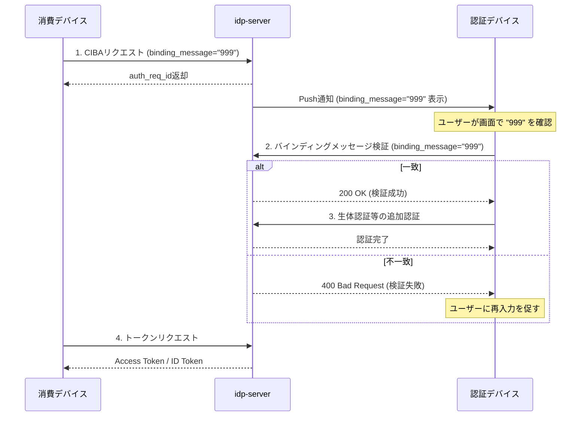

# CIBAバインディングメッセージのバックエンド検証

## このドキュメントの目的

**CIBAフローにおけるバインディングメッセージのバックエンド検証を理解し、実装する**ことが目標です。

### 学べること

- **バインディングメッセージ検証の基礎**
  - バインディングメッセージの役割（フィッシング対策、トランザクション確認）
  - 消費デバイスと認証デバイス間の連動確認
  - OIDC CIBA仕様との関連

- **実践的な知識**
  - 認証デバイスでのバインディングメッセージ検証API
  - 認証ポリシーでの設定方法
  - エラーハンドリング

### 所要時間
**約15分**

### 前提条件
- [how-to-12: CIBA + FIDO-UAF](./how-to-12-ciba-flow-fido-uaf.md)の理解
- テナントでCIBAが有効化されている
- 認証デバイスが登録されている

---

## バインディングメッセージとは

### OIDC CIBA仕様での定義

[OpenID Connect CIBA Core 1.0 - Section 7.1](https://openid.net/specs/openid-client-initiated-backchannel-authentication-core-1_0.html#rfc.section.7.1)より:

> The binding_message is intended to be displayed on both the consumption device and the authentication device to interlock them together for the transaction by way of a visual cue for the end-user.

**binding_message**は、消費デバイスと認証デバイスを視覚的に連動させ、ユーザーがトランザクションを確認できるようにするためのメッセージです。

### 用途

| 用途 | 説明 | 例 |
|-----|------|---|
| **フィッシング対策** | ユーザーが正しいトランザクションを承認しているか確認 | `確認コード: 1234` |
| **トランザクション確認** | 金融取引等での取引内容確認 | `振込: ¥50,000` |
| **セッション連動** | 複数デバイス間でのセッション一致確認 | `TX-ABCD-1234` |

---

## フロー概要



---

## API仕様

### バインディングメッセージ検証エンドポイント

認証デバイスからバインディングメッセージの一致を検証するAPIです。

```
POST {tenant-id}/v1/authentications/{flow-type}/{transaction-id}/interactions/authentication-device-binding-message
Content-Type: application/json

{
  "binding_message": "999"
}
```

#### パスパラメータ

| パラメータ | 型 | 説明 |
|-----------|---|------|
| `tenant-id` | `string` | テナント識別子 |
| `flow-type` | `string` | 認証フロー種別（`ciba`等） |
| `transaction-id` | `string` | 認証トランザクションID（UUID） |

#### リクエストボディ

| フィールド | 型 | 必須 | 説明 |
|-----------|---|------|------|
| `binding_message` | `string` | ✅ | ユーザーが入力したバインディングメッセージ |

#### レスポンス

**成功時 (200 OK)**

```json
{}
```

**失敗時 (400 Bad Request)**

```json
{
  "error": "invalid_request",
  "error_description": "Binding Message is unmatched"
}
```

#### エラーコード

| エラー | 説明 |
|-------|------|
| `invalid_request` - "Binding Message is null" | CIBAリクエストにbinding_messageが含まれていない |
| `invalid_request` - "Binding Message is unmatched" | 入力されたbinding_messageが一致しない |

---

## 認証トランザクションの取得

認証デバイスは、まず認証トランザクション情報を取得してbinding_messageを表示します。

```
GET {tenant-id}/v1/authentication-devices/{device-id}/authentications?client_id=...
```

#### レスポンス例

```json
{
  "list": [
    {
      "id": "550e8400-e29b-41d4-a716-446655440000",
      "flow": "ciba",
      "context": {
        "binding_message": "999",
        "scopes": "openid profile"
      },
      "client_attributes": {
        "client_name": "My App"
      }
    }
  ]
}
```

`context.binding_message`をユーザーに表示し、ユーザーが消費デバイスに表示されているメッセージと一致することを確認した上で入力させます。

---

## 実装例

### 認証デバイスアプリ（モバイル）での実装フロー

```javascript
// 1. 認証トランザクション取得
const transactionResponse = await fetch(
  `${baseUrl}/${tenantId}/v1/authentication-devices/${deviceId}/authentications?client_id=${clientId}`
);
const transactions = await transactionResponse.json();
const transaction = transactions.list[0];

// 2. ユーザーにbinding_messageを表示
// UI: "消費デバイスに表示されているコードを入力してください"
// UI: 期待値表示: transaction.context.binding_message (e.g., "999")

// 3. ユーザー入力を取得
const userInput = await getUserInput(); // ユーザーが入力した値

// 4. バインディングメッセージ検証API呼び出し
const verifyResponse = await fetch(
  `${baseUrl}/${tenantId}/v1/authentications/${transaction.flow}/${transaction.id}/interactions/authentication-device-binding-message`,
  {
    method: 'POST',
    headers: { 'Content-Type': 'application/json' },
    body: JSON.stringify({ binding_message: userInput })
  }
);

if (verifyResponse.status === 200) {
  // 5. 検証成功 → 次の認証ステップへ（生体認証等）
  await proceedToNextAuthentication(transaction);
} else {
  // 6. 検証失敗 → エラー表示
  const error = await verifyResponse.json();
  showError(error.error_description);
}
```

---

## 認証ポリシーでの設定

バインディングメッセージ検証を認証フローに組み込むには、認証ポリシーで設定します。

### 設定例

```json
{
  "id": "ciba-binding-message-policy",
  "name": "CIBA with Binding Message Verification",
  "auth_flow": "ciba",
  "conditions": {
    "scopes": ["openid"]
  },
  "interactions": [
    {
      "type": "authentication-device-binding-message",
      "required": true,
      "order": 1
    },
    {
      "type": "fido-uaf-authentication",
      "required": true,
      "order": 2
    }
  ]
}
```

### インタラクションタイプ

| タイプ | 説明 |
|-------|------|
| `authentication-device-binding-message` | バインディングメッセージ検証 |
| `fido-uaf-authentication` | FIDO-UAF認証 |
| `password-authentication` | パスワード認証 |

---

## セキュリティイベント

バインディングメッセージ検証の結果はセキュリティイベントとして記録されます。

| イベントタイプ | 説明 |
|---------------|------|
| `authentication_device_binding_message_success` | バインディングメッセージ検証成功 |
| `authentication_device_binding_message_failure` | バインディングメッセージ検証失敗 |

### Security Event Hookでの活用

検証失敗時にアラートを送信する設定例：

```json
{
  "type": "webhook",
  "events": ["authentication_device_binding_message_failure"],
  "endpoint": "https://your-webhook.example.com/alerts",
  "method": "POST"
}
```

---

## binding_messageの制約

### 長さ制限

`idp-server`では、binding_messageは**最大20文字**に制限されています。

```java
// CibaRequestBaseVerifier.java
private static final int BINDING_MESSAGE_MAX_LENGTH = 20;
```

CIBA仕様より:
> The binding_message SHOULD be relatively short and use a limited set of plain text characters.

### 推奨フォーマット

| パターン | 例 | 用途 |
|---------|---|------|
| 数字コード | `1234` | シンプルな確認 |
| 英数字コード | `TX-ABCD` | トランザクション識別 |
| 金額表示 | `¥50,000` | 金融取引確認 |

---

## よくあるエラーと対処

### エラー1: "Binding Message is null"

**原因**: CIBAリクエスト時に`binding_message`パラメータが指定されていない

**対処**: CIBAリクエストに`binding_message`を含める

```bash
curl -X POST "${TENANT_ID}/v1/backchannel/authentications" \
  -d "login_hint=..." \
  -d "binding_message=1234" \  # ← 追加
  -d "scope=openid"
```

### エラー2: "Binding Message is unmatched"

**原因**: ユーザーが入力したbinding_messageが元のリクエストと一致しない

**対処**:
- ユーザーに正しいコードの再入力を促す
- 消費デバイスに表示されているコードを確認するよう案内

---

## 関連ドキュメント

- [how-to-12: CIBA + FIDO-UAF](./how-to-12-ciba-flow-fido-uaf.md) - CIBAフローの基本
- [CIBA Flow実装ガイド](../content_06_developer-guide/03-application-plane/06-ciba-flow.md) - 開発者向け詳細
- [OpenID Connect CIBA Core 1.0](https://openid.net/specs/openid-client-initiated-backchannel-authentication-core-1_0.html) - 仕様書

---

## 実装リファレンス

| ファイル | 説明 |
|---------|------|
| `AuthenticationDeviceBindingMessageInteractor.java` | バインディングメッセージ検証実装 |
| `StandardAuthenticationInteraction.java` | 認証インタラクションタイプ定義 |
| `DefaultSecurityEventType.java` | セキュリティイベントタイプ |

---

**情報源**:
- `libs/idp-server-authentication-interactors/src/main/java/org/idp/server/authentication/interactors/device/AuthenticationDeviceBindingMessageInteractor.java`
- OpenID Connect CIBA Core 1.0 Section 7.1

**最終更新**: 2025-12-09
