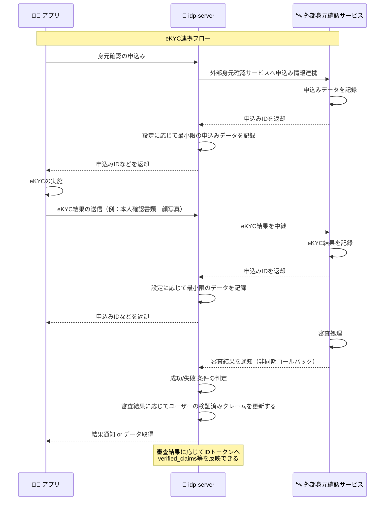
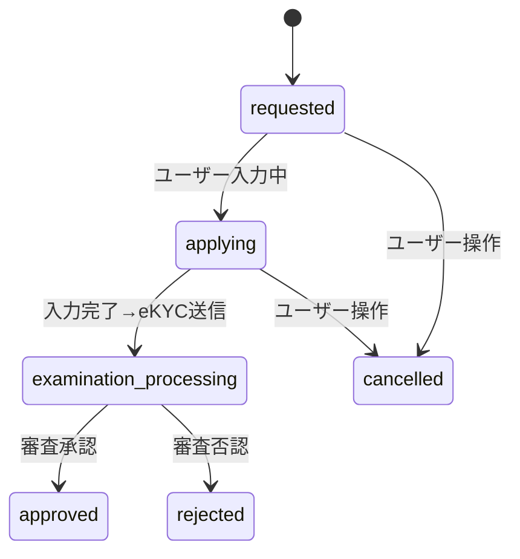
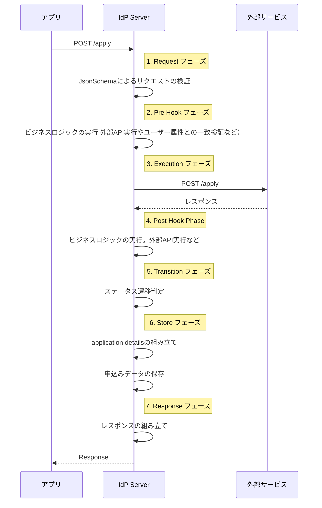
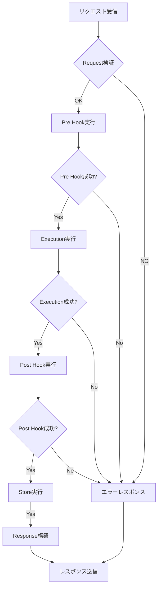

# 身元確認申込み

## 概要

`idp-server` は身元確認済みID（verified ID）を提供するにあたり、 **申込み・審査・完了登録**の一連の申込みを管理できます。
外部のサービスと連携も可能です。

申込み機能はテンプレート形式で柔軟に定義可能で、申込みのバリデーション・外部サービス連携・データ変換などに対応しています。

## 利用方法

1. `Control Plane API` を使ってテンプレートを事前に登録する。
2. テンプレートに応じて身元確認APIが利用可能になる。
3. ユーザーが申込み操作を実行すると、定義済みテンプレートに従って申込み処理を実行する。
4. 外部サービスからコールバックも同様に、定義済みテンプレートに従って処理を実行する。
5. 身元確認が完了すると `verified_claims` をユーザーに紐づけて永続化する。
6. IDトークンやUserInfoに `verified_claims` を含めることができる。

※ 外部身元確認サービスのAPI仕様に合わせて、柔軟に `idp-server` の各申込のプロセスの設定を設定することができます。

## 申込みテンプレートの設定項目

| 項目           | 内容                                          | 必須 |
|--------------|---------------------------------------------|----|
| `id`         | テンプレートのUUID                                 | ✅️ |
| `type`       | 申込み種別（例: `investment-account-opening`）      | ✅️ |
| `common`     | 共通設定。外部サービス。外部サービスのコールバック用の申込ID             | -  |
| `processes`  | 申込みプロセス。一連の身元確認のプロセスを定義する。複数登録可能            | ✅️ |
| `result`     | `verified_claims` `source_details` のマッピング定義 | -  |
| `attributes` | 申込参照APIのレスポンスに含める属性情報。                      | -  |

## 申込みステータス

身元確認申込みは、申請の受付から承認・否認に至るまで複数のステータスを経由します。
本項では、各ステータスの意味と代表的な利用タイミングについて解説します。

ステータスは、申込み処理の進行状況を表すものであり、申込み一覧画面や詳細画面での表示などでご利用してください。

以下は、申込みにおける代表的なステータス一覧とその説明です。

| ステータス名                   | 説明                                                             |
|--------------------------|----------------------------------------------------------------|
| `requested`              | 申請リクエストが正常に受理された直後の状態です。                                       |
| `applying`               | ユーザーまたは外部システムが必要な情報を入力・収集中の状態です。フォーム入力中や追加書類のアップロード待ちなどが該当します。 |
| `examination_processing` | 申請内容に対する審査が実施されている状態です。外部eKYCサービスとの連携や人手による審査が行われている場合も含まれます。  |
| `approved`               | 審査の結果、申請が承認された状態です。ユーザーの身元確認が完了し、検証済みクレームの登録などが行われます。          |
| `rejected`               | 審査の結果、申請が却下された状態です。必要に応じて理由の提示や再申請の導線提示が推奨されます。                |
| `expired`                | 有効期限切れなどにより、申請が無効となった状態です。一定期間操作が行われなかった場合などに自動的に遷移することがあります。  |
| `cancelled`              | ユーザーまたは管理者によって申請が任意に中断された状態です。取り下げやキャンセル操作などが該当します。            |
| `unknown`                | 状態が特定できない不明な状態です。移行中やデータ不整合、バージョン差異等により例外的に発生する可能性があります。       |

## 申込APIのパスの動的設定

身元確認申込みAPIは、テンプレートのprocesses定義の基づいて、テナント単位で動的にルーティングされる仕組みになっています。

APIのパスの verification-type と process が、テンプレートの "type" フィールドと "processes"
に定義されたキーにより組み立てられます。

※テナント間で設定は共有されません。ただし、別テナントに同一の設定を適用するこは可能。

**アプリからの申込み用API**

```
初回申込み
POST /{tenant-id}/v1/me/identity-verification/applications/{verification-type}/{process}
※リソースオーナーのアクセストークンが必要

後続処理
POST /{tenant-id}/v1/me/identity-verification/applications/{verification-type}/{id}/{process}
※リソースオーナーのアクセストークンが必要

申込み一覧取得
GET /{tenant-id}/v1/me/identity-verification/applications
※リソースオーナーのアクセストークンが必要
※クエリパラメータ: type, status, limit, offset

申込み削除
DELETE /{tenant-id}/v1/me/identity-verification/applications/{verification-type}/{id}
※リソースオーナーのアクセストークンが必要

検証結果取得
GET /{tenant-id}/v1/me/identity-verification/results
※リソースオーナーのアクセストークンが必要
※検証済みクレーム（verified_claims）の取得
```

### APIエンドポイント詳細

#### 申込み一覧取得 API
- **パス**: `GET /{tenant-id}/v1/me/identity-verification/applications`
- **認証**: リソースオーナーのアクセストークン必須
- **クエリパラメータ**:
  - `type` (optional): 申込み種別でフィルタリング
  - `status` (optional): 申込みステータスでフィルタリング（requested, applying, examination_processing, approved, rejected, expired, cancelled）
  - `limit` (optional): 取得件数制限（デフォルト: 20）
  - `offset` (optional): 取得開始位置（デフォルト: 0）

#### 申込み削除 API
- **パス**: `DELETE /{tenant-id}/v1/me/identity-verification/applications/{verification-type}/{id}`
- **認証**: リソースオーナーのアクセストークン必須
- **説明**: 申込みの削除または取り下げ処理。ステータスがcancelledに変更される

#### 検証結果取得 API
- **パス**: `GET /{tenant-id}/v1/me/identity-verification/results`
- **認証**: リソースオーナーのアクセストークン必須
- **レスポンス**: ユーザーに紐づく検証済みクレーム（verified_claims）とその詳細情報

[リソースオーナー用のAPI仕様（身元確認関連の申込みAPIを含む）](api-resource-owner-ja)

**審査結果コールバックAPI**

```
審査結果コールバック
POST /{tenant-id}/internal/v1/identity-verification/callback/{verification-type}/{process}
※テンプレートのcommonへの設定および、申込み詳細(application_details)から申込みを特定できるパラメータを含める必要があります。

{
 "id": "UUID",
 "type": "investment-account-opening"
 "common": {
    "external_service": "mocky",
    "callback_application_id_param": "application_id"
  },
  "processes": {},
  "result: {}
}

審査結果コールバック
POST /{tenant-id}/internal/v1/identity-verification/callback/{verification-type}/{id}/{process}

```

[外部ステム連携用インターナルAPI仕様（身元確認関連のコールバックAPIを含む）](api-internal-ja)

## 条件付き実行機能 (Conditional Execution)

身元確認のpre_hookコンポーネント（検証とパラメータ解決）に条件を設定することで、アプリケーションのコンテキストに応じて実行を制御できます。

### 概要

条件付き実行機能により、以下の利点があります：

- **パフォーマンス最適化**: 不要な処理をスキップ
- **柔軟な制御**: ユーザー属性や申込み内容に応じた動的な処理
- **コスト削減**: 外部API呼び出しの最適化
- **セキュリティ向上**: リスクベースの認証制御

### 設定方法

pre_hookコンポーネントに `condition` フィールドを追加します：

```json
{
  "pre_hook": {
    "verifications": [
      {
        "type": "user_claim",
        "details": { ... },
        "condition": {
          "operation": "eq",
          "path": "$.user.role",
          "value": "admin"
        }
      }
    ],
    "additional_parameters": [
      {
        "type": "http_request",
        "details": { ... },
        "condition": {
          "operation": "gte",
          "path": "$.request.amount",
          "value": 10000
        }
      }
    ]
  }
}
```

### 条件演算子

| 演算子 | 説明 | 例 |
|-------|------|---|
| `eq` | 等しい | `{"operation": "eq", "path": "$.user.role", "value": "admin"}` |
| `ne` | 等しくない | `{"operation": "ne", "path": "$.user.status", "value": "suspended"}` |
| `gt` | より大きい | `{"operation": "gt", "path": "$.request.amount", "value": 1000}` |
| `gte` | 以上 | `{"operation": "gte", "path": "$.user.age", "value": 18}` |
| `lt` | より小さい | `{"operation": "lt", "path": "$.risk_score", "value": 50}` |
| `lte` | 以下 | `{"operation": "lte", "path": "$.retry_count", "value": 3}` |
| `in` | 含まれる | `{"operation": "in", "path": "$.user.region", "value": ["US", "EU"]}` |
| `nin` | 含まれない | `{"operation": "nin", "path": "$.user.status", "value": ["banned", "suspended"]}` |
| `exists` | 存在する | `{"operation": "exists", "path": "$.user.verified"}` |
| `missing` | 存在しない | `{"operation": "missing", "path": "$.user.temp_flag"}` |
| `contains` | 文字列を含む | `{"operation": "contains", "path": "$.user.email", "value": "@company.com"}` |
| `regex` | 正規表現 | `{"operation": "regex", "path": "$.user.phone", "value": "^\\+81"}` |

### 複合演算子による条件の組み合わせ

`allOf`と`anyOf`は**複合演算子**です：

| 演算子 | 説明 | 使用例 |
|---------|------------|---------|
| `allOf` | すべての条件を満たす（AND） | `{"operation": "allOf", "value": [condition1, condition2]}` |
| `anyOf` | いずれかの条件を満たす（OR） | `{"operation": "anyOf", "value": [condition1, condition2]}` |

**例1：allOf（role==admin AND verified==true）**

```json
{
  "operation": "allOf",
  "value": [
    {"operation": "eq", "path": "$.user.role", "value": "admin"},
    {"operation": "eq", "path": "$.user.verified", "value": true}
  ]
}
```

**例2：anyOf（role==admin OR role==editor）**

```json
{
  "operation": "anyOf",
  "value": [
    {"operation": "eq", "path": "$.user.role", "value": "admin"},
    {"operation": "eq", "path": "$.user.role", "value": "editor"}
  ]
}
```

**例3：ネストした複合条件（(role==admin AND verified==true) OR age>=21）**

```json
{
  "operation": "anyOf",
  "value": [
    {
      "operation": "allOf",
      "value": [
        {"operation": "eq", "path": "$.user.role", "value": "admin"},
        {"operation": "eq", "path": "$.user.verified", "value": true}
      ]
    },
    {"operation": "gte", "path": "$.user.age", "value": 21}
  ]
}
```

### コンテキストデータ

条件評価で利用可能なコンテキストデータ（実行時コンテキストと同一形式）：

```json
{
  "user": {
    "sub": "ユーザーID",
    "role": "admin",
    "verified": true,
    "age": 25
  },
  "application": {
    "id": "申込みID",
    "type": "申込み種別",
    "process": "プロセス種別",
    "status": "申込みステータス"
  },
  "request_body": {
    "user_id": "リクエストデータ",
    "amount": 50000
  },
  "request_attributes": {
    "ip": "クライアントIP",
    "user_agent": "ユーザーエージェント"
  }
}
```

### 実用例

#### 1. 管理者のみ実行

```json
{
  "type": "enhanced_verification",
  "details": { ... },
  "condition": {
    "operation": "eq",
    "path": "$.user.role",
    "value": "admin"
  }
}
```

#### 2. 高額取引時のみ実行

```json
{
  "type": "additional_risk_check",
  "details": { ... },
  "condition": {
    "operation": "gte",
    "path": "$.request_body.amount",
    "value": 100000
  }
}
```

#### 3. 複合条件

```json
{
  "type": "premium_verification",
  "details": { ... },
  "condition": {
    "operation": "allOf",
    "value": [
      {
        "operation": "eq",
        "path": "$.user.tier",
        "value": "premium"
      },
      {
        "operation": "gte",
        "path": "$.user.age",
        "value": 18
      }
    ]
  }
}
```

#### 4. 地域ベースの条件

```json
{
  "type": "geo_compliance_check",
  "details": { ... },
  "condition": {
    "operation": "in",
    "path": "$.user.country",
    "value": ["US", "CA", "GB"]
  }
}
```

### 後方互換性

- 既存設定（condition未指定）は変更なく動作
- 新規設定のみconditionフィールドを追加
- 段階的な移行が可能

## 申込みフロー例

1. アプリから身元確認の申込みを行い、idp-server経由で外部身元確認サービスに連携する
2. アプリでeKYCの実施し、idp-server経由で結果を外部身元確認サービスに連携する
3. 外部身元確認サービスでの審査
4. idp-serverが外部身元確認サービスから審査結果を受信する
5. 審査結果に応じて、ユーザーの検証済みクレームを更新する

### 例に対応する`process` 定義

- `apply`：申請データの送信
- `ekyc`：eKYC実施
- `callback-examination`：審査状態の通知（コールバック）
- `callback-result`：verified_claims 登録用データの受信（コールバック）

### 例に対応するシーケンス



### 例に対応するステータス遷移



---

## process詳細

身元確認申込みAPIの内部ロジックは、7つの主要なフェーズで構成されています。

これらのフェーズにより、柔軟で拡張可能な申込み処理を実現しています。

### フェーズ一覧

| フェーズ名             | 役割・目的                      | 主な設定項目                                                    | 必須 |
|-------------------|----------------------------|-----------------------------------------------------------|----|
| **1. request**    | リクエストの構造・形式を検証             | `schema`（JSON Schema）                                     | -  |
| **2. pre_hook**   | 実行前の事前検証・外部パラメータ取得・外部API実行 | `verifications`, `additional_parameters`                  | -  |
| **3. execution**  | メイン業務処理（外部連携 or 内部処理）      | `type`, `http_request`, `mock`, `no_action` など（処理タイプに応じて） | ✅  |
| **4. post_hook**  | 実行後の検証・外部API実行             | `verifications` `additional_parameters`                   | -  |
| **5. transition** | ステータス遷移                    | `approved` `rejected` `canceled`                          | -  |
| **6. store**      | 処理結果や申請内容の永続化              | `application_details_mapping_rules`                       | -  |
| **7. response**   | クライアントへのレスポンス生成            | `body_mapping_rules`                                      | -  |

### プロセス内部ロジック



### 詳細処理フロー



## 各フェーズの詳細設定

### 1. Request フェーズ

**目的**: リクエストの受信と基本検証

**主な機能**:

- リクエストスキーマ検証
    - 必須パラメータチェック
    - データ型・形式検証
- 認証情報確認

**設定例**:

```json
{
  "request": {
    "schema": {
      "type": "object",
      "required": [
        "last_name",
        "first_name",
        "email_address"
      ],
      "properties": {
        "last_name": {
          "type": "string",
          "maxLength": 255
        },
        "email_address": {
          "type": "string",
          "pattern": "^[\\w\\.-]+@[\\w\\.-]+\\.[a-zA-Z]{2,}$"
        }
      }
    }
  },
  "pre_hook": {},
  "execution": {},
  "post_hook": {},
  "transition": {},
  "store": {},
  "response": {}
}
```

**処理内容**:

1. リクエストボディのJSONスキーマ検証
2. 必須フィールドの存在確認
3. データ形式の妥当性チェック
4. 文字数制限などの制約確認

**設定項目**:

| 項目名           | 型         | 説明                                                      |
|---------------|-----------|---------------------------------------------------------|
| `type`        | string    | 基本は `"object"`。ルートのデータ型を定義。                             |
| `required`    | string\[] | 必須項目名のリスト。リクエストにこの項目が存在しないとエラーになる。                      |
| `properties`  | object    | 各プロパティのバリデーション定義を含むオブジェクト。                              |
| └ `<key>`     | object    | 各プロパティに対する制約（型、長さ、パターンなど）。                              |
| └└`type`      | string    | `"string"`, `"integer"`, `"boolean"`, `"object"` などを指定。 |
| └└`format`    | string    | `"date"`, `"date-time"` など、特定フォーマットの検証に使用。              |
| └└`pattern`   | string    | 正規表現による文字列パターンチェック。例: メールアドレス。                          |
| └└`minLength` | integer   | 文字列の最小文字数。                                              |
| └└`maxLength` | integer   | 文字列の最大文字数。                                              |
| └└`minimum`   | integer   | 数値の最小値。                                                 |
| └└`maximum`   | integer   | 数値の最大値。                                                 |

---

### 2. Pre Hook フェーズ

**目的**: メイン処理実行前の準備・検証

**主な機能**:

- 申込みに対するビジネスロジック検証（複数指定できる。設定順に実行する）
    - ユーザークレームの検証
    - 重複申込み検証
    - その他のロジックも追加予定
- 追加パラメータ取得（複数指定できる。設定順に実行する）
    - 外部API実行
    - その他のロジックも追加予定

**設定例**:

```json
{
  "request": {},
  "pre_hook": {
    "verifications": [],
    "additional_parameters": []
  },
  "execution": {},
  "post_hook": {},
  "transition": {},
  "store": {},
  "response": {}
}
```

**処理内容**:

1. 申込みに対するビジネスロジック検証
2. 追加パラメータ取得

の順で実行される。

#### verifications: ビジネス検証処理群

申請前に確認すべきチェック（例：ユーザー情報との一致、重複申請、外部ブラックリスト照会など）を定義する。

```json
{
  "pre_hook": {
    "verifications": [
      {
        "type": "user_claim",
        "details": {}
      }
    ],
    "additional_parameters": []
  }
}
```

**type 一覧**

| type                          | 概要                     |
|-------------------------------|------------------------|
| `user_claim`                  | リクエスト内容とユーザークレームの一致確認。 |
| `application_limitation` （予定） | 申込み可能数チェック。            |
| `duplicate_application` （予定）  | 過去の申請と重複がないかをチェック。     |
| `http_request`（予定）            | 外部APIと連携して検証を行う。       |

**user_claim の詳細構造**

```json
{
  "type": "user_claim",
  "details": {
    "verification_parameters": [
      {
        "request_json_path": "$.mobile_phone_number",
        "user_claim_json_path": "phone_number"
      },
      {
        "request_json_path": "$.request_body.email",
        "user_claim_json_path": "email"
      }
    ]
  }
}
```

| フィールド                  | 型      | 説明                                                                      |
|------------------------|--------|-------------------------------------------------------------------------|
| `request_json_path`    | string | リクエストから値を取得するJSONPath　[JsonPath](https://github.com/json-path/JsonPath) |
| `user_claim_json_path` | string | ユーザークレームから値を取得するキー（ネスト対応）                                               |

#### additional_parameters: 動的パラメータ取得

申込みに必要な情報を外部や他ソースから事前に取得する機構。

```json
{
  "pre_hook": {
    "verifications": [
      {
        "type": "http_request",
        "details": {}
      }
    ],
    "additional_parameters": []
  }
}
```

| type           | 説明                    |
|----------------|-----------------------|
| `http_request` | 外部APIを叩いて追加パラメータを取得する |

```json
{
  "type": "http_request",
  "details": {
    "url": "http://localhost:5000/{{external_application_id}}/resolve",
    "method": "POST",
    "path_mapping_rules": [
      {
        "from": "$.application.application_details.external_application_id",
        "to": "external_application_id"
      }
    ],
    "header_mapping_rules": [
      {
        "from": "$.request_attributes.headers.token",
        "to": "x-token"
      }
    ],
    "body_mapping_rules": [
      {
        "from": "$.request_body",
        "to": "*"
      }
    ]
  }
}

```

##### http_requestの設定

| JSONキー名                | 型               | 説明                                                        | 必須 |
|------------------------|-----------------|-----------------------------------------------------------|----|
| `url`                  | `string`        | ベースとなるリクエストURL（例：`https://example.com/users/{{user_id}}`） | ✅  |
| `method`               | `string`        | HTTPメソッド（例：`GET`, `POST` など）                              | ✅  |
| `auth_type`            | `string`        | 認証方式（`none`, `oauth2`, `hmac_sha256`）                     | ✅  |
| `oauth_authorization`  | `object`        | OAuth2認証の設定（`auth_type = "oauth2"` のときに必要）                | △  |
| `hmac_authentication`  | `object`        | HMAC認証の設定（`auth_type = "hmac_sha256"` のときに必要）             | △  |
| `path_mapping_rules`   | `array<object>` | URLパスのマッピングルール一覧                                          | -  |
| `header_mapping_rules` | `array<object>` | リクエストヘッダーのマッピングルール一覧                                      | -  |
| `body_mapping_rules`   | `array<object>` | リクエストボディのマッピングルール一覧                                       | -  |
| `query_mapping_rules`  | `array<object>` | GETメソッド用のクエリパラメータマッピングルール一覧                               | -  |

凡例：

- ✅：常に必須
- △：条件付き必須（auth_type による）
- -：任意

**mapping_rules 配列内のルール構造**

| フィールド          | 型        | 説明                                                                                    | 必須    |
|----------------|----------|---------------------------------------------------------------------------------------|-------|
| `from`         | `string` | 抽出元（[JsonPath](https://github.com/json-path/JsonPath)）例: `$.request_body.customer_id` | △（※1） |
| `to`           | `string` | 変換先キー（例: `resolved.customer_id`, `*`）`.`形式でオブジェクトのネストが可能。`※`を指定するとトップ階層にオブジェクトが展開される。 | ✅     |
| `static_value` | `any`    | 静的な値（JSONPathを使わず固定値を設定したい場合に使用）                                                      | △（※1） |
| `convert_type` | `string` | 省略可。型変換が必要な場合に指定（`string`, `int`, `boolean`, `datetime`）                              | -     |

補足

- ※1：「from」or「static_value」のどちらか一方は必須
- 両方が未指定の場合、無効なマッピングルールとして扱われる

**mapping_rules fromの指定方法**

from で参照できるトップレベルのオブジェクトは以下の通り：

| オブジェクト名              | 内容                                |
|----------------------|-----------------------------------|
| `request_body`       | ユーザーからの申請リクエストボディ（画面入力値など）        |
| `request_attributes` | 認証情報やHTTPリクエストヘッダー等のリクエスト属性       |
| `user`               | ユーザー情報（`sub`, `email`, `name` など） |
| `application`        | 現在の申込み情報                          |

**注意点**

- JSONPathのプレフィックス $ は 省略不可
- オブジェクトが存在しない場合、値は null となる
- from または static_value はいずれか 必須（両方未指定はエラー）
- to に "*" を使うと、指定したオブジェクトの中身をトップ階層に展開できる（競合時の挙動には注意）

---

### 3. Execution フェーズ

**目的**: メインとなるビジネスロジックの実行

**機能**:

- 外部API呼び出し
- 何もしない
- Mock（予定）
- 内部ロジック実行（予定）

**外部API呼び出しの設定例**:

```json
{
  "request": {},
  "pre_hook": {},
  "execution": {
    "type": "http_request",
    "http_request": {
      "url": "http://localhost:5000/{{external_application_id}}/process",
      "method": "POST",
      "auth_type": "oauth2",
      "oauth_authorization": {
        "type": "password",
        "token_endpoint": "http://localhost:5000/token",
        "client_id": "your-client-id",
        "username": "username",
        "password": "password",
        "scope": "application"
      },
      "static_headers": {
        "Content-Type": "application/json",
        "Authorization": "Bearer dummy-token"
      },
      "path_mapping_rules": [
        {
          "from": "$.application.application_details.external_application_id",
          "to": "external_application_id"
        }
      ],
      "body_mapping_rules": [
        {
          "from": "$.request_body.trust_framework",
          "to": "trust_framework"
        },
        {
          "from": "$.request_body.evidence_document_type",
          "to": "evidence_document_type"
        },
        {
          "from": "$.additional_parameters.resolve_body",
          "to": "*"
        }
      ]
    }
  },
  "post_hook": {},
  "transition": {},
  "store": {},
  "response": {}
}
```

**外部API呼び出しの処理内容**:

1. OAuthによるアクセストークンの取得(必要な場合)
2. URLパラメータの動的置換(必要な場合)
3. リクエストボディのマッピング・変換(必要な場合)
4. 外部APIへのHTTPリクエスト送信

**mapping_rules fromの指定方法**

from で参照できるトップレベルのオブジェクトは以下の通り：

| オブジェクト名                 | 内容                                |
|-------------------------|-----------------------------------|
| `request_body`          | ユーザーからの申請リクエストボディ（画面入力値など）        |
| `request_attributes`    | 認証情報やHTTPリクエストヘッダー等のリクエスト属性       |
| `user`                  | ユーザー情報（`sub`, `email`, `name` など） |
| `application`           | 現在の申込み情報                          |
| `additional_parameters` | pre_hookで追加したパラメータ                |

---

### 4. Post Hook フェーズ

**目的**: メイン処理後の結果検証・変換

**主な機能**:

- 外部API呼び出し

**設定例**:

```json
{
  "request": {},
  "pre_hook": {},
  "execution": {},
  "post_hook": {
    "transformations": [
      {
        "type": "data_validation",
        "rules": [
          {
            "path": "$.response_body.status",
            "expected": "success"
          }
        ]
      },
      {
        "type": "data_mapping",
        "mapping_rules": [
          {
            "from": "$.response_body.external_id",
            "to": "application_id"
          }
        ]
      }
    ]
  },
  "transition": {},
  "store": {},
  "response": {}
}
```

**処理内容**:

1. 実行結果の妥当性検証
2. レスポンスデータの変換・正規化
3. 次のフェーズに向けたデータ準備
4. エラー状態の検知・処理

**mapping_rules fromの指定方法**

from で参照できるトップレベルのオブジェクトは以下の通り：

| オブジェクト名                 | 内容                                    |
|-------------------------|---------------------------------------|
| `request_body`          | ユーザーからの申請リクエストボディ（画面入力値など）            |
| `request_attributes`    | 認証情報やHTTPリクエストヘッダー等のリクエスト属性           |
| `user`                  | ユーザー情報（`sub`, `email`, `name` など）     |
| `application`           | 現在の申込み情報                              |
| `additional_parameters` | pre_hookで追加したパラメータ                    |
| `response_status_code`  | executionで外部APIを利用した際のレスポンスのステータスコード。 |
| `response_headers`      | executionで外部APIを利用した際のレスポンスヘッダー。      |
| `response_body`         | executionで外部APIを利用した場合のレスポンスのボディー。    |

---

### 5. transition フェーズ

目的: 外部サービスや事前条件に基づいて、申込みステータスを動的に遷移させるための条件を判定する。

主な機能:

- コールバックや申込み処理の結果をもとに、申請を approved / rejected / cancelled のいずれかの状態に更新する

**各遷移タイプの定義**

| 遷移タイプ       | 意味                                         |
|-------------|--------------------------------------------|
| `approved`  | 承認された場合の遷移条件。通常は本人確認が成功し、検証済みクレームの発行対象となる。 |
| `rejected`  | 却下された場合の遷移条件。eKYCの不一致や審査NGの場合など。           |
| `cancelled` | ユーザーまたは管理者によって明示的にキャンセルされた場合の遷移条件。         |

**遷移条件**

下記の3種の条件を設定することで、対応する状態へ遷移する:

* `approved`: 承認
* `rejected`: 否認
* `cancelled`: キャンセル

**条件の基本構造**

```json
{
  "path": "$.application.type",
  "type": "string",
  "operation": "equals",
  "value": "investment-account-opening"
}

```

| 項目          | 説明                                                                        |
|-------------|---------------------------------------------------------------------------|
| `path`      | JSONPathで評価対象を指定。例：`$.request_body.xxx`、`$.processes.apply.success_count` |
| `type`      | 値の型：`string`, `integer`, `boolean`                                        |
| `operation` | 比較演算子：`equals`, `not_equals`, `exists`, `in`, `gte`, `lte`, など            |
| `value`     | 比較対象の値（文字列・数値・真偽値）                                                        |

**条件の組み合わせ構文**

```
"transition": {
  "approved": {
    "any_of": [
      [ 条件A1, 条件A2 ], // A1 AND A2
      [ 条件B1 ]          // OR B1
    ]
  }
}

```

- 外側配列：OR条件
- 内側配列：AND条件

**設定例**

```json
{
  "request": {},
  "pre_hook": {},
  "execution": {},
  "post_hook": {},
  "transition": {
    "approved": {
      "any_of": [
        [
          {
            "path": "$.request_body.application_id",
            "type": "string",
            "operation": "exists",
            "value": true
          },
          {
            "path": "$.processes.callback-result.status",
            "type": "string",
            "operation": "equals",
            "value": "success"
          }
        ]
      ]
    },
    "rejected": {
      "any_of": [
        {
          "path": "$.processes.callback-result.status",
          "type": "string",
          "operation": "equals",
          "value": "rejected"
        }
      ]
    },
    "cancelled": {
      "any_of": [
        [
          {
            "path": "$.processes.apply.success_count",
            "type": "integer",
            "operation": "gte",
            "value": 1
          }
        ]
      ]
    }
  },
  "store": {},
  "response": {}
}
```

**評価ルール（ロジック）**

- transition に定義された状態ごとに条件を評価
- 各状態の any_of → どれか1グループがすべて成立すればOK
- 最初に成立した状態に遷移する
- 条件が空、またはどれも成立しなければ遷移しない

**pathの指定方法**

| オブジェクト名                 | 内容                                    |
|-------------------------|---------------------------------------|
| `request_body`          | ユーザーからの申請リクエストボディ（画面入力値など）            |
| `request_attributes`    | 認証情報やHTTPリクエストヘッダー等のリクエスト属性           |
| `application`           | 現在の申込み情報                              |
| `additional_parameters` | pre_hookで追加したパラメータ                    |
| `response_status_code`  | executionで外部APIを利用した際のレスポンスのステータスコード。 |
| `response_headers`      | executionで外部APIを利用した際のレスポンスヘッダー。      |
| `response_body`         | executionで外部APIを利用した場合のレスポンスのボディー。    |

### 6. Store フェーズ

**目的**: 処理結果の永続化

**主な機能**:

- 申込みの詳細として保存する対象のマッピング

**設定例**:

```json
{
  "request": {},
  "pre_hook": {},
  "execution": {},
  "post_hook": {},
  "transition": {},
  "store": {
    "application_details_mapping_rules": [
      {
        "from": "$.request_body",
        "to": "*"
      },
      {
        "from": "$.response_body.application_id",
        "to": "application_id"
      },
      {
        "from": "$.response_body.application_id",
        "to": "external_application_id"
      },
      {
        "from": "$.response_body.status",
        "to": "process_status"
      },
      {
        "from": "$.request_attributes.headers",
        "to": "*"
      }
    ]
  },
  "response": {}
}
```

**処理内容**:

1. リクエストデータの保存
2. レスポンスデータの保存

**mapping_rules fromの指定方法**

from で参照できるトップレベルのオブジェクトは以下の通り：

| オブジェクト名                 | 内容                                    |
|-------------------------|---------------------------------------|
| `request_body`          | ユーザーからの申請リクエストボディ（画面入力値など）            |
| `request_attributes`    | 認証情報やHTTPリクエストヘッダー等のリクエスト属性           |
| `user`                  | ユーザー情報（`sub`, `email`, `name` など）     |
| `application`           | 現在の申込み情報                              |
| `additional_parameters` | pre_hook・post_hookで追加したパラメータ          |
| `response_status_code`  | executionで外部APIを利用した際のレスポンスのステータスコード。 |
| `response_headers`      | executionで外部APIを利用した際のレスポンスヘッダー。      |
| `response_body`         | executionで外部APIを利用した場合のレスポンスのボディー。    |

---

### 7. Response フェーズ

**目的**: クライアントへのレスポンス構築

**主な機能**:

- レスポンスデータ構築

**設定例**:

```json
{
  "request": {},
  "pre_hook": {},
  "execution": {},
  "post_hook": {},
  "transition": {},
  "store": {},
  "response": {
    "body_mapping_rules": [
      {
        "from": "$.response_body.application_id",
        "to": "application_id"
      },
      {
        "from": "$.response_body.status",
        "to": "status"
      },
      {
        "from": "$.response_body.message",
        "to": "message"
      }
    ]
  }
}
```

**処理内容**:

1. 必要なデータのマッピング

**mapping_rules fromの指定方法**

from で参照できるトップレベルのオブジェクトは以下の通り：

| オブジェクト名                 | 内容                                    |
|-------------------------|---------------------------------------|
| `request_body`          | ユーザーからの申請リクエストボディ（画面入力値など）            |
| `request_attributes`    | 認証情報やHTTPリクエストヘッダー等のリクエスト属性           |
| `user`                  | ユーザー情報（`sub`, `email`, `name` など）     |
| `application`           | 現在の申込み情報                              |
| `additional_parameters` | pre_hook・post_hookで追加したパラメータ          |
| `response_status_code`  | executionで外部APIを利用した際のレスポンスのステータスコード。 |
| `response_headers`      | executionで外部APIを利用した際のレスポンスヘッダー。      |
| `response_body`         | executionで外部APIを利用した場合のレスポンスのボディー。    |

## 身元確認結果

身元確認が完了後に保存する `verified_claims`と `source_details` のマッピングルールを定義します。

**例**

```json
{
  "result": {
    "verified_claims_mapping_rules": [
      {
        "static_value": "jp_aml",
        "to": "verification.trust_framework"
      },
      {
        "from": "$.request_body.verification.evidence[0].type",
        "to": "verification.evidence.0.type"
      },
      {
        "from": "$.request_body.verification.evidence[0].check_details[0].check_method",
        "to": "verification.evidence.0.check_details.0.check_method"
      },
      {
        "from": "$.request_body.verification.evidence[0].check_details[0].organization",
        "to": "verification.evidence.0.check_details.0.organization"
      },
      {
        "from": "$.request_body.claims.given_name",
        "to": "claims.given_name"
      },
      {
        "from": "$.request_body.claims.address.postal_code",
        "to": "claims.address.postal_code"
      }
    ]
  },
  "source_details_mapping_rules": [
    {
      "from": "$.application.application_details",
      "to": "*"
    }
  ]
}
```

| オブジェクト名              | 内容                          |
|----------------------|-----------------------------|
| `request_body`       | ユーザーからの申請リクエストボディ（画面入力値など）  |
| `request_attributes` | 認証情報やHTTPリクエストヘッダー等のリクエスト属性 |
| `application`        | 申込み情報                       |

### verified_claimsスキーマの例

```json
{
  "verification": {
    "trust_framework": "idv",
    "time": "2025-06-01T00:00:00Z"
  },
  "claims": {
    "given_name": "一郎",
    "family_name": "伊藤",
    "birthdate": "1990-01-01",
    "email": "ichiro@example.com"
  }
}
```

- verified_claimsは動的なJSON構造で保存され、認証フロー内でIDトークンやuserinfoに反映。
- コールバックデータがそのまま使えない場合でも、mapping_rulesを使って構造を変換可能。
- nested arrayやobjectのマッピングにも対応。

## 証券口座開設を想定した設定例

```json
{
  "id": "666bae10-bc0d-41ce-92b4-53359b2f8439",
  "type": "investment-account-opening",
  "common": {
    "external_service": "mocky",
    "callback_application_id_param": "application_id"
  },
  "processes": {
    "apply": {
      "request": {
        "schema": {
          "type": "object",
          "required": [
            "last_name",
            "first_name",
            "last_name_kana",
            "first_name_kana",
            "birthdate",
            "nationality",
            "email_address",
            "mobile_phone_number",
            "address"
          ],
          "properties": {
            "last_name": {
              "type": "string",
              "maxLength": 255
            },
            "first_name": {
              "type": "string",
              "maxLength": 255
            },
            "last_name_kana": {
              "type": "string",
              "maxLength": 255
            },
            "first_name_kana": {
              "type": "string",
              "maxLength": 255
            },
            "birthdate": {
              "type": "string",
              "format": "date"
            },
            "nationality": {
              "type": "string",
              "maxLength": 255
            },
            "email_address": {
              "type": "string",
              "maxLength": 255,
              "pattern": "^[\\w\\.-]+@[\\w\\.-]+\\.[a-zA-Z]{2,}$"
            },
            "mobile_phone_number": {
              "type": "string",
              "maxLength": 11,
              "pattern": "^[0-9]{10,11}$"
            },
            "address": {
              "type": "object",
              "properties": {
                "street_address": {
                  "type": "string",
                  "maxLength": 255
                },
                "locality": {
                  "type": "string",
                  "maxLength": 255
                },
                "region": {
                  "type": "string",
                  "maxLength": 255
                },
                "postal_code": {
                  "type": "string",
                  "maxLength": 255
                },
                "country": {
                  "type": "string",
                  "maxLength": 255
                }
              }
            }
          }
        }
      },
      "pre_hook": {
        "verifications": [
          {
            "type": "user_claim",
            "details": {
              "verification_parameters": [
                {
                  "request_json_path": "$.mobile_phone_number",
                  "user_claim_json_path": "phone_number"
                }
              ]
            }
          }
        ],
        "additional_parameters": [
          {
            "type": "http_request",
            "details": {
              "url": "http://mockoon:4000/apply",
              "method": "POST",
              "static_headers": {
                "Content-Type": "application/json",
                "Authorization": "Bearer dummy-token"
              },
              "body_mapping_rules": [
                {
                  "from": "$.request_body",
                  "to": "*"
                }
              ],
              "response_schema": {
                "type": "object",
                "required": [
                  "application_id"
                ],
                "properties": {
                  "application_id": {
                    "type": "string"
                  }
                }
              }
            }
          }
        ]
      },
      "execution": {
        "type": "http_request",
        "http_request": {
          "url": "http://mockoon:4000/apply",
          "method": "POST",
          "header_mapping_rules": [
            {
              "static_value": "application/json",
              "to": "Content-Type"
            },
            {
              "static_value": "Bearer dummy-token",
              "to": "Authorization"
            }
          ],
          "body_mapping_rules": [
            {
              "from": "$.request_body",
              "to": "*"
            }
          ]
        }
      },
      "post_hook": {},
      "store": {
        "application_details_mapping_rules": [
          {
            "from": "$.request_body",
            "to": "*"
          },
          {
            "from": "$.response_body.application_id",
            "to": "application_id"
          },
          {
            "from": "$.response_body.application_id",
            "to": "external_application_id"
          }
        ]
      },
      "response": {
        "body_mapping_rules": [
          {
            "from": "$.response_body",
            "to": "*"
          },
          {
            "from": "$.response_body.application_id",
            "to": "external_application_id"
          }
        ]
      }
    },
    "request-ekyc": {
      "request_schema": {
        "type": "object",
        "required": [
          "trust_framework",
          "evidence_document_type"
        ],
        "properties": {
          "trust_framework": {
            "type": "string",
            "maxLength": 100
          },
          "evidence_document_type": {
            "type": "string",
            "maxLength": 50
          }
        }
      },
      "execution": {
        "type": "http_request",
        "http_request": {
          "url": "http://mockoon:4000/{{external_application_id}}/request-ekyc",
          "method": "POST",
          "header_mapping_rules": [
            {
              "static_value": "application/json",
              "to": "Content-Type"
            },
            {
              "static_value": "Bearer dummy-token",
              "to": "Authorization"
            }
          ],
          "path_mapping_rules": [
            {
              "from": "$.application.application_details.external_application_id",
              "to": "external_application_id"
            }
          ],
          "body_mapping_rules": [
            {
              "from": "$.request_body.trust_framework",
              "to": "trust_framework"
            },
            {
              "from": "$.request_body.evidence_document_type",
              "to": "evidence_document_type"
            }
          ]
        }
      },
      "store": {
        "application_details_mapping_rules": [
          {
            "from": "$.request_body",
            "to": "*"
          }
        ]
      },
      "response": {
        "body_mapping_rules": [
          {
            "from": "$.response_body",
            "to": "*"
          }
        ]
      }
    },
    "complete-ekyc": {
      "request_schema": {
        "type": "object",
        "required": [],
        "properties": {},
        "additionalProperties": false
      },
      "execution": {
        "type": "http_request",
        "http_request": {
          "url": "http://mockoon:4000/{{external_application_id}}/complete-ekyc",
          "method": "POST",
          "header_mapping_rules": [
            {
              "static_value": "application/json",
              "to": "Content-Type"
            },
            {
              "static_value": "Bearer dummy-token",
              "to": "Authorization"
            }
          ],
          "path_mapping_rules": [
            {
              "from": "$.application.application_details.external_application_id",
              "to": "external_application_id"
            }
          ],
          "body_mapping_rules": [
            {
              "from": "$.request_body",
              "to": "*"
            }
          ]
        }
      },
      "store": {
        "application_details_mapping_rules": [
          {
            "from": "$.request_body",
            "to": "*"
          },
          {
            "from": "$.response_body",
            "to": "*"
          }
        ]
      },
      "response": {
        "body_mapping_rules": [
          {
            "from": "$.response_body",
            "to": "*"
          }
        ]
      }
    },
    "crm-registration": {
      "request_schema": {
        "type": "object",
        "required": [],
        "properties": {}
      },
      "execution": {
        "type": "http_request",
        "http_request": {
          "url": "http://mockoon:4000/crm-registration",
          "method": "POST",
          "auth_type": "hmac_sha256",
          "hmac_authentication": {
            "api_key": "abcdef123456",
            "secret": "super-secret-key",
            "signature_format": "HmacSHA256={signature}",
            "signing_fields": [
              "method",
              "path",
              "timestamp",
              "body"
            ]
          },
          "header_mapping_rules": [
            {
              "static_value": "application/json",
              "to": "Content-Type"
            }
          ],
          "body_mapping_rules": [
            {
              "from": "$.request_body",
              "to": "*"
            }
          ]
        }
      },
      "store": {
        "application_details_mapping_rules": [
          {
            "from": "$.request_body",
            "to": "*"
          },
          {
            "from": "$.response_body",
            "to": "*"
          }
        ]
      },
      "response": {
        "body_mapping_rules": [
          {
            "from": "$.response_body",
            "to": "*"
          }
        ]
      }
    },
    "callback-examination": {
      "type": "callback",
      "request": {
        "basic_auth": {
          "username": "test_user",
          "password": "test_user001"
        },
        "schema": {
          "type": "object",
          "required": [
            "application_id"
          ],
          "properties": {
            "application_id": {
              "type": "string"
            },
            "step": {
              "type": "string"
            },
            "comment": {
              "type": "string"
            },
            "rejected": {
              "type": "boolean"
            }
          }
        }
      }
    },
    "cancel": {
      "execution": {
        "type": "no_action"
      },
      "transition": {
        "canceled": {
          "any_of": [
            [
              {
                "path": "$.application.processes.apply.success_count",
                "type": "integer",
                "operation": "gte",
                "value": 1
              }
            ]
          ]
        }
      }
    },
    "callback-result": {
      "request": {
        "basic_auth": {
          "username": "test_user",
          "password": "test_user001"
        },
        "schema": {
          "type": "object",
          "required": [
            "application_id",
            "verification",
            "claims"
          ],
          "properties": {
            "application_id": {
              "type": "string"
            },
            "verification": {
              "type": "object"
            },
            "claims": {
              "type": "object"
            }
          }
        }
      },
      "transition": {
        "approved": {
          "any_of": [
            [
              {
                "path": "$.request_body.application_id",
                "type": "string",
                "operation": "exists",
                "value": true
              },
              {
                "path": "$.application.processes.apply.success_count",
                "type": "integer",
                "operation": "gte",
                "value": 1
              },
              {
                "path": "$.application.processes.callback-examination.success_count",
                "type": "integer",
                "operation": "gte",
                "value": 1
              }
            ]
          ]
        }
      }
    }
  },
  "result": {
    "verified_claims_mapping_rules": [
      {
        "static_value": "jp_aml",
        "to": "verification.trust_framework"
      },
      {
        "from": "$.request_body.verification.evidence[0].type",
        "to": "verification.evidence.0.type"
      },
      {
        "from": "$.request_body.verification.evidence[0].check_details[0].check_method",
        "to": "verification.evidence.0.check_details.0.check_method"
      },
      {
        "from": "$.request_body.verification.evidence[0].check_details[0].organization",
        "to": "verification.evidence.0.check_details.0.organization"
      },
      {
        "from": "$.request_body.verification.evidence[0].check_details[0].txn",
        "to": "verification.evidence.0.check_details.0.txn"
      },
      {
        "from": "$.request_body.verification.evidence[0].time",
        "to": "verification.evidence.0.time"
      },
      {
        "from": "$.request_body.verification.evidence[0].record.type",
        "to": "verification.evidence.0.record.type"
      },
      {
        "from": "$.request_body.verification.evidence[0].record.source.name",
        "to": "verification.evidence.0.record.source.name"
      },
      {
        "from": "$.request_body.verification.evidence[1].type",
        "to": "verification.evidence.1.type"
      },
      {
        "from": "$.request_body.verification.evidence[1].check_details[0].check_method",
        "to": "verification.evidence.1.check_details.0.check_method"
      },
      {
        "from": "$.request_body.verification.evidence[1].check_details[0].organization",
        "to": "verification.evidence.1.check_details.0.organization"
      },
      {
        "from": "$.request_body.verification.evidence[1].check_details[0].txn",
        "to": "verification.evidence.1.check_details.1.txn"
      },
      {
        "from": "$.request_body.verification.evidence[1].time",
        "to": "verification.evidence.1.time"
      },
      {
        "from": "$.request_body.verification.evidence[1].record.type",
        "to": "verification.evidence.1.record.type"
      },
      {
        "from": "$.request_body.verification.evidence[1].record.source.name",
        "to": "verification.evidence.1.record.source.name"
      },
      {
        "from": "$.request_body.claims.given_name",
        "to": "claims.given_name"
      },
      {
        "from": "$.request_body.claims.family_name",
        "to": "claims.family_name"
      },
      {
        "from": "$.request_body.claims.birthdate",
        "to": "claims.birthdate"
      },
      {
        "from": "$.request_body.claims.place_of_birth.country",
        "to": "claims.place_of_birth.country"
      },
      {
        "from": "$.request_body.claims.address.locality",
        "to": "claims.address.locality"
      },
      {
        "from": "$.request_body.claims.address.postal_code",
        "to": "claims.address.postal_code"
      },
      {
        "from": "$.request_body.claims.address.country",
        "to": "claims.address.country"
      },
      {
        "from": "$.request_body.claims.address.street_address",
        "to": "claims.address.street_address"
      }
    ],
    "source_details_mapping_rules": [
      {
        "from": "$.application.application_details",
        "to": "*"
      }
    ]
  }
}
```

## 関連ドキュメント

身元確認申込み機能を効果的に利用するために、以下の関連ドキュメントもご参照ください：

### API仕様書
- [リソースオーナー用API仕様](/docs/content_07_reference/api-resource-owner-ja/) - 身元確認関連の申込みAPIの詳細仕様
- [管理用API仕様](/docs/content_07_reference/control-plane-api-ja/) - テンプレート設定用の管理API仕様
- [内部システム連携API仕様](/docs/content_07_reference/api-internal-ja/) - 外部サービス連携用のコールバックAPI仕様