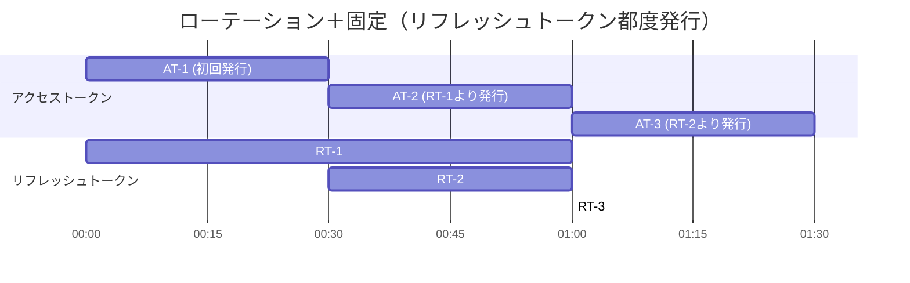
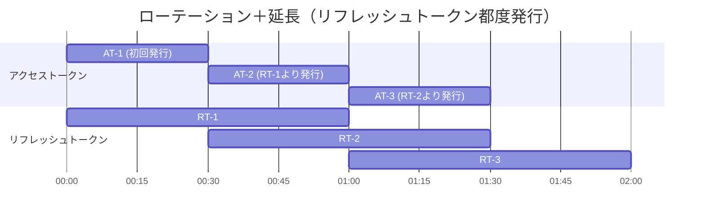
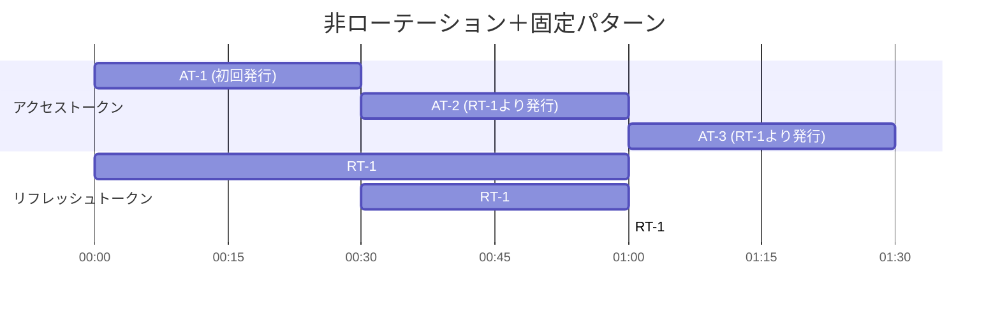
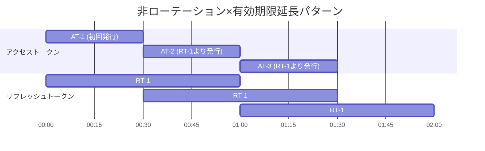

# トークン有効期限パターン

## このドキュメントの目的

**トークン有効期限の戦略を理解し、サービスに適したパターンを選択・設定する**ことが目標です。

### 学べること

✅ **トークン戦略の基礎**
- 4つのトークン有効期限パターンの違い
- セキュリティと利便性のトレードオフ
- 各パターンの推奨ユースケース

✅ **実践的な知識**
- Management APIでの設定方法
- デフォルト設定の理解

### 所要時間
⏱️ **約10分**

### 前提条件
- [how-to-02](../phase-1-foundation/03-tenant-setup.md)でテナント作成完了
- 認可サーバー設定の基本理解

---

## トークン有効期限パターンの概要

アクセストークンおよびリフレッシュトークンの有効期限管理には、主に以下の4つのパターンがあります。それぞれの特徴は、セキュリティと利便性のバランスに応じて選択してください。

| パターン        | 概要                                 | 推奨度   |
|:------------|:-----------------------------------|:------|
| ローテーション＋固定  | セキュリティ重視。長期利用は不可。**セキュアな実装のため推奨**。 | ◎ 推奨  |
| ローテーション＋延長  | セキュリティ・利便性ともに高い。                   | ○ 選択可 |
| 非ローテーション＋固定 | 利便性重視。ただし、セキュリティリスクがある。                  | △ 注意  |
| 非ローテーション＋延長 | 利便性重視。ただし、セキュリティリスクがある。             | △ 注意  |

---

## 各パターンの詳細

アクセストークン（AT）有効期限：30分
リフレッシュトークン（RT）有効期限：60分
における各パターンの有効期限の詳細を説明します。

### 1. ローテーション＋固定パターン（◎ 推奨）

リフレッシュトークンはローテーションされますが、有効期限は「初回発行時点から固定」で延長されません。  
セキュリティを最重視したい場合に推奨される実装パターンです。


```mermaid
gantt
    title ローテーション＋固定（リフレッシュトークン都度発行）
    dateFormat HH:mm
    axisFormat %H:%M
    section アクセストークン
        AT-1 (初回発行): a1, 00:00, 30m
        AT-2 (RT-1より発行): a2, 00:30, 30m
        AT-3 (RT-2より発行): a3, 01:00, 30m
    section リフレッシュトークン
        RT-1: r1, 00:00, 60m
        RT-2: r2, 00:30, 30m
        RT-3: r3, 01:00, 00m
```

- リフレッシュトークン自体の有効期限は延長されない
- 有効期間満了後は再認証が必要
- セキュリティを最重視するサービスに最適

---

### 2. ローテーション＋延長パターン（○ 選択可）

リフレッシュトークンを使ってトークンを再発行するたびに、新しいリフレッシュトークンが発行され、その有効期限も「今」から再度延長されます。  
セッションが続く限り、ログイン状態を長期間維持できます。FAPI等で採用例あり。


```mermaid
gantt
    title ローテーション＋延長（リフレッシュトークン都度発行）
    dateFormat HH:mm
    axisFormat %H:%M
    section アクセストークン
        AT-1 (初回発行): a1, 00:00, 30m
        AT-2 (RT-1より発行): a2, 00:30, 30m
        AT-3 (RT-2より発行): a3, 01:00, 30m
    section リフレッシュトークン
        RT-1: r1, 00:00, 60m
        RT-2: r2, 00:30, 60m
        RT-3: r3, 01:00, 60m
```

- リフレッシュトークンを使うたび、有効期限が「今」から再延長される
- 古いトークンセット（アクセストークン・リフレッシュトークン）は無効化される

---

### 3. 非ローテーション＋固定パターン（△ 注意）

リフレッシュトークンはローテーションせず、かつ有効期限も「初回発行時点から固定」です。


```mermaid
gantt
    title 非ローテーション＋固定パターン
    dateFormat HH:mm
    axisFormat %H:%M
    section アクセストークン
        AT-1 (初回発行): a1, 00:00, 30m
        AT-2 (RT-1より発行): a2, 00:30, 30m
        AT-3 (RT-1より発行): a3, 01:00, 30m
    section リフレッシュトークン
        RT-1: r1, 00:00, 60m
        RT-1: r2, 00:30, 30m
        RT-1: r3, 01:00, 00m
```

- リフレッシュトークンはずっと同じで、有効期限も初回発行時から変わらない
- 有効期限切れ後は再認証が必須
- セキュリティリスクが比較的高い

---

### 4. 非ローテーション＋延長パターン（△ 注意）

リフレッシュトークン自体はローテーションせず、最初に発行されたものをずっと使い続けます。  
ただし、トークンを再発行するたびにリフレッシュトークンの有効期限が延長されます。


```mermaid
gantt
    title 非ローテーション×有効期限延長パターン
    dateFormat HH:mm
    axisFormat %H:%M
    section アクセストークン
        AT-1 (初回発行): a1, 00:00, 30m
        AT-2 (RT-1より発行): a2, 00:30, 30m
        AT-3 (RT-1より発行): a3, 01:00, 30m
    section リフレッシュトークン
        RT-1: r1, 00:00, 60m
        RT-1: r2, 00:30, 60m
        RT-1: r3, 01:00, 60m
```

- 使うリフレッシュトークンは常に同じ
- トークン再発行のたびにそのリフレッシュトークンの有効期限が延長される
- セキュリティリスクが比較的高い

---

## 設定方法

各パターンは以下の2つの設定項目で制御します：

| 設定項目                    | 説明                         | 設定値                      | デフォルト    |
|:------------------------|:---------------------------|:-------------------------|:---------|
| `refresh_token_strategy` | リフレッシュトークンの有効期限戦略          | `"FIXED"` / `"EXTENDS"`  | `"FIXED"` |
| `rotate_refresh_token`   | リフレッシュトークンのローテーション有無 | `true` / `false`         | `true`    |

### パターン別設定

| パターン           | `refresh_token_strategy` | `rotate_refresh_token` |
|:---------------|:-------------------------|:-----------------------|
| ローテーション＋固定（◎推奨） | `"FIXED"`                | `true`                 |
| ローテーション＋延長     | `"EXTENDS"`              | `true`                 |
| 非ローテーション＋固定    | `"FIXED"`                | `false`                |
| 非ローテーション＋延長    | `"EXTENDS"`              | `false`                |

### Management API での設定例

```bash
curl -X PUT https://api.local.test/v1/management/tenants/{tenant-id}/authorization-server \
  -H "Content-Type: application/json" \
  -d '{
    "extension": {
      "refresh_token_strategy": "FIXED",
      "rotate_refresh_token": true,
      "refresh_token_duration": 3600
    }
  }'
```

### デフォルト設定

設定を省略した場合、最もセキュアな **ローテーション＋固定パターン** が適用されます：
- `refresh_token_strategy`: `"FIXED"`
- `rotate_refresh_token`: `true`

---

## クライアントレベルのオーバーライド

テナントレベルの設定に加えて、クライアントごとにトークン戦略をオーバーライドできます。

クライアントの `extension` オブジェクトに設定することで、そのクライアントだけ異なる戦略を適用できます。未設定の場合はテナント設定にフォールバックします。

### 設定例

```bash
curl -X PUT https://api.local.test/v1/management/tenants/{tenant-id}/clients/{client-id} \
  -H "Content-Type: application/json" \
  -d '{
    "extension": {
      "refresh_token_strategy": "EXTENDS",
      "rotate_refresh_token": true,
      "refresh_token_duration": 2592000
    }
  }'
```

### ユースケース

| シナリオ | テナント設定 | クライアントオーバーライド | 理由 |
|---------|------------|----------------------|------|
| モバイルアプリ | FIXED + rotate | EXTENDS + rotate | 長期ログイン維持 |
| 管理画面 | EXTENDS + rotate | FIXED + rotate | セキュリティ強化 |
| バッチ処理 | FIXED + rotate | FIXED + !rotate | トークン値の固定化 |

---

## アクセストークンの形式（Opaque vs JWT）

アクセストークンの形式は、`authorization_server.extension.access_token_type` で制御します。

| 形式 | 概要 | トークン例 |
|:-----|:-----|:----------|
| `opaque`（デフォルト） | ランダム文字列。リソースサーバーはIntrospectionエンドポイントで検証 | `dGhpcyBpcyBhbiB...` |
| `jwt` | `header.payload.signature` 形式。JWKSで署名検証してローカル検証可能 | `eyJhbGci...eyJzdWIi...signature` |

### Opaque トークン（デフォルト）

- トークン自体には情報を含まないランダム文字列
- リソースサーバーはアクセストークンを受け取るたびに、IdPの **Introspectionエンドポイント** に問い合わせてトークンの有効性を確認する
- **Revocation（失効）が即時反映される**: トークンを失効させると、次回のIntrospection問い合わせで即座に無効と判定される
- IdPへのネットワーク通信が毎回発生するため、レイテンシが増加する

### JWT トークン

- トークン自体にクレーム（ユーザー情報、有効期限等）を含む自己完結型トークン
- リソースサーバーはIdPの **JWKSエンドポイント** から公開鍵を取得し、トークンの署名をローカルで検証できる
- IdPへの毎回の問い合わせが不要なため、**パフォーマンスに優れる**
- ただし、トークンを失効させても有効期限が切れるまでリソースサーバー側では有効と判定される可能性がある

### 使い分けの指針

| ユースケース | 推奨形式 | 理由 |
|:------------|:---------|:-----|
| 即時失効が重要（金融、決済等） | `opaque` | Revocationが即時反映される |
| リソースサーバーのパフォーマンス重視 | `jwt` | Introspection不要でローカル検証可能 |
| マイクロサービス間通信 | `jwt` | サービス間でIdPに依存せず検証可能 |
| セキュリティ最優先 | `opaque` | トークンに情報が含まれず、漏洩時のリスクが低い |

### 設定例

#### テナントレベルでの設定

```bash
curl -X PUT https://api.local.test/v1/management/tenants/{tenant-id}/authorization-server \
  -H "Content-Type: application/json" \
  -d '{
    "extension": {
      "access_token_type": "JWT"
    }
  }'
```

### デフォルト設定

設定を省略した場合、**opaque** が適用されます。即時失効が可能なセキュアなデフォルトです。

> **注意**: `access_token_type` は認可サーバーレベルの設定です。クライアント単位でのオーバーライドはサポートされていません。

---

## まとめ

要件やセキュリティレベルに応じて、最適なトークン管理方式を選択してください。
**特にセキュリティを重視する場合、「ローテーション＋固定」パターンを強く推奨します。**
**アクセストークン形式は、即時失効の重要度とパフォーマンス要件に応じてopaqueまたはJWTを選択してください。**