# FIDO-UAF 登録フロー

## このドキュメントの目的

**FIDO-UAFを使用した認証デバイス（モバイル端末）の登録フローを実装する**ことが目標です。

### 学べること

✅ **FIDO-UAF登録の基礎**
- FIDO-UAF認証の仕組み
- デバイス登録フローの全体像
- 認証ポリシーの設定方法

✅ **実践的な知識**
- 登録リクエストとチャレンジ応答の実装
- UserInfoでの登録状況確認
- トラブルシューティング

### 所要時間
⏱️ **約15分**

---

## 前提条件

FIDO-UAF登録を行う前に、以下の設定が必要です：

### 1. テナントのデバイス登録ルール設定

テナントの `identity_policy_config` に `authentication_device_rule` を設定してください。

```http
PUT /v1/management/tenants/{tenant-id}
Content-Type: application/json

{
  "tenant": {
    "identity_policy_config": {
      "identity_unique_key_type": "EMAIL",
      "authentication_device_rule": {
        "max_devices": 100,
        "required_identity_verification": false,
        "authentication_type": "device_secret_jwt",
        "issue_device_secret": true,
        "device_secret_algorithm": "HS256",
        "device_secret_expires_in_seconds": 31536000
      }
    }
  }
}
```

#### 主要パラメータ

| パラメータ | 説明 | デフォルト |
|-----------|------|-----------|
| `max_devices` | ユーザーあたりの最大デバイス登録数 | 5 |
| `required_identity_verification` | デバイス登録時に身元確認必須フラグ | false |
| `authentication_type` | デバイスエンドポイントへのアクセス認証方式<br/>`none`: 認証不要<br/>`device_secret_jwt`: JWT認証を要求 | none |
| `issue_device_secret` | FIDO-UAF登録時にデバイスシークレットを自動発行 | false |
| `device_secret_algorithm` | 署名アルゴリズム（HS256/HS384/HS512） | HS256 |
| `device_secret_expires_in_seconds` | シークレットの有効期限（秒）、null=無期限 | null |

> **Note**: CIBAフローでデバイス認証を行う場合は、`authentication_type: "device_secret_jwt"` と `issue_device_secret: true` を設定してください。詳細は[デバイスクレデンシャル管理](../../../content_03_concepts/03-authentication-authorization/concept-10-device-credential.md)を参照してください。

### 2. 認証ポリシーの登録

`fido-uaf-registration` フローの認証ポリシーを事前に登録してください。

```http
POST /v1/management/tenants/{tenant-id}/authentication-policies
Content-Type: application/json

{
  "flow": "fido-uaf-registration",
  "enabled": true,
  "policies": [
    {
      "description": "FIDO-UAF device registration policy",
      "priority": 1,
      "available_methods": ["fido-uaf"]
    }
  ]
}
```

---

## 🧭 全体の流れ

1. ログイン
2. デバイス登録リクエスト送信
3. 登録チャレンジ応答
4. FIDO-UAF Facet取得
5. デバイス登録完了
6. UserInfoで認証デバイスの登録状況を確認する

---

## 🔁 シーケンス図（Mermaid）

```mermaid
sequenceDiagram
    participant App
    participant IdP
    participant FIDO as FIDO Server
    note over App, IdP: 1. ログイン。認可コードフローなどでアクセストークンを取得する
    App ->> IdP: 2. POST {tenant-id}/v1/me/mfa/fido-uaf-registration
    IdP -->> App: 200 OK (id)
    note over App, IdP: レスポンスの `id` はFIDO-UAFチャレンジ・FIDO UAF登録APIのPathに指定する
    App ->> IdP: 3. POST {tenant-id}/v1/authentications/{id}/fido-uaf-registration-challenge
    IdP ->> FIDO: 認証チャレンジ生成要求
    FIDO -->> IdP: 認証チャレンジ
    IdP -->> App: 200 OK (challenge)
    App ->> IdP: 4. GET {tenant-id}/.well-known/fido/facets
    IdP ->> FIDO: FIDOクライアントFacetリスト取得
    FIDO -->> IdP: Facetリスト
    IdP -->> App: 200 OK (facet list)
    App ->> IdP: 5. POST {tenant-id}/v1/authentications/{id}/fido-uaf-registration
    IdP ->> FIDO: 登録データ検証・保存要求
    FIDO -->> IdP: 登録成功レスポンス
    IdP -->> App: 200 OK (device_id)
    App ->> IdP: 6. GET /userinfo
    IdP -->> App: 200 OK (authentication_devices)

```



---

## 1. ログイン

[認可コードフロー](../content_04_protocols/protocol-01-authorization-code-flow.md)を参照。

## 2. FIDO-UAF登録開始リクエスト

```http
POST {tenant-id}/v1/me/mfa/fido-uaf-registration
Authorization: Bearer {access_token}
Content-Type: application/json

{
  "app_name": "sampleアプリ",  
  "platform": "Android",
  "os": "Android15",
  "model": "galaxy z fold 6",
  "locale": "ja",
  "notification_channel": "fcm",
  "notification_token": "test token",
  "priority": 1
}
```

* リクエストボディ

認証デバイスの属性情報に設定するパラメータをリクエストに指定することができます。

| パラメータ名                 | 必須 | 説明                                                                                 |
|------------------------|----|------------------------------------------------------------------------------------|
| `action`               | -  | 登録アクション。`"reset"` を指定すると既存のFIDO-UAFデバイスを全て削除してから新しいデバイスを登録する。                        |
| `app_name`             | -  | アプリ名（例：◯◯アプリ）。                                                                     |
| `platform`             | -  | デバイスのプラットフォーム名（例："Android", "iOS" など）。                                             |
| `os`                   | -  | オペレーティングシステムのバージョン情報（例："Android15"）。                                               |
| `model`                | -  | デバイスモデル名（例："galaxy z fold 6"）。                                                     |
| `locale`               | -  | 言語設定。（例：ja, en）                                                                    |
| `notification_channel` | -  | 通知チャネル（"fcm" など）。※現在サポートしているPush通知チャネルはfcmのみ。                                      |
| `notification_token`   | -  | 通知を送信するためのトークン（例：FCMトークン）。                                                         |
| `priority`             | -  | このデバイスの通知の優先順位（例: 1, 50, 100）。数値が大きいほど優先順位が高く、100が一番優先順位が高い。省略された場合は、認証デバイスの登録数の連番となる。 |

* 正常応答レスポンス `200 OK`

```json
{
  "id": "UUID"
}
```

レスポンスの `id` はFIDO-UAFチャレンジ・FIDO UAF登録APIのPathに指定する

* 登録リクエストの検証

fido-uaf 認証デバイスの登録リクエストは、ポリシーに応じたデータの整合性を検証します。

- 登録上限数
    - 登録条件数に達していた場合、ステータスコード 400エラーを返却します。
    - ただし、`action=reset` の場合は既存デバイスが削除されるため、上限数チェックはスキップされます。

### デバイスリセット機能

`action=reset` パラメータを指定することで、既存のFIDO-UAFデバイスを全て削除してから新しいデバイスを登録できます。

```http
POST {tenant-id}/v1/me/mfa/fido-uaf-registration
Authorization: Bearer {access_token}
Content-Type: application/json

{
  "action": "reset",
  "app_name": "新しいデバイス",  
  "platform": "Android",
  "os": "Android16",
  "model": "galaxy z fold 7",
  "locale": "ja",
  "notification_channel": "fcm",
  "notification_token": "new token",
  "priority": 1
}
```

この機能は以下のような場面で有用です：
- デバイスを紛失・盗難された際の緊急時デバイス交換
- 新しいデバイスに完全移行する際の一括置換

**注意事項:**
- `action=reset` を指定すると、現在登録されている全てのFIDO-UAFデバイスが削除されます
- 削除されたデバイスは復元できません
- 他の認証方式（WebAuthn、SMSなど）のデバイスには影響しません

---

## 3. FIDO-UAFチャレンジ

```http
POST {tenant-id}/v1/authentications/{id}/fido-uaf-registration-challenge

{
 FIDOサーバーのAPI仕様に沿ったパラメータを指定する
}
```

* レスポンス `200 OK`

```
{
  FIDOサーバーのAPI仕様に沿ったパラメータ
}
```

---

## 4. FIDO UAF Facet取得

```http
GET {tenant-id}/.well-known/fido/facets
```

* レスポンス `200 OK`

```
{
  FIDOサーバーのAPI仕様に沿ったパラメータ
}
```

FIDOクライアントのFacet検証に使用。

---

## 5. FIDO UAF登録

```http
POST {tenant-id}/v1/authentications/{id}/fido-uaf-registration

{
 FIDOサーバーのAPI仕様に沿ったパラメータを指定する
}
```

* レスポンス：

  ```json
  {
    "status": "success",
    "device_id": "device_abc123",
    "device_secret": "base64url-encoded-random-secret",
    "device_secret_algorithm": "HS256",
    "device_secret_jwt_issuer": "device:device_abc123"
  }
  ```

| フィールド | 説明 |
|-----------|------|
| `device_id` | 登録されたデバイスのID |
| `device_secret` | 署名用シークレット（`issue_device_secret: true`の場合のみ） |
| `device_secret_algorithm` | JWT署名アルゴリズム |
| `device_secret_jwt_issuer` | JWT生成時の`iss`クレームに使用する値 |

> **Important**: `device_secret`はこのレスポンスでのみ返却されます。モバイルアプリはSecure Storage（iOS: Keychain、Android: Keystore）に安全に保存してください。

---

## 6. UserInfoでデバイス登録を確認

FIDO-UAFクライアントは認証デバイスとして登録され、Userinfoで参照できます。

```http
GET /{tenant}/v1/userinfo
Authorization: Bearer {access_token}
```

```
{
  "sub": "user-id",
  "authentication_devices": [
    {
      "id": "UUID",
      "app_name": "sampleアプリ",
      "platform": "Android",
      "os": "Android15",
      "model": "galaxy z fold 6",
      "locale": "ja",
      "notification_channel": "fcm",
      "notification_token": "test token",
      "available_methods": ["fido-uaf"],
      "priority": 1
    }
  ]
}
```

