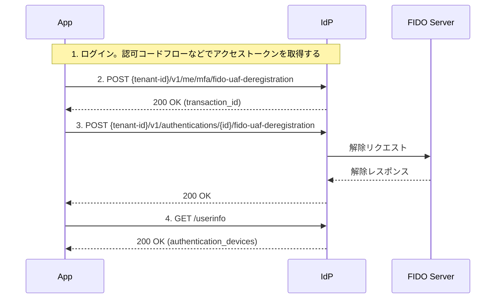

# FIDO-UAF 解除フロー

## このドキュメントの目的

**FIDO-UAFで登録した認証デバイスを安全に解除する**ことが目標です。

### 学べること

✅ **FIDO-UAF解除の基礎**
- デバイス解除フローの全体像
- 認証ポリシーの設定方法

✅ **実践的な知識**
- 解除リクエストの実装
- UserInfoでの解除確認

### 所要時間
⏱️ **約10分**

---

## 前提条件

FIDO-UAF解除を行う前に、以下の設定が必要です：

### 1. 認証ポリシーの登録

`fido-uaf-deregistration` フローの認証ポリシーを事前に登録してください。

```http
POST /v1/management/tenants/{tenant-id}/authentication-policies
Content-Type: application/json

{
  "flow": "fido-uaf-deregistration",
  "enabled": true,
  "policies": [
    {
      "description": "FIDO-UAF device deregistration policy",
      "priority": 1,
      "available_methods": ["fido-uaf"]
    }
  ]
}
```

---

## 🧭 全体の流れ

1. ログイン
2. MFA FIDO-UAF解除要求
3. FIDO-UAF解除リクエスト
4. UserInfoで認証デバイスの登録状況を確認する

---

## 🔁 シーケンス図（Mermaid）



---

## 1. ログイン

[認可コードフロー](../../../content_04_protocols/protocol-01-authorization-code-flow.md)を参照。

## 2. FIDO-UAF解除開始リクエスト

```http
POST {tenant-id}/v1/me/mfa/fido-uaf-deregistration
Authorization: Bearer {access_token}
Content-Type: application/json

{
  "device_id": "UUID"
}
```

### リクエストボディのパラメータ説明

| パラメータ名      | 必須 | 説明        |
|-------------|----|-----------|
| `device_id` | ✅️ | 認証デバイスID。 |

* レスポンス `200 OK`

```json
{
  "id": "UUID"
}
```

レスポンスの `id` はFIDO-UAFチャレンジ・FIDO UAF登録APIのPathに指定する

---

## 3. FIDO-UAFチャレンジ

```http
POST {tenant-id}/v1/authentications/{id}/fido-uaf-deregistration

{
 FIDOサーバーのAPI仕様に沿ったパラメータを指定する
}
```

* レスポンス `200 OK`

```
{
  FIDOサーバーのAPI仕様に沿ったパラメータ
}
```

## 4. UserInfoでデバイス登録を確認

指定した認証デバイスがないことを、Userinfoで確認できます。

```http
GET /{tenant}/v1/userinfo
Authorization: Bearer {access_token}
```

```
{
  "sub": "user-id",
  "authentication_devices": [
    ...
  ]
}
```

