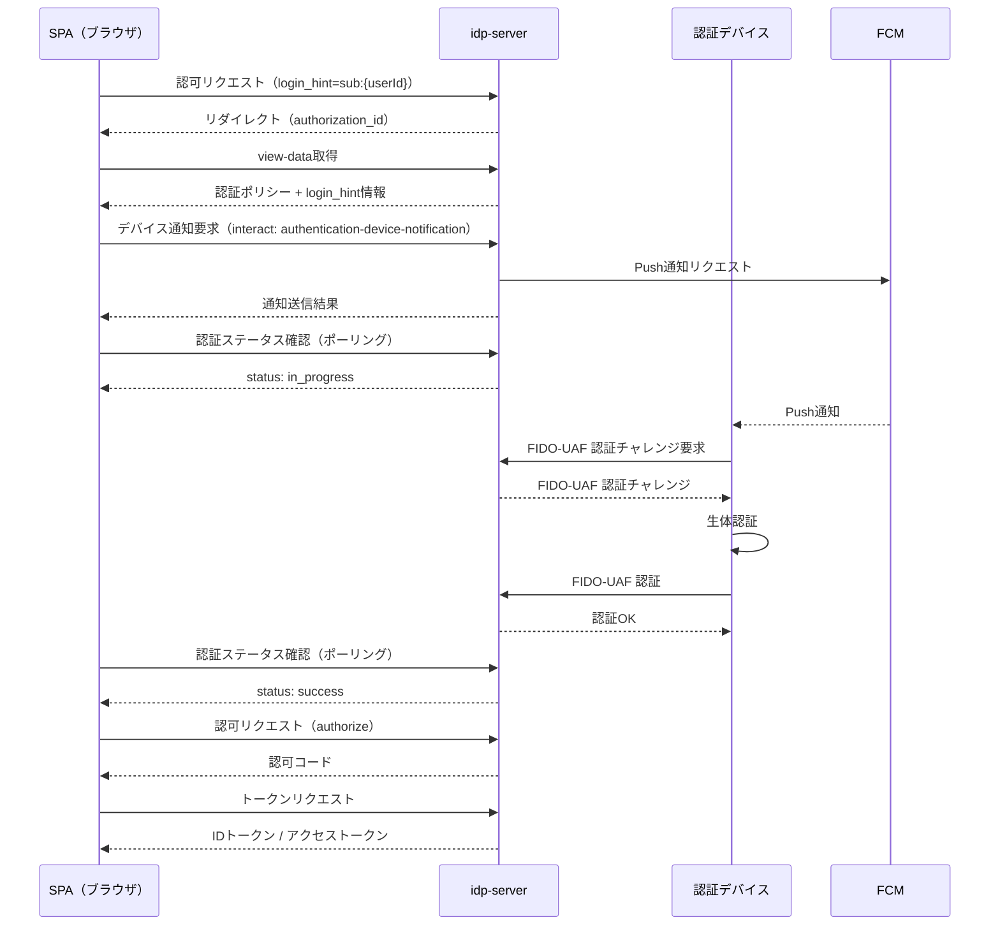

# 認可コードフロー + FIDO-UAF

## このドキュメントの目的

**認可コードフロー（Authorization Code Flow）でFIDO-UAF認証を利用し、モバイルデバイスでの生体認証を実装する**ことが目標です。

### 学べること

✅ **認可コードフロー + FIDO-UAFの基礎**
- CIBAとの違い（SPAがフロントチャネル、デバイスがバックチャネル）
- login_hintによるユーザー事前解決
- 認証ステータスAPIによるポーリング

✅ **実践的な知識**
- login_hint付き認可リクエストの実行
- Push通知によるデバイス認証要求
- 認証ステータスのポーリングによる完了検知
- トークン取得までの一連の流れ

### 所要時間
⏱️ **約20分**

### 前提条件
- [FIDO-UAF登録](./02-registration.md)でデバイス登録完了
- テナントで認可コードフローが有効化されている
- FCM（Firebase Cloud Messaging）の設定完了

---

## CIBAフローとの比較

| 項目 | CIBAフロー | 認可コードフロー |
|------|-----------|--------------|
| フロントチャネル | サーバーサイドクライアント | SPA（ブラウザ） |
| ユーザー特定 | login_hint（必須） | login_hint（任意） |
| 完了検知 | トークンエンドポイントのポーリング | authentication-status APIのポーリング |
| トークン取得 | トークンエンドポイント直接 | 認可コード → トークンエンドポイント |

---

## フロー全体の流れ（概要）



---

## ステップ詳細

### 認可リクエスト（SPA）

login_hintパラメータを付与して認可リクエストを送信します。login_hintで指定されたユーザーが`AuthenticationTransaction`に事前解決されます。

```
GET {tenant-id}/v1/authorizations?response_type=code&client_id=...&redirect_uri=...&scope=openid profile email&state=...&login_hint=sub:{userId}
```

#### login_hintの形式

| 形式 | 説明 | 例 |
|------|------|-----|
| `sub:{userId}` | ユーザーIDで指定 | `sub:3ec055a8-8000-44a2-8677-e70ebff414e2` |
| `device:{deviceId}` | デバイスIDで指定 | `device:7736a252-60b4-45f5-b817-65ea9a540860` |
| `email:{email}` | メールアドレスで指定 | `email:user@example.com` |
| `phone:{phone}` | 電話番号で指定 | `phone:+81-90-1234-5678` |

IdPプロバイダーの指定も可能: `sub:{userId},idp:{providerId}`

#### レスポンス

302リダイレクト。`Location`ヘッダに`id`パラメータ（authorization_id）が含まれます。

---

### view-data取得（SPA）

認証ポリシーとlogin_hint情報を取得します。

```
GET {tenant-id}/v1/authorizations/{id}/view-data
```

#### レスポンス

```json
{
  "client_id": "...",
  "client_name": "My App",
  "scopes": ["openid", "profile", "email"],
  "session_enabled": false,
  "login_hint": "sub:3ec055a8-...",
  "authentication_policy": {
    "available_methods": ["authentication-device-notification", "fido-uaf"],
    "step_definitions": [
      { "method": "authentication-device-notification", "order": 1 },
      { "method": "fido-uaf", "order": 2 }
    ],
    "success_conditions": { ... }
  }
}
```

SPAは`login_hint`の有無と`authentication_policy`を確認し、デバイス認証フローを開始するかパスワード認証UIを表示するか判断します。

---

### デバイスへのPush通知送信（SPA）

SPAがinteractエンドポイント経由でPush通知の送信を要求します。

```
POST {tenant-id}/v1/authorizations/{id}/authentication-device-notification
Content-Type: application/json

{}
```

#### レスポンス

| ステータス | 説明 |
|-----------|------|
| 200 | Push通知送信成功 |
| 400 | ユーザー未解決、デバイス未登録、通知チャネル未設定など |

---

### 認証ステータスの確認（SPA）

SPAは認証デバイスでの認証完了をポーリングで検知します。

```
GET {tenant-id}/v1/authorizations/{id}/authentication-status
```

#### レスポンス

```json
{
  "status": "in_progress",
  "interaction_results": {
    "authentication-device-notification": {
      "operation_type": "CHALLENGE",
      "method": "authentication-device-notification",
      "call_count": 1,
      "success_count": 1,
      "failure_count": 0
    }
  },
  "authentication_methods": []
}
```

#### ステータス値

| status | 意味 |
|--------|------|
| `in_progress` | 認証フロー進行中 |
| `success` | 認証成功（authorizeに進める） |
| `failure` | 認証失敗 |
| `locked` | アカウントロック |

#### ポーリングの推奨間隔

3〜5秒間隔でポーリングすることを推奨します。

---

### FIDO-UAF認証（認証デバイス）

Push通知を受信した認証デバイスは、CIBAフローと同じ`/authentications/`エンドポイントでFIDO-UAF認証を実行します。

#### 認証トランザクションの取得

```
GET {tenant-id}/v1/authentication-devices/{device-id}/authentications?flow=oauth
```

認可コードフローの場合、`flow`パラメータに`oauth`を指定して検索します。

#### FIDO-UAFチャレンジ

```
POST {tenant-id}/v1/authentications/{id}/fido-uaf-authentication-challenge
Content-Type: application/json

{
  ...FIDOサーバーのAPI仕様に沿ったパラメータを指定する
}
```

#### FIDO-UAF認証

```
POST {tenant-id}/v1/authentications/{id}/fido-uaf-authentication
Content-Type: application/json

{
  ...FIDOサーバーのAPI仕様に沿ったパラメータを指定する
}
```

認証成功後、`AuthenticationTransaction`が更新され、SPAのポーリングで`status: "success"`が返ります。

---

### 認可（SPA）

認証ステータスが`success`になったら、認可エンドポイントを呼び出します。

```
POST {tenant-id}/v1/authorizations/{id}/authorize
```

#### レスポンス

```json
{
  "redirect_uri": "https://app.example.com/callback?code=...&state=..."
}
```

---

### トークンリクエスト（SPA）

認可コードをトークンに交換します。

```
POST {tenant-id}/v1/tokens
Content-Type: application/x-www-form-urlencoded

grant_type=authorization_code&code=...&redirect_uri=...&client_id=...&client_secret=...
```

#### レスポンス

```json
{
  "access_token": "...",
  "token_type": "Bearer",
  "expires_in": 3600,
  "refresh_token": "...",
  "id_token": "..."
}
```

IDトークンの`amr`クレームに`fido-uaf`が含まれることを確認できます。

---

### login_hintなしの場合（パスワード + FIDO-UAF MFA）

login_hintを指定しない場合でも、パスワード認証でユーザーを特定した後にFIDO-UAF認証を2nd factorとして実行できます。

```
認可リクエスト（login_hintなし）
  → パスワード認証（1st factor、ユーザー特定）
  → デバイス通知（2nd factor、Push送信）
  → FIDO-UAF認証
  → authentication-status: success
  → authorize → トークン
```

この場合の認証ポリシー設定例:

```json
{
  "step_definitions": [
    { "method": "password", "order": 1, "requires_user": false },
    { "method": "authentication-device-notification", "order": 2, "requires_user": true },
    { "method": "fido-uaf", "order": 3, "requires_user": true }
  ],
  "success_conditions": {
    "any_of": [
      [
        { "path": "$.password-authentication.success_count", "type": "integer", "operation": "gte", "value": 1 },
        { "path": "$.fido-uaf-authentication.success_count", "type": "integer", "operation": "gte", "value": 1 }
      ]
    ]
  }
}
```

---

## 認証ポリシー設定例

### login_hint + FIDO-UAF（デバイス認証のみ）

```json
{
  "flow": "oauth",
  "enabled": true,
  "policies": [
    {
      "description": "device_fido_uaf_authentication",
      "priority": 1,
      "conditions": {
        "acr_values": ["urn:idp:acr:device"]
      },
      "available_methods": [
        "authentication-device-notification",
        "authentication-device-binding-message",
        "authentication-device-deny",
        "fido-uaf"
      ],
      "step_definitions": [
        { "method": "authentication-device-notification", "order": 1, "requires_user": false },
        { "method": "fido-uaf", "order": 2, "requires_user": true }
      ],
      "success_conditions": {
        "any_of": [
          [{ "path": "$.fido-uaf-authentication.success_count", "type": "integer", "operation": "gte", "value": 1 }]
        ]
      },
      "failure_conditions": {
        "any_of": [
          [{ "path": "$.authentication-device-deny.success_count", "type": "integer", "operation": "gte", "value": 1 }]
        ]
      }
    },
    {
      "description": "password_fallback",
      "priority": 2,
      "conditions": {},
      "available_methods": ["password"],
      "success_conditions": {
        "any_of": [
          [{ "path": "$.password-authentication.success_count", "type": "integer", "operation": "gte", "value": 1 }]
        ]
      }
    }
  ]
}
```

---

## まとめ

認可コードフローでのFIDO-UAF認証は、CIBAフローと同じ認証インフラを再利用しながら、SPAベースのユーザー体験を提供します。

* **login_hint**によるユーザー事前解決でデバイス通知が可能
* **authentication-status API**によるポーリングで非同期認証の完了を検知
* **既存のFIDO-UAF認証エンドポイント**をそのまま利用（追加のデバイス側実装不要）

---

## 関連ドキュメント

- [CIBA + FIDO-UAF](./01-ciba-flow.md) - CIBAフローでのFIDO-UAF認証
- [FIDO-UAF登録](./02-registration.md) - デバイス登録手順
- [FIDO-UAF解除](./03-deregistration.md) - デバイス解除手順
