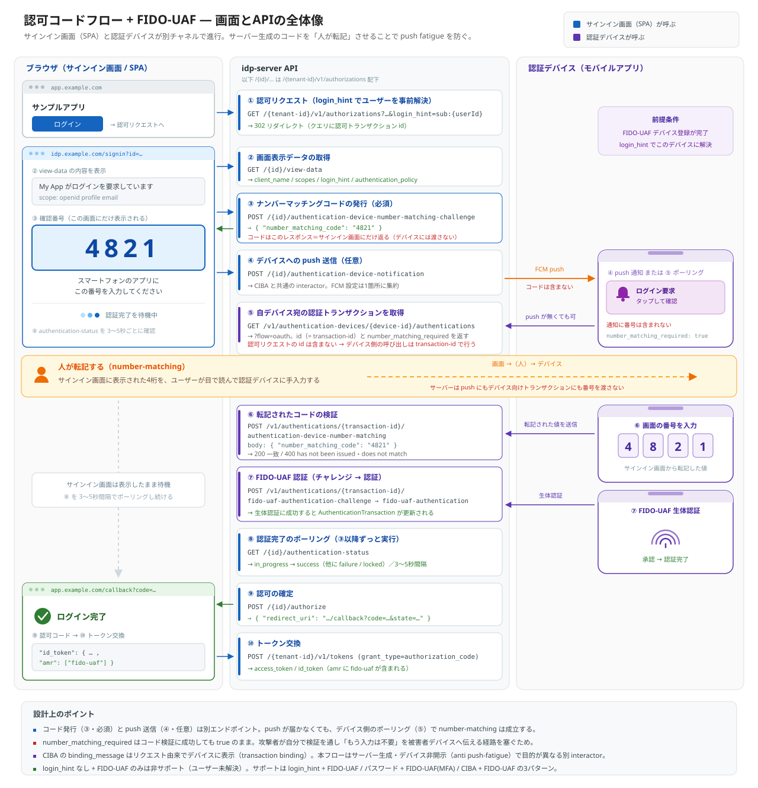
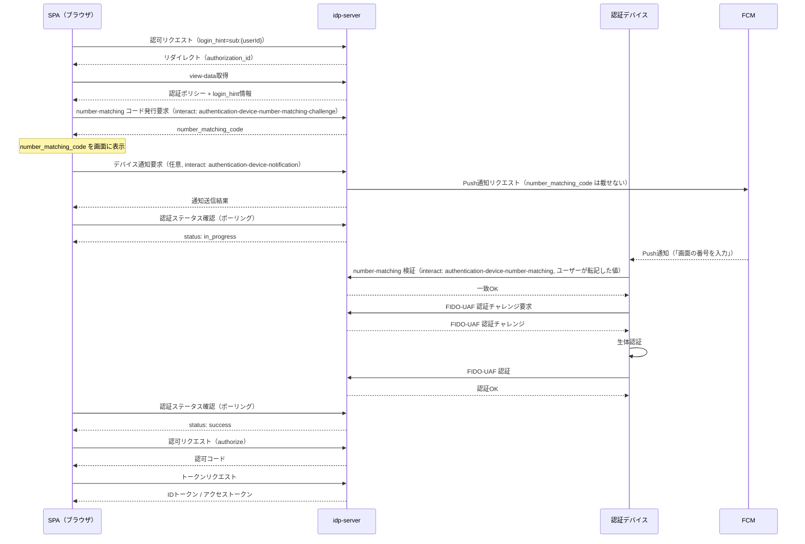

# 認可コードフロー + FIDO-UAF

## このドキュメントの目的

**認可コードフロー（Authorization Code Flow）でFIDO-UAF認証を利用し、モバイルデバイスでの生体認証を実装する**ことが目標です。

### 学べること

✅ **認可コードフロー + FIDO-UAFの基礎**
- CIBAとの違い（SPAがフロントチャネル、デバイスがバックチャネル）
- login_hintによるユーザー事前解決と、それが必要な理由
- スコープ単位で認証強度を要求する step-up の組み方
- 認証ステータスAPIによるポーリング

✅ **実践的な知識**
- login_hint付き認可リクエストの実行
- Push通知によるデバイス認証要求
- 認証ステータスのポーリングによる完了検知
- トークン取得までの一連の流れ

### 所要時間
⏱️ **約20分**

### 前提条件
- [FIDO-UAF登録](./02-registration.md)でデバイス登録完了
- テナントで認可コードフローが有効化されている
- FCM（Firebase Cloud Messaging）の設定完了

---

## 想定するケース

**public クライアント（SPA・モバイルアプリ）で、ログイン後に追加の認証をさせたい場合**を想定しています。

同じことは [CIBA](./01-ciba-flow.md) のほうがシームレスに実現できますが、CIBA はクライアント認証が必須（CIBA Core §7.1）のため public クライアントでは使えません。confidential クライアントなら CIBA を検討してください。

### 典型的な使いどころ: スコープの step-up

**初回ログインのためのフローではありません。** ログイン済みのユーザーに、より強い認証を要求するスコープを後から取得させるケースです。

```
① 通常ログイン（パスワード等）    → scope: openid profile email
② ユーザーが送金画面へ
③ 追加の認可リクエスト（login_hint + scope に transfers）
   → FIDO-UAF 生体認証         → transfers を含むアクセストークン
```

スコープごとに必要な認証方式は認証ポリシーの `level_of_authentication_scopes` で設定します（[後述](#スコープ単位で認証強度を要求する)）。

:::info なぜログイン済みでも login_hint が必要なのか
`AuthenticationTransaction` のユーザーは **`login_hint` からのみ解決されます**。既存のOPセッションは `prompt=none` の判定と view-data の `session_enabled` にしか使われず、認証トランザクションのユーザーには反映されません。

RPは①で受け取ったIDトークンの `sub` を保持しておき、③で `login_hint=sub:{sub}` として渡します。初回ログインではRPが `sub` を知らないためこれができず、**パスワード + FIDO-UAF（MFA）**のパターンを使います（[後述](#login_hintなし--fido-uafのみの認証はサポートしない)）。

実装: [OAuthFlowEntryService.java](../../../../libs/idp-server-use-cases/src/main/java/org/idp/server/usecases/application/enduser/OAuthFlowEntryService.java)（`resolveUserFromLoginHint`）
:::

---

## フロー全体の流れ（概要）

サインイン画面（SPA）と認証デバイスが**別チャネルで並行して進行**します。まず画面とAPIの対応を俯瞰してください。



呼び出し元でパスが分かれる点が要注意です。

| 呼び出し元 | パス | 使うID |
|-----------|------|--------|
| サインイン画面（SPA） | `/{tenant-id}/v1/authorizations/{id}/…` | 認可リクエストのID |
| 認証デバイス | `/{tenant-id}/v1/authentications/{transaction-id}/…` | 認証トランザクションのID |

デバイスは認証トランザクション取得API（⑤）でしか自分宛のリクエストを知ることができず、そのレスポンスに認可リクエストのIDは含まれません。

以下は同じフローのシーケンス図です。


```mermaid
sequenceDiagram
    participant SPA as SPA（ブラウザ）
    participant idp as idp-server
    participant Device as 認証デバイス
    participant fcm as FCM

    SPA ->> idp: 認可リクエスト（login_hint=sub:{userId}）
    idp -->> SPA: リダイレクト（authorization_id）
    SPA ->> idp: view-data取得
    idp -->> SPA: 認証ポリシー + login_hint情報

    SPA ->> idp: number-matching コード発行要求（interact: authentication-device-number-matching-challenge）
    idp -->> SPA: number_matching_code
    Note over SPA: number_matching_code を画面に表示

    SPA ->> idp: デバイス通知要求（任意, interact: authentication-device-notification）
    idp ->> fcm: Push通知リクエスト（number_matching_code は載せない）
    idp -->> SPA: 通知送信結果

    SPA ->> idp: 認証ステータス確認（ポーリング）
    idp -->> SPA: status: in_progress

    fcm -->> Device: Push通知（「画面の番号を入力」）
    Device ->> idp: number-matching 検証（interact: authentication-device-number-matching, ユーザーが転記した値）
    idp -->> Device: 一致OK
    Device ->> idp: FIDO-UAF 認証チャレンジ要求
    idp -->> Device: FIDO-UAF 認証チャレンジ
    Device ->> Device: 生体認証
    Device ->> idp: FIDO-UAF 認証
    idp -->> Device: 認証OK

    SPA ->> idp: 認証ステータス確認（ポーリング）
    idp -->> SPA: status: success

    SPA ->> idp: 認可リクエスト（authorize）
    idp -->> SPA: 認可コード

    SPA ->> idp: トークンリクエスト
    idp -->> SPA: IDトークン / アクセストークン
```

---

## ステップ詳細

### 認可リクエスト（SPA）

login_hintパラメータを付与して認可リクエストを送信します。login_hintで指定されたユーザーが`AuthenticationTransaction`に事前解決されます。

```
GET {tenant-id}/v1/authorizations?response_type=code&client_id=...&redirect_uri=...&scope=openid profile email&state=...&login_hint=sub:{userId}
```

#### login_hintの形式

| 形式 | 説明 | 例 |
|------|------|-----|
| `sub:{userId}` | ユーザーIDで指定 | `sub:3ec055a8-8000-44a2-8677-e70ebff414e2` |
| `device:{deviceId}` | デバイスIDで指定 | `device:7736a252-60b4-45f5-b817-65ea9a540860` |
| `email:{email}` | メールアドレスで指定 | `email:user@example.com` |
| `phone:{phone}` | 電話番号で指定 | `phone:+81-90-1234-5678` |

IdPプロバイダーの指定も可能: `sub:{userId},idp:{providerId}`

#### レスポンス

302リダイレクト。`Location`ヘッダに`id`パラメータ（authorization_id）が含まれます。

---

### view-data取得（SPA）

認証ポリシーとlogin_hint情報を取得します。

```
GET {tenant-id}/v1/authorizations/{id}/view-data
```

#### レスポンス

```json
{
  "client_id": "...",
  "client_name": "My App",
  "scopes": ["openid", "profile", "email"],
  "session_enabled": false,
  "login_hint": "sub:3ec055a8-...",
  "authentication_policy": {
    "available_methods": ["authentication-device-notification", "authentication-device-number-matching", "fido-uaf"],
    "step_definitions": [
      { "method": "authentication-device-notification", "order": 1 },
      { "method": "authentication-device-number-matching", "order": 2 },
      { "method": "fido-uaf", "order": 3 }
    ],
    "success_conditions": { ... }
  }
}
```

SPAは`login_hint`の有無と`authentication_policy`を確認し、デバイス認証フローを開始するかパスワード認証UIを表示するか判断します。

---

### デバイスへのPush通知送信（SPA）（オプション）

Push通知の送信は**オプション**です。デバイスがPush通知を受け取れない環境（通知をオフにしている等）でも、デバイスが自発的に認証トランザクションをポーリングすればフローは成立します。Push は number-matching コードを**含みません**。

```
POST {tenant-id}/v1/authorizations/{id}/authentication-device-notification
Content-Type: application/json

{}
```

| ステータス | 説明 |
|-----------|------|
| 200 | Push通知送信成功 |
| 400 | ユーザー未解決、デバイス未登録、通知チャネル未設定、Push配信失敗など |

> Push（FCM）は CIBA と共有の `authentication-device-notification` interactor が担い、FCM 設定は1箇所に集約されます。number-matching コードの生成はこれとは**分離**されています（次節）。

---

### number-matching による push fatigue 対策（Issue #1505）

認可コードフローの FIDO step-up は、攻撃者が正規ユーザーの email 等を把握していれば攻撃者起点でフローを開始でき、繰り返し push を送って**誤承認（push fatigue / MFA fatigue）**を狙えます。これを防ぐため、**number-matching**（番号一致）を行います。

**方式（重要）**: number-matching コードはサーバーが生成し、**コード発行エンドポイントのレスポンス（＝サインイン画面/SPA）にのみ**返します。**push payload にもデバイス向けトランザクションにも含めません**。ユーザーは画面に表示された値を**デバイスアプリに手入力（転記）**します。これにより「承認する人はサインイン画面を見ている本人」であることが保証され、push に載せて自動 echo させる方式より push fatigue 耐性が高くなります。

**設計上のポイント**: コード発行（必須）と push 送信（任意）は**別エンドポイント**に分離されています。push は FCM 設定を共有する `authentication-device-notification` が担当し、コード発行はそれに依存しません（push 失敗やポーリング運用でも number-matching は成立）。

```
SPA                         idp-server                    device (bank-app)
 ├─ POST .../authentication-device-number-matching-challenge
 │     └─ コード "4821" を生成・サーバー保存（デバイスには出さない）
 │◀─ { number_matching_code: "4821" }
 ├─ 画面に "4821" を大きく表示
 ├─ （任意）POST .../authentication-device-notification → push 送信（コードは載せない）
 │                                                 ├─ 受信 or ポーリングで「画面の番号を入力」
 │                                                 ├─ ユーザーが "4821" を転記して送信
 │                                                 ├─ POST .../authentication-device-number-matching
 │                                                 │     body: { "number_matching_code": "4821" }
 │                                     ├─ 保存値と一致検証
 │                                                 ├─ POST .../fido-uaf-authentication（生体認証）
```

CIBA では `binding_message` がリクエストパラメータから供給されデバイスに表示されます（transaction binding）が、認可コードフローではサーバーが number-matching コードを生成し**デバイスには出しません**（anti push-fatigue）。目的が異なるため別 interactor です。

#### コードの発行（SPA）

```
POST {tenant-id}/v1/authorizations/{id}/authentication-device-number-matching-challenge
Content-Type: application/json

{}
```

レスポンス:

```json
{ "number_matching_code": "4821" }
```

コードは**数字（0-9）**です（MS Authenticator / Okta の number matching と同様）。**長さ**は要件依存で、`authentication-device-number-matching` 設定の `execution.details.length` で調整できます（既定 **4桁**）。

#### コードの検証（device）

```
POST {tenant-id}/v1/authentications/{transaction-id}/authentication-device-number-matching
Content-Type: application/json

{ "number_matching_code": "4821" }
```

`{transaction-id}` は次節の認証トランザクション取得APIが返す `id` です。**デバイスは認可リクエストの `id` を知りません**（取得APIのレスポンスに含まれません）。デバイス側の呼び出しは FIDO-UAF 認証と同じ `/v1/authentications/{transaction-id}/` 配下に揃います。

:::note SPA 側のパスからも到達できます
`POST {tenant-id}/v1/authorizations/{id}/authentication-device-number-matching` でも同じ検証が実行されます（両者は `OAuthFlowEntryService#interactInternal` に合流します）。ただしデバイスは認可リクエストの `id` を取得できないため、デバイス実装では使えません。
:::

| ステータス | 説明 |
|-----------|------|
| 200 | 一致。次の FIDO-UAF 認証へ |
| 400 | コード不一致 or 未発行 |

400 の `error_description` で区別できます。

| 状況 | `error_description` |
|---|---|
| チャレンジ未実行 | `number_matching_code has not been issued` |
| コード不一致 | `number_matching_code does not match` |

#### 入力画面の要否判定（device）

デバイスアプリは、認証トランザクション取得APIのレスポンスに含まれる `number_matching_required` を見て、番号入力画面を出すかどうかを判定します。

```
GET {tenant-id}/v1/authentication-devices/{device-id}/authentications?flow=oauth
```

```json
{
  "list": [
    { "id": "...", "flow": "oauth", "number_matching_required": true }
  ]
}
```

`id` は**認証トランザクションのID**です。以降のデバイス側の呼び出し（コード検証・FIDO-UAF認証）はこの値を使います。

コードが発行されると `number_matching_required` が `true` になります。**コード検証に成功した後も `true` のままです。** 検証成功でクリアすると、フローを開始した攻撃者が自分でコード検証を通すことで「もう入力は不要」という状態を被害者のデバイスへ伝えられてしまい、number-matching が塞いでいる push fatigue の経路が再び開くためです。実際にコードが検証済みかどうかは認証結果側で管理されます。

---

#### Push通知なしのパターン

Push通知を使用しない場合、デバイスアプリが定期的に認証トランザクションをポーリングして認証リクエストの存在を検知します。

```
デバイス: GET {tenant-id}/v1/authentication-devices/{device-id}/authentications?flow=oauth
  → 認証トランザクションが見つかれば FIDO-UAF 認証を開始
```

この場合、SPA側は`authentication-device-notification`のAPIを呼び出さず、直接`authentication-status`のポーリングに進みます。

---

### 認証ステータスの確認（SPA）

SPAは認証デバイスでの認証完了をポーリングで検知します。

```
GET {tenant-id}/v1/authorizations/{id}/authentication-status
```

#### レスポンス

```json
{
  "status": "in_progress",
  "interaction_results": {
    "authentication-device-notification": {
      "operation_type": "CHALLENGE",
      "method": "authentication-device-notification",
      "call_count": 1,
      "success_count": 1,
      "failure_count": 0
    }
  },
  "authentication_methods": []
}
```

#### ステータス値

| status | 意味 |
|--------|------|
| `in_progress` | 認証フロー進行中 |
| `success` | 認証成功（authorizeに進める） |
| `failure` | 認証失敗 |
| `locked` | アカウントロック |

#### ポーリングの推奨間隔

3〜5秒間隔でポーリングすることを推奨します。

---

### FIDO-UAF認証（認証デバイス）

Push通知を受信した認証デバイスは、CIBAフローと同じ`/authentications/`エンドポイントでFIDO-UAF認証を実行します。

#### 認証トランザクションの取得

```
GET {tenant-id}/v1/authentication-devices/{device-id}/authentications?flow=oauth
```

認可コードフローの場合、`flow`パラメータに`oauth`を指定して検索します。

#### FIDO-UAFチャレンジ

```
POST {tenant-id}/v1/authentications/{id}/fido-uaf-authentication-challenge
Content-Type: application/json

{
  ...FIDOサーバーのAPI仕様に沿ったパラメータを指定する
}
```

#### FIDO-UAF認証

```
POST {tenant-id}/v1/authentications/{id}/fido-uaf-authentication
Content-Type: application/json

{
  ...FIDOサーバーのAPI仕様に沿ったパラメータを指定する
}
```

認証成功後、`AuthenticationTransaction`が更新され、SPAのポーリングで`status: "success"`が返ります。

---

### 認可（SPA）

認証ステータスが`success`になったら、認可エンドポイントを呼び出します。

```
POST {tenant-id}/v1/authorizations/{id}/authorize
```

#### レスポンス

```json
{
  "redirect_uri": "https://app.example.com/callback?code=...&state=..."
}
```

---

### トークンリクエスト（SPA）

認可コードをトークンに交換します。

```
POST {tenant-id}/v1/tokens
Content-Type: application/x-www-form-urlencoded

grant_type=authorization_code&code=...&redirect_uri=...&client_id=...&client_secret=...
```

#### レスポンス

```json
{
  "access_token": "...",
  "token_type": "Bearer",
  "expires_in": 3600,
  "refresh_token": "...",
  "id_token": "..."
}
```

IDトークンの`amr`クレームに`fido-uaf`が含まれることを確認できます。

---

### login_hintなしの場合（パスワード + FIDO-UAF MFA）

login_hintを指定しない場合でも、パスワード認証でユーザーを特定した後にFIDO-UAF認証を2nd factorとして実行できます。

```
認可リクエスト（login_hintなし）
  → パスワード認証（1st factor、ユーザー特定）
  → デバイス通知（2nd factor、Push送信）
  → FIDO-UAF認証
  → authentication-status: success
  → authorize → トークン
```

この場合の認証ポリシー設定例:

```json
{
  "step_definitions": [
    { "method": "password", "order": 1, "requires_user": false },
    { "method": "authentication-device-notification", "order": 2, "requires_user": true },
    { "method": "fido-uaf", "order": 3, "requires_user": true }
  ],
  "success_conditions": {
    "any_of": [
      [
        { "path": "$.password-authentication.success_count", "type": "integer", "operation": "gte", "value": 1 },
        { "path": "$.fido-uaf-authentication.success_count", "type": "integer", "operation": "gte", "value": 1 }
      ]
    ]
  }
}
```

---

## 認証ポリシー設定例

### login_hint + FIDO-UAF（デバイス認証のみ）

```json
{
  "flow": "oauth",
  "enabled": true,
  "policies": [
    {
      "description": "device_fido_uaf_authentication",
      "priority": 1,
      "conditions": {
        "acr_values": ["urn:idp:acr:device"]
      },
      "available_methods": [
        "authentication-device-notification",
        "authentication-device-number-matching",
        "authentication-device-deny",
        "fido-uaf"
      ],
      "step_definitions": [
        { "method": "authentication-device-notification", "order": 1, "requires_user": false },
        { "method": "fido-uaf", "order": 2, "requires_user": true }
      ],
      "success_conditions": {
        "any_of": [
          [{ "path": "$.fido-uaf-authentication.success_count", "type": "integer", "operation": "gte", "value": 1 }]
        ]
      },
      "failure_conditions": {
        "any_of": [
          [{ "path": "$.authentication-device-deny.success_count", "type": "integer", "operation": "gte", "value": 1 }]
        ]
      }
    },
    {
      "description": "password_fallback",
      "priority": 2,
      "conditions": {},
      "available_methods": ["password"],
      "success_conditions": {
        "any_of": [
          [{ "path": "$.password-authentication.success_count", "type": "integer", "operation": "gte", "value": 1 }]
        ]
      }
    }
  ]
}
```

### スコープ単位で認証強度を要求する

`level_of_authentication_scopes` に「スコープ → それを許可する認証方式」を書きます（`config/templates/use-cases/mfa-fido-uaf/authentication-policy.json` より）。

```json
"level_of_authentication_scopes": {
  "transfers": ["fido-uaf"],
  "account": ["password", "email"]
}
```

値は**いずれか1つを満たせばよい**方式のリストです。満たしていないスコープは**付与されずに落とされます**（エラーにはなりません）。パスワード認証だけでは `transfers` が付かず、FIDO-UAF を実行すると付く、という挙動になります。

実装: [LoaDeniedScopeResolver.java](../../../../libs/idp-server-core/src/main/java/org/idp/server/core/openid/authentication/loa/LoaDeniedScopeResolver.java)

---

## CIBAフローとの比較

| 項目 | CIBAフロー | 認可コードフロー |
|------|-----------|--------------|
| フロントチャネル | サーバーサイドクライアント | SPA（ブラウザ） |
| ユーザー特定 | login_hint（必須） | login_hint（FIDO-UAFのみで認証する場合は必須） |
| 完了検知 | トークンエンドポイントのポーリング | authentication-status APIのポーリング |
| トークン取得 | トークンエンドポイント直接 | 認可コード → トークンエンドポイント |

---

## 制限事項

### login_hintなし + FIDO-UAFのみの認証はサポートしない

認可コードフローにおいて、`login_hint`を指定せずにFIDO-UAFデバイス認証だけで認証を完了するパターンは**サポートしていません**。

#### 仕組みによる制約

デバイスへのPush通知送信（`authentication-device-notification`）は、`AuthenticationTransaction`にユーザーが解決されていることを前提としています。`login_hint`なしの場合、認可リクエスト時点ではユーザーが未解決のため、通知APIを呼び出しても `"User does not exist"` エラーとなり、フロー自体が成立しません。

```
認可リクエスト（login_hintなし）
  → AuthenticationTransaction にユーザー未設定
  → デバイス通知API呼び出し
  → "User does not exist" エラー ← ここで止まる
```

#### セキュリティ上の意図: Push通知疲労攻撃の防止

この仕様は、**Push通知疲労攻撃（Push Notification Fatigue Attack）** を防ぐ意図も含んでいます。

仮にログイン画面でメールアドレス等を入力するだけでPush通知を送信できてしまうと、攻撃者が対象ユーザーのデバイスに大量のPush通知を送りつけ、ユーザーが疲労して誤って認証を承認してしまうリスクがあります。

ユーザーの解決を`login_hint`（信頼されたクライアントからの指定）またはパスワード認証等の事前認証に限定することで、未認証の第三者がPush通知を発生させることを防いでいます。

#### サポートされるパターン

FIDO-UAFデバイス認証を利用する場合は、以下のいずれかのパターンを使用してください。

| パターン | 説明 | Push通知の保護 |
|---------|------|------------|
| **login_hint + FIDO-UAFのみ** | 信頼されたクライアントがlogin_hintでユーザーを事前指定 | クライアント認証により保護 |
| **パスワード + FIDO-UAF（MFA）** | パスワードで1st factor認証後、FIDO-UAFを2nd factorとして実行 | パスワード認証が障壁 |
| **CIBA + FIDO-UAF** | サーバーサイドクライアントがCIBAフローで実行 | クライアント認証（client_secret等）により保護 |

いずれのパターンも、Push通知の送信前にクライアント認証またはユーザー認証（パスワード等）が必須となるため、未認証の第三者による通知疲労攻撃を防止できます。

---

## まとめ

認可コードフローでのFIDO-UAF認証は、CIBAフローと同じ認証インフラを再利用しながら、SPAベースのユーザー体験を提供します。

* **login_hint**によるユーザー事前解決でデバイス通知が可能
* **authentication-status API**によるポーリングで非同期認証の完了を検知
* **既存のFIDO-UAF認証エンドポイント**をそのまま利用（追加のデバイス側実装不要）

---

## 関連ドキュメント

- [認可コードフロー デバイス認証拡張](../../../content_04_protocols/protocol-07-authorization-code-device-authentication.md) - プロトコル定義（エンドポイント体系・number-matching のセキュリティモデル）
- [ナンバーマッチング設定](../../../content_06_developer-guide/05-configuration/authn/number-matching.md) - 桁数等の設定リファレンス
- [CIBA + FIDO-UAF](./01-ciba-flow.md) - CIBAフローでのFIDO-UAF認証
- [FIDO-UAF登録](./02-registration.md) - デバイス登録手順
- [FIDO-UAF解除](./03-deregistration.md) - デバイス解除手順
