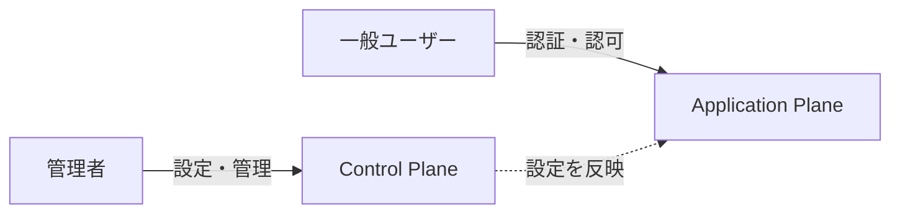

# 01. アーキテクチャ概要

## このドキュメントの目的

idp-serverのアーキテクチャを理解し、**どこに何を実装すべきか**を判断できるようになることが目標です。

### 所要時間
⏱️ **約15分**

### 前提知識
- Java基礎知識
- Spring Boot基礎知識（オプション）
- OAuth 2.0/OIDC概要（オプション - 後から学べます）

---

## 全体像

### コントロールプレーン vs アプリケーションプレーン

idp-serverは、**コントロールプレーン（管理層）** と **アプリケーションプレーン（実行層）** を明確に分離した設計です。



**責務の違い**:

| 層 | 役割 | 利用者 | モジュール                      | 例 |
|:---|:---|:---|:---------------------------|:---|
| **Control Plane** | 設定・管理 | 管理者 | `idp-server-control-plane` | テナント作成<br/>クライアント登録<br/>認証設定 |
| **Application Plane** | 認証・認可実行 | 一般ユーザー | `idp-server-core`など        | ログイン<br/>トークン発行<br/>ユーザー情報取得 |

**なぜ分離するのか**:
1. **セキュリティ**: 管理操作と認証処理の攻撃面を分離
2. **責務分離**: 管理者権限と一般ユーザー権限を明確に分離

**詳細**: [コントロールプレーン](../../content_03_concepts/concept-02-control-plane.md)

---

### 4層アーキテクチャ

idp-serverは、**Hexagonal Architecture（ヘキサゴナルアーキテクチャ）** を採用した4層構造です。

```
┌─────────────────────────────────────────────────────────┐
│                  Controller層                            │
│          (idp-server-springboot-adapter)                │
│              HTTP ↔ DTO変換のみ                          │
│              ❌ ロジック禁止                              │
└─────────────────────────────────────────────────────────┘
                         ↓
┌─────────────────────────────────────────────────────────┐
│                   UseCase層                              │
│              (idp-server-use-cases)                     │
│     {Domain}{Action}EntryService パターン                │
│         オーケストレーション専用                            │
│         トランザクション境界・認可チェック                   │
└─────────────────────────────────────────────────────────┘
                         ↓
┌─────────────────────────────────────────────────────────┐
│                     Core層                               │
│              (idp-server-core)                          │
│   Handler-Service-Repository パターン                    │
│     OIDC仕様準拠・ドメインロジック                          │
└─────────────────────────────────────────────────────────┘
                         ↓
┌─────────────────────────────────────────────────────────┐
│                   Adapter層                              │
│    (idp-server-core-adapter, database)                 │
│       Repository実装・永続化カプセル化                      │
│         ❌ ドメインロジック禁止                            │
└─────────────────────────────────────────────────────────┘
```

---

## 各層の責務

### 1️⃣ Controller層（入口）

**役割**: HTTPリクエストを受け取り、EntryServiceに渡す

**モジュール**: `idp-server-springboot-adapter`

#### ✅ やっていいこと
```java
@RestController
@RequestMapping("/v1/management/tenants/{tenant-id}/clients")
public class ClientManagementV1Api implements ParameterTransformable {  // ✅ 命名規則: *V1Api

    private final ClientManagementApi clientManagementApi;

    @PostMapping
    public ResponseEntity<?> post(
        @AuthenticationPrincipal OperatorPrincipal operatorPrincipal,
        @PathVariable("tenant-id") TenantIdentifier tenantIdentifier,
        @RequestBody(required = false) Map<String, Object> body,
        HttpServletRequest httpServletRequest) {

        // ✅ RequestAttributes変換
        RequestAttributes requestAttributes = transform(httpServletRequest);

        // ✅ Control-Plane API呼び出し
        ClientManagementResponse response = clientManagementApi.create(
            tenantIdentifier,
            operatorPrincipal.getUser(),
            operatorPrincipal.getOAuthToken(),
            new ClientRegistrationRequest(body),
            requestAttributes,
            false);

        // ✅ HTTPレスポンス変換
        return new ResponseEntity<>(response.contents(), HttpStatus.valueOf(response.statusCode()));
    }
}
```

**重要**: Controller命名は`*Controller`ではなく`*V1Api`が正しい

**詳細**: [AI開発者向けドキュメント - Spring Boot Adapter](../content_10_ai_developer/ai-23-springboot-adapter.md)

#### ❌ やってはいけないこと
```java
@RestController
public class BadController {  // ❌ 命名規則違反（*V1Apiが正しい）

    @PostMapping
    public ResponseEntity<?> register(@RequestBody Map<String, Object> request) {
        // ❌ Controllerで業務ロジック実行禁止
        if (request.get("client_type").equals("PUBLIC")) {
            // ビジネスルール判定はCore層の仕事
        }

        // ❌ Controllerで直接Repository呼び出し禁止
        clientRepository.save(request);

        // ❌ Controllerで直接データベース操作禁止
        jdbcTemplate.update("INSERT INTO ...");
    }
}
```

**原則**: Controller = 型変換（HTTP ↔ DTO）のみ

---

### 2️⃣ UseCase層（オーケストレーション）

**役割**: トランザクション管理・認可チェック・Core層の呼び出し

**モジュール**: `idp-server-use-cases`

#### パターン: `{Domain}{Action}EntryService`

```java
@Transaction  // ✅ トランザクション境界
public class ClientManagementEntryService implements ClientManagementApi {

    private final ClientConfigurationQueryRepository clientConfigurationQueryRepository;
    private final ClientConfigurationCommandRepository clientConfigurationCommandRepository;
    private final AuditLogPublisher auditLogPublisher;

    public ClientRegistrationResponse register(ClientRegistrationRequest request) {
        // 1. Context Creator でリクエスト → ドメインモデル変換
        ClientRegistrationContextCreator creator = new ClientRegistrationContextCreator();
        ClientRegistrationContext context = creator.create(request);

        // 2. 権限チェック（管理API の場合）
        verifyPermissions(request.getUser(), request.getRequiredPermissions());

        // 3. Dry Runチェック
        if (request.isDryRun()) {
            return ClientRegistrationResponse.dryRun();
        }

        // 4. Core層のHandlerを呼び出し
        ClientConfigurationHandler handler = new ClientConfigurationHandler(...);
        ClientConfiguration result = handler.register(context);

        // 5. Audit Log記録
        auditLogPublisher.publish(createAuditLog(request, result));

        // 6. ドメインモデル → レスポンスDTO変換
        return new ClientRegistrationResponse(result);
    }
}
```

#### ✅ EntryServiceの責務
- ✅ トランザクション境界設定（`@Transaction`）
- ✅ 認可チェック（管理APIの場合）
- ✅ Dry Run対応
- ✅ Audit Log記録
- ✅ Context Creator使用（DTO → ドメインモデル）
- ✅ Core層Handler呼び出し

#### ❌ EntryServiceでやってはいけないこと
- ❌ ビジネスロジック実装（それはCore層の仕事）
- ❌ Repository直接呼び出し（Handlerに委譲）
- ❌ HTTP/JSON処理（それはController層の仕事）

**原則**: UseCase = オーケストレーションのみ、ロジックはCore層へ

---

### 3️⃣ Core層（ドメインロジック）

**役割**: OAuth/OIDC仕様に準拠したビジネスロジック

**モジュール**: `idp-server-core`

#### Handler-Service-Repository パターン

```
Handler (プロトコル処理)
   ↓
Service (純粋ビジネスロジック)
   ↓
Repository (データアクセス抽象化)
```

#### Handler - プロトコル処理

```java
public class OAuthAuthorizeHandler {

    private final AuthorizationRequestRepository authorizationRequestRepository;
    private final ClientConfigurationQueryRepository clientConfigurationQueryRepository;
    private final AuthorizationResponseCreators creators;

    public AuthorizationResponse handle(OAuthAuthorizeRequest request, OAuthSessionDelegate delegate) {
        // 1. Validatorで入力検証
        OAuthAuthorizeRequestValidator validator = new OAuthAuthorizeRequestValidator(...);
        validator.validate();

        // 2. Repositoryからデータ取得（⚠️ Tenant第一引数）
        Tenant tenant = request.tenant();
        AuthorizationRequest authorizationRequest =
            authorizationRequestRepository.get(tenant, request.toIdentifier());
        ClientConfiguration clientConfiguration =
            clientConfigurationQueryRepository.get(tenant, authorizationRequest.requestedClientId());

        // 3. Serviceでビジネスロジック実行
        OAuthAuthorizeService service = new OAuthAuthorizeService(...);
        AuthorizationCode authorizationCode = service.createAuthorizationCode(...);

        // 4. Creatorでレスポンス生成
        AuthorizationResponseCreator creator = creators.selectCreator(...);
        return creator.create(authorizationCode, authorizationRequest);
    }
}
```

#### Service - 純粋ビジネスロジック

```java
/**
 * Client Credentials Grant Service（実例）
 * 実装: libs/idp-server-core/src/main/java/org/idp/server/core/openid/token/service/ClientCredentialsGrantService.java
 */
public class ClientCredentialsGrantService implements OAuthTokenCreationService {

    OAuthTokenCommandRepository oAuthTokenCommandRepository;
    AccessTokenCreator accessTokenCreator;

    @Override
    public OAuthToken create(TokenRequestContext context, ClientCredentials clientCredentials) {
        // 1. Validatorで入力検証
        ClientCredentialsGrantValidator validator = new ClientCredentialsGrantValidator(context);
        validator.validate();

        // 2. スコープフィルタリング（クライアント許可スコープのみ）
        Scopes scopes = new Scopes(
            context.clientConfiguration().filteredScope(context.scopes().toStringValues())
        );

        // 3. Verifierでビジネスルール検証（RFC 6749準拠）
        ClientCredentialsGrantVerifier verifier = new ClientCredentialsGrantVerifier(scopes);
        verifier.verify();

        // 4. AuthorizationGrant作成
        AuthorizationGrant authorizationGrant = new AuthorizationGrantBuilder(
            context.tenantIdentifier(),
            context.requestedClientId(),
            GrantType.client_credentials,
            scopes
        ).build();

        // 5. AccessToken生成
        AccessToken accessToken = accessTokenCreator.create(
            authorizationGrant,
            context.serverConfiguration(),
            context.clientConfiguration(),
            clientCredentials
        );

        // 6. OAuthToken構築・永続化（⚠️ Tenant第一引数）
        OAuthToken oAuthToken = new OAuthTokenBuilder(
            new OAuthTokenIdentifier(UUID.randomUUID().toString())
        ).add(accessToken).build();

        oAuthTokenCommandRepository.register(context.tenant(), oAuthToken);
        return oAuthToken;
    }
}
```

#### Repository - データアクセス抽象化

```java
public interface ClientConfigurationQueryRepository {

    // ⚠️ 重要: 第一引数は必ず Tenant（マルチテナント分離）
    ClientConfiguration get(Tenant tenant, RequestedClientId clientId);

    ClientConfiguration find(Tenant tenant, ClientIdentifier clientIdentifier);

    List<ClientConfiguration> findList(Tenant tenant, int limit, int offset);
}
```

**Repository命名規則**:
- `get()`: 必須存在（存在しない場合は例外）
- `find()`: 任意存在（**Null Object Pattern**: `null`ではなく空のオブジェクトを返す）
- `findList()`: 複数件検索
- `findTotalCount()`: 件数取得

**重要**:
- `Optional`は基本的に使用しない
- `find()`は**nullを返さない**。代わりに`SomeModel.notFound()`のような空オブジェクトを返す（Null Object Pattern）
- 存在確認はドメインモデルの`exists()`メソッドを使用（`null`チェックは不要）
- `exists()`/`is()`/`has()`/`can()`などの真偽値判定メソッドはRepositoryではなく、**ドメインモデルクラス**に実装する

```java
// ✅ 正しいパターン: find()は空オブジェクトを返す
User user = userQueryRepository.findById(tenant, userId);
if (user.exists()) {  // nullチェック不要、exists()で判定
    // ユーザーが存在する場合の処理
}

// ドメインモデルの実装例
public class User {
    public static User notFound() {
        return new User();  // 空のUserオブジェクト
    }

    public boolean exists() {
        return Objects.nonNull(sub) && !sub.isEmpty();
    }
}
```

---

### 4️⃣ Adapter層（永続化）

**役割**: Repositoryインターフェースの実装・データベースアクセス

**モジュール**: `idp-server-core-adapter`

#### DataSource-SqlExecutor パターン

```java
public class ClientConfigurationDataSource implements ClientConfigurationQueryRepository {

    private final SqlExecutor sqlExecutor;

    @Override
    public ClientConfiguration get(Tenant tenant, RequestedClientId clientId) {
        // ✅ SQL実行のみ（ビジネスロジック禁止）
        String sql = "SELECT * FROM client_configuration WHERE tenant_id = ? AND client_id = ?";

        Map<String, Object> row = sqlExecutor.selectOne(
            sql,
            tenant.value(),
            clientId.value()
        );

        // ✅ データベース行 → ドメインモデル変換
        return ClientConfigurationMapper.map(row);
    }
}
```

#### ❌ Adapter層でやってはいけないこと

```java
public class BadDataSource implements ClientConfigurationQueryRepository {

    @Override
    public ClientConfiguration get(Tenant tenant, RequestedClientId clientId) {
        String sql = "SELECT * FROM client_configuration WHERE tenant_id = ? AND client_id = ?";
        Map<String, Object> row = sqlExecutor.selectOne(sql, tenant.value(), clientId.value());

        // ❌ Adapter層でビジネスロジック実行禁止
        if ("ORGANIZER".equals(tenant.type())) {
            // このようなビジネス判定はCore層で行う
        }

        // ❌ Adapter層で複雑な計算禁止
        int complexCalculation = someBusinessLogic();

        return ClientConfigurationMapper.map(row);
    }
}
```

**原則**: Adapter = SELECT/INSERT/UPDATE/DELETE + 型変換のみ

**重要**: データソース層でのビジネスロジック実行は絶対禁止。業務ルール判定はドメイン層で行うこと。

---

## マルチテナント設計

idp-serverは、**完全マルチテナント分離**を実現しています。

### Repository第一引数は必ず Tenant

```java
// ✅ 正しい
ClientConfiguration get(Tenant tenant, RequestedClientId clientId);

// ❌ 間違い（Tenantがない）
ClientConfiguration get(RequestedClientId clientId);
```

**例外**: `OrganizationRepository`のみ（組織はテナントより上位概念）

### データベースレベル分離

PostgreSQLの Row Level Security (RLS) で強制的にテナント分離：

```sql
-- テナントIDが一致するレコードのみ返却
CREATE POLICY tenant_isolation_policy ON client_configuration
    USING (tenant_id = current_setting('app.tenant_id')::uuid);
```

**詳細**: [Database](../content_10_ai_developer/ai-22-database.md#row-level-security-rls)

---

## 実装判断フロー

新しい機能を実装する際、どこに書くべきかの判断フロー：

```
Q1: HTTPリクエストを処理する？
    YES → Controller層 (springboot-adapter)
    NO  → Q2へ

Q2: トランザクション境界・認可チェックが必要？
    YES → UseCase層 (use-cases)
    NO  → Q3へ

Q3: OAuth/OIDC仕様に関わるロジック？
    YES → Core層 (core)
    NO  → Q4へ

Q4: データベースアクセス？
    YES → Adapter層 (core-adapter)
    NO  → Platform層 (platform) を検討
```

---

## よくある質問

### Q1: なぜController層にロジックを書いてはいけない？

**A**: テスト容易性・ポータビリティのため。

- Controller層をRESTからgRPCに変更しても、UseCase層以下は変わらない
- UseCase層以下はHTTP依存なしでユニットテストできる

### Q2: EntryServiceとHandlerの違いは？

**A**: EntryService = オーケストレーション、Handler = プロトコル処理

| 比較項目 | EntryService | Handler |
|---------|-------------|---------|
| 層 | UseCase層 | Core層 |
| 責務 | トランザクション・認可・Audit Log | OAuth仕様準拠のロジック |
| 依存 | Core層のHandlerを呼び出す | Serviceを呼び出す |
| テスト | 統合テスト | ユニットテスト |

### Q3: なぜRepository第一引数はTenantなのか？

**A**: マルチテナント分離を強制するため。

```java
// ❌ 間違い: テナント指定忘れでデータ漏洩リスク
ClientConfiguration client = repository.get(clientId);

// ✅ 正しい: 必ずテナント指定が必要
ClientConfiguration client = repository.get(tenant, clientId);
```

---

## 次のステップ

- ✅ 4層アーキテクチャの全体像を理解した
- ✅ 各層の責務・やっていいこと/ダメなことを理解した
- ✅ どこに実装すべきかの判断基準を理解した

### 📖 次に読むべきドキュメント

1. [Control Plane API実装](../02-control-plane/02-first-api.md) - 実際に手を動かす
2. [共通実装パターン](../06-patterns/common-patterns.md) - よく使うパターンを学ぶ

### 🔗 詳細情報

- [AI開発者向け: Use-Cases詳細](../content_10_ai_developer/ai-10-use-cases.md)
- [AI開発者向け: Core詳細](../content_10_ai_developer/ai-11-core.md)
- [AI開発者向け: Adapters詳細](../content_10_ai_developer/ai-20-adapters.md)

---

**情報源**: [ai-10-use-cases.md](../content_10_ai_developer/ai-10-use-cases.md), [ai-11-core.md](../content_10_ai_developer/ai-11-core.md)
**最終更新**: 2025-10-12
