# HTTP Request Executor

> **関連ドキュメント**
> - [Mapping Functions 開発ガイド](impl-20-mapping-functions.md) - リクエスト/レスポンスのデータ変換（19個のFunction）
> - [外部サービス連携ガイド](impl-17-external-integration.md) - 完全な実装例

このドキュメントでは、`idp-server` における **HTTP Request Executor** システムについて説明します。
これは、外部サービスとの HTTP 通信において、堅牢な再試行メカニズム、包括的なエラーハンドリング、および**動的なデータマッピング（Mapping Functions）**を提供することを目的としています。

---

## 🎯 目的

- 外部 API との通信における一時的なネットワーク障害やサーバーエラーに対する自動再試行
- RFC 7231 準拠の Retry-After ヘッダーサポート
- 499 レスポンスの動的再試行制御
- OAuth 2.0 認証との統合
- 設定ベースの柔軟な再試行ポリシー
- **リクエスト/レスポンスのデータ変換（Mapping Functions統合）**

---

## 🔽 図：HTTP Request Executor の全体像

```mermaid
flowchart TD
    A[🌐 HTTP Request] --> B{📋 Retry Config?}
    B -->|Yes| C[🔄 HttpRequestExecutor.executeWithRetry]
    B -->|No| D[⚡ HttpRequestExecutor.execute]

    C --> E{🔍 Response Check}
    E -->|Success 2xx| F[✅ Return Result]
    E -->|Retryable Error| G[⏱️ Backoff Delay]
    E -->|Non-retryable| H[❌ Return Error]

    G --> I{📊 Max Retries?}
    I -->|Not Reached| C
    I -->|Exceeded| H

    D --> F
```



---

## 📚 主要コンポーネント

### HttpRequestExecutor

HTTP リクエストの実行と再試行を管理するメインクラスです。

#### 主要メソッド

```java
// 設定ベースの実行（自動再試行サポート）
public HttpRequestResult execute(
    HttpRequestExecutionConfigInterface configuration,
    HttpRequestBaseParams params
)

// 明示的な再試行実行
public HttpRequestResult executeWithRetry(
    HttpRequest request,
    HttpRetryConfiguration retryConfig
)

// 単純実行（再試行なし）
public HttpRequestResult execute(HttpRequest request)
```

### HttpRetryConfiguration

再試行の詳細設定を管理するクラスです。

#### 設定項目

```java
public class HttpRetryConfiguration implements JsonReadable {
    private int maxRetries = 0;                          // 最大再試行回数
    private Duration[] backoffDelays = new Duration[0];  // バックオフ遅延
    private Set<Integer> retryableStatusCodes = Set.of(); // 再試行可能ステータスコード
    private boolean idempotencyRequired = false;         // 冪等性要求
    private String strategy = "EXPONENTIAL_BACKOFF";     // 再試行戦略
}
```

#### デフォルト設定

```java
// デフォルト再試行設定
HttpRetryConfiguration defaultConfig = HttpRetryConfiguration.defaultRetry();
// - 最大再試行: 3回
// - バックオフ: 1秒 → 5秒 → 30秒
// - 再試行可能ステータス: 408, 429, 500, 502, 503, 504
// - 冪等性要求: false

// 再試行無効化
HttpRetryConfiguration noRetry = HttpRetryConfiguration.noRetry();
```

---

## 🔧 実装クラス

以下のクラスが `HttpRequestExecutionConfigInterface` を実装し、JSON からの自動マッピングをサポートしています：

### 1. HttpRequestExecutionConfig
基本的な HTTP リクエスト設定クラス

### 2. SecurityEventHttpRequestConfig
セキュリティイベント用 HTTP リクエスト設定

### 3. IdentityVerificationHttpRequestConfig
身元確認用 HTTP リクエスト設定

### 4. AdditionalParameterHttpRequestConfig
追加パラメータ用 HTTP リクエスト設定

すべてのクラスは `@JsonIgnoreProperties(ignoreUnknown = true)` と `JsonReadable` を実装し、
`JsonConverter` による自動マッピングをサポートしています。

---

## 📖 使用例

### 基本的な使用方法

```java
// 1. 設定ベースの実行（推奨）
@Autowired
private HttpRequestExecutor executor;

public void callExternalApi() {
    // JSON から自動マッピングされた設定
    HttpRequestExecutionConfig config = loadConfigFromDatabase();

    HttpRequestBaseParams params = HttpRequestBaseParams.builder()
        .body("request data")
        .build();

    HttpRequestResult result = executor.execute(config, params);

    if (result.isSuccess()) {
        // 成功処理
        processResponse(result.body());
    } else {
        // エラー処理
        handleError(result.statusCode(), result.body());
    }
}
```

### 明示的な再試行設定

```java
public void callWithCustomRetry() {
    HttpRetryConfiguration retryConfig = HttpRetryConfiguration.builder()
        .maxRetries(5)
        .backoffDelays(
            Duration.ofSeconds(2),
            Duration.ofSeconds(10),
            Duration.ofMinutes(1)
        )
        .retryableStatusCodes(Set.of(500, 502, 503, 504, 408, 429))
        .idempotencyRequired(true)
        .build();

    HttpRequest request = HttpRequest.newBuilder()
        .uri(URI.create("https://api.example.com/endpoint"))
        .POST(BodyPublishers.ofString("data"))
        .build();

    HttpRequestResult result = executor.executeWithRetry(request, retryConfig);
}
```

### JSON 設定例

```json
{
  "url": "https://api.example.com/webhook",
  "method": "POST",
  "auth_type": "oauth",
  "oauth_authorization": {
    "client_id": "your-client-id",
    "scope": "api:write"
  },
  "retry_configuration": {
    "max_retries": 3,
    "backoff_delays": [1000, 5000, 30000],
    "retryable_status_codes": [500, 502, 503, 504, 408, 429],
    "idempotency_required": false,
    "strategy": "EXPONENTIAL_BACKOFF"
  }
}
```

---

## 🔐 OAuth 2.0 認証統合

HttpRequestExecutor は OAuth 2.0 認証を透過的にサポートしています。

### OAuth 設定

```json
{
  "url": "https://api.example.com/webhook",
  "method": "POST",
  "auth_type": "oauth",
  "oauth_authorization": {
    "type": "client_credentials",
    "token_endpoint": "https://auth.example.com/token",
    "client_authentication_type": "client_secret_basic",
    "client_id": "your-client-id",
    "client_secret": "your-client-secret",
    "scope": "api:write webhooks:send",
    "cache_enabled": true,
    "cache_buffer_seconds": 30,
    "cache_ttl_seconds": 3600
  }
}
```

#### キャッシュ設定

- **`cache_enabled`**: トークンキャッシュの有効/無効
- **`cache_buffer_seconds`**: トークン期限前のバッファ時間（秒）
- **`cache_ttl_seconds`**: キャッシュのデフォルトTTL（秒）

#### キャッシュキー生成

キャッシュキーは以下の形式で自動生成されます：

```
oauth_token:type={grant_type}:client={client_id}:scope={scope}:user={username}:endpoint={token_endpoint}
```

例：
```
oauth_token:type=client_credentials:client=my_client_id:scope=api_write:endpoint=https://auth.example.com/token
oauth_token:type=password:client=app_client:scope=read_write:user=john_doe:endpoint=https://auth.example.com/token
```

- 特殊文字は `_` に置換
- 各要素は50文字以内に制限
- デバッグ・ログ解析が容易な人間可読形式

### 自動トークン管理

```java
// OAuth設定があるリクエストでは OAuthAuthorizationResolvers が自動的にトークンを解決します
HttpRequestExecutionConfig config = loadConfigWithOAuth();
HttpRequestResult result = executor.execute(config, params);

// 内部処理:
// 1. OAuthAuthorizationResolvers がトークンを解決
// 2. Authorization ヘッダーに Bearer トークン設定
// 3. リクエスト実行
```

✅ **最適化済み**: OAuth認証とリトライ機能は効率的に統合されており、トークン解決の重複実行はありません。

### OAuthAuthorizationResolvers

`OAuthAuthorizationResolvers` は OAuth 2.0 の各種認証フローに対応したリゾルバーを管理するクラスです。

#### サポートする OAuth フロー

```java
public class OAuthAuthorizationResolvers {
    Map<String, OAuthAuthorizationResolver> resolvers = new HashMap<>();

    // デフォルトでサポートされるフロー:
    // - Client Credentials Grant (client_credentials)
    // - Resource Owner Password Credentials Grant (password)
}
```

#### 初期化方法

```java
// 基本初期化（デフォルトリゾルバーのみ）
OAuthAuthorizationResolvers resolvers = new OAuthAuthorizationResolvers();

// カスタムリゾルバー追加
Map<String, OAuthAuthorizationResolver> customResolvers = new HashMap<>();
customResolvers.put("custom_grant", customResolver);
OAuthAuthorizationResolvers resolvers = new OAuthAuthorizationResolvers(customResolvers);

// キャッシュ有効化
OAuthAuthorizationResolvers resolvers = new OAuthAuthorizationResolvers(
    cacheStore,     // キャッシュストア
    30,            // バッファ秒数
    3600           // デフォルトTTL秒数
);
```

#### 使用方法

```java
// HttpRequestExecutor の初期化時に OAuth リゾルバーを設定
HttpRequestExecutor executor = new HttpRequestExecutor(
    httpClient,
    oAuthAuthorizationResolvers
);

// OAuth 設定が含まれるリクエストでは自動的にトークンが解決されます
HttpRequestResult result = executor.execute(configWithOAuth, params);
```

#### リゾルバー選択

```java
// grant_type に基づいてリゾルバーを取得
OAuthAuthorizationResolver resolver = resolvers.get("client_credentials");

// サポートされていない grant_type の場合は UnSupportedException がスロー
```

---

## 🔄 再試行メカニズム

### 再試行可能な条件

1. **ステータスコードベース**
   - `408 Request Timeout`
   - `429 Too Many Requests`
   - `5xx Server Errors` (500, 502, 503, 504)

2. **例外ベース**
   - `IOException`
   - `ConnectException`
   - `SocketTimeoutException`
   - `HttpTimeoutException`

3. **499 レスポンスの動的制御**
   ```json
   // 再試行する場合
   {
     "error": "temporary_unavailable",
     "retryable": true
   }

   // 再試行しない場合
   {
     "error": "invalid_request",
     "retryable": false
   }
   ```

   **非JSONレスポンスの処理**:
   - JSONパースに失敗した場合は `retryable: false` として扱う
   - `retryable` フィールドが存在しない場合も `false` として扱う
   - 空のレスポンスボディも `false` として扱う

   ```java
   // 例: 非JSONレスポンス
   // Response: "Client closed connection - not JSON"
   // → 再試行されない (retryable: false として扱われる)
   ```

### Retry-After ヘッダーサポート

RFC 7231 準拠の Retry-After ヘッダーをサポートしています：

```java
// 秒数指定
Retry-After: 120

// HTTP日付指定
Retry-After: Fri, 31 Dec 1999 23:59:59 GMT
```

### バックオフ戦略

**指数バックオフ** (Exponential Backoff) を採用：

```
1回目の再試行: 1秒後
2回目の再試行: 5秒後
3回目の再試行: 30秒後
```

Retry-After ヘッダーが存在する場合は、そちらが優先されます。

---

## 🛡️ エラーハンドリング

### 機械可読エラー情報

エラーレスポンスには詳細な再試行情報が含まれます：

```json
{
  "error": "rate_limit_exceeded",
  "error_description": "Too many requests",
  "retry_info": {
    "retryable": true,
    "retry_after_seconds": 60,
    "max_retries": 3,
    "attempt": 2
  }
}
```

### 冪等性チェック

`idempotencyRequired = true` の場合、POST/PUT/PATCH リクエストに `Idempotency-Key` ヘッダーが自動追加されます：

```
Idempotency-Key: 550e8400-e29b-41d4-a716-446655440000
```

---

## 🧪 テスト

### テストケース

包括的なテストスイートが提供されています：

1. **基本機能テスト**
   - 成功レスポンス処理
   - エラーレスポンス処理

2. **再試行メカニズムテスト**
   - 設定ベース再試行
   - 明示的再試行
   - 最大再試行回数チェック

3. **499 レスポンステスト**
   - `retryable: true` での再試行
   - `retryable: false` での停止
   - 非JSONレスポンス処理

4. **Retry-After ヘッダーテスト**
   - 秒数指定
   - HTTP日付指定
   - 大小文字区別なし

5. **エラー情報テスト**
   - 機械可読エラー情報
   - 再試行情報埋め込み

### テスト実行

```bash
./gradlew :libs:idp-server-platform:test --tests "*HttpRequestExecutorTest*"
```

---

## 📋 ベストプラクティス

### 1. 設定ベース実行の推奨

```java
// ✅ 推奨: 設定ベース
HttpRequestResult result = executor.execute(config, params);

// ❌ 非推奨: 手動設定
HttpRequest request = buildRequest();
HttpRequestResult result = executor.executeWithRetry(request, retryConfig);
```

### 2. 適切な再試行設定

```java
// ✅ 適切: 段階的バックオフ
.backoffDelays(
    Duration.ofSeconds(1),   // 短い初期遅延
    Duration.ofSeconds(5),   // 中程度の遅延
    Duration.ofSeconds(30)   // 長い最終遅延
)

// ❌ 不適切: 固定遅延
.backoffDelays(Duration.ofSeconds(5), Duration.ofSeconds(5), Duration.ofSeconds(5))
```

### 3. 冪等性の考慮

```java
// ✅ POST/PUT/PATCH には冪等性を要求
.idempotencyRequired(true)  // 重複実行を防止

// ✅ GET/HEAD/OPTIONS は冪等
.idempotencyRequired(false) // 冪等性チェック不要
```

### 4. エラーハンドリング

```java
public void handleResult(HttpRequestResult result) {
    if (result.isSuccess()) {
        // 成功処理
        return;
    }

    // エラー詳細の確認
    JsonNodeWrapper errorBody = result.body();
    if (errorBody != null && errorBody.contains("retry_info")) {
        JsonNodeWrapper retryInfo = errorBody.getNode("retry_info");
        boolean retryable = retryInfo.getValueAsBoolean("retryable");

        if (retryable) {
            // 再試行可能エラー
            scheduleRetry();
        } else {
            // 再試行不可エラー
            handlePermanentError();
        }
    }
}
```

---

## 🔗 関連ドキュメント

### 実装ガイド
- [設定管理 API](configuration-management-api.md)
- [タスクガイド: 外部サービス連携](../04-implementation-guides/impl-17-external-integration.md) - HttpRequestExecutor実践ガイド

### 技術詳細
- [AI開発者向け: Platform - HttpRequestExecutor](../content_10_ai_developer/ai-12-platform.md#httprequestexecutor---http通信) - HTTP通信詳細実装