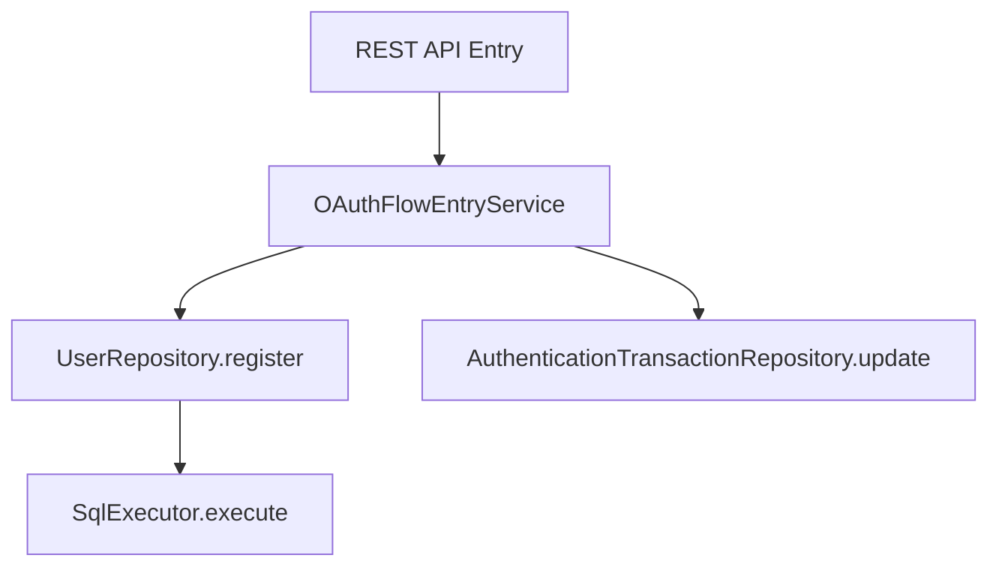

# トランザクション

## 1. 概要

`idp-server` は、**フレームワーク非依存のトランザクション管理レイヤー**を実装しており、Spring Boot、Quarkus、Jakarta EE
など異なるアプリケーションスタック間での移植性をサポートします。これにより、特定の DI や Web
フレームワークに密結合せずにトランザクションの伝播や境界制御が可能となります。

---

## 2. カスタムトランザクションアノテーション

```java

@Transaction
public class OAuthFlowEntryService implements OAuthFlowApi {
    // transactional service logic
}
```

- `@Transaction` アノテーションは、クラスまたはメソッドをトランザクション対象としてマークします。
- **宣言的なトランザクション境界の制御**を実現します。

---

## 3. トランザクションの伝播

現在の `@Transaction` システムでは、以下の伝播動作をサポートしています：

| 伝播タイプ        | サポート状況 | 説明                                  |
|--------------|--------|-------------------------------------|
| REQUIRED     | ✅ 対応済み | トランザクションが存在しない場合に新規作成。既に存在する場合はエラー。 |
| REQUIRES_NEW | ❌ 非対応  | ネストや中断されたトランザクションは未対応。              |
| SUPPORTS     | ❌ 非対応  | 明示的なトランザクションコンテキストが必要。              |

> 備考：このトランザクションシステムはフレームワーク非依存であり、ThreadLocal
> によってトランザクション状態を管理します。マルチレベル伝播やネストトランザクションは現時点では未対応です。

---

## 4. サンプルフロー



すべてのDB呼び出しは、サービスレベルで定義された1つのトランザクションスコープ内で処理されます。

---

## 5. エラーハンドリングとロールバック

例外（ランタイム例外またはラップされたチェック例外）が発生した場合、トランザクションは自動的にロールバックされます。

- 中央集権的な例外ハンドラーとの統合を推奨
- カスタムロールバックルールはアダプターごとに設定可能

---

## 6. 実装クラス

- `@Transaction` アノテーション：`org.idp.server.platform.datasource` に存在
- アダプターエントリポイント：例 `TenantAwareEntryServiceProxy`
- リポジトリインターフェース：コマンド／クエリ分離設計（`register()`, `update()` など）

### TenantAwareEntryServiceProxy - Dynamic Proxy実装

`TenantAwareEntryServiceProxy`は、Java Dynamic Proxyを使用して`@Transaction`アノテーションを検出し、自動的にトランザクション管理を実行します。

---

## 7. トランザクション分離レベル

`idp-server` では、PostgreSQL/MySQLのデフォルト分離レベルである **READ COMMITTED** を使用しています。

**関連ドキュメント**: Writer/Reader DataSourceの分岐については [Writer/Reader DataSource](./writer-reader-datasource.md) を参照してください。

### 分離レベルの特性

| 分離レベル | 動作 |
|-----------|------|
| **READ COMMITTED** | コミット済みのデータのみ参照可能。同一トランザクション内では自分の更新は即座に参照可能（Read Your Own Writes） |

**PostgreSQL**: デフォルトで READ COMMITTED
**MySQL/InnoDB**: デフォルトで REPEATABLE READ（より厳密）だが、Read Your Own Writesは両方でサポート

### データベース別の動作

| データベース | デフォルト分離レベル | Read Your Own Writes |
|-------------|-------------------|---------------------|
| PostgreSQL | READ COMMITTED | ✅ サポート |
| MySQL (InnoDB) | REPEATABLE READ | ✅ サポート |

**参考**:
- [PostgreSQL - Transaction Isolation](https://www.postgresql.org/docs/current/transaction-iso.html)
- [MySQL - Transaction Isolation Levels](https://dev.mysql.com/doc/refman/8.0/en/innodb-transaction-isolation-levels.html)

---

## 8. Read Your Own Writes パターン

同一トランザクション内では、自分が更新したデータは即座に参照可能です。

**重要**: このパターンは**Writer DataSource**での書き込みトランザクションで有効です。Reader DataSourceは読み取り専用のため、Read Your Own Writesは適用されません。詳細は [Writer/Reader DataSource](./writer-reader-datasource.md#writerreader分岐の詳細) を参照してください。

### ユースケース: 更新API実行後のデータ再取得

更新APIでDBから再取得してレスポンスを返す場合、同一トランザクション内で更新後のデータを正確に取得できます。

```java
// 1. トランザクション開始（@Transactionアノテーションにより自動開始）
@Transaction
public UserManagementResponse update(TenantIdentifier tenant, ...) {

    // 2. UPDATE実行（updated_at = now() はDB側で設定）
    userCommandRepository.update(tenant, user);

    // 3. 同一トランザクション内で再取得
    // → 更新後のデータ（updated_at含む）が即座に取得可能
    User updatedUser = userQueryRepository.get(tenant, userIdentifier);

    // 4. レスポンス生成
    return toResponse(updatedUser);

    // 5. コミット（メソッド終了時に自動コミット）
}
```

### Read Your Own Writes が保証する動作

- **即座の可視性**: UPDATE/INSERT直後のSELECTで最新データを取得可能
- **DB関数の値**: `now()`, `CURRENT_TIMESTAMP`, `uuid_generate_v4()` 等のDB側で設定される値も取得可能
- **ThreadLocal共有**: `ThreadLocal`により同一スレッドで同じ `Connection` を使用
- **コミット前でも参照可能**: コミット前でもSELECTで自分の更新を参照可能

### 関連テーブルのJOIN取得

ユーザーエンティティなど、複数テーブルにまたがるデータの場合、更新後に再取得することでメインテーブルと関連テーブルの両方の最新データを一括で取得できます。

```
関連テーブル例（Userエンティティ）:
- idp_user               メインテーブル（updated_atがDB側で更新される）
- idp_user_roles         ロール割り当て
- idp_user_assigned_tenants        テナント割り当て
- idp_user_assigned_organizations  組織割り当て
```

**メリット**:
- 1回のSELECT（JOIN）で全関連データを取得
- DB側で設定された値（updated_at等）も含めて取得
- レスポンスに最新の正確なデータを含められる

### 注意点

- **同一トランザクション内でのみ有効**: トランザクション境界を超えると、別のConnectionが使用される可能性がある
- **他トランザクションの更新は不可視**: READ COMMITTEDのため、他のトランザクションの未コミット更新は参照できない
- **ThreadLocal依存**: 同一スレッド内でのみ有効（非同期処理では動作が異なる可能性）

---

このモジュール化されたトランザクションアーキテクチャは、すべての ID／認可フローにおいて移植性、拡張性、安全なデータ一貫性を保証します。

---

## 9. Row-Level Security（RLS）との統合

`idp-server` では、PostgreSQL の **Row-Level Security（RLS）** を独自トランザクション管理レイヤーと組み合わせることで、テナントベースのデータ分離を厳密に実現します。

### 🔐 主な概念

* 全マルチテナントテーブルに対して以下のような RLS ポリシーを定義：

```sql
CREATE
POLICY rls_<table_name>
  ON <table_name>
  USING (tenant_id = current_setting('app.tenant_id')::uuid);
```

* 強制適用には以下を使用：

```sql
ALTER TABLE < table_name > FORCE ROW LEVEL SECURITY;
```

### 🔧 RLS コンテキストの伝播

`TransactionManager` は各 DB コネクションに適切なテナントコンテキストを適用します：

```java
private static void setTenantId(Connection conn, TenantIdentifier tenantIdentifier) {
    log.trace("[RLS] SET app.tenant_id: tenant={}", tenantIdentifier.value());

    // Use set_config() function with PreparedStatement to prevent SQL Injection
    // See: https://www.postgresql.org/docs/current/functions-admin.html#FUNCTIONS-ADMIN-SET
    try (var stmt = conn.prepareStatement("SELECT set_config('app.tenant_id', ?, true)")) {
        stmt.setString(1, tenantIdentifier.value());
        stmt.execute();
    } catch (SQLException e) {
        throw new SqlRuntimeException("Failed to set tenant_id", e);
    }
}
```

* この `app.tenant_id` は RLS ポリシーで使用されるセッションレベル変数です。
* **SQL 実行前に必ず設定**されている必要があります。
* テナント ID は `TenantIdentifier` として明示的に渡されます。

---

### 💡 運用ベストプラクス

* リクエスト初期に解決が必要な場合は、`tenant` テーブルへの RLS 適用は避けることを推奨
* Flyway マイグレーション後には以下のような権限設定を実行：

```sql
GRANT
SELECT,
INSERT
,
UPDATE,
DELETE
ON ALL TABLES IN SCHEMA public TO idp_app_user;
```

* 将来的なテーブル・シーケンスにも適用されるようにデフォルト権限を変更：

```sql
ALTER
DEFAULT PRIVILEGES FOR ROLE postgres
  IN SCHEMA public
  GRANT
SELECT,
INSERT
,
UPDATE,
DELETE
ON TABLES TO idp_app_user;

ALTER
DEFAULT PRIVILEGES FOR ROLE postgres
  IN SCHEMA public
  GRANT USAGE,
SELECT
ON SEQUENCES TO idp_app_user;
```

---

### 🔍 デバッグヒント

* RLS ポリシー一覧表示：

```sql
SELECT *
FROM pg_policies
WHERE schemaname = 'public';
```

* テーブルに対するユーザー権限の確認：

```sql
SELECT *
FROM information_schema.role_table_grants
WHERE grantee = 'idp_app_user'
  AND table_schema = 'public';
```

---

この設計により、**あらゆる実行環境においてもマルチテナント安全性をデータベースレベルで実現**できます。

---

## 10. EntryService Proxy の使い分け

EntryServiceは、用途に応じて異なるProxyでラップする必要があります。Proxyの選択を誤ると、トランザクション管理やRLS設定が正しく動作しません。

### 10.1 TenantAwareEntryServiceProxy

**用途**: Application層のAPI（第一引数に`TenantIdentifier`を持つ）

```java
// 使用例: TenantIdentifierを第一引数に持つAPI
this.tenantMetaDataApi = TenantAwareEntryServiceProxy.createProxy(
    new TenantMetaDataEntryService(tenantQueryRepository),
    TenantMetaDataApi.class,
    databaseTypeProvider);
```

**動作**:
- メソッド引数から `TenantIdentifier` を自動解決
- RLS（Row-Level Security）用の `app.tenant_id` を自動設定
- トランザクション管理（コミット/ロールバック）

**対象APIの例**:
- `TenantMetaDataApi` - `get(TenantIdentifier tenantIdentifier)`
- `ClientManagementApi` - `create(TenantIdentifier tenantIdentifier, ...)`
- `UserManagementApi` - `findList(TenantIdentifier tenantIdentifier, ...)`

### 10.2 ManagementTypeEntryServiceProxy

**用途**: Control Plane層の管理API（`TenantIdentifier`を引数に持たない、または別の識別子から内部で解決する必要がある）

```java
// 使用例: OrganizationIdentifierのみを引数に持つAPI
this.organizationTenantResolverApi = ManagementTypeEntryServiceProxy.createProxy(
    new OrganizationTenantResolverEntryService(
        organizationRepository, tenantQueryRepository),
    OrganizationTenantResolverApi.class,
    databaseTypeProvider);
```

**動作**:
- TenantIdentifierの自動解決を行わない
- RLS設定を行わない（サービス内で必要に応じて設定）
- 純粋なトランザクション管理のみ

**対象APIの例**:
- `OrganizationTenantResolverApi` - `resolveOrganizerTenant(OrganizationIdentifier orgId)`
- `OnboardingApi` - `create(OnboardingRequest request)`
- `OrganizationManagementApi` - `create(OrganizationRegistrationRequest request)`

### 10.3 選択基準

| レイヤー | Proxy |
|---------|-------|
| Application Plane | `TenantAwareEntryServiceProxy` |
| System-level Control Plane | `TenantAwareEntryServiceProxy` |
| Organization-level Control Plane | `ManagementTypeEntryServiceProxy` |

| Proxy | RLS設定 | トランザクション |
|-------|---------|-----------------|
| `TenantAwareEntryServiceProxy` | ✅ 自動 | ✅ 自動 |
| `ManagementTypeEntryServiceProxy` | ❌ なし | ✅ 自動 |

### 10.4 よくあるエラーと対処法

#### エラー: MissingRequiredTenantIdentifierException

```
MissingRequiredTenantIdentifierException: Missing required TenantIdentifier.
Please ensure it is explicitly passed to the service.
```

**原因**: `TenantAwareEntryServiceProxy`を使用しているが、APIメソッドの引数に`TenantIdentifier`が含まれていない。

**対処法**: `ManagementTypeEntryServiceProxy`に変更する。

```java
// 変更前（エラー発生）
this.myApi = TenantAwareEntryServiceProxy.createProxy(
    new MyEntryService(...),
    MyApi.class,
    databaseTypeProvider);

// 変更後（正常動作）
this.myApi = ManagementTypeEntryServiceProxy.createProxy(
    new MyEntryService(...),
    MyApi.class,
    databaseTypeProvider);
```

---

---

**情報源**:
- [TransactionManager.java](../../../../libs/idp-server-platform/src/main/java/org/idp/server/platform/datasource/TransactionManager.java)
- [TenantAwareEntryServiceProxy.java](../../../../libs/idp-server-use-cases/src/main/java/org/idp/server/usecases/TenantAwareEntryServiceProxy.java)
- [ManagementTypeEntryServiceProxy.java](../../../../libs/idp-server-use-cases/src/main/java/org/idp/server/usecases/ManagementTypeEntryServiceProxy.java)
- [PostgreSQL - Transaction Isolation](https://www.postgresql.org/docs/current/transaction-iso.html)
- [PostgreSQL - set_config()](https://www.postgresql.org/docs/current/functions-admin.html#FUNCTIONS-ADMIN-SET)
- [MySQL - Transaction Isolation Levels](https://dev.mysql.com/doc/refman/8.0/en/innodb-transaction-isolation-levels.html)

**最終更新**: 2025-12-18
