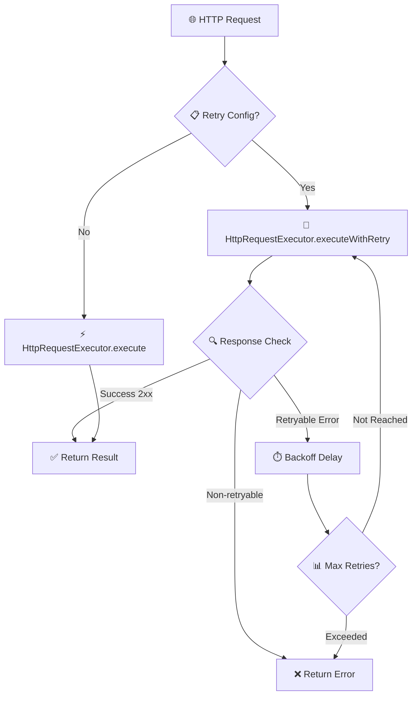

# HTTP Request Executor

> **関連ドキュメント**
> - [Mapping Functions 開発ガイド](impl-20-mapping-functions.md) - リクエスト/レスポンスのデータ変換（19個のFunction）
> - [外部サービス連携ガイド](impl-17-external-integration.md) - 完全な実装例

このドキュメントでは、`idp-server` における **HTTP Request Executor** システムについて説明します。
これは、外部サービスとの HTTP 通信において、堅牢な再試行メカニズム、包括的なエラーハンドリング、および**動的なデータマッピング（Mapping Functions）**を提供することを目的としています。

---

## 🎯 目的

- 外部 API との通信における一時的なネットワーク障害やサーバーエラーに対する自動再試行
- RFC 7231 準拠の Retry-After ヘッダーサポート
- 499 レスポンスの動的再試行制御
- OAuth 2.0 認証との統合
- 設定ベースの柔軟な再試行ポリシー
- **リクエスト/レスポンスのデータ変換（Mapping Functions統合）**

---

## 🔽 図：HTTP Request Executor の全体像



---

## 📚 主要コンポーネント

### HttpRequestExecutor

HTTP リクエストの実行と再試行を管理するメインクラスです。

#### 主要メソッド

```java
// 設定ベースの実行（自動再試行サポート）
public HttpRequestResult execute(
    HttpRequestExecutionConfigInterface configuration,
    HttpRequestBaseParams params
)

// 明示的な再試行実行
public HttpRequestResult executeWithRetry(
    HttpRequest request,
    HttpRetryConfiguration retryConfig
)

// 単純実行（再試行なし）
public HttpRequestResult execute(HttpRequest request)
```

### HttpRetryConfiguration

再試行の詳細設定を管理するクラスです。

#### 設定項目

```java
public class HttpRetryConfiguration implements JsonReadable {
    private int maxRetries = 0;                          // 最大再試行回数
    private Duration[] backoffDelays = new Duration[0];  // バックオフ遅延
    private Set<Integer> retryableStatusCodes = Set.of(); // 再試行可能ステータスコード
    private boolean idempotencyRequired = false;         // 冪等性要求
    private String strategy = "EXPONENTIAL_BACKOFF";     // 再試行戦略
}
```

#### デフォルト設定

```java
// デフォルト再試行設定
HttpRetryConfiguration defaultConfig = HttpRetryConfiguration.defaultRetry();
// - 最大再試行: 3回
// - バックオフ: 1秒 → 5秒 → 30秒
// - 再試行可能ステータス: 408, 429, 500, 502, 503, 504
// - 冪等性要求: false

// 再試行無効化
HttpRetryConfiguration noRetry = HttpRetryConfiguration.noRetry();
```

---

## 🔧 実装クラス

以下のクラスが `HttpRequestExecutionConfigInterface` を実装し、JSON からの自動マッピングをサポートしています：

### 1. HttpRequestExecutionConfig
基本的な HTTP リクエスト設定クラス

### 2. SecurityEventHttpRequestConfig
セキュリティイベント用 HTTP リクエスト設定

### 3. IdentityVerificationHttpRequestConfig
身元確認用 HTTP リクエスト設定

### 4. AdditionalParameterHttpRequestConfig
追加パラメータ用 HTTP リクエスト設定

すべてのクラスは `@JsonIgnoreProperties(ignoreUnknown = true)` と `JsonReadable` を実装し、
`JsonConverter` による自動マッピングをサポートしています。

---

## 📖 使用例

### 基本的な使用方法

```java
// 1. 設定ベースの実行（推奨）
@Autowired
private HttpRequestExecutor executor;

public void callExternalApi() {
    // JSON から自動マッピングされた設定
    HttpRequestExecutionConfig config = loadConfigFromDatabase();

    HttpRequestBaseParams params = HttpRequestBaseParams.builder()
        .body("request data")
        .build();

    HttpRequestResult result = executor.execute(config, params);

    if (result.isSuccess()) {
        // 成功処理
        processResponse(result.body());
    } else {
        // エラー処理
        handleError(result.statusCode(), result.body());
    }
}
```

### 明示的な再試行設定

```java
public void callWithCustomRetry() {
    HttpRetryConfiguration retryConfig = HttpRetryConfiguration.builder()
        .maxRetries(5)
        .backoffDelays(
            Duration.ofSeconds(2),
            Duration.ofSeconds(10),
            Duration.ofMinutes(1)
        )
        .retryableStatusCodes(Set.of(500, 502, 503, 504, 408, 429))
        .idempotencyRequired(true)
        .build();

    HttpRequest request = HttpRequest.newBuilder()
        .uri(URI.create("https://api.example.com/endpoint"))
        .POST(BodyPublishers.ofString("data"))
        .build();

    HttpRequestResult result = executor.executeWithRetry(request, retryConfig);
}
```

### JSON 設定例

```json
{
  "url": "https://api.example.com/webhook",
  "method": "POST",
  "auth_type": "oauth",
  "oauth_authorization": {
    "client_id": "your-client-id",
    "scope": "api:write"
  },
  "retry_configuration": {
    "max_retries": 3,
    "backoff_delays": [1000, 5000, 30000],
    "retryable_status_codes": [500, 502, 503, 504, 408, 429],
    "idempotency_required": false,
    "strategy": "EXPONENTIAL_BACKOFF"
  }
}
```

---

## 🔐 OAuth 2.0 認証統合

HttpRequestExecutor は OAuth 2.0 認証を透過的にサポートしています。

### OAuth 設定

```json
{
  "url": "https://api.example.com/webhook",
  "method": "POST",
  "auth_type": "oauth",
  "oauth_authorization": {
    "type": "client_credentials",
    "token_endpoint": "https://auth.example.com/token",
    "client_authentication_type": "client_secret_basic",
    "client_id": "your-client-id",
    "client_secret": "your-client-secret",
    "scope": "api:write webhooks:send",
    "cache_enabled": true,
    "cache_buffer_seconds": 30,
    "cache_ttl_seconds": 3600
  }
}
```

#### キャッシュ設定

- **`cache_enabled`**: トークンキャッシュの有効/無効
- **`cache_buffer_seconds`**: トークン期限前のバッファ時間（秒）
- **`cache_ttl_seconds`**: キャッシュのデフォルトTTL（秒）

#### キャッシュキー生成

キャッシュキーは以下の形式で自動生成されます：

```
oauth_token:type={grant_type}:client={client_id}:scope={scope}:user={username}:endpoint={token_endpoint}
```

例：
```
oauth_token:type=client_credentials:client=my_client_id:scope=api_write:endpoint=https://auth.example.com/token
oauth_token:type=password:client=app_client:scope=read_write:user=john_doe:endpoint=https://auth.example.com/token
```

- 特殊文字は `_` に置換
- 各要素は50文字以内に制限
- デバッグ・ログ解析が容易な人間可読形式

### 自動トークン管理

```java
// OAuth設定があるリクエストでは OAuthAuthorizationResolvers が自動的にトークンを解決します
HttpRequestExecutionConfig config = loadConfigWithOAuth();
HttpRequestResult result = executor.execute(config, params);

// 内部処理:
// 1. OAuthAuthorizationResolvers がトークンを解決
// 2. Authorization ヘッダーに Bearer トークン設定
// 3. リクエスト実行
```

✅ **最適化済み**: OAuth認証とリトライ機能は効率的に統合されており、トークン解決の重複実行はありません。

### 401/403 エラー時の自動リトライ

外部サービスから `401 Unauthorized` または `403 Forbidden` が返却された場合、HttpRequestExecutor は自動的にキャッシュされたトークンを無効化し、新しいトークンを取得してリトライします。

#### 処理フロー（詳細）

```
┌─────────────────────────────────────────────────────────────────────────────┐
│                         execute(config, params)                              │
│                                  │                                           │
│                                  ▼                                           │
│                    executeWithOAuthRetry(config, params, isRetry=false)      │
└─────────────────────────────────────────────────────────────────────────────┘
                                   │
                                   ▼
┌─────────────────────────────────────────────────────────────────────────────┐
│  1. HttpRequestBuilder.build(config, params)                                 │
│     ┌─────────────────────────────────────────────────────────────────────┐ │
│     │  - URL/Header/Body のマッピング                                      │ │
│     │  - auth_type == "oauth2" の場合:                                     │ │
│     │      OAuthAuthorizationResolver.resolve() でトークン取得             │ │
│     │      → Authorization: Bearer {token} ヘッダー追加                    │ │
│     └─────────────────────────────────────────────────────────────────────┘ │
└─────────────────────────────────────────────────────────────────────────────┘
                                   │
                                   ▼
┌─────────────────────────────────────────────────────────────────────────────┐
│  2. HTTPリクエスト実行                                                       │
│     ┌─────────────────────────────────────────────────────────────────────┐ │
│     │  hasRetryConfiguration?                                              │ │
│     │     YES → executeWithRetryAndCriteria() (指数バックオフリトライ)     │ │
│     │     NO  → executeWithCriteria() (単発実行)                           │ │
│     └─────────────────────────────────────────────────────────────────────┘ │
└─────────────────────────────────────────────────────────────────────────────┘
                                   │
                                   ▼
┌─────────────────────────────────────────────────────────────────────────────┐
│  3. レスポンス評価                                                           │
│     ┌─────────────────────────────────────────────────────────────────────┐ │
│     │  auth_type == "oauth2"                                               │ │
│     │  AND (statusCode == 401 OR statusCode == 403)                        │ │
│     │  AND isRetry == false                                                │ │
│     └─────────────────────────────────────────────────────────────────────┘ │
└─────────────────────────────────────────────────────────────────────────────┘
                                   │
                    ┌──────────────┴──────────────┐
                    │                             │
                   YES                           NO
                    │                             │
                    ▼                             ▼
┌───────────────────────────────────┐   ┌─────────────────────┐
│  4. トークンリフレッシュ & リトライ │   │  結果を返却          │
│  ┌─────────────────────────────┐  │   │                     │
│  │ a. ログ出力:                │  │   │  return result;     │
│  │    "Received 401/403,      │  │   │                     │
│  │     invalidating cached    │  │   └─────────────────────┘
│  │     token and retrying"    │  │
│  │                            │  │
│  │ b. resolver.invalidateCache()│ │
│  │    → キャッシュからトークン削除│ │
│  │    → ログ: "Invalidated     │  │
│  │      cached access token"  │  │
│  │                            │  │
│  │ c. executeWithOAuthRetry() │  │
│  │    (isRetry=true で再帰)   │  │
│  └─────────────────────────────┘  │
└───────────────────────────────────┘
                    │
                    ▼
┌─────────────────────────────────────────────────────────────────────────────┐
│  5. リトライ実行 (isRetry=true)                                              │
│     ┌─────────────────────────────────────────────────────────────────────┐ │
│     │  - 新しいトークンを取得 (キャッシュにないため)                        │ │
│     │  - HTTPリクエスト再実行                                              │ │
│     │  - 401/403でも isRetry=true なのでリトライしない (無限ループ防止)     │ │
│     └─────────────────────────────────────────────────────────────────────┘ │
└─────────────────────────────────────────────────────────────────────────────┘
                    │
                    ▼
              ┌───────────┐
              │ 結果を返却 │
              └───────────┘
```

#### シーケンス図

```
┌────────┐     ┌──────────────────┐     ┌─────────────────┐     ┌──────────────┐     ┌──────────────┐
│ Client │     │HttpRequestExecutor│     │HttpRequestBuilder│     │OAuthResolver │     │External API  │
└───┬────┘     └────────┬─────────┘     └────────┬────────┘     └──────┬───────┘     └──────┬───────┘
    │                   │                        │                     │                    │
    │ execute(config)   │                        │                     │                    │
    │──────────────────>│                        │                     │                    │
    │                   │                        │                     │                    │
    │                   │ build(config)          │                     │                    │
    │                   │───────────────────────>│                     │                    │
    │                   │                        │                     │                    │
    │                   │                        │ resolve(oAuthConfig)│                    │
    │                   │                        │────────────────────>│                    │
    │                   │                        │                     │                    │
    │                   │                        │   access_token      │                    │
    │                   │                        │<────────────────────│                    │
    │                   │                        │                     │                    │
    │                   │   HttpRequest          │                     │                    │
    │                   │<───────────────────────│                     │                    │
    │                   │                        │                     │                    │
    │                   │ POST /api (Bearer token)                     │                    │
    │                   │─────────────────────────────────────────────────────────────────>│
    │                   │                        │                     │                    │
    │                   │                        │                     │      401 Unauthorized
    │                   │<─────────────────────────────────────────────────────────────────│
    │                   │                        │                     │                    │
    │                   │ invalidateCache()      │                     │                    │
    │                   │─────────────────────────────────────────────>│                    │
    │                   │                        │                     │                    │
    │                   │ build(config) [RETRY]  │                     │                    │
    │                   │───────────────────────>│                     │                    │
    │                   │                        │                     │                    │
    │                   │                        │ resolve(oAuthConfig)│                    │
    │                   │                        │────────────────────>│                    │
    │                   │                        │                     │                    │
    │                   │                        │   NEW access_token  │                    │
    │                   │                        │<────────────────────│                    │
    │                   │                        │                     │                    │
    │                   │   HttpRequest          │                     │                    │
    │                   │<───────────────────────│                     │                    │
    │                   │                        │                     │                    │
    │                   │ POST /api (NEW Bearer token)                 │                    │
    │                   │─────────────────────────────────────────────────────────────────>│
    │                   │                        │                     │                    │
    │                   │                        │                     │      200 OK        │
    │                   │<─────────────────────────────────────────────────────────────────│
    │                   │                        │                     │                    │
    │   result          │                        │                     │                    │
    │<──────────────────│                        │                     │                    │
    │                   │                        │                     │                    │
```

#### ログ出力

リトライ時には以下のログが出力されます（運用時の確認に有用）：

```
INFO  HttpRequestExecutor - Received 401 Unauthorized, invalidating cached token and retrying: uri=https://api.example.com/endpoint
INFO  SmartCachedOAuthAuthorizationResolver - Invalidated cached access token for key: oauth_token:type=password:client=my-client:scope=api_access:endpoint=https://auth.example.com/token
```

#### 設計ポイント

| ポイント | 説明 |
|---------|------|
| **リトライは1回のみ** | 無限ループ防止。リトライ後も401/403なら最終結果として返却 |
| **キャッシュ無効化** | 期限切れや失効したトークンをキャッシュから削除 |
| **新トークン取得** | キャッシュミスにより、OAuthサーバーから新規取得 |
| **対象エラー** | 401（認証失敗）と403（認可失敗）の両方に対応 |

#### 関連クラス

| クラス | 責務 |
|--------|------|
| `HttpRequestExecutor` | HTTPリクエスト実行、401/403リトライ制御 |
| `HttpRequestBuilder` | 設定からHttpRequestを構築、OAuthトークン付与 |
| `OAuthAuthorizationResolver` | OAuthトークン取得・キャッシュ管理 |
| `SmartCachedOAuthAuthorizationResolver` | トークンキャッシュ、TTL管理、キャッシュ無効化 |
| `CachedAccessToken` | キャッシュされたトークン、有効期限判定 |
| `HttpRetryStrategy` | 指数バックオフリトライ（ネットワークエラー用） |

#### 関連Issue

- [Issue #1139](https://github.com/hirokazu-kobayashi-koba-hiro/idp-server/issues/1139): キャッシュTTL個別設定
- [Issue #1143](https://github.com/hirokazu-kobayashi-koba-hiro/idp-server/issues/1143): 401/403エラー時のキャッシュクリア＆リトライ機能

### トークンキャッシュの有効期限管理

#### TTL（Time To Live）の決定

トークンのキャッシュTTLは、OAuthサーバーから返却される `expires_in` を使用して動的に設定されます：

```java
// OAuthサーバーからのレスポンス
{
  "access_token": "eyJhbGciOiJSUzI1...",
  "expires_in": 1800,  // 30分
  "token_type": "Bearer"
}

// キャッシュ保存時
cacheStore.put(cacheKey, cachedToken, expiresIn);  // TTL = 1800秒
```

#### バッファ時間（Buffer Seconds）

トークン期限切れ直前のリクエスト失敗を防ぐため、バッファ時間を設定できます：

```
|←────────── expires_in (1800秒) ──────────→|
|                              |←─buffer─→|
├──────────────────────────────┼───────────┤
取得時刻                        ↑          有効期限
                          ここでisValid()=false
                          （リクエスト前に新トークン取得）
```

```java
// CachedAccessToken.isValid()
public boolean isValid() {
    long bufferTime = bufferSeconds * 1000L;
    return currentTime < (expirationTimestamp - bufferTime);
}
```

### OAuthAuthorizationResolvers

`OAuthAuthorizationResolvers` は OAuth 2.0 の各種認証フローに対応したリゾルバーを管理するクラスです。

#### サポートする OAuth フロー

```java
public class OAuthAuthorizationResolvers {
    Map<String, OAuthAuthorizationResolver> resolvers = new HashMap<>();

    // デフォルトでサポートされるフロー:
    // - Client Credentials Grant (client_credentials)
    // - Resource Owner Password Credentials Grant (password)
}
```

#### 初期化方法

```java
// 基本初期化（デフォルトリゾルバーのみ）
OAuthAuthorizationResolvers resolvers = new OAuthAuthorizationResolvers();

// カスタムリゾルバー追加
Map<String, OAuthAuthorizationResolver> customResolvers = new HashMap<>();
customResolvers.put("custom_grant", customResolver);
OAuthAuthorizationResolvers resolvers = new OAuthAuthorizationResolvers(customResolvers);

// キャッシュ有効化
OAuthAuthorizationResolvers resolvers = new OAuthAuthorizationResolvers(
    cacheStore,     // キャッシュストア
    30,            // バッファ秒数
    3600           // デフォルトTTL秒数
);
```

#### 使用方法

```java
// HttpRequestExecutor の初期化時に OAuth リゾルバーを設定
HttpRequestExecutor executor = new HttpRequestExecutor(
    httpClient,
    oAuthAuthorizationResolvers
);

// OAuth 設定が含まれるリクエストでは自動的にトークンが解決されます
HttpRequestResult result = executor.execute(configWithOAuth, params);
```

#### リゾルバー選択

```java
// grant_type に基づいてリゾルバーを取得
OAuthAuthorizationResolver resolver = resolvers.get("client_credentials");

// サポートされていない grant_type の場合は UnSupportedException がスロー
```

---

## 🗺️ Mapping Rules（データマッピング）

HTTPリクエストの動的な構築とレスポンスの変換を行うMapping Rulesについて説明します。

### Mapping Rulesの種類

| Mapping Rule | 用途 | 説明 |
|-------------|------|------|
| `path_mapping_rules` | URLパス | URLテンプレート内の変数を動的に置き換え |
| `header_mapping_rules` | HTTPヘッダー | ヘッダーの動的設定 |
| `body_mapping_rules` | リクエストボディ | JSONボディの動的構築 |
| `query_mapping_rules` | クエリパラメータ | URLクエリパラメータの動的設定 |

**詳細**: [Mapping Functions 開発ガイド](impl-20-mapping-functions.md)

### path_mapping_rules

URLパスパラメータを動的に設定する機能です。

**設定例**:
```json
{
  "http_request": {
    "url": "https://api.example.com/v1/applications/{{application_id}}/documents/{{document_id}}",
    "path_mapping_rules": [
      {
        "from": "$.application.id",
        "to": "application_id"
      },
      {
        "from": "$.document.id",
        "to": "document_id"
      }
    ]
  }
}
```

**動作**:
1. URLテンプレート内の`{{application_id}}`と`{{document_id}}`を検出
2. `path_mapping_rules`に基づいて値を取得
3. 最終的なURL: `https://api.example.com/v1/applications/12345/documents/67890`

**使用シーン**:
- RESTful APIのリソースIDをパスに埋め込む
- 動的なエンドポイント構築（ユーザーID、テナントID等）

### header_mapping_rules / body_mapping_rules

ヘッダーとボディのマッピングについては、[Mapping Functions 開発ガイド](impl-20-mapping-functions.md)を参照してください。

---

## 🔍 Response Resolver（レスポンス解決）

HTTPレスポンスをアプリケーションレベルのステータスコードにマッピングする機能です。

### 目的

外部APIのレスポンスは様々な形式があります：
- HTTP 200でも、ボディ内に`"status": "error"`が含まれる場合
- HTTP 503でも、再試行可能なエラーと不可能なエラーがある
- ビジネスレベルの成功/失敗をHTTPステータスとボディで複合判定する必要がある

Response Resolverは、これらの複雑なレスポンスを統一的に扱うための仕組みです。

### 設定構造

```json
{
  "http_request": {
    "url": "https://api.example.com/verify",
    "response_resolve_configs": {
      "configs": [
        {
          "conditions": [
            {"path": "$.httpStatusCode", "operation": "in", "value": [200, 201]},
            {"path": "$.response_body.status", "operation": "eq", "value": "approved"}
          ],
          "match_mode": "all",
          "mapped_status_code": 200
        },
        {
          "conditions": [
            {"path": "$.httpStatusCode", "operation": "eq", "value": 200},
            {"path": "$.response_body.status", "operation": "eq", "value": "pending"}
          ],
          "match_mode": "all",
          "mapped_status_code": 202
        },
        {
          "conditions": [
            {"path": "$.httpStatusCode", "operation": "eq", "value": 503}
          ],
          "match_mode": "all",
          "mapped_status_code": 503,
          "error_message_json_path": "$.response_body.message"
        }
      ]
    }
  }
}
```

### フィールド説明

| フィールド | 説明 |
|-----------|------|
| `conditions` | レスポンス判定条件の配列 |
| `conditions[].path` | JSONPath（`$.httpStatusCode`、`$.response_body.*`） |
| `conditions[].operation` | 演算子（`eq`, `in`, `ne`, `gte`, `lte`等） |
| `conditions[].value` | 比較値 |
| `match_mode` | マッチモード（`all`: AND条件、`any`: OR条件） |
| `mapped_status_code` | マッピング先のステータスコード |
| `error_message_json_path` | エラーメッセージ抽出用JSONPath（オプション） |

### 動作

1. レスポンスを受信
2. `configs`を順番に評価
3. 最初にマッチした設定の`mapped_status_code`を適用
4. どれもマッチしない場合は、元のHTTPステータスコードを使用

### 使用シーン

**ケース1: HTTP 200でもエラーを検出**

外部APIが常にHTTP 200を返すが、ボディで成功/失敗を区別する場合：

```json
{
  "configs": [
    {
      "conditions": [
        {"path": "$.response_body.result", "operation": "eq", "value": "success"}
      ],
      "match_mode": "all",
      "mapped_status_code": 200
    },
    {
      "conditions": [
        {"path": "$.response_body.result", "operation": "eq", "value": "error"}
      ],
      "match_mode": "all",
      "mapped_status_code": 400,
      "error_message_json_path": "$.response_body.error_message"
    }
  ]
}
```

**ケース2: ビジネスステータスによる判定**

eKYCの審査結果を判定する場合：

```json
{
  "configs": [
    {
      "conditions": [
        {"path": "$.httpStatusCode", "operation": "eq", "value": 200},
        {"path": "$.response_body.verification_status", "operation": "eq", "value": "approved"}
      ],
      "match_mode": "all",
      "mapped_status_code": 200
    },
    {
      "conditions": [
        {"path": "$.httpStatusCode", "operation": "eq", "value": 200},
        {"path": "$.response_body.verification_status", "operation": "eq", "value": "rejected"}
      ],
      "match_mode": "all",
      "mapped_status_code": 400
    }
  ]
}
```

**ケース3: 複数条件の組み合わせ**

```json
{
  "conditions": [
    {"path": "$.httpStatusCode", "operation": "in", "value": [200, 201, 204]},
    {"path": "$.response_body.errors", "operation": "eq", "value": null}
  ],
  "match_mode": "all",
  "mapped_status_code": 200
}
```

### 評価順序

- `configs`配列の**順番**が重要
- 最初にマッチした設定が適用される
- より具体的な条件を先に、一般的な条件を後に配置

---

## 🔄 再試行メカニズム

### 再試行可能な条件

1. **ステータスコードベース**
   - `408 Request Timeout`
   - `429 Too Many Requests`
   - `5xx Server Errors` (500, 502, 503, 504)

2. **例外ベース**
   - `IOException`
   - `ConnectException`
   - `SocketTimeoutException`
   - `HttpTimeoutException`

3. **499 レスポンスの動的制御**
   ```json
   // 再試行する場合
   {
     "error": "temporary_unavailable",
     "retryable": true
   }

   // 再試行しない場合
   {
     "error": "invalid_request",
     "retryable": false
   }
   ```

   **非JSONレスポンスの処理**:
   - JSONパースに失敗した場合は `retryable: false` として扱う
   - `retryable` フィールドが存在しない場合も `false` として扱う
   - 空のレスポンスボディも `false` として扱う

   ```java
   // 例: 非JSONレスポンス
   // Response: "Client closed connection - not JSON"
   // → 再試行されない (retryable: false として扱われる)
   ```

### Retry-After ヘッダーサポート

RFC 7231 準拠の Retry-After ヘッダーをサポートしています：

```java
// 秒数指定
Retry-After: 120

// HTTP日付指定
Retry-After: Fri, 31 Dec 1999 23:59:59 GMT
```

### バックオフ戦略

**指数バックオフ** (Exponential Backoff) を採用：

```
1回目の再試行: 1秒後
2回目の再試行: 5秒後
3回目の再試行: 30秒後
```

Retry-After ヘッダーが存在する場合は、そちらが優先されます。

---

## 🛡️ エラーハンドリング

### 機械可読エラー情報

エラーレスポンスには詳細な再試行情報が含まれます：

```json
{
  "error": "rate_limit_exceeded",
  "error_description": "Too many requests",
  "retry_info": {
    "retryable": true,
    "retry_after_seconds": 60,
    "max_retries": 3,
    "attempt": 2
  }
}
```

### 冪等性チェック

`idempotencyRequired = true` の場合、POST/PUT/PATCH リクエストに `Idempotency-Key` ヘッダーが自動追加されます：

```
Idempotency-Key: 550e8400-e29b-41d4-a716-446655440000
```

---

## 🧪 テスト

### テストケース

包括的なテストスイートが提供されています：

1. **基本機能テスト**
   - 成功レスポンス処理
   - エラーレスポンス処理

2. **再試行メカニズムテスト**
   - 設定ベース再試行
   - 明示的再試行
   - 最大再試行回数チェック

3. **499 レスポンステスト**
   - `retryable: true` での再試行
   - `retryable: false` での停止
   - 非JSONレスポンス処理

4. **Retry-After ヘッダーテスト**
   - 秒数指定
   - HTTP日付指定
   - 大小文字区別なし

5. **エラー情報テスト**
   - 機械可読エラー情報
   - 再試行情報埋め込み

### テスト実行

```bash
./gradlew :libs:idp-server-platform:test --tests "*HttpRequestExecutorTest*"
```

---

## 📋 ベストプラクティス

### 1. 設定ベース実行の推奨

```java
// ✅ 推奨: 設定ベース
HttpRequestResult result = executor.execute(config, params);

// ❌ 非推奨: 手動設定
HttpRequest request = buildRequest();
HttpRequestResult result = executor.executeWithRetry(request, retryConfig);
```

### 2. 適切な再試行設定

```java
// ✅ 適切: 段階的バックオフ
.backoffDelays(
    Duration.ofSeconds(1),   // 短い初期遅延
    Duration.ofSeconds(5),   // 中程度の遅延
    Duration.ofSeconds(30)   // 長い最終遅延
)

// ❌ 不適切: 固定遅延
.backoffDelays(Duration.ofSeconds(5), Duration.ofSeconds(5), Duration.ofSeconds(5))
```

### 3. 冪等性の考慮

```java
// ✅ POST/PUT/PATCH には冪等性を要求
.idempotencyRequired(true)  // 重複実行を防止

// ✅ GET/HEAD/OPTIONS は冪等
.idempotencyRequired(false) // 冪等性チェック不要
```

### 4. エラーハンドリング

```java
public void handleResult(HttpRequestResult result) {
    if (result.isSuccess()) {
        // 成功処理
        return;
    }

    // エラー詳細の確認
    JsonNodeWrapper errorBody = result.body();
    if (errorBody != null && errorBody.contains("retry_info")) {
        JsonNodeWrapper retryInfo = errorBody.getNode("retry_info");
        boolean retryable = retryInfo.getValueAsBoolean("retryable");

        if (retryable) {
            // 再試行可能エラー
            scheduleRetry();
        } else {
            // 再試行不可エラー
            handlePermanentError();
        }
    }
}
```

---

## 🔗 関連ドキュメント

### 実装ガイド
- [設定管理 API](configuration-management-api.md)
- [タスクガイド: 外部サービス連携](../04-implementation-guides/impl-17-external-integration.md) - HttpRequestExecutor実践ガイド

### 技術詳細
- [AI開発者向け: Platform - HttpRequestExecutor](../content_10_ai_developer/ai-12-platform.md#httprequestexecutor---http通信) - HTTP通信詳細実装