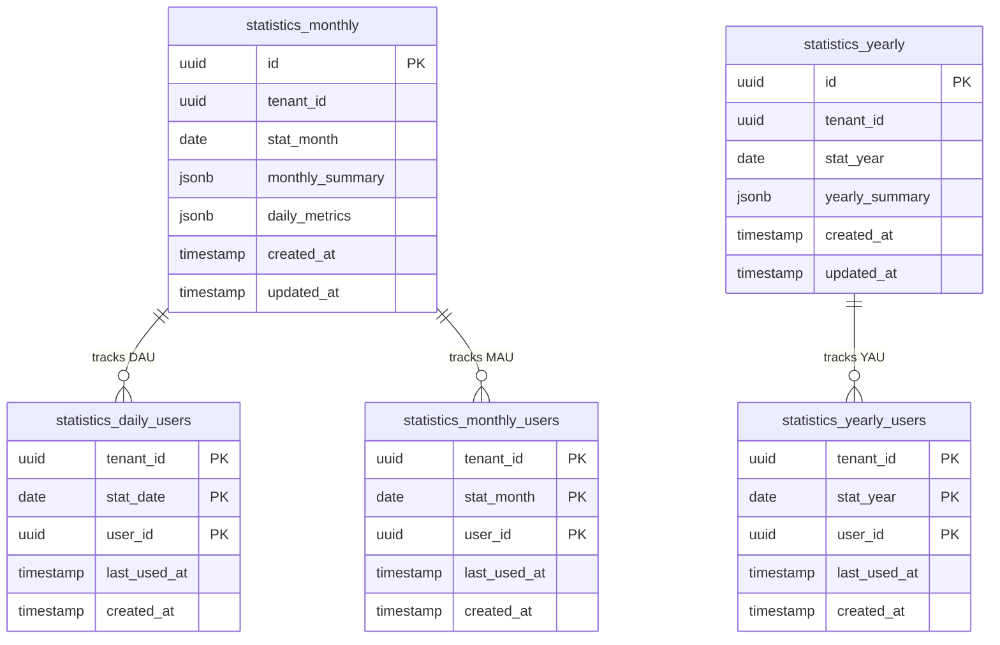
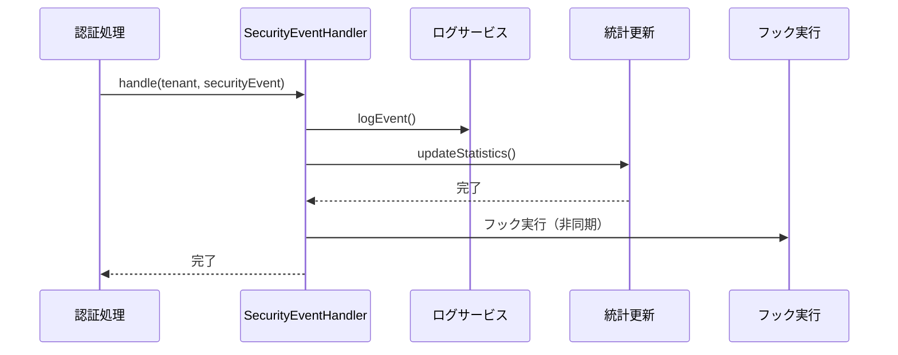
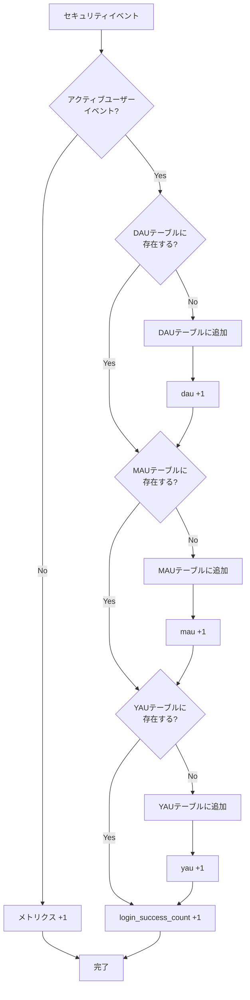
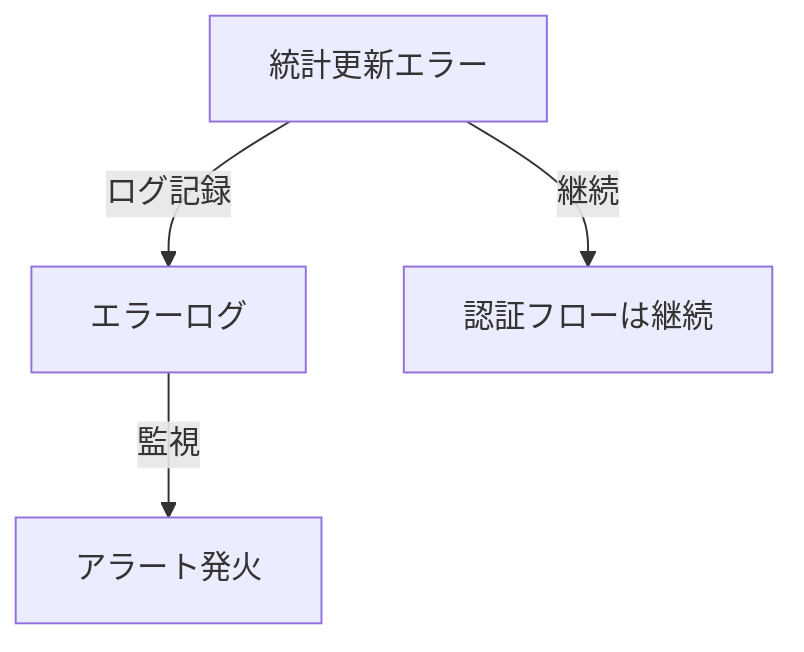

# テナント統計機能 実装ガイド

このドキュメントでは、テナント統計機能の実装詳細について説明します。概要については [テナント統計管理](../../content_03_concepts/07-operations/concept-03-tenant-statistics.md) を参照してください。

---

## アーキテクチャの選択

### イベント駆動 vs バッチ処理

idp-serverでは、バッチ処理ではなく**イベント駆動によるリアルタイム統計更新**を採用しています。

| アプローチ | 特徴 | メリット | デメリット |
|:---|:---|:---|:---|
| **バッチ処理** | 定期的に過去データを集計 | シンプル | データ遅延、高負荷 |
| **イベント駆動** | イベント発生時に増分更新 | リアルタイム、低負荷 | 実装複雑 |

**イベント駆動を選択した理由**:
- セキュリティイベントは既に発行されている（追加コスト小）
- リアルタイムな可視化が可能
- 増分更新のため計算コストが低い
- トランザクション整合性を保証できる

**トレードオフ**:
- イベントハンドラーの複雑性増加
- 統計更新失敗時のエラーハンドリング必要
- ただし、認証フローと統計更新は疎結合（統計失敗でも認証は成功）

---

## データモデル

### ER図



### テーブル構造

#### 集計テーブル（非パーティション）

| テーブル | 用途 | パーティション |
|:---|:---|:---|
| `statistics_monthly` | 月次集計メトリクス | なし |
| `statistics_yearly` | 年次集計メトリクス | なし |

#### ユーザートラッキングテーブル（パーティション）

| テーブル | 用途 | パーティション間隔 | 保持期間 |
|:---|:---|:---|:---|
| `statistics_daily_users` | DAU重複排除 | 日別 | 90日 |
| `statistics_monthly_users` | MAU重複排除 | 月別 | 13ヶ月 |
| `statistics_yearly_users` | YAU重複排除 | 年別 | 5年 |

### カラム詳細

#### statistics_monthly

| カラム | 型 | 説明 |
|:---|:---|:---|
| `id` | UUID | 統計レコードID |
| `tenant_id` | UUID | テナント識別子 |
| `stat_month` | DATE | 統計対象月（月初日、例: 2025-01-01） |
| `monthly_summary` | JSONB | 月次集計メトリクス |
| `daily_metrics` | JSONB | 日別メトリクス（キー: YYYY-MM-DD形式） |

> **Note**: `stat_month`はDATE型で月初日（1日）を格納します。pg_partman対応のため、CHAR(7)からDATE型に変更されました。

**monthly_summary の例**:
```json
{
  "mau": 5000,
  "login_success": 45000,
  "dau": 3200,
  "issue_token_success": 12000
}
```

**daily_metrics の例**:
```json
{
  "2025-01-01": {"dau": 100, "login_success": 1500},
  "2025-01-02": {"dau": 110, "login_success": 1600}
}
```

#### statistics_yearly

| カラム | 型 | 説明 |
|:---|:---|:---|
| `id` | UUID | 統計レコードID |
| `tenant_id` | UUID | テナント識別子 |
| `stat_year` | DATE | 統計対象年（年初日、例: 2025-01-01） |
| `yearly_summary` | JSONB | 年次集計メトリクス |

**yearly_summary の例**:
```json
{
  "yau": 15000,
  "total_logins": 500000,
  "total_login_failures": 5000,
  "new_users": 2000
}
```

---

## 統計更新フロー

### SecurityEventHandlerによる統計収集

セキュリティイベント発行時に、`SecurityEventHandler`が統計を同期的に更新します。



### アクティブユーザーイベントの判定

以下のセキュリティイベントがアクティブユーザーイベントとして判定されます（`DefaultSecurityEventType.isActiveUserEvent()`）:

| イベントタイプ | 説明 |
|:---|:---|
| `login_success` | ログイン成功 |
| `issue_token_success` | トークン発行成功 |
| `refresh_token_success` | トークンリフレッシュ成功 |
| `inspect_token_success` | トークン検証成功 |

### 統計更新処理の詳細



**処理フロー**:

1. **イベント種別判定**: `DefaultSecurityEventType.isActiveUserEvent()` でアクティブユーザーイベントか判定
2. **タイムゾーン変換**: UTCタイムスタンプをテナントのタイムゾーンに変換して日付を決定
3. **DAU処理**: `statistics_daily_users` テーブルでユーザーの初回アクティビティを検出
4. **MAU処理**: `statistics_monthly_users` テーブルでユーザーの月初アクティビティを検出
5. **YAU処理**: `statistics_yearly_users` テーブルでユーザーの年初アクティビティを検出
6. **メトリクス更新**: 日次・月次・年次メトリクスをJSONBで増分更新

---

## タイムゾーン処理

グローバルなマルチテナント環境では、タイムゾーン処理が重要です。

```java
// SecurityEventHandler.updateStatistics() より
LocalDate eventDate = securityEvent
    .createdAt()
    .value()
    .atZone(ZoneOffset.UTC)
    .withZoneSameInstant(tenant.timezone())
    .toLocalDate();
```

**原則**:
- イベントのタイムスタンプはUTCで記録
- 統計日付はテナントのタイムゾーンで計算
- 例: 東京のテナント（JST +9）の23:30 UTC → 翌日08:30 JST として集計

---

## データベース実装

### PostgreSQL vs MySQL

| 機能 | PostgreSQL | MySQL |
|:---|:---|:---|
| UUID生成 | `gen_random_uuid()` | `UUID()` |
| JSON型 | `JSONB` | `JSON` |
| JSONパス更新 | `jsonb_set()` | `JSON_SET()` |
| UPSERT | `ON CONFLICT ... DO UPDATE` | `ON DUPLICATE KEY UPDATE` |
| 行レベルセキュリティ | RLSポリシー | なし（アプリ層で制御） |

### UPSERT による増分更新

アトミックな増分更新により、同時実行制御を実現しています。

**PostgreSQL例**:
```sql
INSERT INTO statistics_monthly (...)
VALUES (...)
ON CONFLICT (tenant_id, stat_month)
DO UPDATE SET
    daily_metrics = jsonb_set(
        COALESCE(statistics_monthly.daily_metrics, '{}'::jsonb),
        ARRAY[?::text],
        jsonb_set(
            COALESCE(statistics_monthly.daily_metrics->?::text, '{}'::jsonb),
            ARRAY[?::text],
            to_jsonb(COALESCE((statistics_monthly.daily_metrics->?::text->>?::text)::int, 0) + ?::int)
        )
    ),
    updated_at = now()
```

**メリット**:
- ロック不要
- デッドロック回避
- 高スループット

---

## 実装パターン

### LocalDate型の使用

統計機能では、日付パラメータに`java.time.LocalDate`型を使用します。

```java
// SecurityEventHandler.updateStatistics() より
LocalDate eventDate = securityEvent
    .createdAt()
    .value()
    .atZone(ZoneOffset.UTC)
    .withZoneSameInstant(tenant.timezone())
    .toLocalDate();

// 月初日・年初日の計算
LocalDate monthStart = eventDate.withDayOfMonth(1);
LocalDate yearStart = eventDate.withDayOfYear(1);

// Repository呼び出し
statisticsRepository.incrementDailyMetric(tenant.identifier(), monthStart, day, "dau", 1);
yearlyStatisticsRepository.incrementYau(tenant.identifier(), yearStart, 1);
```

**設計原則**:
- API層（`TenantStatisticsQueries`）では`String`型（"YYYY-MM"形式）でパラメータを受け取る
- クエリ実行時に`LocalDate`に変換（`fromAsLocalDate()`, `toAsLocalDate()`）
- データベース層では`LocalDate`を直接使用（JDBCが自動変換）

### パーティションテーブルでの新規レコード検出

PostgreSQLのパーティションテーブルでは、システムカラム`xmax`を使用した新規レコード検出ができません。

```sql
-- ❌ 誤り: パーティションテーブルでは使用不可
INSERT INTO statistics_yearly_users (...)
ON CONFLICT (...) DO UPDATE SET last_used_at = NOW()
RETURNING (xmax = 0) AS is_new

-- ✅ 正解: RETURNING + DO NOTHING パターン
INSERT INTO statistics_yearly_users (...)
ON CONFLICT (...) DO NOTHING
RETURNING user_id
```

**判定ロジック**:
- `RETURNING`で行が返る = 新規INSERT成功（新規ユーザー）
- `RETURNING`で行が返らない = CONFLICT発生（既存ユーザー）

---

## パーティショニング戦略

### pg_partmanによる自動管理

統計ユーザーテーブルは pg_partman 拡張を使用した自動パーティション管理を行います。

| テーブル | パーティション間隔 | 保持期間 | premake | 備考 |
|:---|:---|:---|:---|:---|
| `statistics_daily_users` | 日別 | 90日 | 90 | DAU追跡（データ量最大） |
| `statistics_monthly_users` | 月別 | 13ヶ月 | 13 | MAU追跡（YoY比較用） |
| `statistics_yearly_users` | 年別 | 5年 | 5 | YAU追跡 |

**DDL参照**: `V0_9_21_2__statistics.sql`

### パーティショニングのメリット

1. **クエリ性能向上**: パーティションプルーニングにより、特定期間のクエリが高速化
2. **メンテナンス効率化**: 古いパーティションのDROP操作は DELETE より高速
3. **自動管理**: pg_partmanが新規パーティションを自動作成・古いパーティションを自動削除

### 運用カスタマイズ

保持期間やスケジュールの変更方法は [database-partitioning-guide.md](./database-partitioning-guide.md#12-運用カスタマイズ) を参照してください。

---

## パフォーマンス考慮事項

### インデックス戦略

```sql
-- 時系列クエリ用（最頻出）
CREATE INDEX idx_statistics_monthly_tenant_month
    ON statistics_monthly (tenant_id, stat_month DESC);

CREATE INDEX idx_statistics_yearly_tenant_year
    ON statistics_yearly (tenant_id, stat_year DESC);

-- DAU/MAU/YAUカウントクエリ用
CREATE INDEX idx_statistics_daily_users_tenant_date
    ON statistics_daily_users (tenant_id, stat_date);

CREATE INDEX idx_statistics_monthly_users_tenant_month
    ON statistics_monthly_users (tenant_id, stat_month);

CREATE INDEX idx_statistics_yearly_users_tenant_year
    ON statistics_yearly_users (tenant_id, stat_year);

-- 非アクティブユーザー検索用
CREATE INDEX idx_statistics_yearly_users_last_used
    ON statistics_yearly_users (tenant_id, last_used_at);
```

### 増分更新による負荷軽減

**避けるべきパターン**:
```
❌ 毎回全レコードを再計算（高コスト）
   statistics = load_all_events_today()
   recalculate(statistics)
```

**推奨パターン**:
```
✅ 増分更新のみ（低コスト）
   incrementDailyMetric(tenant, month, day, metric, +1)
```

---

## モニタリング

### 統計更新エラーの挙動

統計更新エラーは認証フローを停止しません（疎結合設計）。



### 監視すべき指標

- 統計更新の成功率
- DAU/MAUの急激な変動
- メトリクス更新のレイテンシ
- pg_cronジョブの実行状態

---

## データ保持と移行

### クリーンアップ関数

非パーティションテーブル用のクリーンアップ関数が提供されています:

```sql
-- 月次統計データの削除（指定月数より古いデータ）
SELECT cleanup_old_statistics_monthly(25);  -- 25ヶ月より古いデータを削除

-- 年次統計データの削除（指定年数より古いデータ）
SELECT cleanup_old_statistics_yearly(5);  -- 5年より古いデータを削除
```

**パーティションテーブルのクリーンアップ**: pg_partman が `retention` 設定に基づいて自動削除します。

### 過去データの集計

既存の `security_event` データから統計を再構築するスクリプトが提供されています:

**参照**: `libs/idp-server-database/postgresql/operation/aggregate_historical_statistics.sql`

```bash
# 基本実行（過去12ヶ月）
psql -h <host> -U <user> -d <database> -f aggregate_historical_statistics.sql

# 日付範囲指定
psql -h <host> -U <user> -d <database> \
  -v start_date="'2024-01-01'" \
  -v end_date="'2024-12-31'" \
  -f aggregate_historical_statistics.sql
```

---

## 検証スクリプト

pg_partman検証用のスクリプトが用意されています:

```bash
# pg_partmanセットアップ
./scripts/pg_partman/setup-pg_partman.sh

# 統計ユーザーテーブルのパーティション設定
./scripts/pg_partman/statistics-users-pg_partman.sh

# 動作検証
./scripts/pg_partman/verify-pg_partman.sh

# クリーンアップ
./scripts/pg_partman/cleanup-pg_partman.sh
```

---

## 関連ドキュメント

- [テナント統計管理](../../content_03_concepts/07-operations/concept-03-tenant-statistics.md) - 概念・API仕様
- [データベースパーティショニングガイド](./database-partitioning-guide.md) - パーティショニング詳細
- [pg_partman運用ガイド](./pg-partman-operations-guide.md) - pg_partman運用詳細
- [セキュリティイベント・フック](../../content_03_concepts/06-security-extensions/concept-01-security-events.md) - イベント駆動アーキテクチャ
