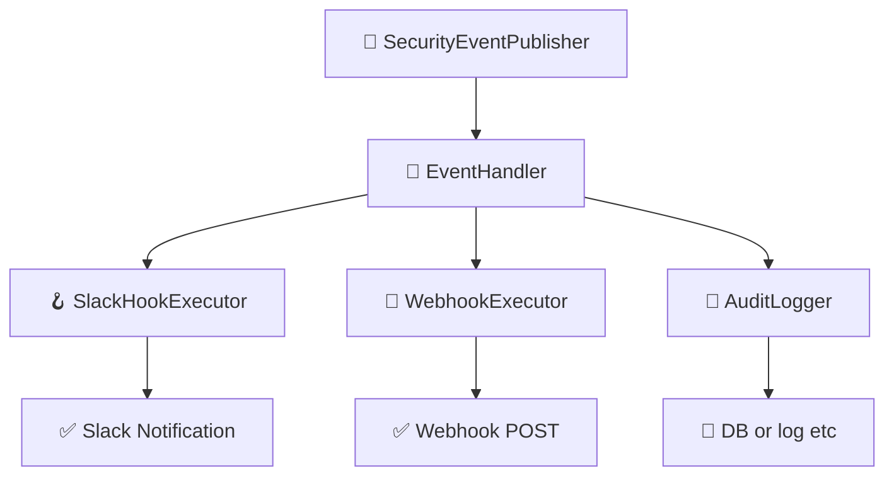

# イベント & フックシステム

このドキュメントでは、`idp-server` における **イベント駆動アーキテクチャ** と **フック実行システム**
について説明します。  
これは、モダンなアイデンティティワークフローにおける拡張性・可観測性・セキュリティ強化を目的としています。

---

## 🎯 目的

- 認証・認可に関するすべての主要なアクティビティに対して構造化されたイベントを発行する
- テナントごとに異なるフック（Slack, Webhook, 監査など）を実行可能にする
- 外部システム（SIEM、アラート、BI）との統合を容易にする
- フロー本体のロジックから副作用的処理を分離する

---

## 🔽 図：フック実行の全体像



---

## 🧩 コア概念

### 1. セキュリティイベント（Security Events）

- `oauth_authorize`, `mfa_failure`, `federation_callback_success` など、アイデンティティライフサイクル上の意味あるアクションを表現
- 含まれる情報：
    - `tenant_id`
    - `event_type`（列挙型）
    - `timestamp`
    - `user_id`（利用者情報があれば）
    - `requestAttributes`（IP, UserAgent, traceIdなど）
    - `eventPayload`（JSON形式の任意データ）

### 2. SecurityEventPublisher

- 各種フロー処理中にイベントを発行する中心クラス
- `OAuthFlowEntryService`, `TokenEntryService` などで直接使用

```java
eventPublisher.publish(
        tenant,
        authorizationRequest,
        user,
        DefaultSecurityEventType.oauth_authorize,
        requestAttributes);
```

---

## 🔌 フック実行パイプライン

### 1. SecurityEventHookConfiguration

- テナントごとの設定ファイルとしてJSON形式で保持される
- 例：Slackへの通知

```json
{
  "type": "SLACK",
  "triggers": [
    "user_signup"
  ],
  "enabled": true,
  "store_execution_payload": true,  // 🆕 実行結果ペイロード保存設定
  "details": {
    "base": {
      "description": "slack共通通知",
      "incoming_webhook_url": "https://hooks.slack.com/services/xxx",
      "message_template": "🔐 type: ${trigger} / user: ${user.id} / tenant: ${tenant.id} / clientAttributes: ${clientAttributes.id}"
    },
    "overlays": {
      "user_deletion": {
        "description": "ユーザー削除通知",
        "incoming_webhook_url": "https://hooks.slack.com/services/xxx",
        "message_template": "⚠ user_deletion: ${user.email}"
      }
    }
  }
}
```

### 2. SecurityEventHookExecutor

- 登録されたフックを **並列** または **フォールバックチェーン** で実行
- 成功・失敗の詳細を `HookExecutionResult` に記録

### 3. SecurityEventHookResult

- 各フック実行結果の構造：
    - `hookType`
    - `status`（`success`, `failure`）
    - `error`（あれば）
    - `payload`

---

## 🗂️ 永続化

### イベント

```sql
CREATE TABLE security_event
(
    id          UUID,
    type        VARCHAR(255) NOT NULL,
    description VARCHAR(255) NOT NULL,
    tenant_id   UUID         NOT NULL,
    tenant_name VARCHAR(255) NOT NULL,
    client_id   VARCHAR(255) NOT NULL,
    client_name VARCHAR(255) NOT NULL,
    user_id     UUID,
    user_name   VARCHAR(255),
    login_hint  VARCHAR(255),
    ip_address  INET,
    user_agent  TEXT,
    detail      JSONB        NOT NULL,
    created_at  TIMESTAMP DEFAULT CURRENT_TIMESTAMP,
    PRIMARY KEY (id)
);
```

### フック

```sql
CREATE TABLE security_event_hook_results
(
    id                                      UUID                    NOT NULL,
    tenant_id                               UUID                    NOT NULL,
    security_event_id                       UUID                    NOT NULL,
    security_event_type                     VARCHAR(255)            NOT NULL,
    security_event_hook                     VARCHAR(255)            NOT NULL,
    security_event_payload                  JSONB                   NOT NULL,
    security_event_hook_execution_payload   JSONB,                              -- 🆕 実行結果ペイロード
    status                                  VARCHAR(255)            NOT NULL,
    created_at                              TIMESTAMP DEFAULT now() NOT NULL,
    updated_at                              TIMESTAMP DEFAULT now() NOT NULL,
    PRIMARY KEY (id)
);
```

**新機能**: `security_event_hook_execution_payload` カラムにより、フック実行結果を保存可能となり、リトライ・デバッグ・監査を強化できます。

### 実行結果ペイロード保存の制御

各フック設定で `store_execution_payload` オプションを使用して、実行結果の保存を制御できます：

```json
{
  "type": "SLACK",
  "store_execution_payload": true,   // デフォルト: true
  "triggers": ["user_login_success"],
  "details": { ... }
}
```

**設定値**:
- `true`: 実行結果（レスポンス、エラー詳細等）をDBに保存
- `false`: 実行結果は保存せず、ステータスのみ記録

**用途**:
- **デバッグ**: 失敗したフックの詳細な原因調査
- **再送**: 失敗時のペイロードを使用した手動再送
- **監査**: 外部システムとの通信履歴の完全な記録
- **プライバシー**: 機密情報を含む場合の保存制御

---

## 📋 利用可能なセキュリティイベント一覧

以下は `idp-server` で発生する全セキュリティイベントの包括的な一覧です。これらのイベントをトリガーとしてセキュリティフックを設定できます。

### 👤 ユーザー認証関連

#### パスワード認証
- `password_success` - パスワード認証成功
- `password_failure` - パスワード認証失敗
- `password_reset` - パスワードリセット
- `password_change` - パスワード変更

#### メール認証
- `email_verification_request_success` - メール認証リクエスト成功
- `email_verification_request_failure` - メール認証リクエスト失敗
- `email_verification_success` - メール認証成功
- `email_verification_failure` - メール認証失敗

#### SMS認証
- `sms_verification_challenge_success` - SMS認証チャレンジ成功
- `sms_verification_challenge_failure` - SMS認証チャレンジ失敗
- `sms_verification_success` - SMS認証成功
- `sms_verification_failure` - SMS認証失敗

#### FIDO UAF認証
- `fido_uaf_registration_challenge_success` - FIDO UAF登録チャレンジ成功
- `fido_uaf_registration_challenge_failure` - FIDO UAF登録チャレンジ失敗
- `fido_uaf_registration_success` - FIDO UAF登録成功
- `fido_uaf_registration_failure` - FIDO UAF登録失敗
- `fido_uaf_authentication_challenge_success` - FIDO UAF認証チャレンジ成功
- `fido_uaf_authentication_challenge_failure` - FIDO UAF認証チャレンジ失敗
- `fido_uaf_authentication_success` - FIDO UAF認証成功
- `fido_uaf_authentication_failure` - FIDO UAF認証失敗
- `fido_uaf_deregistration_success` - FIDO UAF登録解除成功
- `fido_uaf_deregistration_failure` - FIDO UAF登録解除失敗
- `fido_uaf_cancel_success` - FIDO UAFキャンセル成功
- `fido_uaf_cancel_failure` - FIDO UAFキャンセル失敗

#### WebAuthn認証
- `webauthn_registration_challenge_success` - WebAuthn登録チャレンジ成功
- `webauthn_registration_challenge_failure` - WebAuthn登録チャレンジ失敗
- `webauthn_registration_success` - WebAuthn登録成功
- `webauthn_registration_failure` - WebAuthn登録失敗
- `webauthn_authentication_challenge_success` - WebAuthn認証チャレンジ成功
- `webauthn_authentication_challenge_failure` - WebAuthn認証チャレンジ失敗
- `webauthn_authentication_success` - WebAuthn認証成功
- `webauthn_authentication_failure` - WebAuthn認証失敗

#### 外部認証・連携
- `external_token_authentication_success` - 外部トークン認証成功
- `external_token_authentication_failure` - 外部トークン認証失敗
- `legacy_authentication_success` - レガシー認証成功
- `legacy_authentication_failure` - レガシー認証失敗
- `federation_request` - フェデレーションリクエスト
- `federation_success` - フェデレーション成功
- `federation_failure` - フェデレーション失敗

### 📱 認証デバイス管理

#### デバイス通知
- `authentication_device_notification_success` - デバイス通知成功
- `authentication_device_notification_cancel` - デバイス通知キャンセル
- `authentication_device_notification_failure` - デバイス通知失敗
- `authentication_device_notification_no_action_success` - デバイス通知無動作成功

#### デバイス操作
- `authentication_device_allow_success` - デバイス許可成功
- `authentication_device_allow_failure` - デバイス許可失敗
- `authentication_device_deny_success` - デバイス拒否成功
- `authentication_device_deny_failure` - デバイス拒否失敗
- `authentication_device_binding_message_success` - デバイスバインディング成功
- `authentication_device_binding_message_failure` - デバイスバインディング失敗

#### デバイス登録
- `authentication_device_registration_success` - デバイス登録成功
- `authentication_device_registration_failure` - デバイス登録失敗
- `authentication_device_deregistration_success` - デバイス登録解除成功
- `authentication_device_deregistration_failure` - デバイス登録解除失敗
- `authentication_device_registration_challenge_success` - デバイス登録チャレンジ成功

### 🔐 OAuth/OpenID Connect

#### 認可フロー
- `oauth_authorize` - OAuth認可成功
- `oauth_authorize_with_session` - セッション付きOAuth認可成功
- `oauth_deny` - OAuth認可拒否成功
- `authorize_failure` - 認可失敗

#### トークン管理
- `issue_token_success` - トークン発行成功
- `issue_token_failure` - トークン発行失敗
- `refresh_token_success` - トークンリフレッシュ成功
- `refresh_token_failure` - トークンリフレッシュ失敗
- `revoke_token_success` - トークン取り消し成功
- `revoke_token_failure` - トークン取り消し失敗

#### トークン検証
- `inspect_token_success` - トークン検証成功
- `inspect_token_failure` - トークン検証失敗
- `inspect_token_expired` - トークン期限切れ

#### ユーザー情報
- `userinfo_success` - ユーザー情報取得成功
- `userinfo_failure` - ユーザー情報取得失敗

### 🔒 CIBA (Client Initiated Backchannel Authentication)

- `backchannel_authentication_request_success` - バックチャネル認証リクエスト成功
- `backchannel_authentication_request_failure` - バックチャネル認証リクエスト失敗
- `backchannel_authentication_authorize` - バックチャネル認証許可
- `backchannel_authentication_deny` - バックチャネル認証拒否

### 👥 ユーザー管理

#### ユーザーライフサイクル
- `user_signup` - ユーザー登録
- `user_signup_failure` - ユーザー登録失敗
- `user_signup_conflict` - ユーザー登録競合
- `user_create` - ユーザー作成
- `user_get` - ユーザー情報取得
- `user_edit` - ユーザー編集
- `user_delete` - ユーザー削除
- `user_deletion` - ユーザー削除
- `user_lock` - ユーザーロック
- `user_disabled` - ユーザー無効化
- `user_enabled` - ユーザー有効化

#### セッション管理
- `login_success` - ログイン成功
- `logout` - ログアウト
- `authentication_cancel_success` - 認証キャンセル成功
- `authentication_cancel_failure` - 認証キャンセル失敗

### 🏢 組織・テナント管理

#### メンバー管理
- `member_invite` - メンバー招待
- `member_join` - メンバー参加
- `member_leave` - メンバー脱退

#### システム管理
- `server_create` - サーバー作成
- `server_get` - サーバー情報取得
- `server_edit` - サーバー編集
- `server_delete` - サーバー削除
- `application_create` - アプリケーション作成
- `application_get` - アプリケーション情報取得
- `application_edit` - アプリケーション編集
- `application_delete` - アプリケーション削除

### 📋 身元確認

- `identity_verification_application_apply` - 身元確認申請
- `identity_verification_application_failure` - 身元確認申請失敗
- `identity_verification_application_cancel` - 身元確認申請キャンセル
- `identity_verification_application_delete` - 身元確認申請削除
- `identity_verification_application_findList` - 身元確認申請一覧取得
- `identity_verification_application_approved` - 身元確認承認
- `identity_verification_application_rejected` - 身元確認拒否
- `identity_verification_application_cancelled` - 身元確認キャンセル
- `identity_verification_result_findList` - 身元確認結果一覧取得

### 💡 イベント設定例

```json
{
  "type": "SLACK",
  "triggers": [
    "password_failure",
    "fido_uaf_authentication_failure", 
    "oauth_deny",
    "user_signup",
    "login_success"
  ],
  "enabled": true,
  "store_execution_payload": true,
  "details": {
    "base": {
      "incoming_webhook_url": "https://hooks.slack.com/services/xxx",
      "message_template": "🚨 Event: ${trigger} | User: ${user.email} | IP: ${detail.ip_address}"
    }
  }
}
```

### 🔄 カスタムイベント拡張

アプリケーション固有のイベントを追加する場合：

1. `SecurityEventType` を継承
2. カスタムイベント作成者（EventCreator）を実装
3. 適切な場所でイベント発行（EventPublisher）

```java
// カスタムイベントタイプの例
public enum CustomSecurityEventType {
    custom_business_logic_success("Custom business logic executed successfully"),
    custom_integration_failure("External integration failed");
    
    // ... implementation
}
```

---

## 🧪 テスト容易性

- すべてのフックは `HookExecutor` インターフェース経由で定義
- WireMockなどのモックサーバーを使って外部連携のテスト可能
- リトライやフォールバック戦略は設定可能

---

## 🛣️ 今後の拡張予定

- リトライポリシー（指数バックオフ）
- Dead Letter Queueによる失敗フック保存
- Kafkaベースのイベントストリーム対応
- イベントタイプ別のフック振り分け機能

---
