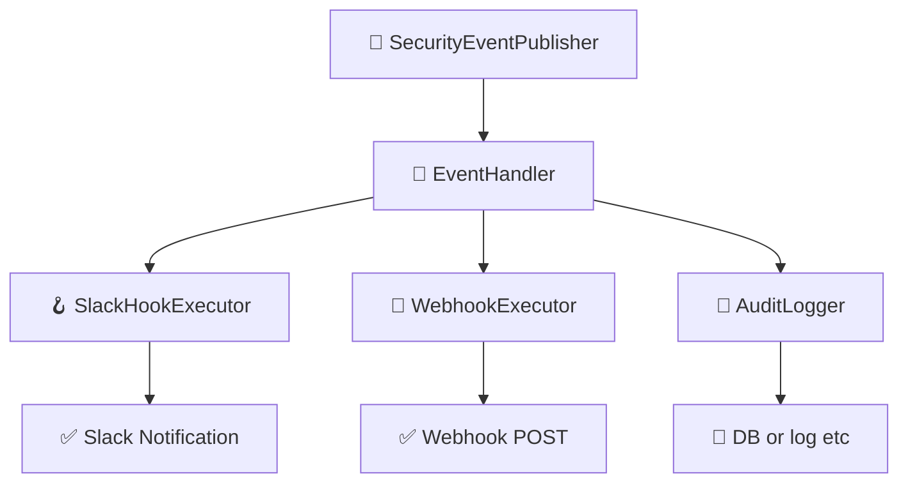

# イベント & フックシステム

このドキュメントでは、`idp-server` における **イベント駆動アーキテクチャ** と **フック実行システム**
について説明します。  
これは、モダンなアイデンティティワークフローにおける拡張性・可観測性・セキュリティ強化を目的としています。

---

## 🎯 目的

- 認証・認可に関するすべての主要なアクティビティに対して構造化されたイベントを発行する
- テナントごとに異なるフック（Slack, Webhook, 監査など）を実行可能にする
- 外部システム（SIEM、アラート、BI）との統合を容易にする
- フロー本体のロジックから副作用的処理を分離する

---

## 🔽 図：フック実行の全体像



---

## 🧩 コア概念

### 1. セキュリティイベント（Security Events）

- `oauth_authorize`, `mfa_failure`, `federation_callback_success` など、アイデンティティライフサイクル上の意味あるアクションを表現
- 含まれる情報：
    - `tenant_id`
    - `event_type`（列挙型）
    - `timestamp`
    - `user_id`（利用者情報があれば）
    - `requestAttributes`（IP, UserAgent, traceIdなど）
    - `eventPayload`（JSON形式の任意データ）

### 2. SecurityEventPublisher

- 各種フロー処理中にイベントを発行する中心クラス
- `OAuthFlowEntryService`, `TokenEntryService` などで直接使用

```java
eventPublisher.publish(
        tenant,
        authorizationRequest,
        user,
        DefaultSecurityEventType.oauth_authorize,
        requestAttributes);
```

---

## 🔌 フック実行パイプライン

### 1. SecurityEventHookConfiguration

- テナントごとの設定ファイルとしてJSON形式で保持される
- 例：Slackへの通知

```json
{
  "type": "SLACK",
  "triggers": [
    "user_signup"
  ],
  "details": {
    "base": {
      "description": "slack共通通知",
      "incoming_webhook_url": "https://hooks.slack.com/services/xxx",
      "message_template": "🔐 type: ${trigger} / user: ${user.id} / tenant: ${tenant.id} / clientAttributes: ${clientAttributes.id}"
    },
    "overlays": {
      "user_deletion": {
        "description": "ユーザー削除通知",
        "incoming_webhook_url": "https://hooks.slack.com/services/xxx",
        "message_template": "⚠ user_deletion: ${user.email}"
      }
    }
  }
}
```

### 2. SecurityEventHookExecutor

- 登録されたフックを **並列** または **フォールバックチェーン** で実行
- 成功・失敗の詳細を `HookExecutionResult` に記録

### 3. SecurityEventHookResult

- 各フック実行結果の構造：
    - `hookType`
    - `status`（`success`, `failure`）
    - `error`（あれば）
    - `payload`

---

## 🗂️ 永続化

### イベント

```sql
CREATE TABLE security_event
(
    id          UUID,
    type        VARCHAR(255) NOT NULL,
    description VARCHAR(255) NOT NULL,
    tenant_id   UUID         NOT NULL,
    tenant_name VARCHAR(255) NOT NULL,
    client_id   VARCHAR(255) NOT NULL,
    client_name VARCHAR(255) NOT NULL,
    user_id     UUID,
    user_name   VARCHAR(255),
    login_hint  VARCHAR(255),
    ip_address  INET,
    user_agent  TEXT,
    detail      JSONB        NOT NULL,
    created_at  TIMESTAMP DEFAULT CURRENT_TIMESTAMP,
    PRIMARY KEY (id)
);
```

### フック

```sql
CREATE TABLE security_event_hook_results
(
    id                     UUID                    NOT NULL,
    tenant_id              UUID                    NOT NULL,
    security_event_id      UUID                    NOT NULL,
    security_event_type    VARCHAR(255)            NOT NULL,
    security_event_hook    VARCHAR(255)            NOT NULL,
    security_event_payload JSONB                   NOT NULL,
    status                 VARCHAR(255)            NOT NULL,
    created_at             TIMESTAMP DEFAULT now() NOT NULL,
    updated_at             TIMESTAMP DEFAULT now() NOT NULL,
    PRIMARY KEY (id)
);
```

---

## 📋 Available Security Event Types

Below is a comprehensive list of all security events available in `idp-server`. These events can be used as triggers for security event hooks.

### 👤 User Authentication

#### Password Authentication  
- `password_success` - Password authentication successful
- `password_failure` - Password authentication failed
- `password_reset` - Password reset
- `password_change` - Password changed

#### Email Authentication
- `email_verification_request_success` - Email verification request successful
- `email_verification_request_failure` - Email verification request failed
- `email_verification_success` - Email verification successful
- `email_verification_failure` - Email verification failed

#### SMS Authentication
- `sms_verification_challenge_success` - SMS verification challenge successful
- `sms_verification_challenge_failure` - SMS verification challenge failed
- `sms_verification_success` - SMS verification successful
- `sms_verification_failure` - SMS verification failed

#### FIDO UAF Authentication
- `fido_uaf_registration_challenge_success` - FIDO UAF registration challenge successful
- `fido_uaf_registration_challenge_failure` - FIDO UAF registration challenge failed
- `fido_uaf_registration_success` - FIDO UAF registration successful
- `fido_uaf_registration_failure` - FIDO UAF registration failed
- `fido_uaf_authentication_challenge_success` - FIDO UAF authentication challenge successful
- `fido_uaf_authentication_challenge_failure` - FIDO UAF authentication challenge failed
- `fido_uaf_authentication_success` - FIDO UAF authentication successful
- `fido_uaf_authentication_failure` - FIDO UAF authentication failed
- `fido_uaf_deregistration_success` - FIDO UAF deregistration successful
- `fido_uaf_deregistration_failure` - FIDO UAF deregistration failed
- `fido_uaf_cancel_success` - FIDO UAF cancellation successful
- `fido_uaf_cancel_failure` - FIDO UAF cancellation failed

#### WebAuthn Authentication
- `webauthn_registration_challenge_success` - WebAuthn registration challenge successful
- `webauthn_registration_challenge_failure` - WebAuthn registration challenge failed
- `webauthn_registration_success` - WebAuthn registration successful
- `webauthn_registration_failure` - WebAuthn registration failed
- `webauthn_authentication_challenge_success` - WebAuthn authentication challenge successful
- `webauthn_authentication_challenge_failure` - WebAuthn authentication challenge failed
- `webauthn_authentication_success` - WebAuthn authentication successful
- `webauthn_authentication_failure` - WebAuthn authentication failed

#### External Authentication & Federation
- `external_token_authentication_success` - External token authentication successful
- `external_token_authentication_failure` - External token authentication failed
- `legacy_authentication_success` - Legacy authentication successful
- `legacy_authentication_failure` - Legacy authentication failed
- `federation_request` - Federation request
- `federation_success` - Federation successful
- `federation_failure` - Federation failed

### 📱 Authentication Device Management

#### Device Notifications
- `authentication_device_notification_success` - Device notification successful
- `authentication_device_notification_cancel` - Device notification canceled
- `authentication_device_notification_failure` - Device notification failed
- `authentication_device_notification_no_action_success` - Device notification no action successful

#### Device Operations
- `authentication_device_allow_success` - Device allow successful
- `authentication_device_allow_failure` - Device allow failed
- `authentication_device_deny_success` - Device deny successful
- `authentication_device_deny_failure` - Device deny failed
- `authentication_device_binding_message_success` - Device binding successful
- `authentication_device_binding_message_failure` - Device binding failed

#### Device Registration
- `authentication_device_registration_success` - Device registration successful
- `authentication_device_registration_failure` - Device registration failed
- `authentication_device_deregistration_success` - Device deregistration successful
- `authentication_device_deregistration_failure` - Device deregistration failed
- `authentication_device_registration_challenge_success` - Device registration challenge successful

### 🔐 OAuth/OpenID Connect

#### Authorization Flow
- `oauth_authorize` - OAuth authorization successful
- `oauth_authorize_with_session` - OAuth authorization with session successful
- `oauth_deny` - OAuth authorization denied
- `authorize_failure` - Authorization failed

#### Token Management
- `issue_token_success` - Token issuance successful
- `issue_token_failure` - Token issuance failed
- `refresh_token_success` - Token refresh successful
- `refresh_token_failure` - Token refresh failed
- `revoke_token_success` - Token revocation successful
- `revoke_token_failure` - Token revocation failed

#### Token Introspection
- `inspect_token_success` - Token inspection successful
- `inspect_token_failure` - Token inspection failed
- `inspect_token_expired` - Token expired

#### User Information
- `userinfo_success` - User info retrieval successful
- `userinfo_failure` - User info retrieval failed

### 🔒 CIBA (Client Initiated Backchannel Authentication)

- `backchannel_authentication_request_success` - Backchannel authentication request successful
- `backchannel_authentication_request_failure` - Backchannel authentication request failed
- `backchannel_authentication_authorize` - Backchannel authentication authorized
- `backchannel_authentication_deny` - Backchannel authentication denied

### 👥 User Management

#### User Lifecycle
- `user_signup` - User signup
- `user_signup_failure` - User signup failed
- `user_signup_conflict` - User signup conflict
- `user_create` - User created
- `user_get` - User information retrieved
- `user_edit` - User edited
- `user_delete` - User deleted
- `user_deletion` - User deletion
- `user_lock` - User locked
- `user_disabled` - User disabled
- `user_enabled` - User enabled

#### Session Management
- `login_success` - Login successful
- `logout` - User logged out
- `authentication_cancel_success` - Authentication cancellation successful
- `authentication_cancel_failure` - Authentication cancellation failed

### 🏢 Organization & Tenant Management

#### Member Management
- `member_invite` - Member invited
- `member_join` - Member joined
- `member_leave` - Member left

#### System Management
- `server_create` - Server created
- `server_get` - Server information retrieved
- `server_edit` - Server edited
- `server_delete` - Server deleted
- `application_create` - Application created
- `application_get` - Application information retrieved
- `application_edit` - Application edited
- `application_delete` - Application deleted

### 📋 Identity Verification

- `identity_verification_application_apply` - Identity verification application applied
- `identity_verification_application_failure` - Identity verification application failed
- `identity_verification_application_cancel` - Identity verification application canceled
- `identity_verification_application_delete` - Identity verification application deleted
- `identity_verification_application_findList` - Identity verification application list retrieved
- `identity_verification_application_approved` - Identity verification application approved
- `identity_verification_application_rejected` - Identity verification application rejected
- `identity_verification_application_cancelled` - Identity verification application cancelled
- `identity_verification_result_findList` - Identity verification result list retrieved

### 💡 Event Configuration Example

```json
{
  "type": "SLACK",
  "triggers": [
    "password_failure",
    "fido_uaf_authentication_failure", 
    "oauth_deny",
    "user_signup",
    "login_success"
  ],
  "enabled": true,
  "store_execution_payload": true,
  "details": {
    "base": {
      "incoming_webhook_url": "https://hooks.slack.com/services/xxx",
      "message_template": "🚨 Event: ${trigger} | User: ${user.email} | IP: ${detail.ip_address}"
    }
  }
}
```

### 🔄 Custom Event Extension

To add application-specific events:

1. Extend `SecurityEventType`
2. Implement custom event creator (EventCreator)
3. Publish events at appropriate points (EventPublisher)

```java
// Custom event type example
public enum CustomSecurityEventType {
    custom_business_logic_success("Custom business logic executed successfully"),
    custom_integration_failure("External integration failed");
    
    // ... implementation
}
```

---

## 🧪 Testability

- All hooks are defined through `HookExecutor` interfaces
- External integrations can be tested using tools like WireMock
- Retry and fallback strategies are configurable

---

## 🛣️ 今後の拡張予定

- リトライポリシー（指数バックオフ）
- Dead Letter Queueによる失敗フック保存
- Kafkaベースのイベントストリーム対応
- イベントタイプ別のフック振り分け機能

---
