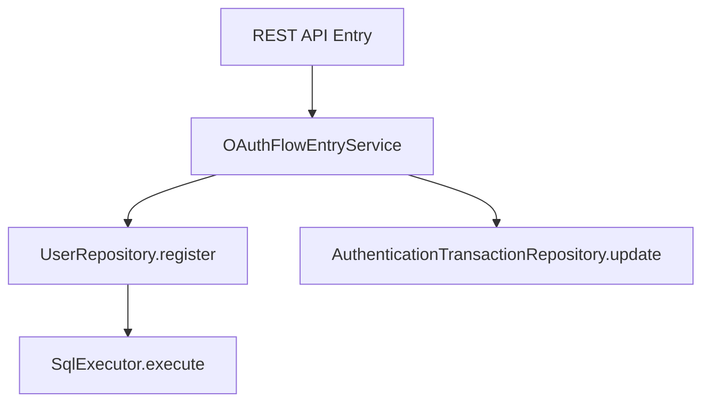

# トランザクション管理

## 1. 概要

`idp-server` は、**フレームワーク非依存のトランザクション管理レイヤー**を実装しており、Spring Boot、Quarkus、Jakarta EE
など異なるアプリケーションスタック間での移植性をサポートします。これにより、特定の DI や Web
フレームワークに密結合せずにトランザクションの伝播や境界制御が可能となります。

---

## 2. カスタムトランザクションアノテーション

```java

@Transaction
public class OAuthFlowEntryService implements OAuthFlowApi {
    // transactional service logic
}
```

- `@Transaction` アノテーションは、クラスまたはメソッドをトランザクション対象としてマークします。
- **宣言的なトランザクション境界の制御**を実現します。

---

## 3. トランザクションの伝播

現在の `@Transaction` システムでは、以下の伝播動作をサポートしています：

| 伝播タイプ        | サポート状況 | 説明                                  |
|--------------|--------|-------------------------------------|
| REQUIRED     | ✅ 対応済み | トランザクションが存在しない場合に新規作成。既に存在する場合はエラー。 |
| REQUIRES_NEW | ❌ 非対応  | ネストや中断されたトランザクションは未対応。              |
| SUPPORTS     | ❌ 非対応  | 明示的なトランザクションコンテキストが必要。              |

> 備考：このトランザクションシステムはフレームワーク非依存であり、ThreadLocal
> によってトランザクション状態を管理します。マルチレベル伝播やネストトランザクションは現時点では未対応です。

---

## 4. サンプルフロー



すべてのDB呼び出しは、サービスレベルで定義された1つのトランザクションスコープ内で処理されます。

---

## 5. エラーハンドリングとロールバック

例外（ランタイム例外またはラップされたチェック例外）が発生した場合、トランザクションは自動的にロールバックされます。

- 中央集権的な例外ハンドラーとの統合を推奨
- カスタムロールバックルールはアダプターごとに設定可能

---

## 6. 実装クラス

- `@Transaction` アノテーション：`org.idp.server.platform.datasource` に存在
- アダプターエントリポイント：例 `TenantAwareEntryServiceProxy`
- リポジトリインターフェース：コマンド／クエリ分離設計（`register()`, `update()` など）

---

このモジュール化されたトランザクションアーキテクチャは、すべての ID／認可フローにおいて移植性、拡張性、安全なデータ一貫性を保証します。

---

## 7. Row-Level Security（RLS）との統合

`idp-server` では、PostgreSQL の **Row-Level Security（RLS）** を独自トランザクション管理レイヤーと組み合わせることで、テナントベースのデータ分離を厳密に実現します。

### 🔐 主な概念

* 全マルチテナントテーブルに対して以下のような RLS ポリシーを定義：

```sql
CREATE
POLICY rls_<table_name>
  ON <table_name>
  USING (tenant_id = current_setting('app.tenant_id')::uuid);
```

* 強制適用には以下を使用：

```sql
ALTER TABLE < table_name > FORCE ROW LEVEL SECURITY;
```

### 🔧 RLS コンテキストの伝播

`TransactionManager` は各 DB コネクションに適切なテナントコンテキストを適用します：

```java
private static void setTenantId(Connection conn, TenantIdentifier tenantIdentifier) {
    log.debug("[RLS] SET app.tenant_id: tenant={}", tenantIdentifier.value());

    // Use set_config() function with PreparedStatement to prevent SQL Injection
    // See: https://www.postgresql.org/docs/current/functions-admin.html#FUNCTIONS-ADMIN-SET
    try (var stmt = conn.prepareStatement("SELECT set_config('app.tenant_id', ?, true)")) {
        stmt.setString(1, tenantIdentifier.value());
        stmt.execute();
    } catch (SQLException e) {
        throw new SqlRuntimeException("Failed to set tenant_id", e);
    }
}
```

* この `app.tenant_id` は RLS ポリシーで使用されるセッションレベル変数です。
* **SQL 実行前に必ず設定**されている必要があります。
* テナント ID は `TenantIdentifier` として明示的に渡されます。

---

### 💡 運用ベストプラクス

* リクエスト初期に解決が必要な場合は、`tenant` テーブルへの RLS 適用は避けることを推奨
* Flyway マイグレーション後には以下のような権限設定を実行：

```sql
GRANT
SELECT,
INSERT
,
UPDATE,
DELETE
ON ALL TABLES IN SCHEMA public TO idp_app_user;
```

* 将来的なテーブル・シーケンスにも適用されるようにデフォルト権限を変更：

```sql
ALTER
DEFAULT PRIVILEGES FOR ROLE postgres
  IN SCHEMA public
  GRANT
SELECT,
INSERT
,
UPDATE,
DELETE
ON TABLES TO idp_app_user;

ALTER
DEFAULT PRIVILEGES FOR ROLE postgres
  IN SCHEMA public
  GRANT USAGE,
SELECT
ON SEQUENCES TO idp_app_user;
```

---

### 🔍 デバッグヒント

* RLS ポリシー一覧表示：

```sql
SELECT *
FROM pg_policies
WHERE schemaname = 'public';
```

* テーブルに対するユーザー権限の確認：

```sql
SELECT *
FROM information_schema.role_table_grants
WHERE grantee = 'idp_app_user'
  AND table_schema = 'public';
```

---

この設計により、**あらゆる実行環境においてもマルチテナント安全性をデータベースレベルで実現**できます。
