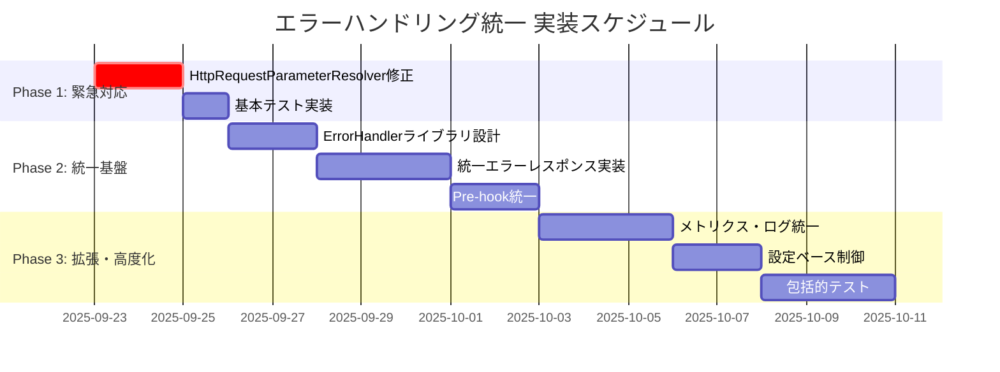

# エラーハンドリング統一 実装ロードマップ

Identity Verification システムのエラーハンドリング統一を段階的に実装するためのロードマップです。

## 実装フェーズ概要



## Phase 1: 緊急対応 🔥

**期間**: 2-3日
**目標**: 現在のTODOコメント解消と即座の安定性向上

### 1.1 HttpRequestParameterResolver修正

**優先度**: 🔥 最高

**タスク**:
```java
// Before: TODOコメントのまま
// TODO handle error
public Map<String, Object> resolve(...) {
  HttpRequestResult result = httpRequestExecutor.execute(configuration, baseParams);
  // ...
}

// After: 適切なエラーハンドリング
public Map<String, Object> resolve(...) {
  try {
    HttpRequestResult result = httpRequestExecutor.execute(configuration, baseParams);
    return createSuccessResponse(result);
  } catch (HttpRequestException e) {
    log.warn("HTTP request failed in pre_hook: {}", e.getMessage());
    return createErrorFallback("EXTERNAL_SERVICE_ERROR", e.getMessage());
  } catch (Exception e) {
    log.error("Unexpected error in pre_hook", e);
    return createErrorFallback("INTERNAL_ERROR", "Internal processing error");
  }
}
```

**成果物**:
- [ ] HttpRequestParameterResolver.java修正
- [ ] 基本的なフォールバック実装
- [ ] 単体テスト追加

### 1.2 他のAdditionalParameterResolver確認

**タスク**:
- [ ] ContinuousCustomerDueDiligenceParameterResolver
- [ ] SsoCredentialsParameterResolver

### 1.3 基本テスト実装

**タスク**:
- [ ] ネットワークエラーシミュレーション
- [ ] タイムアウトテスト
- [ ] フォールバック動作確認

## Phase 2: 統一基盤構築 🏗️

**期間**: 1-2週間
**目標**: 統一されたエラーハンドリングライブラリとパターン確立

### 2.1 統一エラーハンドラーライブラリ設計

**ファイル構成**:
```
org.idp.server.platform.error/
├── IdentityVerificationErrorHandler.java
├── ErrorHandlingResult.java
├── IdentityVerificationErrorType.java
├── ErrorDetails.java
└── phase/
    ├── PreHookErrorHandler.java
    ├── ExecutionErrorHandler.java
    └── PostHookErrorHandler.java
```

**核となるクラス**:
```java
public class IdentityVerificationErrorHandler {
  public static <T> ErrorHandlingResult<T> handlePhaseError(
      String phase, String component,
      Supplier<T> operation, T fallback) {
    // 統一エラーハンドリングロジック
  }
}

public class ErrorHandlingResult<T> {
  private final boolean success;
  private final T value;
  private final ErrorDetails errorDetails;
  private final T fallback;
}
```

### 2.2 統一エラーレスポンス実装

**共通レスポンス形式**:
```java
public class IdentityVerificationErrorResponse {
  private boolean error;
  private String errorType;
  private String errorDescription;
  private Map<String, Object> errorDetails;
  private Map<String, Object> fallbackData;
}
```

### 2.3 既存実装の統一形式への移行

**移行対象**:
- [ ] HttpRequestParameterResolver → 新フォーマット
- [ ] 他のParameterResolver → 新フォーマット
- [ ] Execution phase → 既存実装活用

## Phase 3: 拡張・高度化 🚀

**期間**: 2-3週間
**目標**: 運用レベルの品質確保と高度な機能追加

### 3.1 メトリクス・ログ統一

**メトリクス実装**:
```java
@Component
public class IdentityVerificationMetrics {
  private final Counter errorCounter;
  private final Timer operationTimer;

  public void recordError(String phase, String component, String errorType) {
    errorCounter.increment(
        Tag.of("phase", phase),
        Tag.of("component", component),
        Tag.of("error_type", errorType)
    );
  }
}
```

**構造化ログ**:
```java
public class StructuredErrorLogger {
  public void logError(String phase, String component,
                       IdentityVerificationErrorType errorType,
                       Exception exception, String correlationId) {
    Map<String, Object> logData = Map.of(
        "phase", phase,
        "component", component,
        "error_type", errorType.name(),
        "correlation_id", correlationId,
        "retryable", isRetryable(errorType)
    );

    if (isRetryable(errorType)) {
      log.warn("Retryable error occurred", logData, exception);
    } else {
      log.error("Non-retryable error occurred", logData, exception);
    }
  }
}
```

### 3.2 設定ベースエラー制御

**設定ファイル例**:
```yaml
identity:
  verification:
    error-handling:
      pre-hook:
        strategy: RESILIENT
        retry-count: 3
        fallback-enabled: true
        timeout-seconds: 30
      execution:
        strategy: FAIL_WITH_DETAILS
        security-sanitize: true
        detailed-logging: true
      post-hook:
        strategy: BEST_EFFORT
        log-level: WARN
```

### 3.3 包括的テスト実装

**テストカテゴリ**:

#### 3.3.1 単体テスト
- [ ] エラーハンドラーの各メソッド
- [ ] フォールバック動作
- [ ] エラー分類ロジック

#### 3.3.2 統合テスト
- [ ] フェーズ間エラー伝播
- [ ] 外部サービス障害シミュレーション
- [ ] リトライ動作確認

#### 3.3.3 E2Eテスト
- [ ] 全フェーズエラーシナリオ
- [ ] パフォーマンス影響確認
- [ ] ログ・メトリクス確認

## マイルストーン

### Milestone 1: 緊急対応完了 ✅ (Day 3)
- HttpRequestParameterResolverのエラーハンドリング完了
- 基本的なフォールバック動作確認
- 緊急性の高い問題解決

### Milestone 2: 統一基盤完了 🏗️ (Week 2)
- 統一エラーハンドラーライブラリ完成
- Pre-hookフェーズの完全統一
- 統一レスポンス形式確立

### Milestone 3: 本格運用準備完了 🚀 (Week 4)
- 全フェーズエラーハンドリング統一
- メトリクス・ログ統一
- 包括的テスト完了

## リスク管理

### 高リスク要素
1. **既存動作への影響**: 統一化により既存動作が変わる可能性
2. **パフォーマンス影響**: エラーハンドリング追加による性能劣化
3. **設定複雑化**: 設定ベース制御による複雑性増加

### リスク軽減策
1. **段階的移行**: 一度に全て変更せず、段階的に実装
2. **後方互換性維持**: 既存APIの動作は原則維持
3. **包括的テスト**: 各段階で十分なテスト実施
4. **カナリーリリース**: 限定環境での先行検証

## 成功指標

### 定量指標
- [ ] エラーハンドリング未実装箇所: 0件
- [ ] 統一エラーレスポンス採用率: 100%
- [ ] エラー関連の本番障害: 0件/月

### 定性指標
- [ ] 開発者のエラーハンドリング実装効率向上
- [ ] 運用チームのトラブルシューティング効率向上
- [ ] エンドユーザーの体験向上（適切なエラーメッセージ）

## 次のアクション

### 即座実行 (今日-明日)
1. **Phase 1開始**: HttpRequestParameterResolverの修正着手
2. **ブランチ作成**: `feature/error-handling-unification`
3. **基本実装**: エラーハンドリングとフォールバック

### 短期 (今週中)
1. **Phase 1完了**: 緊急対応完了とテスト
2. **Phase 2設計**: 統一基盤の詳細設計
3. **チームレビュー**: 戦略とアプローチの合意形成

この段階的アプローチにより、リスクを最小化しながらシステム全体のエラーハンドリング品質を向上させることができます。