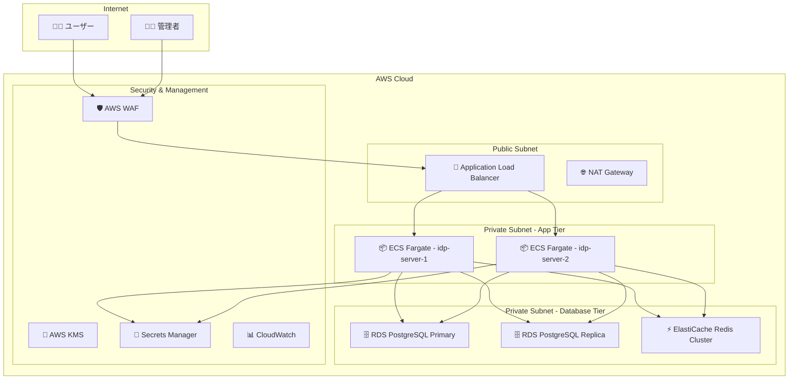

# AWS インフラストラクチャ構築

idp-server の AWS 本番環境構築手順について説明します。高可用性、セキュリティ、スケーラビリティを考慮したエンタープライズグレードの構成を提供します。

---

## 🏗️ アーキテクチャ概要

### 全体構成図



### 推奨 AWS サービス構成

| レイヤー | サービス | 目的 |
|----------|----------|------|
| **Load Balancer** | Application Load Balancer | L7 負荷分散・SSL 終端 |
| **Compute** | ECS Fargate | コンテナ実行・自動スケーリング |
| **Database** | RDS PostgreSQL Multi-AZ | 高可用性データベース |
| **Cache** | ElastiCache Redis | セッション・キャッシュ管理 |
| **Security** | WAF, KMS, Secrets Manager | セキュリティ・機密情報管理 |
| **Monitoring** | CloudWatch, X-Ray | 監視・トレーシング |
| **Network** | VPC, Security Groups | ネットワーク分離・制御 |

---

## 🌐 VPC・ネットワーク構築

### VPC 作成

```bash
# VPC 作成
aws ec2 create-vpc \
  --cidr-block 10.0.0.0/16 \
  --tag-specifications 'ResourceType=vpc,Tags=[{Key=Name,Value=idp-server-vpc},{Key=Environment,Value=production}]'

# VPC ID を取得
VPC_ID=$(aws ec2 describe-vpcs \
  --filters "Name=tag:Name,Values=idp-server-vpc" \
  --query 'Vpcs[0].VpcId' --output text)
```

### サブネット構成

#### Public Subnet (ALB・NAT Gateway用)
```bash
# Public Subnet AZ-1a
aws ec2 create-subnet \
  --vpc-id $VPC_ID \
  --cidr-block 10.0.1.0/24 \
  --availability-zone ap-northeast-1a \
  --tag-specifications 'ResourceType=subnet,Tags=[{Key=Name,Value=idp-server-public-1a},{Key=Type,Value=public}]'

# Public Subnet AZ-1c
aws ec2 create-subnet \
  --vpc-id $VPC_ID \
  --cidr-block 10.0.2.0/24 \
  --availability-zone ap-northeast-1c \
  --tag-specifications 'ResourceType=subnet,Tags=[{Key=Name,Value=idp-server-public-1c},{Key=Type,Value=public}]'
```

#### Private Subnet (アプリケーション用)
```bash
# Private Subnet AZ-1a (App)
aws ec2 create-subnet \
  --vpc-id $VPC_ID \
  --cidr-block 10.0.10.0/24 \
  --availability-zone ap-northeast-1a \
  --tag-specifications 'ResourceType=subnet,Tags=[{Key=Name,Value=idp-server-private-app-1a},{Key=Type,Value=private-app}]'

# Private Subnet AZ-1c (App)
aws ec2 create-subnet \
  --vpc-id $VPC_ID \
  --cidr-block 10.0.11.0/24 \
  --availability-zone ap-northeast-1c \
  --tag-specifications 'ResourceType=subnet,Tags=[{Key=Name,Value=idp-server-private-app-1c},{Key=Type,Value=private-app}]'
```

#### Private Subnet (データベース用)
```bash
# Private Subnet AZ-1a (DB)
aws ec2 create-subnet \
  --vpc-id $VPC_ID \
  --cidr-block 10.0.20.0/24 \
  --availability-zone ap-northeast-1a \
  --tag-specifications 'ResourceType=subnet,Tags=[{Key=Name,Value=idp-server-private-db-1a},{Key=Type,Value=private-db}]'

# Private Subnet AZ-1c (DB)
aws ec2 create-subnet \
  --vpc-id $VPC_ID \
  --cidr-block 10.0.21.0/24 \
  --availability-zone ap-northeast-1c \
  --tag-specifications 'ResourceType=subnet,Tags=[{Key=Name,Value=idp-server-private-db-1c},{Key=Type,Value=private-db}]'
```

### Internet Gateway・NAT Gateway

```bash
# Internet Gateway 作成・アタッチ
aws ec2 create-internet-gateway \
  --tag-specifications 'ResourceType=internet-gateway,Tags=[{Key=Name,Value=idp-server-igw}]'

IGW_ID=$(aws ec2 describe-internet-gateways \
  --filters "Name=tag:Name,Values=idp-server-igw" \
  --query 'InternetGateways[0].InternetGatewayId' --output text)

aws ec2 attach-internet-gateway \
  --vpc-id $VPC_ID \
  --internet-gateway-id $IGW_ID

# NAT Gateway 作成 (各AZに配置)
# Elastic IP 割り当て
aws ec2 allocate-address --domain vpc \
  --tag-specifications 'ResourceType=elastic-ip,Tags=[{Key=Name,Value=idp-server-nat-eip-1a}]'

EIP_1A=$(aws ec2 describe-addresses \
  --filters "Name=tag:Name,Values=idp-server-nat-eip-1a" \
  --query 'Addresses[0].AllocationId' --output text)

# NAT Gateway 作成
aws ec2 create-nat-gateway \
  --subnet-id $PUBLIC_SUBNET_1A_ID \
  --allocation-id $EIP_1A \
  --tag-specifications 'ResourceType=nat-gateway,Tags=[{Key=Name,Value=idp-server-nat-1a}]'
```

---

## 🔐 セキュリティグループ設定

### ALB セキュリティグループ

```bash
# ALB セキュリティグループ作成
aws ec2 create-security-group \
  --group-name idp-server-alb-sg \
  --description "Security group for idp-server ALB" \
  --vpc-id $VPC_ID \
  --tag-specifications 'ResourceType=security-group,Tags=[{Key=Name,Value=idp-server-alb-sg}]'

ALB_SG_ID=$(aws ec2 describe-security-groups \
  --filters "Name=group-name,Values=idp-server-alb-sg" \
  --query 'SecurityGroups[0].GroupId' --output text)

# HTTPS (443) アクセス許可
aws ec2 authorize-security-group-ingress \
  --group-id $ALB_SG_ID \
  --protocol tcp \
  --port 443 \
  --cidr 0.0.0.0/0

# HTTP (80) リダイレクト用
aws ec2 authorize-security-group-ingress \
  --group-id $ALB_SG_ID \
  --protocol tcp \
  --port 80 \
  --cidr 0.0.0.0/0
```

### ECS セキュリティグループ

```bash
# ECS セキュリティグループ作成
aws ec2 create-security-group \
  --group-name idp-server-ecs-sg \
  --description "Security group for idp-server ECS tasks" \
  --vpc-id $VPC_ID \
  --tag-specifications 'ResourceType=security-group,Tags=[{Key=Name,Value=idp-server-ecs-sg}]'

ECS_SG_ID=$(aws ec2 describe-security-groups \
  --filters "Name=group-name,Values=idp-server-ecs-sg" \
  --query 'SecurityGroups[0].GroupId' --output text)

# ALB からのアクセス許可 (8080)
aws ec2 authorize-security-group-ingress \
  --group-id $ECS_SG_ID \
  --protocol tcp \
  --port 8080 \
  --source-group $ALB_SG_ID

# アウトバウンド HTTPS (外部API用)
aws ec2 authorize-security-group-egress \
  --group-id $ECS_SG_ID \
  --protocol tcp \
  --port 443 \
  --cidr 0.0.0.0/0
```

### データベース セキュリティグループ

```bash
# RDS セキュリティグループ作成
aws ec2 create-security-group \
  --group-name idp-server-rds-sg \
  --description "Security group for idp-server RDS" \
  --vpc-id $VPC_ID \
  --tag-specifications 'ResourceType=security-group,Tags=[{Key=Name,Value=idp-server-rds-sg}]'

RDS_SG_ID=$(aws ec2 describe-security-groups \
  --filters "Name=group-name,Values=idp-server-rds-sg" \
  --query 'SecurityGroups[0].GroupId' --output text)

# ECS からの PostgreSQL アクセス許可
aws ec2 authorize-security-group-ingress \
  --group-id $RDS_SG_ID \
  --protocol tcp \
  --port 5432 \
  --source-group $ECS_SG_ID

# Redis セキュリティグループ作成
aws ec2 create-security-group \
  --group-name idp-server-redis-sg \
  --description "Security group for idp-server Redis" \
  --vpc-id $VPC_ID \
  --tag-specifications 'ResourceType=security-group,Tags=[{Key=Name,Value=idp-server-redis-sg}]'

REDIS_SG_ID=$(aws ec2 describe-security-groups \
  --filters "Name=group-name,Values=idp-server-redis-sg" \
  --query 'SecurityGroups[0].GroupId' --output text)

# ECS からの Redis アクセス許可
aws ec2 authorize-security-group-ingress \
  --group-id $REDIS_SG_ID \
  --protocol tcp \
  --port 6379 \
  --source-group $ECS_SG_ID
```

---

## 🗄️ RDS PostgreSQL 構築

### DB サブネットグループ作成

```bash
# DB サブネットグループ作成
aws rds create-db-subnet-group \
  --db-subnet-group-name idp-server-db-subnet-group \
  --db-subnet-group-description "Subnet group for idp-server RDS" \
  --subnet-ids $PRIVATE_DB_SUBNET_1A_ID $PRIVATE_DB_SUBNET_1C_ID \
  --tags Key=Name,Value=idp-server-db-subnet-group
```

### RDS インスタンス作成

```bash
# パラメータグループ作成 (PostgreSQL 15 最適化)
aws rds create-db-parameter-group \
  --db-parameter-group-name idp-server-pg15-params \
  --db-parameter-group-family postgres15 \
  --description "Custom parameter group for idp-server PostgreSQL 15" \
  --tags Key=Name,Value=idp-server-pg15-params

# PostgreSQL パフォーマンス最適化パラメータ設定
aws rds modify-db-parameter-group \
  --db-parameter-group-name idp-server-pg15-params \
  --parameters \
    "ParameterName=shared_preload_libraries,ParameterValue=pg_stat_statements,ApplyMethod=pending-reboot" \
    "ParameterName=max_connections,ParameterValue=200,ApplyMethod=immediate" \
    "ParameterName=shared_buffers,ParameterValue={DBInstanceClassMemory/4},ApplyMethod=pending-reboot" \
    "ParameterName=effective_cache_size,ParameterValue={DBInstanceClassMemory*3/4},ApplyMethod=immediate"

# RDS インスタンス作成 (Multi-AZ)
aws rds create-db-instance \
  --db-instance-identifier idp-server-postgresql \
  --db-instance-class db.r6g.xlarge \
  --engine postgres \
  --engine-version 15.4 \
  --master-username idpserver \
  --master-user-password YOUR_SECURE_PASSWORD \
  --allocated-storage 100 \
  --storage-type gp3 \
  --storage-encrypted \
  --kms-key-id alias/idp-server-rds-key \
  --vpc-security-group-ids $RDS_SG_ID \
  --db-subnet-group-name idp-server-db-subnet-group \
  --db-parameter-group-name idp-server-pg15-params \
  --backup-retention-period 7 \
  --multi-az \
  --auto-minor-version-upgrade \
  --deletion-protection \
  --enable-performance-insights \
  --performance-insights-retention-period 7 \
  --monitoring-interval 60 \
  --monitoring-role-arn arn:aws:iam::ACCOUNT_ID:role/rds-monitoring-role \
  --tags Key=Name,Value=idp-server-postgresql Key=Environment,Value=production
```

### 読み取り専用レプリカ作成

```bash
# 読み取り専用レプリカ作成 (異なるAZに配置)
aws rds create-db-instance-read-replica \
  --db-instance-identifier idp-server-postgresql-replica \
  --source-db-instance-identifier idp-server-postgresql \
  --db-instance-class db.r6g.large \
  --availability-zone ap-northeast-1c \
  --publicly-accessible false \
  --auto-minor-version-upgrade \
  --enable-performance-insights \
  --performance-insights-retention-period 7 \
  --monitoring-interval 60 \
  --monitoring-role-arn arn:aws:iam::ACCOUNT_ID:role/rds-monitoring-role \
  --tags Key=Name,Value=idp-server-postgresql-replica Key=Environment,Value=production
```

---

## ⚡ ElastiCache Redis 構築

### Redis サブネットグループ作成

```bash
# Redis サブネットグループ作成
aws elasticache create-cache-subnet-group \
  --cache-subnet-group-name idp-server-redis-subnet-group \
  --cache-subnet-group-description "Subnet group for idp-server Redis" \
  --subnet-ids $PRIVATE_DB_SUBNET_1A_ID $PRIVATE_DB_SUBNET_1C_ID
```

### Redis パラメータグループ作成

```bash
# Redis パラメータグループ作成
aws elasticache create-cache-parameter-group \
  --cache-parameter-group-name idp-server-redis-params \
  --cache-parameter-group-family redis7 \
  --description "Custom parameter group for idp-server Redis 7"

# Redis パフォーマンス最適化パラメータ設定
aws elasticache modify-cache-parameter-group \
  --cache-parameter-group-name idp-server-redis-params \
  --parameter-name-values \
    "ParameterName=maxmemory-policy,ParameterValue=allkeys-lru" \
    "ParameterName=timeout,ParameterValue=300" \
    "ParameterName=tcp-keepalive,ParameterValue=60"
```

### Redis クラスター作成

```bash
# Redis レプリケーショングループ作成
aws elasticache create-replication-group \
  --replication-group-id idp-server-redis \
  --description "Redis cluster for idp-server" \
  --num-cache-clusters 2 \
  --cache-node-type cache.r7g.large \
  --engine redis \
  --engine-version 7.0 \
  --cache-parameter-group-name idp-server-redis-params \
  --cache-subnet-group-name idp-server-redis-subnet-group \
  --security-group-ids $REDIS_SG_ID \
  --at-rest-encryption-enabled \
  --transit-encryption-enabled \
  --auth-token YOUR_REDIS_AUTH_TOKEN \
  --automatic-failover-enabled \
  --multi-az-enabled \
  --snapshot-retention-limit 5 \
  --snapshot-window "03:00-05:00" \
  --preferred-maintenance-window "sun:05:00-sun:06:00" \
  --tags Key=Name,Value=idp-server-redis Key=Environment,Value=production
```

---

## 🔄 Application Load Balancer 構築

### ALB 作成

```bash
# Application Load Balancer 作成
aws elbv2 create-load-balancer \
  --name idp-server-alb \
  --subnets $PUBLIC_SUBNET_1A_ID $PUBLIC_SUBNET_1C_ID \
  --security-groups $ALB_SG_ID \
  --scheme internet-facing \
  --type application \
  --ip-address-type ipv4 \
  --tags Key=Name,Value=idp-server-alb Key=Environment,Value=production

ALB_ARN=$(aws elbv2 describe-load-balancers \
  --names idp-server-alb \
  --query 'LoadBalancers[0].LoadBalancerArn' --output text)
```

### SSL証明書・リスナー設定

```bash
# SSL証明書をACMで管理 (事前に取得済みと仮定)
CERT_ARN="arn:aws:acm:ap-northeast-1:ACCOUNT_ID:certificate/CERTIFICATE_ID"

# HTTPS リスナー作成
aws elbv2 create-listener \
  --load-balancer-arn $ALB_ARN \
  --protocol HTTPS \
  --port 443 \
  --certificates CertificateArn=$CERT_ARN \
  --default-actions Type=forward,TargetGroupArn=$TARGET_GROUP_ARN

# HTTP → HTTPS リダイレクト
aws elbv2 create-listener \
  --load-balancer-arn $ALB_ARN \
  --protocol HTTP \
  --port 80 \
  --default-actions Type=redirect,RedirectConfig='{Protocol=HTTPS,Port=443,StatusCode=HTTP_301}'
```

---

## 📦 ECS Fargate 構築

### ECS クラスター作成

```bash
# ECS クラスター作成
aws ecs create-cluster \
  --cluster-name idp-server-cluster \
  --capacity-providers FARGATE \
  --default-capacity-provider-strategy capacityProvider=FARGATE,weight=1 \
  --tags key=Name,value=idp-server-cluster key=Environment,value=production
```

### タスク定義作成

```json
{
  "family": "idp-server-task",
  "networkMode": "awsvpc",
  "requiresCompatibilities": ["FARGATE"],
  "cpu": "2048",
  "memory": "4096",
  "executionRoleArn": "arn:aws:iam::ACCOUNT_ID:role/ecsTaskExecutionRole",
  "taskRoleArn": "arn:aws:iam::ACCOUNT_ID:role/idp-server-task-role",
  "containerDefinitions": [
    {
      "name": "idp-server",
      "image": "YOUR_ECR_REGISTRY/idp-server:latest",
      "portMappings": [
        {
          "containerPort": 8080,
          "protocol": "tcp"
        }
      ],
      "environment": [
        {
          "name": "SERVER_URL",
          "value": "https://idp.your-domain.com"
        }
      ],
      "secrets": [
        {
          "name": "IDP_SERVER_API_KEY",
          "valueFrom": "arn:aws:secretsmanager:region:account:secret:idp-api-key"
        },
        {
          "name": "IDP_SERVER_API_SECRET",
          "valueFrom": "arn:aws:secretsmanager:region:account:secret:idp-api-secret"
        }
      ],
      "logConfiguration": {
        "logDriver": "awslogs",
        "options": {
          "awslogs-group": "/ecs/idp-server",
          "awslogs-region": "ap-northeast-1",
          "awslogs-stream-prefix": "ecs"
        }
      },
      "healthCheck": {
        "command": [
          "CMD-SHELL",
          "curl -f http://localhost:8080/actuator/health || exit 1"
        ],
        "interval": 30,
        "timeout": 5,
        "retries": 3,
        "startPeriod": 60
      }
    }
  ]
}
```

### ECS サービス作成

```bash
# ターゲットグループ作成
aws elbv2 create-target-group \
  --name idp-server-tg \
  --protocol HTTP \
  --port 8080 \
  --vpc-id $VPC_ID \
  --target-type ip \
  --health-check-path /actuator/health \
  --health-check-interval-seconds 30 \
  --health-check-timeout-seconds 5 \
  --healthy-threshold-count 2 \
  --unhealthy-threshold-count 3

# ECS サービス作成
aws ecs create-service \
  --cluster idp-server-cluster \
  --service-name idp-server-service \
  --task-definition idp-server-task \
  --desired-count 2 \
  --launch-type FARGATE \
  --platform-version LATEST \
  --network-configuration "awsvpcConfiguration={subnets=[$PRIVATE_APP_SUBNET_1A_ID,$PRIVATE_APP_SUBNET_1C_ID],securityGroups=[$ECS_SG_ID],assignPublicIp=DISABLED}" \
  --load-balancers targetGroupArn=$TARGET_GROUP_ARN,containerName=idp-server,containerPort=8080 \
  --health-check-grace-period-seconds 60 \
  --enable-execute-command \
  --tags key=Name,value=idp-server-service key=Environment,value=production
```

---

## 🗄️ データベースセットアップ

### RDS PostgreSQL セットアップ

#### 管理者ユーザー作成
```sql
-- 管理者用ユーザー（DDL操作・マイグレーション用）
CREATE USER idpserver WITH PASSWORD 'secure_admin_password';
CREATE DATABASE idpserver OWNER idpserver;
GRANT ALL PRIVILEGES ON DATABASE idpserver TO idpserver;
```

#### アプリケーションユーザー作成
```sql
-- アプリケーション用ユーザー（DML操作用）
CREATE USER idp_app_user WITH PASSWORD 'secure_app_password';
GRANT CONNECT ON DATABASE idpserver TO idp_app_user;
GRANT USAGE ON SCHEMA public TO idp_app_user;

-- テーブルアクセス権限
GRANT SELECT, INSERT, UPDATE, DELETE ON ALL TABLES IN SCHEMA public TO idp_app_user;
GRANT USAGE, SELECT ON ALL SEQUENCES IN SCHEMA public TO idp_app_user;

-- 未来のテーブル用デフォルト権限
ALTER DEFAULT PRIVILEGES
    FOR ROLE idpserver
    IN SCHEMA public
    GRANT SELECT, INSERT, UPDATE, DELETE ON TABLES TO idp_app_user;

ALTER DEFAULT PRIVILEGES
    FOR ROLE idpserver
    IN SCHEMA public
    GRANT USAGE, SELECT ON SEQUENCES TO idp_app_user;
```

#### Row Level Security (RLS) 実装

idp-serverは包括的なRow Level Security実装により、テナント間の完全なデータ分離を実現：

```sql
-- RLS設定例（tenant_invitationテーブル）
ALTER TABLE tenant_invitation ENABLE ROW LEVEL SECURITY;
CREATE POLICY rls_tenant_invitation
  ON tenant_invitation
  USING (tenant_id = current_setting('app.tenant_id')::uuid);
ALTER TABLE tenant_invitation FORCE ROW LEVEL SECURITY;

-- RLS設定例（oauth_authorizationテーブル）
ALTER TABLE oauth_authorization ENABLE ROW LEVEL SECURITY;
CREATE POLICY rls_oauth_authorization
  ON oauth_authorization
  USING (tenant_id = current_setting('app.tenant_id')::uuid);
ALTER TABLE oauth_authorization FORCE ROW LEVEL SECURITY;
```

**主要なRLS対象テーブル**:
- `tenant_invitation` - テナント招待管理
- `user_registration` - ユーザー登録
- `oauth_authorization` - OAuth認可情報
- `oauth_token` - OAuthトークン
- `identity_provider_connection` - IdP接続設定
- `client_configuration` - クライアント設定
- `user_session` - ユーザーセッション
- `authentication_device` - 認証デバイス
- `tenant_attributes` - テナント属性

**RLS動作原理**:
1. アプリケーション接続時に`SET app.tenant_id = 'tenant_uuid'`でテナントID設定
2. 全てのクエリで自動的に`tenant_id = current_setting('app.tenant_id')::uuid`フィルタリング実行
3. 物理レベルでのテナント分離によりデータ漏洩を防止
4. `FORCE ROW LEVEL SECURITY`によりスーパーユーザーにも適用

### Flyway マイグレーション実行

```bash
# 初期スキーマ作成（管理者ユーザーで実行）
export DATABASE_TYPE=postgresql
export DB_WRITER_URL=jdbc:postgresql://idp-server-postgresql.region.rds.amazonaws.com:5432/idpserver
export ADMIN_DB_WRITER_USER_NAME=idpserver
export ADMIN_DB_WRITER_PASSWORD=secure_admin_password

# マイグレーション実行
./gradlew flywayMigrate

# マイグレーション状態確認
./gradlew flywayInfo

# アプリケーションユーザー作成（上記SQLを手動実行）
psql -h idp-server-postgresql.region.rds.amazonaws.com -U idpserver -d idpserver -f libs/idp-server-database/postgresql/operation/app_user.sql
```

### RDS 接続検証

```bash
# 管理者ユーザー接続テスト
psql -h idp-server-postgresql.region.rds.amazonaws.com -U idpserver -d idpserver -c "SELECT current_user, current_database();"

# アプリケーションユーザー接続テスト
psql -h idp-server-postgresql.region.rds.amazonaws.com -U idp_app_user -d idpserver -c "SELECT current_user, current_database();"

# RLS動作確認
psql -h idp-server-postgresql.region.rds.amazonaws.com -U idp_app_user -d idpserver -c "
SET app.tenant_id = '67e7eae6-62b0-4500-9eff-87459f63fc66';
SELECT count(*) FROM tenant_invitation;
"
```

### 🚨 新規テーブル追加時の必須チェックリスト

新しいテーブルを追加する際は、テナント分離を維持するため以下の手順を必ず実行：

#### 1. テーブル設計時の必須要件
```sql
-- ✅ 正しいテーブル設計例
CREATE TABLE new_feature_table
(
    id          UUID         NOT NULL PRIMARY KEY,
    tenant_id   UUID         NOT NULL,  -- 必須カラム
    feature_data TEXT,
    created_at  TIMESTAMP WITH TIME ZONE DEFAULT CURRENT_TIMESTAMP
);
```

#### 2. Row Level Security (RLS) 設定
```sql
-- RLS設定 (3ステップ必須)
ALTER TABLE new_feature_table ENABLE ROW LEVEL SECURITY;

CREATE POLICY rls_new_feature_table
  ON new_feature_table
  USING (tenant_id = current_setting('app.tenant_id')::uuid);

ALTER TABLE new_feature_table FORCE ROW LEVEL SECURITY;  -- 重要！
```

#### 3. インデックス最適化
```sql
-- テナント別クエリ最適化
CREATE INDEX idx_new_feature_table_tenant_id
  ON new_feature_table(tenant_id);

CREATE INDEX idx_new_feature_table_tenant_feature
  ON new_feature_table(tenant_id, feature_data);
```

#### 4. 外部キー制約
```sql
-- テナント整合性確保
ALTER TABLE new_feature_table
ADD CONSTRAINT fk_new_feature_table_tenant
FOREIGN KEY (tenant_id) REFERENCES tenant(id);
```

#### 5. アプリケーションユーザー権限
```sql
-- アクセス権限付与（DEFAULT PRIVILEGES設定により通常は自動）
GRANT SELECT, INSERT, UPDATE, DELETE ON new_feature_table TO idp_app_user;
GRANT USAGE, SELECT ON SEQUENCE new_feature_table_seq TO idp_app_user;
```

#### ⚠️ 重要な注意点

**必ず確認すべきポイント**:
- [ ] `tenant_id UUID NOT NULL` カラム存在
- [ ] `ENABLE ROW LEVEL SECURITY` 設定済み
- [ ] `FORCE ROW LEVEL SECURITY` 設定済み（スーパーユーザー対策）
- [ ] `current_setting('app.tenant_id')::uuid` ポリシー設定
- [ ] テナント用インデックス作成
- [ ] 外部キー制約によるデータ整合性確保

**よくある落とし穴**:
- RLS設定忘れ → **テナント分離完全破綻**
- FORCE指定忘れ → 管理者権限でのデータ漏洩リスク
- tenant_id NULL許可 → データ整合性問題
- インデックス設計不備 → パフォーマンス劣化

#### RLS設定検証

```bash
# 新しいテーブルのRLS設定確認
psql -h idp-server-postgresql.region.rds.amazonaws.com -U idpserver -d idpserver -c "
SELECT
    schemaname,
    tablename,
    rowsecurity,
    forcerowsecurity
FROM pg_tables
WHERE tablename = 'new_feature_table';
"

# ポリシー確認
psql -h idp-server-postgresql.region.rds.amazonaws.com -U idpserver -d idpserver -c "
SELECT
    pol.polname AS policy_name,
    pol.polcmd AS policy_command,
    pol.polqual AS policy_condition
FROM pg_policy pol
JOIN pg_class pc ON pol.polrelid = pc.oid
WHERE pc.relname = 'new_feature_table';
"
```

**現在のidp-serverでは30以上のテーブル全てにRLS実装済み**。新規テーブル追加時も同じパターンを必ず適用してください。

---

## 🔐 セキュリティ・機密情報管理

### KMS キー作成

```bash
# idp-server 用 KMS キー作成
aws kms create-key \
  --description "KMS key for idp-server encryption" \
  --key-usage ENCRYPT_DECRYPT \
  --key-spec SYMMETRIC_DEFAULT \
  --tags TagKey=Name,TagValue=idp-server-kms-key TagKey=Environment,TagValue=production

# エイリアス作成
aws kms create-alias \
  --alias-name alias/idp-server-key \
  --target-key-id $KMS_KEY_ID
```

### Secrets Manager 設定

```bash
# API キー・シークレット保存
aws secretsmanager create-secret \
  --name "idp-server/api-credentials" \
  --description "API credentials for idp-server" \
  --secret-string '{
    "api_key": "your-generated-api-key",
    "api_secret": "your-generated-api-secret",
    "encryption_key": "your-generated-encryption-key"
  }' \
  --kms-key-id alias/idp-server-key

# データベース認証情報保存
aws secretsmanager create-secret \
  --name "idp-server/db-credentials" \
  --description "Database credentials for idp-server" \
  --secret-string '{
    "admin_username": "idpserver",
    "admin_password": "secure_admin_password",
    "app_username": "idp_app_user",
    "app_password": "secure_app_password"
  }' \
  --kms-key-id alias/idp-server-key
```

### AWS WAF 設定

```bash
# WAF Web ACL 作成
aws wafv2 create-web-acl \
  --name idp-server-waf \
  --scope REGIONAL \
  --default-action Allow={} \
  --rules '[
    {
      "Name": "AWSManagedRulesCommonRuleSet",
      "Priority": 1,
      "OverrideAction": {"None": {}},
      "Statement": {
        "ManagedRuleGroupStatement": {
          "VendorName": "AWS",
          "Name": "AWSManagedRulesCommonRuleSet"
        }
      },
      "VisibilityConfig": {
        "SampledRequestsEnabled": true,
        "CloudWatchMetricsEnabled": true,
        "MetricName": "CommonRuleSetMetric"
      }
    }
  ]' \
  --tags Key=Name,Value=idp-server-waf Key=Environment,Value=production

# ALB に WAF を関連付け
aws wafv2 associate-web-acl \
  --web-acl-arn $WAF_ARN \
  --resource-arn $ALB_ARN
```

---

## 📊 監視・ログ設定

### CloudWatch ログ設定

```bash
# CloudWatch ログ グループ作成
aws logs create-log-group \
  --log-group-name /ecs/idp-server \
  --retention-in-days 30 \
  --tags Name=idp-server-logs Environment=production

# CloudWatch メトリクス アラーム設定
aws cloudwatch put-metric-alarm \
  --alarm-name "idp-server-high-cpu" \
  --alarm-description "Alert when CPU exceeds 80%" \
  --metric-name CPUUtilization \
  --namespace AWS/ECS \
  --statistic Average \
  --period 300 \
  --threshold 80 \
  --comparison-operator GreaterThanThreshold \
  --evaluation-periods 2 \
  --alarm-actions arn:aws:sns:region:account:idp-server-alerts
```

### X-Ray トレーシング設定

```bash
# X-Ray サービスマップ有効化 (ECS タスク定義に追加)
{
  "name": "xray-daemon",
  "image": "amazon/aws-xray-daemon:latest",
  "cpu": 32,
  "memoryReservation": 256,
  "portMappings": [
    {
      "containerPort": 2000,
      "protocol": "udp"
    }
  ]
}
```

---

## ✅ インフラ構築チェックリスト

### ネットワーク
- [ ] VPC 作成・設定完了
- [ ] サブネット作成 (Public/Private 分離)
- [ ] Internet Gateway・NAT Gateway 設定
- [ ] ルートテーブル設定完了
- [ ] セキュリティグループ適切設定

### データベース
- [ ] RDS PostgreSQL インスタンス作成
- [ ] Multi-AZ 構成設定完了
- [ ] 読み取り専用レプリカ作成
- [ ] パラメータグループ最適化
- [ ] バックアップ・復旧設定

### キャッシュ・セッション
- [ ] ElastiCache Redis クラスター作成
- [ ] レプリケーション・フェイルオーバー設定
- [ ] パフォーマンス最適化
- [ ] セキュリティ設定 (暗号化・認証)

### アプリケーション
- [ ] ECS クラスター作成
- [ ] タスク定義作成・最適化
- [ ] ECS サービス作成・スケーリング設定
- [ ] ALB・ターゲットグループ設定
- [ ] ヘルスチェック正常動作

### セキュリティ
- [ ] KMS キー作成・設定
- [ ] Secrets Manager 機密情報保存
- [ ] IAM ロール・ポリシー最適化
- [ ] WAF 設定・有効化
- [ ] SSL/TLS 証明書設定

### 監視・ログ
- [ ] CloudWatch ログ・メトリクス設定
- [ ] アラーム・通知設定
- [ ] X-Ray トレーシング有効化
- [ ] ダッシュボード作成

---

## 🔗 関連ドキュメント

- [前提条件](./01-prerequisites.md)
- [環境変数・セキュリティパラメータ](./02-environment-variables.md)
- [初期設定・ユーザー・ロール](./04-initial-configuration.md)
- [検証・テストチェックリスト](./05-verification-checklist.md)
- [運用ガイダンス](./06-operational-guidance.md)