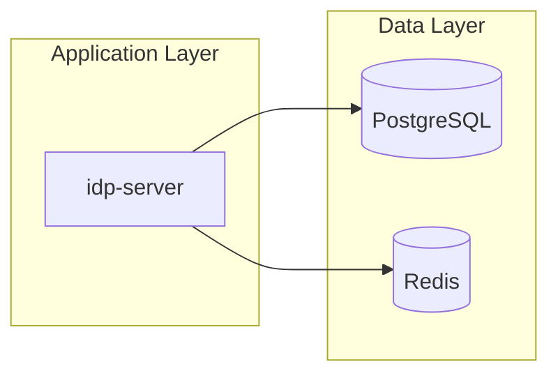

# デプロイメント手順書

`idp-server`をDocker環境にデプロイするための実践的な手順書です。

## 目次

1. [アプリケーション構成](#アプリケーション構成)
2. [技術要件](#技術要件)
3. [データベース・テーブル構築](#データベーステーブル構築)
4. [アプリケーション設定](#アプリケーション設定)
5. [Adminテナント初期設定](#Adminテナント初期設定)
6. [アプリケーションの動作確認](#アプリケーションの動作確認)

---

## アプリケーション構成

### システム構成図



### idp-server (Spring Boot Application)
- **フレームワーク**: Spring Boot 3.x
- **Java Version**: OpenJDK 21+

---

## 技術要件

### Java プラットフォーム

| 項目 | 要件 | 推奨 |
|------|------|------|
| **Java バージョン** | Java 21+ | Java 21 LTS |
| **JVM** | OpenJDK, Oracle JDK | Eclipse Temurin |
| **メモリ** | 最小 2GB | 4GB+ |
| **CPU** | 最小 2 コア | 4 コア+ |

### データベース要件

#### PostgreSQL (推奨)
| 項目 | 要件 | 推奨 |
|------|------|------|
| **バージョン** | PostgreSQL 13+ | PostgreSQL 15+ |
| **レプリケーション** | 必須 (読み書き分離) | Streaming Replication |
| **接続数** | 最小 50 | 100+ |
| **ストレージ** | SSD | NVMe SSD |

#### MySQL (代替)
| 項目 | 要件 | 推奨 |
|------|------|------|
| **バージョン** | MySQL 8.0+ | MySQL 8.0.34+ |
| **エンジン** | InnoDB | InnoDB |
| **文字セット** | utf8mb4 | utf8mb4_unicode_ci |

### キャッシュ・セッション管理

| 項目 | 要件 | 推奨 |
|------|------|------|
| **Redis** | 6.0+ | Redis 7.2+ |
| **メモリ** | 最小 1GB | 4GB+ |
| **永続化** | RDB + AOF | 推奨 |
| **クラスタリング** | 高可用性構成 | Redis Sentinel/Cluster |


## データベース・テーブル構築

### PostgreSQL セットアップ

#### ユーザー作成

```sql
-- データベース作成
CREATE DATABASE idpserver
  WITH ENCODING 'UTF8'
       LC_COLLATE = 'ja_JP.UTF-8'
       LC_CTYPE = 'ja_JP.UTF-8'
       TEMPLATE = template0;

-- 専用ユーザー作成
CREATE USER idpserver_user WITH PASSWORD 'secure_db_password';

-- 権限付与
GRANT ALL PRIVILEGES ON DATABASE idpserver TO idpserver_user;
GRANT CREATE ON SCHEMA public TO idpserver_user;

-- 接続制限設定
ALTER USER idpserver_user CONNECTION LIMIT 50;
```

#### 4. アプリケーション用ユーザー作成とRLS設定

**情報源**: `/libs/idp-server-database/postgresql/operation/app_user.sql`
**確認方法**: `cat libs/idp-server-database/postgresql/operation/app_user.sql`

```sql
-- =============================================================================
-- アプリケーション用ユーザー作成（実際の実装）
-- =============================================================================

-- マスターユーザーでの接続
sudo -u postgres psql -d idpserver

-- アプリケーション用ユーザー作成（実装に基づく）
CREATE USER idp_app_user WITH PASSWORD 'idp_app_user';

-- 基本権限付与
GRANT CONNECT ON DATABASE idpserver TO idp_app_user;
GRANT USAGE ON SCHEMA public TO idp_app_user;
GRANT SELECT, INSERT, UPDATE, DELETE ON ALL TABLES IN SCHEMA public TO idp_app_user;
GRANT USAGE, SELECT ON ALL SEQUENCES IN SCHEMA public TO idp_app_user;

-- 将来のテーブルに対する権限設定
ALTER DEFAULT PRIVILEGES
    FOR ROLE idpserver
    IN SCHEMA public
    GRANT SELECT, INSERT, UPDATE, DELETE ON TABLES TO idp_app_user;

ALTER DEFAULT PRIVILEGES
    FOR ROLE idpserver
    IN SCHEMA public
    GRANT USAGE, SELECT ON SEQUENCES TO idp_app_user;
```

**情報源**: `/libs/idp-server-database/postgresql/V1_0_0__init_lib.sql`
**確認方法**: `grep -A 5 "ROW LEVEL SECURITY" V1_0_0__init_lib.sql`


#### 5. スキーマ初期化
```bash
# PostgreSQL再起動
sudo systemctl restart postgresql

# アプリケーション初回起動でのスキーマ作成
# idp-serverは Flyway migration を使用してスキーマを自動作成
# 手動でのスキーマ作成は不要（アプリケーション起動時に自動実行）
```


## アプリケーション設定

### 環境変数設定


---

## Adminテナント初期設定


### 6. 動作確認チェックリスト

#### 基本動作確認
- [ ] アプリケーションが正常起動（docker-compose ps）
- [ ] ヘルスチェック正常（/actuator/health）
- [ ] データベース接続正常（/actuator/health/db）
- [ ] Redis接続正常（/actuator/health/redis）

#### OIDC機能確認
- [ ] Discovery endpoint 応答正常（/.well-known/openid-configuration）
- [ ] JWKS endpoint 応答正常（/oauth2/jwks）
- [ ] Authorization endpoint アクセス可能（/oauth2/authorize）
- [ ] Token endpoint アクセス可能（/oauth2/token）

#### セキュリティ確認
- [ ] HTTP ヘッダーセキュリティ設定済み
- [ ] SSL/TLS設定済み（本番環境）
- [ ] ファイアウォール設定済み
- [ ] 適切なファイル権限設定済み

#### 性能確認
- [ ] Discovery endpoint レスポンス時間 < 100ms
- [ ] JWKS endpoint レスポンス時間 < 100ms
- [ ] メモリ使用量が設定値内
- [ ] CPU使用率が正常範囲内

これで基本的なデプロイメントが完了です。本番環境では、追加でロードバランサー、SSL証明書、監視設定等の構成が必要になります。