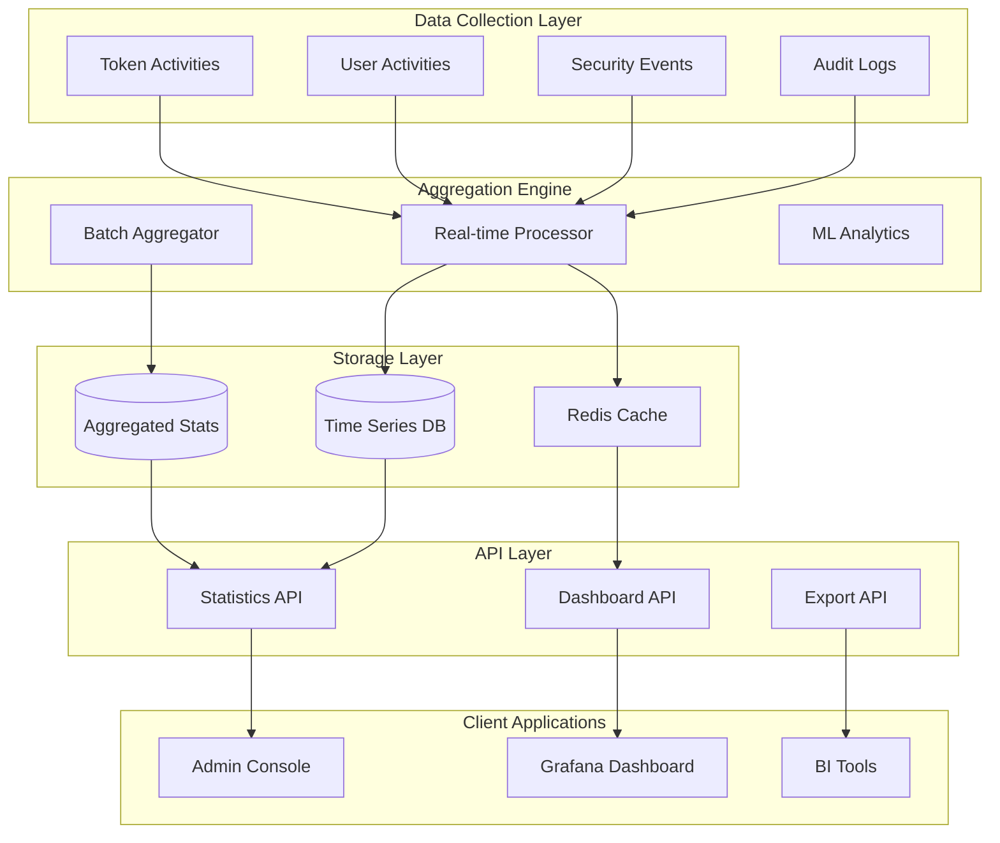

# 統計・分析機能 設計提案

**Issue #441 対応**: テナント統計データ収集・分析機能の追加

---

## 📊 現状分析と課題

### 現在のidp-server機能
- ✅ **監査ログAPI**: `/v1/management/tenants/{tenant-id}/audit-logs` で詳細ログ取得可能
- ✅ **ユーザー管理API**: ユーザー一覧・詳細情報の取得
- ✅ **セキュリティイベント**: セキュリティ関連イベントの記録・通知
- ❌ **統計・分析機能**: 集計データやダッシュボード用メトリクス不足

### 運用上の課題
1. **意思決定支援不足**: 利用状況の可視化・トレンド分析不可
2. **キャパシティプランニング困難**: リソース使用量の予測困難
3. **セキュリティ監視不足**: 異常パターン・脅威検知の自動化不可
4. **コンプライアンス報告煩雑**: 定期報告用データ収集の手作業

---

## 🔍 競合分析結果

### Keycloak
**強み**:
- Prometheus連携による包括的メトリクス
- Grafanaダッシュボードテンプレート提供
- リアルタイム監視対応

**提供メトリクス**:
- ログイン成功/失敗回数（IdP・クライアント別）
- トークン発行・リフレッシュ回数
- レスポンス時間分布
- セッション管理統計

### Auth0
**強み**:
- SaaS特化の洗練されたダッシュボード
- 利用量・請求連動の統計機能
- 外部分析ツール統合

**提供メトリクス**:
- サブスクリプション使用量監視
- MFA利用状況・成功率
- API呼び出し統計
- ユーザーアクティビティ分析

### 業界ベストプラクティス
- **リアルタイム性**: 2025年のトレンドは即座の洞察提供
- **AI/ML統合**: 異常検知・予測分析の自動化
- **ゼロトラスト対応**: 継続的な信頼度評価・リスクアセスメント
- **ノンヒューマンID対応**: 2025年には人間:ボット = 1:3 の比率予想

---

## 🎯 設計提案

### 1. アーキテクチャ概要



### 2. データモデル設計

#### 基本統計エンティティ
```sql
-- テナント別日次統計
CREATE TABLE tenant_daily_statistics (
    id UUID PRIMARY KEY,
    tenant_id UUID NOT NULL,
    date DATE NOT NULL,

    -- 認証統計
    total_logins INTEGER DEFAULT 0,
    successful_logins INTEGER DEFAULT 0,
    failed_logins INTEGER DEFAULT 0,
    unique_users INTEGER DEFAULT 0,

    -- トークン統計
    tokens_issued INTEGER DEFAULT 0,
    tokens_refreshed INTEGER DEFAULT 0,
    tokens_revoked INTEGER DEFAULT 0,

    -- セキュリティ統計
    mfa_attempts INTEGER DEFAULT 0,
    mfa_successes INTEGER DEFAULT 0,
    security_events INTEGER DEFAULT 0,

    -- パフォーマンス統計
    avg_response_time_ms INTEGER DEFAULT 0,
    p95_response_time_ms INTEGER DEFAULT 0,
    error_rate DECIMAL(5,4) DEFAULT 0,

    created_at TIMESTAMP DEFAULT CURRENT_TIMESTAMP,
    updated_at TIMESTAMP DEFAULT CURRENT_TIMESTAMP,

    UNIQUE(tenant_id, date)
);

-- RLS適用
ALTER TABLE tenant_daily_statistics ENABLE ROW LEVEL SECURITY;
CREATE POLICY rls_tenant_daily_statistics
  ON tenant_daily_statistics
  USING (tenant_id = current_setting('app.tenant_id')::uuid);
ALTER TABLE tenant_daily_statistics FORCE ROW LEVEL SECURITY;
```

#### 時系列データ（リアルタイム）
```sql
-- 時間別統計（24時間保持）
CREATE TABLE tenant_hourly_metrics (
    id UUID PRIMARY KEY,
    tenant_id UUID NOT NULL,
    timestamp TIMESTAMP NOT NULL,
    metric_type VARCHAR(100) NOT NULL,
    metric_value INTEGER NOT NULL,

    -- インデックス最適化
    INDEX idx_tenant_hourly_timestamp (tenant_id, timestamp),
    INDEX idx_tenant_hourly_type (tenant_id, metric_type)
);
```

#### 集約統計ビュー
```sql
-- 月次集約ビュー
CREATE VIEW tenant_monthly_statistics AS
SELECT
    tenant_id,
    DATE_TRUNC('month', date) as month,
    SUM(total_logins) as total_logins,
    SUM(successful_logins) as successful_logins,
    AVG(unique_users) as avg_unique_users,
    SUM(tokens_issued) as total_tokens_issued,
    AVG(avg_response_time_ms) as avg_response_time,
    AVG(error_rate) as avg_error_rate
FROM tenant_daily_statistics
GROUP BY tenant_id, DATE_TRUNC('month', date);
```

### 3. Statistics API 設計

#### エンドポイント構成
```
GET /v1/management/tenants/{tenant-id}/statistics/dashboard
GET /v1/management/tenants/{tenant-id}/statistics/summary
GET /v1/management/tenants/{tenant-id}/statistics/time-series
GET /v1/management/tenants/{tenant-id}/statistics/reports
GET /v1/management/tenants/{tenant-id}/statistics/export
```

#### API仕様詳細

**1. ダッシュボード統計**
```http
GET /v1/management/tenants/{tenant-id}/statistics/dashboard
```

レスポンス例:
```json
{
  "tenant_id": "67e7eae6-62b0-4500-9eff-87459f63fc66",
  "period": "last_7_days",
  "summary": {
    "total_users": 1250,
    "active_users_today": 89,
    "total_logins_today": 156,
    "success_rate": 97.3,
    "avg_response_time_ms": 245
  },
  "trends": {
    "user_growth_rate": 12.5,
    "login_trend": "increasing",
    "error_rate_trend": "stable"
  },
  "security": {
    "security_events_count": 3,
    "mfa_adoption_rate": 78.5,
    "suspicious_activities": 1
  },
  "performance": {
    "avg_response_time": 245,
    "p95_response_time": 890,
    "uptime_percentage": 99.9
  }
}
```

**2. 時系列データ**
```http
GET /v1/management/tenants/{tenant-id}/statistics/time-series
  ?metric=logins,users,tokens
  &period=7d
  &granularity=1h
```

レスポンス例:
```json
{
  "tenant_id": "67e7eae6-62b0-4500-9eff-87459f63fc66",
  "period": {
    "start": "2025-09-06T00:00:00Z",
    "end": "2025-09-13T23:59:59Z",
    "granularity": "1h"
  },
  "metrics": {
    "logins": [
      {"timestamp": "2025-09-13T00:00:00Z", "value": 23},
      {"timestamp": "2025-09-13T01:00:00Z", "value": 15},
      {"timestamp": "2025-09-13T02:00:00Z", "value": 8}
    ],
    "users": [
      {"timestamp": "2025-09-13T00:00:00Z", "value": 18},
      {"timestamp": "2025-09-13T01:00:00Z", "value": 12}
    ]
  }
}
```

**3. 詳細レポート**
```http
GET /v1/management/tenants/{tenant-id}/statistics/reports
  ?type=security|usage|performance
  &period=30d
  &format=json
```

### 4. 実装方針

#### Phase 1: 基本統計機能
- **目標**: 既存の監査ログ・イベントデータから基本メトリクス生成
- **期間**: 1-2週間
- **成果物**:
  - 日次バッチ処理での統計生成
  - 基本的なREST API
  - シンプルな管理画面

#### Phase 2: リアルタイム統計
- **目標**: 時間単位のリアルタイム統計
- **期間**: 2-3週間
- **成果物**:
  - イベント駆動型統計更新
  - 時系列データAPI
  - Grafanaダッシュボード連携

#### Phase 3: 高度分析機能
- **目標**: 異常検知・予測分析
- **期間**: 3-4週間
- **成果物**:
  - ML基盤統合
  - セキュリティ異常検知
  - 容量計画支援機能

### 5. 技術的考慮事項

#### パフォーマンス最適化
```java
// 非同期統計更新
@EventListener
@Async("statisticsTaskExecutor")
public void handleAuthenticationEvent(AuthenticationEvent event) {
    statisticsAggregator.incrementLoginCount(
        event.getTenantId(),
        event.isSuccessful()
    );
}

// バッチ処理による大量データ集約
@Scheduled(cron = "0 0 1 * * ?") // 毎日AM1時実行
public void aggregateDailyStatistics() {
    List<TenantIdentifier> tenants = tenantService.findAll();
    tenants.parallelStream().forEach(this::processTenantsStatistics);
}
```

#### データ保持戦略
```yaml
# データ保持ポリシー設定
statistics:
  retention:
    hourly_data: 7d    # 時間別データ: 7日間
    daily_data: 1y     # 日別データ: 1年間
    monthly_data: 3y   # 月別データ: 3年間
  aggregation:
    batch_size: 1000
    processing_threads: 4
```

#### セキュリティ対策
- **データ匿名化**: 個人情報除去・ハッシュ化
- **アクセス制御**: テナント管理者のみ統計データ閲覧可能
- **監査ログ**: 統計データへのアクセス記録

---

## 🚀 実装計画

### マイルストーン1: 基本統計API (Week 1-2)
```java
@RestController
@RequestMapping("/v1/management/tenants/{tenant-id}/statistics")
public class TenantStatisticsApi {

    @GetMapping("/dashboard")
    public ResponseEntity<DashboardStatistics> getDashboard(
        @PathVariable("tenant-id") TenantIdentifier tenantId,
        @RequestParam(defaultValue = "7d") String period
    ) {
        // 実装
    }

    @GetMapping("/summary")
    public ResponseEntity<StatisticsSummary> getSummary(
        @PathVariable("tenant-id") TenantIdentifier tenantId,
        @RequestParam(defaultValue = "24h") String period
    ) {
        // 実装
    }
}
```

### マイルストーン2: 時系列データ対応 (Week 3-4)
- Redis/InfluxDBによる時系列データストレージ
- WebSocket接続によるリアルタイム更新
- Grafanaダッシュボードテンプレート

### マイルストーン3: 高度分析機能 (Week 5-6)
- 機械学習による異常検知
- 予測分析（負荷・利用量予測）
- セキュリティインサイト

---

## 📋 期待される効果

### 運用改善
- **30%削減**: 運用監視にかかる手作業時間
- **50%向上**: インシデント検知の迅速性
- **24/7**: 自動化されたヘルス監視

### ビジネス価値
- **データ駆動**: 統計に基づく意思決定支援
- **予防保全**: 問題の事前察知・対処
- **コンプライアンス**: 自動化された監査レポート生成

### 開発者体験
- **可観測性**: システム動作の完全な可視化
- **デバッグ支援**: 問題の根本原因迅速特定
- **パフォーマンス最適化**: ボトルネックの定量的把握

この統計・分析機能により、idp-serverは単なる認証基盤から、**インテリジェントなアイデンティティプラットフォーム**へと進化します。