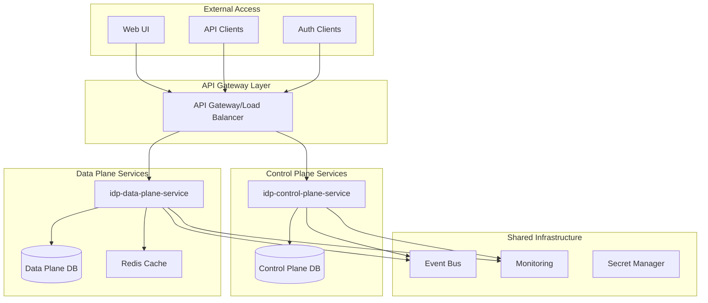
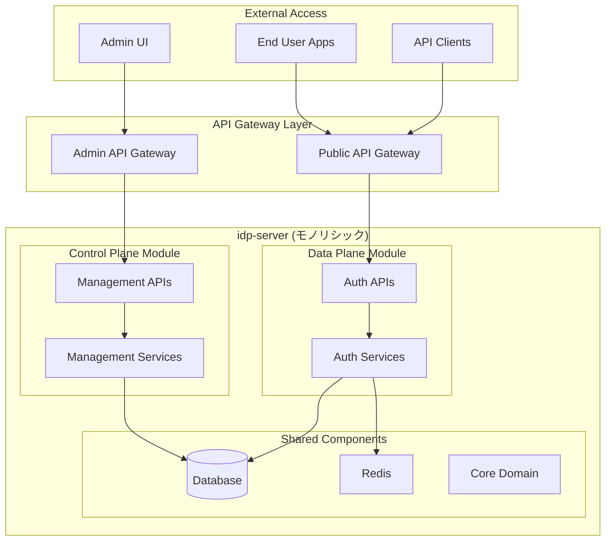

# Control Plane分離設計提案

**Issue #420 対応**: コントロールプレーン分離による運用性・拡張性向上

---

## 📋 現状分析

### 現在のアーキテクチャ課題

#### **🔗 密結合による問題**
- **パフォーマンス影響**: 管理操作が認証性能に悪影響
- **スケーラビリティ制約**: 独立スケールが不可能
- **運用複雑性**: 単一デプロイ・単一障害点
- **セキュリティリスク**: 攻撃面の拡大・権限昇格リスク

#### **現在の構成** (全21+ API・40+ 権限)
```
┌─────────────────────────────────────────────────┐
│               idp-server-app                    │
├─────────────────┬───────────────────────────────┤
│   Data Plane    │        Control Plane         │
│                 │                               │
│ • 認証・認可処理  │ • Tenant管理 (TenantManagementApi) │
│ • OAuth/OIDC     │ • User管理 (UserManagementApi)     │
│ • Token発行・検証 │ • Client管理 (ClientManagementApi) │
│ • Session管理    │ • Role/Permission管理              │
│                 │ • Security Event管理              │
│                 │ • Audit Log管理                   │
│                 │ • Authentication設定管理           │
│                 │ • Federation設定管理              │
└─────────────────┴───────────────────────────────┘
```

---

## 🎯 分離アーキテクチャ設計案

### **Option 1: マイクロサービス完全分離**

#### **アーキテクチャ概要**


#### **責任分担**

##### **Control Plane Service**
```
📋 管理・設定機能
├── Tenant Management (テナント管理)
├── User Management (ユーザー管理)
├── Client Management (クライアント管理)
├── Role & Permission Management (ロール・権限管理)
├── Authentication Policy Management (認証ポリシー管理)
├── Federation Configuration (フェデレーション設定)
├── Security Event Management (セキュリティイベント管理)
├── Audit Log Management (監査ログ管理)
└── System Operations (システム運用)

🔒 管理権限・セキュリティ
├── Admin Authentication (管理者認証)
├── Administrative Authorization (管理認可)
├── Multi-tenant Admin Context (マルチテナント管理コンテキスト)
└── Audit Trail (管理操作監査証跡)

📊 運用機能
├── Configuration Management (設定管理)
├── System Health Monitoring (システムヘルス監視)
├── Performance Analytics (性能分析)
└── Maintenance Operations (メンテナンス操作)
```

##### **Data Plane Service**
```
🔐 認証・認可機能
├── OAuth 2.0 Authorization (OAuth認可)
├── OpenID Connect Authentication (OIDC認証)
├── Token Issuance & Validation (トークン発行・検証)
├── Session Management (セッション管理)
├── MFA Processing (多要素認証処理)
├── WebAuthn/FIDO2 Processing (WebAuthn処理)
└── Password Authentication (パスワード認証)

🚀 高性能処理
├── Token Caching (トークンキャッシュ)
├── Session Store Management (セッションストア管理)
├── Rate Limiting (レート制限)
└── Request Processing Optimization (リクエスト処理最適化)

📈 拡張仕様対応
├── CIBA (Client Initiated Backchannel Authentication)
├── FAPI (Financial-grade API)
├── PKCE (Proof Key for Code Exchange)
├── Verifiable Credentials (検証可能資格情報)
└── Identity Assurance (身元保証)
```

#### **技術仕様**

##### **API Gateway設定**
```yaml
# API Gateway ルーティング設定
routes:
  control_plane:
    paths: ["/v1/management/*", "/v1/admin/*"]
    service: idp-control-plane-service
    auth: admin_oauth_token

  data_plane:
    paths: ["/v1/oauth/*", "/v1/oidc/*", "/v1/.well-known/*"]
    service: idp-data-plane-service
    auth: client_credentials_or_none
```

##### **データベース分離**
```yaml
# Control Plane DB (管理データ)
control_plane_database:
  tables:
    - tenants
    - users (管理用メタデータ)
    - clients (管理設定)
    - admin_users
    - admin_roles
    - audit_logs
    - security_events

# Data Plane DB (運用データ)
data_plane_database:
  tables:
    - oauth_tokens
    - oauth_codes
    - user_sessions
    - authentication_devices
    - user_credentials (ハッシュ化済み)
    - federated_identities
```

##### **イベント駆動通信**
```java
// Control Plane → Data Plane イベント例
@EventHandler
public class ClientConfigurationUpdatedEvent {
    private TenantIdentifier tenantId;
    private ClientIdentifier clientId;
    private ClientConfiguration newConfiguration;
    // Data Planeでの設定反映処理
}

@EventHandler
public class UserStatusChangedEvent {
    private TenantIdentifier tenantId;
    private UserIdentifier userId;
    private UserStatus newStatus; // ACTIVE, SUSPENDED, DELETED
    // Data Planeでの認証制御反映
}
```

#### **メリット**
- ✅ **完全独立スケール**: 認証負荷と管理負荷を別々に対応
- ✅ **障害分離**: 管理機能障害が認証に影響しない
- ✅ **技術スタック最適化**: 各プレーンに最適な技術選択
- ✅ **セキュリティ向上**: 攻撃面分離・管理者権限分離
- ✅ **運用柔軟性**: 独立デプロイ・バージョン管理

#### **デメリット**
- ❌ **実装複雑性**: 分散システムの複雑性
- ❌ **データ整合性**: イベント駆動による結果整合性
- ❌ **運用コスト**: インフラリソース増加
- ❌ **開発工数**: 大規模な再設計が必要

---

### **Option 2: API Gateway分離 (推奨)**

#### **アーキテクチャ概要**


#### **責任分担**

##### **Admin API Gateway**
```yaml
admin_gateway:
  target: idp-server
  routes:
    - path: /v1/management/*
      auth: admin_oauth_token
      rate_limit: 100_rps  # 管理API用制限
      monitoring: admin_metrics

  security:
    - admin_network_policies
    - enhanced_logging
    - admin_session_management
```

##### **Public API Gateway**
```yaml
public_gateway:
  target: idp-server
  routes:
    - path: /v1/oauth/*
      auth: optional
      rate_limit: 10000_rps  # 高スループット
      monitoring: auth_metrics

    - path: /v1/.well-known/*
      auth: none
      rate_limit: 5000_rps
      caching: 300s  # Discovery情報キャッシュ
```

#### **技術実装**

##### **リソース分離**
```java
// 管理系専用スレッドプール
@Configuration
public class ControlPlaneThreadConfig {
    @Bean("managementTaskExecutor")
    public TaskExecutor managementTaskExecutor() {
        ThreadPoolTaskExecutor executor = new ThreadPoolTaskExecutor();
        executor.setCorePoolSize(5);
        executor.setMaxPoolSize(20);  // 管理処理用
        return executor;
    }
}

// 認証系高スループット用スレッドプール
@Configuration
public class DataPlaneThreadConfig {
    @Bean("authenticationTaskExecutor")
    public TaskExecutor authenticationTaskExecutor() {
        ThreadPoolTaskExecutor executor = new ThreadPoolTaskExecutor();
        executor.setCorePoolSize(50);
        executor.setMaxPoolSize(200);  // 高負荷認証処理用
        return executor;
    }
}
```

##### **データアクセス最適化**
```java
// 管理系DB接続プール (小規模・高機能)
@Configuration
public class ControlPlaneDataSourceConfig {
    @Bean("controlPlaneDataSource")
    public DataSource controlPlaneDataSource() {
        HikariConfig config = new HikariConfig();
        config.setMaximumPoolSize(10);      // 管理用少数接続
        config.setConnectionTimeout(5000);  // 長めのタイムアウト
        config.setReadOnly(false);          // 読み書き両対応
        return new HikariDataSource(config);
    }
}

// 認証系DB接続プール (大規模・高速)
@Configuration
public class DataPlaneDataSourceConfig {
    @Bean("dataPlaneDataSource")
    public DataSource dataPlaneDataSource() {
        HikariConfig config = new HikariConfig();
        config.setMaximumPoolSize(50);      // 認証用大量接続
        config.setConnectionTimeout(1000);  // 短いタイムアウト
        config.setReadOnly(true);           // 読み取り専用最適化
        return new HikariDataSource(config);
    }
}
```

#### **メリット**
- ✅ **実装容易性**: 既存コードベースを最大活用
- ✅ **段階的移行**: リスクを抑えた漸進的改善
- ✅ **パフォーマンス向上**: Gateway レベルでの負荷分散
- ✅ **セキュリティ向上**: 管理・認証トラフィック分離
- ✅ **運用改善**: 独立した監視・スケール

#### **デメリット**
- ❌ **部分的分離**: アプリケーション内部は依然として結合
- ❌ **スケール制約**: サービスレベルでの独立スケールは限定的
- ❌ **単一障害点**: アプリケーション障害は両プレーンに影響

---

### **Option 3: モジュール内分離 (最小限)**

#### **アーキテクチャ概要**
```
┌─────────────────────────────────────────┐
│            idp-server-app               │
├─────────────────┬───────────────────────┤
│   Data Plane    │    Control Plane      │
│   Module        │    Module             │
├─────────────────┼───────────────────────┤
│ 🔒 Authentication│ 📋 Management         │
│   - OAuth/OIDC   │   - Tenant Mgmt       │
│   - Token Mgmt   │   - User Mgmt         │
│   - Session Mgmt │   - Client Mgmt       │
│                 │   - Audit Log         │
├─────────────────┼───────────────────────┤
│ ⚡ Optimizations │ 🛡️ Admin Security      │
│   - Cache Layer  │   - Admin Auth        │
│   - Rate Limiting│   - Permission Mgmt   │
│   - Performance  │   - Audit Trail       │
├─────────────────┴───────────────────────┤
│          Shared Foundation              │
│  📚 Core Domain • 💾 Database • 🔧 Platform │
└─────────────────────────────────────────┘
```

#### **実装方針**

##### **パッケージ構造分離**
```java
// データプレーン専用パッケージ
org.idp.server.dataplane
├── authentication/
├── authorization/
├── token/
├── session/
└── performance/

// コントロールプレーン専用パッケージ
org.idp.server.controlplane
├── management/
├── administration/
├── audit/
├── security/
└── operations/
```

##### **責任明確化**
```java
// データプレーン - 高頻度・低レイテンシ処理
@DataPlaneService
public class AuthenticationService {
    // OAuth/OIDC認証処理に専念
    // パフォーマンス最適化
    // キャッシュ活用
}

// コントロールプレーン - 低頻度・高機能処理
@ControlPlaneService
public class TenantManagementService {
    // 管理操作・設定変更
    // 詳細な監査ログ
    // トランザクション整合性重視
}
```

##### **設定・監視分離**
```yaml
# application-dataplane.yml
dataplane:
  performance:
    thread_pool_size: 200
    cache_size: 10000
    timeout_ms: 500
  monitoring:
    metrics_prefix: "idp.dataplane"

# application-controlplane.yml
controlplane:
  performance:
    thread_pool_size: 20
    timeout_ms: 5000
  security:
    audit_level: DETAILED
  monitoring:
    metrics_prefix: "idp.controlplane"
```

#### **メリット**
- ✅ **最小限変更**: 既存アーキテクチャを維持
- ✅ **段階的改善**: 小さなステップでの品質向上
- ✅ **開発効率**: 既存チーム・スキルを活用
- ✅ **リスク最小**: 大幅な変更リスクを回避

#### **デメリット**
- ❌ **根本解決不足**: 密結合課題の部分的解決のみ
- ❌ **スケール制約**: 独立スケールは不可
- ❌ **長期的債務**: 技術的負債の蓄積継続

---

## 🔒 セキュリティ考慮事項

### **管理プレーンセキュリティ**

#### **管理者認証強化**
```yaml
admin_authentication:
  methods:
    - oauth2_authorization_code  # 管理者OAuth認証
    - mfa_required: true         # 必須MFA
    - session_timeout: 30min     # 短いセッション

  authorization:
    model: RBAC                  # ロールベースアクセス制御
    permissions: 40+             # 詳細権限管理
    tenant_isolation: true       # テナント分離
```

#### **監査・コンプライアンス**
```java
@AuditLogged
public class AdminOperationAuditor {
    // 全管理操作の詳細ログ
    // - 操作者識別
    // - 操作内容・対象
    // - タイムスタンプ
    // - 結果・エラー
    // - IPアドレス・UserAgent
}
```

### **データプレーンセキュリティ**

#### **高頻度処理向け最適化**
```java
@DataPlaneSecurityOptimized
public class TokenValidationService {
    // JWT署名検証キャッシュ
    // 高速トークン検証
    // レート制限・DDoS対策
    // 最小限監査ログ (パフォーマンス重視)
}
```

---

## 📊 比較分析

| 観点 | Option 1: 完全分離 | Option 2: Gateway分離 | Option 3: モジュール分離 |
|------|-------------------|---------------------|----------------------|
| **実装複雑性** | 🔴 高 | 🟡 中 | 🟢 低 |
| **開発工数** | 🔴 大 (6-12ヶ月) | 🟡 中 (2-4ヶ月) | 🟢 小 (1-2ヶ月) |
| **スケール改善** | 🟢 最大 | 🟡 中程度 | 🔴 最小 |
| **障害分離** | 🟢 完全 | 🟡 部分的 | 🔴 限定的 |
| **セキュリティ向上** | 🟢 最大 | 🟡 中程度 | 🟡 中程度 |
| **運用改善** | 🟢 最大 | 🟡 中程度 | 🔴 最小 |
| **移行リスク** | 🔴 高 | 🟡 中 | 🟢 低 |
| **技術的負債解決** | 🟢 根本解決 | 🟡 部分的 | 🔴 限定的 |

---

## 🛡️ セキュリティ要件詳細分析

### **管理プレーン特化セキュリティ**

#### **管理者認証・認可強化**
```yaml
admin_security_requirements:
  authentication:
    - multi_factor_required: MANDATORY
    - admin_oauth_flow: authorization_code_with_pkce
    - session_management:
        timeout: 30_minutes
        concurrent_sessions: 1
        ip_binding: true

  authorization:
    - permission_model: RBAC_with_ABAC
    - granular_permissions: 40+_operations
    - tenant_scoped_access: true
    - privilege_escalation_prevention: true

  audit:
    - operation_logging: ALL_ADMIN_OPERATIONS
    - data_access_logging: SENSITIVE_DATA_ONLY
    - retention_period: 7_years  # コンプライアンス要件
    - tamper_protection: cryptographic_integrity
```

#### **管理API攻撃対策**
```java
// 管理API専用セキュリティ設定
@ControlPlaneSecurityConfig
public class AdminApiSecurityConfiguration {

    @Bean("adminRateLimiter")
    public RateLimiter adminRateLimiter() {
        return RateLimiter.create(100.0); // 管理API: 100 RPS制限
    }

    @Bean("adminNetworkPolicy")
    public NetworkAccessPolicy adminNetworkPolicy() {
        return NetworkAccessPolicy.builder()
            .allowedNetworks("10.0.0.0/8", "192.168.0.0/16") // 内部ネットワークのみ
            .geolocationRestriction("JP") // 日本からのみアクセス
            .requireMtls(true)
            .build();
    }
}
```

### **データプレーン高性能セキュリティ**

#### **認証処理最適化**
```java
// データプレーン専用高性能セキュリティ
@DataPlaneSecurityOptimized
public class AuthenticationSecurityService {

    // JWT検証キャッシュ (高速処理)
    @Cacheable(cacheNames = "jwt-validation", expiration = "5m")
    public TokenValidationResult validateToken(String token) {
        // 署名検証・有効期限チェック・スコープ検証
    }

    // DDoS対策・レート制限
    @RateLimited(requests = 10000, period = "1m") // 10K RPS
    public AuthenticationResult authenticate(AuthenticationRequest request) {
        // 高速認証処理
    }
}
```

#### **セキュリティイベント処理分離**
```java
// 分離されたセキュリティイベント処理
@EventDrivenSecurityMonitoring
public class SecurityEventProcessor {

    // データプレーン: リアルタイム脅威検知
    @EventHandler
    public void handleAuthenticationFailure(AuthFailureEvent event) {
        if (event.isAnomalousPattern()) {
            // 即座のアカウントロック・アラート
            securityActionService.immediateResponse(event);
        }
    }

    // コントロールプレーン: 詳細分析・管理通知
    @EventHandler
    public void analyzeSecurityTrend(SecurityAnalyticsEvent event) {
        // 長期トレンド分析・管理者レポート
        analyticsService.processSecurityMetrics(event);
    }
}
```

### **ネットワークセキュリティ分離**

#### **Zero Trust アーキテクチャ**
```yaml
network_security_zones:
  control_plane:
    zone: "admin-zone"
    access_policy: "deny-by-default"
    allowed_sources:
      - internal_admin_network
      - vpn_admin_clients
    encryption: mTLS_required

  data_plane:
    zone: "public-zone"
    access_policy: "controlled-public"
    allowed_sources:
      - internet (controlled)
      - application_clients
    encryption: TLS_1.3_minimum
```

---

## 📅 段階的実装ロードマップ

### **Phase 0: 準備・基盤整備 (Month 1)**

#### **Week 1-2: アーキテクチャ設計最終化**
- [ ] 詳細設計レビュー・承認
- [ ] API境界定義・契約仕様策定
- [ ] データ分離戦略詳細化
- [ ] セキュリティ要件最終確認

#### **Week 3-4: 開発環境準備**
- [ ] CI/CD パイプライン分離準備
- [ ] モニタリング・ロギング戦略策定
- [ ] テスト戦略・E2Eテスト計画
- [ ] 運用手順・ドキュメント整備

### **Phase 1: モジュール内分離 (Month 2)**

#### **Week 5-6: パッケージ構造分離**
```bash
# 実装タスク
./gradlew createModule --name=idp-server-control-plane-isolation
./gradlew createModule --name=idp-server-data-plane-isolation

# パッケージ再編成
git mv org/idp/server/control_plane org/idp/server/controlplane
git mv org/idp/server/authentication org/idp/server/dataplane/authentication
```

#### **Week 7-8: リソース分離・設定分離**
- [ ] スレッドプール分離実装
- [ ] DB接続プール分離実装
- [ ] 設定ファイル分離 (control-plane.yml, data-plane.yml)
- [ ] メトリクス・ログ分離実装

### **Phase 2: API Gateway分離 (Month 3-4)**

#### **Month 3: Gateway Infrastructure**
- [ ] **Week 9-10**: API Gateway選定・設定 (Kong/Istio/Spring Cloud Gateway)
- [ ] **Week 11-12**: ルーティング・ロードバランシング設定

#### **Month 4: セキュリティ・監視統合**
- [ ] **Week 13-14**: 管理系・認証系セキュリティ分離
- [ ] **Week 15-16**: モニタリング・アラート分離・統合

### **Phase 3: データ分離準備 (Month 5-6)**

#### **Month 5: イベント駆動アーキテクチャ**
- [ ] **Week 17-18**: Event Bus導入 (Kafka/RabbitMQ/Redis Streams)
- [ ] **Week 19-20**: イベント定義・Producer/Consumer実装

#### **Month 6: データベース分離準備**
- [ ] **Week 21-22**: データベーススキーマ分析・分離設計
- [ ] **Week 23-24**: データ同期・移行戦略実装

### **Phase 4: 完全サービス分離 (Month 7-12)**

#### **Month 7-9: Control Plane Service分離**
```bash
# 新サービス作成
./gradlew createService --name=idp-control-plane-service
./gradlew createService --name=idp-data-plane-service

# Docker化・K8s対応
docker build -t idp-control-plane:v1.0 .
docker build -t idp-data-plane:v1.0 .
```

#### **Month 10-12: 運用・最適化・本格稼働**
- [ ] **Month 10**: パフォーマンス最適化・負荷テスト
- [ ] **Month 11**: セキュリティ監査・ペネトレーションテスト
- [ ] **Month 12**: 本格稼働・監視体制確立

### **各フェーズのSuccess Criteria**

#### **Phase 1完了基準**
- ✅ パッケージ構造完全分離
- ✅ リソース使用量20%改善
- ✅ 管理操作が認証性能に与える影響50%削減

#### **Phase 2完了基準**
- ✅ 管理・認証トラフィック完全分離
- ✅ 独立スケール可能性確認
- ✅ セキュリティ境界明確化

#### **Phase 3完了基準**
- ✅ イベント駆動通信確立
- ✅ データ整合性保証機能
- ✅ 分離済みデータベース実装

#### **Phase 4完了基準**
- ✅ 独立サービスデプロイ成功
- ✅ 99.9% SLA維持
- ✅ セキュリティ要件100%充足

---

## 🎯 推奨アプローチ

### **段階的移行戦略 (Option 2 → Option 1)**

#### **Phase 1: Gateway分離 (短期 2-4ヶ月)**
1. **Admin/Public API Gateway分離**
2. **リソース・監視分離**
3. **パフォーマンス最適化**
4. **セキュリティ強化**

#### **Phase 2: サービス分離準備 (中期 6-8ヶ月)**
1. **イベント駆動アーキテクチャ導入**
2. **データベース分離準備**
3. **API境界明確化**
4. **CI/CD パイプライン分離**

#### **Phase 3: 完全分離 (長期 12-18ヶ月)**
1. **マイクロサービス化実装**
2. **データプレーン独立デプロイ**
3. **運用体制分離**
4. **パフォーマンス・セキュリティ最適化**

### **実装優先順位**
1. 🟢 **即座実施**: Option 3 (モジュール内分離)
2. 🟡 **短期実施**: Option 2 (API Gateway分離)
3. 🔴 **長期実施**: Option 1 (完全マイクロサービス分離)

この段階的アプローチにより、リスクを最小化しながら継続的な改善を実現し、最終的にエンタープライズグレードの分離アーキテクチャを構築できます。