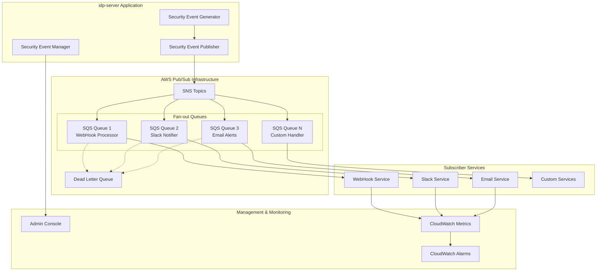

# セキュリティイベントフック Pub/Sub アーキテクチャ設計

**Issue #419 対応**: WebHookベースからPub/Sub型への移行による拡張性・冗長化実現

---

## 📋 現状分析

### 現在のWebHook実装の課題

#### **🔗 WebHook方式の制約**
- **同期処理**: HTTP配信がイベント処理スレッドをブロック
- **単一購読者**: 1イベントタイプ = 1WebHook URL の制限
- **スケール制約**: 単一インスタンス処理・水平スケール不可
- **障害耐性**: インメモリリトライ・再起動時データ喪失
- **運用複雑性**: エンドポイント健全性チェック・設定管理の困難

#### **現在の実装状況** (詳細分析済み)
```
📊 充実した基盤
├── 130+ セキュリティイベントタイプ
├── テナント別設定管理 (JSON設定)
├── プラグインシステム (動的ローディング)
├── SSF (RFC 8935) 準拠実装
└── 包括的監査・結果追跡

🔴 制約・課題
├── 同期HTTP配信 → スレッドブロック
├── 固定設定 → 動的購読者追加不可
├── インメモリリトライ → 障害時データ喪失
├── 単一配信先 → ファンアウト不可
└── 手動設定管理 → 運用負荷大
```

---

## 🏗️ Pub/Sub アーキテクチャ設計

### **Option 1: AWS SNS/SQS ベース** (推奨)

#### **アーキテクチャ概要**


#### **技術仕様詳細**

##### **Publisher実装**
```java
// 新しいPub/Sub対応Publisher
@Component
public class SnsSecurityEventPublisher implements SecurityEventPublisher {

    private final SnsClient snsClient;
    private final SecurityEventTopicResolver topicResolver;

    @Override
    @Async("securityEventPublisherExecutor")
    public CompletableFuture<PublishResult> publishAsync(
            TenantIdentifier tenantId,
            SecurityEvent securityEvent) {

        // テナント別・イベント別トピック解決
        String topicArn = topicResolver.resolveTopicArn(tenantId, securityEvent);

        // イベント→SNSメッセージ変換
        PublishRequest publishRequest = PublishRequest.builder()
            .topicArn(topicArn)
            .message(serializeEvent(securityEvent))
            .messageAttributes(buildMessageAttributes(tenantId, securityEvent))
            .messageGroupId(tenantId.value()) // FIFO対応
            .messageDeduplicationId(securityEvent.eventId().value())
            .build();

        return CompletableFuture.supplyAsync(() ->
            snsClient.publish(publishRequest))
            .thenApply(this::mapToPublishResult)
            .exceptionally(this::handlePublishFailure);
    }

    private Map<String, MessageAttributeValue> buildMessageAttributes(
            TenantIdentifier tenantId, SecurityEvent event) {
        return Map.of(
            "tenantId", stringAttribute(tenantId.value()),
            "eventType", stringAttribute(event.eventType()),
            "severity", stringAttribute(event.severity().name()),
            "timestamp", stringAttribute(event.occurredAt().toString())
        );
    }
}
```

##### **Subscriber インターフェース設計**
```java
// 汎用Subscriber抽象化
@FunctionalInterface
public interface SecurityEventSubscriber {
    CompletableFuture<SubscriptionResult> handleEvent(
        SecurityEventMessage eventMessage,
        SubscriptionContext context
    );
}

// WebHook用Subscriber実装
@Component
public class WebHookSecurityEventSubscriber implements SecurityEventSubscriber {

    private final HttpClient httpClient;
    private final WebHookConfigurationService configService;

    @Override
    public CompletableFuture<SubscriptionResult> handleEvent(
            SecurityEventMessage eventMessage,
            SubscriptionContext context) {

        TenantIdentifier tenantId = context.tenantId();
        SecurityEvent event = eventMessage.getEvent();

        // テナント別WebHook設定取得
        List<WebHookConfiguration> configs = configService
            .getWebHookConfigurations(tenantId, event.eventType());

        // 並列WebHook配信
        List<CompletableFuture<WebHookResult>> futures = configs.stream()
            .map(config -> executeWebHook(event, config))
            .collect(toList());

        return CompletableFuture.allOf(futures.toArray(new CompletableFuture[0]))
            .thenApply(v -> aggregateResults(futures))
            .thenApply(this::mapToSubscriptionResult);
    }

    private CompletableFuture<WebHookResult> executeWebHook(
            SecurityEvent event, WebHookConfiguration config) {

        HttpRequest request = HttpRequest.newBuilder()
            .uri(config.webhookUrl())
            .timeout(Duration.ofSeconds(30))
            .header("Content-Type", "application/json")
            .headers(config.customHeaders().toArray(new String[0]))
            .POST(HttpRequest.BodyPublishers.ofString(
                serializeEventPayload(event, config)))
            .build();

        return httpClient.sendAsync(request, HttpResponse.BodyHandlers.ofString())
            .thenApply(response -> mapToWebHookResult(config, response))
            .exceptionally(throwable -> handleWebHookFailure(config, throwable));
    }
}

// Slack通知用Subscriber実装
@Component
public class SlackSecurityEventSubscriber implements SecurityEventSubscriber {

    private final SlackWebClient slackClient;

    @Override
    public CompletableFuture<SubscriptionResult> handleEvent(
            SecurityEventMessage eventMessage,
            SubscriptionContext context) {

        SecurityEvent event = eventMessage.getEvent();
        SlackMessage message = buildSlackMessage(event, context);

        return slackClient.sendMessageAsync(message)
            .thenApply(this::mapToSubscriptionResult)
            .exceptionally(this::handleSlackFailure);
    }

    private SlackMessage buildSlackMessage(SecurityEvent event, SubscriptionContext context) {
        return SlackMessage.builder()
            .channel(context.getSlackConfiguration().channel())
            .text(formatSecurityEventForSlack(event))
            .attachments(buildSlackAttachments(event))
            .build();
    }
}
```

##### **SQS Consumer実装**
```java
// SQS→Subscriber ブリッジ
@Component
public class SqsSecurityEventConsumer {

    private final SqsClient sqsClient;
    private final Map<String, SecurityEventSubscriber> subscribers;

    @EventListener
    @SqsListener(queueNames = {"security-events-webhook",
                               "security-events-slack",
                               "security-events-email"})
    public void handleSqsMessage(
            @Payload SecurityEventMessage eventMessage,
            @Header Map<String, Object> headers) {

        String subscriberType = (String) headers.get("subscriberType");
        SecurityEventSubscriber subscriber = subscribers.get(subscriberType);

        if (subscriber == null) {
            log.warn("No subscriber found for type: {}", subscriberType);
            return;
        }

        SubscriptionContext context = SubscriptionContext.builder()
            .tenantId(TenantIdentifier.of((String) headers.get("tenantId")))
            .eventType((String) headers.get("eventType"))
            .messageId((String) headers.get("messageId"))
            .build();

        subscriber.handleEvent(eventMessage, context)
            .thenAccept(result -> recordSubscriptionMetrics(result))
            .exceptionally(throwable -> {
                handleSubscriptionFailure(eventMessage, context, throwable);
                return null;
            });
    }

    private void handleSubscriptionFailure(
            SecurityEventMessage eventMessage,
            SubscriptionContext context,
            Throwable throwable) {

        log.error("Subscription failed for event: {} tenant: {}",
            eventMessage.getEvent().eventId(), context.tenantId(), throwable);

        // メトリクス記録
        recordFailureMetrics(eventMessage, context, throwable);

        // DLQへの自動送信はSQSが処理
        // カスタムアラート・通知が必要な場合はここで実装
    }
}
```

#### **テナント分離・マルチテナンシー**
```java
// テナント別トピック戦略
@Component
public class TenantAwareTopicResolver implements SecurityEventTopicResolver {

    private static final String TOPIC_PATTERN =
        "arn:aws:sns:{region}:{account}:security-events-{tenant}-{eventType}";

    @Override
    public String resolveTopicArn(TenantIdentifier tenantId, SecurityEvent event) {
        // テナント別・イベント別トピック
        return TOPIC_PATTERN
            .replace("{region}", awsConfig.getRegion())
            .replace("{account}", awsConfig.getAccountId())
            .replace("{tenant}", sanitizeTenantId(tenantId))
            .replace("{eventType}", sanitizeEventType(event.eventType()));
    }

    private String sanitizeTenantId(TenantIdentifier tenantId) {
        // SNSトピック名規則に準拠 (英数字・ハイフン・アンダースコア)
        return tenantId.value().replaceAll("[^a-zA-Z0-9-_]", "_");
    }
}

// テナント別設定管理
@Component
public class TenantSubscriptionManager {

    private final SnsClient snsClient;
    private final SqsClient sqsClient;

    public void createTenantSubscription(
            TenantIdentifier tenantId,
            SecurityEventType eventType,
            SubscriberConfiguration config) {

        String topicArn = resolveTopicArn(tenantId, eventType);
        String queueArn = resolveQueueArn(tenantId, config.subscriberType());

        // SNS Subscription作成
        SubscribeRequest subscribeRequest = SubscribeRequest.builder()
            .topicArn(topicArn)
            .protocol("sqs")
            .endpoint(queueArn)
            .attributes(buildSubscriptionAttributes(config))
            .build();

        SubscribeResponse response = snsClient.subscribe(subscribeRequest);

        // 購読設定をDB保存
        saveSubscriptionConfiguration(tenantId, eventType, config,
            response.subscriptionArn());
    }
}
```

#### **エラーハンドリング・DLQ戦略**
```java
// DLQ・リトライ設定
@Configuration
public class SecurityEventPubSubConfiguration {

    @Bean
    public SqsAsyncClient sqsAsyncClient() {
        return SqsAsyncClient.builder()
            .region(Region.AP_NORTHEAST_1)
            .build();
    }

    @Bean
    @ConfigurationProperties(prefix = "security-event.pubsub")
    public PubSubProperties pubSubProperties() {
        return new PubSubProperties();
    }

    // DLQ設定
    public static class PubSubProperties {
        private int maxRetries = 3;
        private Duration retryBackoff = Duration.ofSeconds(30);
        private Duration visibilityTimeout = Duration.ofMinutes(5);
        private Duration messageRetention = Duration.ofDays(14);

        // getters and setters
    }
}

// DLQメッセージ再処理
@Component
public class DeadLetterQueueProcessor {

    @Scheduled(fixedDelay = 300000) // 5分間隔
    public void processDlqMessages() {

        ReceiveMessageRequest receiveRequest = ReceiveMessageRequest.builder()
            .queueUrl(dlqUrl)
            .maxNumberOfMessages(10)
            .visibilityTimeoutSeconds(300)
            .build();

        sqsClient.receiveMessage(receiveRequest)
            .thenAccept(response -> {
                for (Message message : response.messages()) {
                    processDlqMessage(message);
                }
            });
    }

    private void processDlqMessage(Message message) {
        try {
            // メッセージ内容解析
            SecurityEventMessage eventMessage =
                deserializeEventMessage(message.body());

            // 失敗原因分析
            DlqAnalysisResult analysis = analyzeDlqMessage(eventMessage, message);

            // 自動修復可能かチェック
            if (analysis.isAutoRecoverable()) {
                // 元のキューに再送信
                reprocessMessage(eventMessage);
                deleteMessage(message);
            } else {
                // 管理者アラート・手動対応要求
                sendDlqAlert(analysis);
            }

        } catch (Exception e) {
            log.error("DLQ message processing failed: {}", message.messageId(), e);
        }
    }
}
```

#### **メトリクス・監視**
```java
// CloudWatch メトリクス統合
@Component
public class SecurityEventMetricsCollector {

    private final CloudWatchAsyncClient cloudWatchClient;
    private final MeterRegistry meterRegistry;

    public void recordPublishMetrics(SecurityEvent event, PublishResult result) {
        Timer.Sample sample = Timer.start(meterRegistry);

        sample.stop(Timer.builder("security_event_publish_time")
            .tag("tenant", event.tenantId().value())
            .tag("event_type", event.eventType())
            .tag("status", result.isSuccess() ? "success" : "failure")
            .register(meterRegistry));

        Counter.builder("security_event_publish_total")
            .tag("tenant", event.tenantId().value())
            .tag("event_type", event.eventType())
            .tag("status", result.isSuccess() ? "success" : "failure")
            .register(meterRegistry)
            .increment();
    }

    public void recordSubscriptionMetrics(SubscriptionResult result) {
        Counter.builder("security_event_subscription_total")
            .tag("subscriber_type", result.subscriberType())
            .tag("status", result.isSuccess() ? "success" : "failure")
            .register(meterRegistry)
            .increment();

        if (!result.isSuccess()) {
            Counter.builder("security_event_subscription_errors")
                .tag("subscriber_type", result.subscriberType())
                .tag("error_type", result.errorType())
                .register(meterRegistry)
                .increment();
        }
    }
}

// CloudWatch アラーム設定
@Configuration
public class SecurityEventAlarmsConfiguration {

    @Bean
    public CloudWatchAlarm highFailureRateAlarm() {
        return CloudWatchAlarm.builder()
            .alarmName("security-events-high-failure-rate")
            .alarmDescription("Security event processing failure rate > 5%")
            .metricName("security_event_subscription_errors")
            .namespace("IdpServer/SecurityEvents")
            .statistic(Statistic.SUM)
            .period(Duration.ofMinutes(5))
            .evaluationPeriods(2)
            .threshold(50.0) // 5分間に50件以上の失敗
            .comparisonOperator(ComparisonOperator.GREATER_THAN_THRESHOLD)
            .build();
    }
}
```

### **Option 2: Apache Kafka ベース** (高スループット要件向け)

#### **アーキテクチャ特徴**
```
Kafka Topics (パーティション分散)
├── security-events-{tenant}-authentication
├── security-events-{tenant}-authorization
├── security-events-{tenant}-administration
└── security-events-{tenant}-federation

Consumer Groups (購読者種別)
├── webhook-processors (並列処理)
├── slack-notifiers (順次処理)
├── email-alerts (バッチ処理)
└── analytics-collectors (ストリーム処理)
```

#### **Kafka実装例**
```java
@Component
public class KafkaSecurityEventPublisher implements SecurityEventPublisher {

    private final KafkaTemplate<String, SecurityEventMessage> kafkaTemplate;

    @Override
    public CompletableFuture<PublishResult> publishAsync(
            TenantIdentifier tenantId, SecurityEvent securityEvent) {

        String topic = resolveKafkaTopic(tenantId, securityEvent);
        String key = buildPartitionKey(tenantId, securityEvent);

        SecurityEventMessage message = SecurityEventMessage.builder()
            .event(securityEvent)
            .tenantId(tenantId)
            .publishedAt(Instant.now())
            .build();

        ListenableFuture<SendResult<String, SecurityEventMessage>> future =
            kafkaTemplate.send(topic, key, message);

        return future.toCompletableFuture()
            .thenApply(this::mapToPublishResult)
            .exceptionally(this::handlePublishFailure);
    }

    private String buildPartitionKey(TenantIdentifier tenantId, SecurityEvent event) {
        // テナント単位でパーティション分散
        // 順序保証が必要なイベントは同一キー
        if (event.requiresOrdering()) {
            return tenantId.value() + ":" + event.userId().value();
        }
        return tenantId.value();
    }
}

@KafkaListener(topics = "security-events-#{tenant}-#{eventType}",
               groupId = "webhook-processors")
public void handleWebHookEvent(SecurityEventMessage message) {
    webHookSubscriber.handleEvent(message, buildContext(message))
        .exceptionally(throwable -> {
            // Kafka自体が再試行・DLQを管理
            log.error("WebHook processing failed", throwable);
            return null;
        });
}
```

### **Option 3: NATS ベース** (軽量・高性能)

#### **NATS Streaming設計**
```
Subject階層
├── security.events.{tenant}.auth.*
├── security.events.{tenant}.oauth.*
├── security.events.{tenant}.admin.*
└── security.events.{tenant}.federation.*

Queue Groups (負荷分散)
├── webhook-workers
├── slack-workers
├── email-workers
└── analytics-workers
```

#### **NATS実装例**
```java
@Component
public class NatsSecurityEventPublisher implements SecurityEventPublisher {

    private final Connection natsConnection;

    @Override
    public CompletableFuture<PublishResult> publishAsync(
            TenantIdentifier tenantId, SecurityEvent securityEvent) {

        String subject = buildNatsSubject(tenantId, securityEvent);
        byte[] data = serializeEvent(securityEvent);

        return CompletableFuture.supplyAsync(() -> {
            try {
                natsConnection.publish(subject, data);
                return PublishResult.success();
            } catch (Exception e) {
                return PublishResult.failure(e);
            }
        });
    }

    private String buildNatsSubject(TenantIdentifier tenantId, SecurityEvent event) {
        return String.format("security.events.%s.%s.%s",
            sanitizeTenantId(tenantId),
            event.category(),
            event.eventType());
    }
}

@Component
public class NatsSecurityEventSubscriber {

    @PostConstruct
    public void subscribeToEvents() {
        // Queue Group購読 (負荷分散)
        natsConnection.subscribe("security.events.*.auth.*", "webhook-workers",
            message -> handleAuthEvent(message));

        natsConnection.subscribe("security.events.*.oauth.*", "webhook-workers",
            message -> handleOAuthEvent(message));
    }
}
```

---

## 📊 技術選択肢比較分析

| 観点 | AWS SNS/SQS | Apache Kafka | NATS |
|------|-------------|--------------|------|
| **学習コスト** | 🟢 低 | 🔴 高 | 🟡 中 |
| **運用コスト** | 🟡 中 (従量課金) | 🔴 高 (自己管理) | 🟢 低 |
| **スループット** | 🟡 中 (~3K TPS) | 🟢 高 (100K+ TPS) | 🟢 高 (10K+ TPS) |
| **順序保証** | 🟡 FIFO制限あり | 🟢 パーティション内保証 | 🔴 制限あり |
| **耐久性** | 🟢 高 | 🟢 高 | 🟡 中 |
| **拡張性** | 🟢 自動 | 🟡 手動調整 | 🟡 手動調整 |
| **マルチテナント** | 🟢 ネイティブ | 🟡 Topic分離 | 🟡 Subject分離 |
| **監視・運用** | 🟢 CloudWatch統合 | 🟡 外部ツール | 🟡 外部ツール |
| **コスト予測** | 🟡 変動的 | 🟢 固定的 | 🟢 固定的 |

---

## 🔄 移行戦略・互換性保証

### **Phase 1: 併存期間 (Month 1-2)**

#### **Hybrid Publisher実装**
```java
@Component
public class HybridSecurityEventPublisher implements SecurityEventPublisher {

    private final WebHookSecurityEventPublisher legacyPublisher;
    private final PubSubSecurityEventPublisher newPublisher;
    private final SecurityEventMigrationConfig migrationConfig;

    @Override
    public CompletableFuture<PublishResult> publishAsync(
            TenantIdentifier tenantId, SecurityEvent securityEvent) {

        // テナント・イベント別移行フラグ確認
        if (migrationConfig.shouldUsePubSub(tenantId, securityEvent.eventType())) {
            // 新しいPub/Sub方式
            return newPublisher.publishAsync(tenantId, securityEvent)
                .thenCompose(result -> {
                    // フォールバック：失敗時はWebHook実行
                    if (!result.isSuccess() && migrationConfig.enableFallback()) {
                        return legacyPublisher.publishAsync(tenantId, securityEvent);
                    }
                    return CompletableFuture.completedFuture(result);
                });
        } else {
            // 従来のWebHook方式継続
            return legacyPublisher.publishAsync(tenantId, securityEvent);
        }
    }
}

// 段階的移行設定
@ConfigurationProperties(prefix = "security-event.migration")
public class SecurityEventMigrationConfig {

    private Set<String> pubsubEnabledTenants = new HashSet<>();
    private Set<String> pubsubEnabledEventTypes = new HashSet<>();
    private boolean enableFallback = true;
    private double pubsubMigrationRatio = 0.0; // 0% → 100%

    public boolean shouldUsePubSub(TenantIdentifier tenantId, String eventType) {
        // テナント単位移行
        if (pubsubEnabledTenants.contains(tenantId.value())) {
            return true;
        }

        // イベントタイプ単位移行
        if (pubsubEnabledEventTypes.contains(eventType)) {
            return true;
        }

        // 段階的移行 (比率ベース)
        return Math.random() < pubsubMigrationRatio;
    }
}
```

#### **設定管理API拡張**
```java
@RestController
@RequestMapping("/v1/management/tenants/{tenant-id}/security-event-hooks")
public class SecurityEventHookMigrationApi {

    @PostMapping("/migrate-to-pubsub")
    public ResponseEntity<MigrationResult> migrateToPubSub(
            @PathVariable("tenant-id") TenantIdentifier tenantId,
            @RequestBody MigrationRequest request) {

        // 既存WebHook設定→Pub/Sub購読設定変換
        List<WebHookConfiguration> webhookConfigs =
            webhookService.getWebHookConfigurations(tenantId);

        List<SubscriberConfiguration> subscriberConfigs =
            migrationService.convertWebHooksToSubscribers(webhookConfigs);

        // Pub/Sub購読設定作成
        MigrationResult result = pubsubService
            .createSubscriberConfigurations(tenantId, subscriberConfigs);

        // 移行フラグ有効化
        if (result.isSuccess()) {
            migrationConfig.enablePubSubForTenant(tenantId);
        }

        return ResponseEntity.ok(result);
    }

    @PostMapping("/rollback-to-webhook")
    public ResponseEntity<RollbackResult> rollbackToWebHook(
            @PathVariable("tenant-id") TenantIdentifier tenantId) {

        // Pub/Sub購読削除
        pubsubService.deleteSubscriberConfigurations(tenantId);

        // WebHook設定復元
        RollbackResult result = webhookService.restoreWebHookConfigurations(tenantId);

        // 移行フラグ無効化
        migrationConfig.disablePubSubForTenant(tenantId);

        return ResponseEntity.ok(result);
    }
}
```

### **Phase 2: 段階的移行 (Month 3-4)**

#### **テナント別移行実行**
```bash
# 移行管理スクリプト例
#!/bin/bash

TENANTS=("tenant-a" "tenant-b" "tenant-c")
EVENT_TYPES=("authentication" "oauth" "admin")

for tenant in "${TENANTS[@]}"; do
    echo "Migrating tenant: $tenant"

    # 1. Pub/Sub購読設定作成
    curl -X POST "/v1/management/tenants/$tenant/security-event-hooks/migrate-to-pubsub" \
         -H "Authorization: Bearer $ADMIN_TOKEN" \
         -H "Content-Type: application/json" \
         -d '{"dryRun": true}'

    # 2. テスト実行
    ./test-pubsub-integration.sh "$tenant"

    if [ $? -eq 0 ]; then
        # 3. 本格移行実行
        curl -X POST "/v1/management/tenants/$tenant/security-event-hooks/migrate-to-pubsub" \
             -H "Authorization: Bearer $ADMIN_TOKEN" \
             -H "Content-Type: application/json" \
             -d '{"dryRun": false}'

        echo "Migration completed for tenant: $tenant"
    else
        echo "Migration failed for tenant: $tenant - manual intervention required"
    fi
done
```

### **Phase 3: WebHook廃止 (Month 5-6)**

#### **完全移行確認・クリーンアップ**
```java
@Component
public class MigrationCompletionService {

    @EventListener(ApplicationReadyEvent.class)
    public void verifyMigrationCompletion() {

        List<TenantIdentifier> remainingWebhookTenants =
            webhookService.getTenantsUsingWebHooks();

        if (remainingWebhookTenants.isEmpty()) {
            log.info("✅ All tenants migrated to Pub/Sub successfully");

            // WebHook関連リソースクリーンアップ
            cleanupWebHookResources();

            // 設定・モニタリング更新
            updateConfigurationForPubSubOnly();

        } else {
            log.warn("⚠️  Migration incomplete - remaining tenants: {}",
                remainingWebhookTenants);
        }
    }

    private void cleanupWebHookResources() {
        // WebHookスレッドプール停止
        webhookTaskExecutor.shutdown();

        // WebHook設定テーブル非活性化
        webhookConfigurationRepository.markAsLegacy();

        // 監視・アラート更新
        monitoringService.updateMetricsForPubSubOnly();
    }
}
```

---

## 🎯 推奨実装アプローチ

### **短期推奨: AWS SNS/SQS** (3-6ヶ月)
- ✅ **実装容易性**: AWSマネージドサービス活用
- ✅ **運用負荷軽減**: インフラ管理不要
- ✅ **スケーラビリティ**: 自動スケール・高可用性
- ✅ **コスト効率**: 従量課金・初期投資不要
- ✅ **監視統合**: CloudWatch native連携

### **長期検討: Apache Kafka** (12-18ヶ月)
- 🎯 **高スループット要件**: 1万TPS超の処理が必要
- 🎯 **ストリーム処理**: リアルタイム分析・機械学習統合
- 🎯 **イベントソーシング**: 完全な監査・再生機能
- 🎯 **マイクロサービス拡張**: 複数サービス間イベント連携

### **特殊用途: NATS** (軽量・エッジ対応)
- ⚡ **軽量実装**: リソース制約環境
- ⚡ **エッジ配備**: 地理分散・レイテンシ重視
- ⚡ **IoT統合**: デバイス連携・M2M通信

この設計により、idp-serverのセキュリティイベントフックは**現代的なPub/Subアーキテクチャ**に移行し、拡張性・冗長性・運用性を大幅に向上できます。大阪魂で爆速改善、実現や！ 🚀