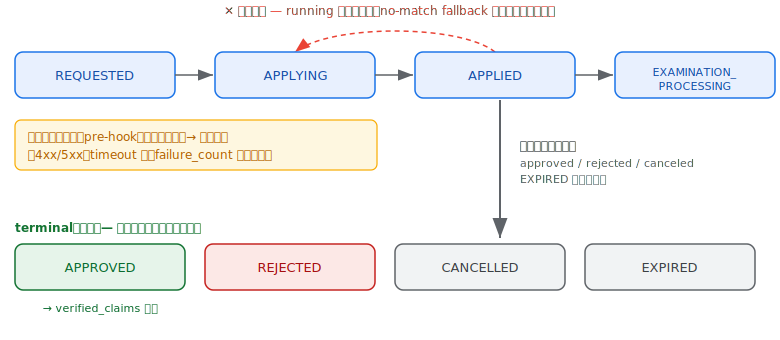
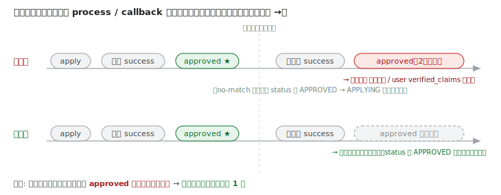

# v0.11.0 影響確認 — verified_claims の OIDC4IDA 準拠化・配信・移行

本ドキュメントは **v0.11.0** に含まれる `verified_claims`（身元確認済みクレーム）関連の変更と、その**利用者側（RP / テナント運用者）への影響**をまとめる。

**Issue #1435 / PR #1514 対応**: 身元確認済みクレーム（`verified_claims`）の Access Token 出力構造を OIDC4IDA 準拠のネスト構造に修正し、UserInfo エンドポイントでの返却に対応した。

**Issue #1628 追加対応**: UserInfo を `claims` パラメータ（OIDC4IDA 標準の要求方式）経由でも返せるようにし、`verified_claims` の §5.7「要求より少なく返す」挙動を仕様精査に基づいて見直した（claims が空でも `verification` は返す）。あわせて「何のクレームに同意したか」の記録を grant に自己完結保存する内部変更を行った。

## 影響まとめ

| 変更 | 種別 | 対象 |
|------|------|------|
| Access Token の `verified_claims` がフラット → ネスト構造（`verification` + `claims`）になる | 🔴 破壊的 | `access_token_selective_verified_claims` を有効にしているテナントと、その Access Token を消費する RP / リソースサーバー |
| UserInfo が `verified_claims` を返すようになる（スコープ経由） | 🟢 追加 | `access_token_selective_verified_claims` + `verified_claims:*` スコープを使うテナント |
| UserInfo が **`claims` パラメータ（OIDC4IDA 標準）経由**でも `verified_claims` を返す（フラグ不要） | 🟢 追加 | `claims` パラメータで `userinfo.verified_claims` を要求する RP（#1628） |
| 要求クレームが全て利用不可/不一致でも **`verification` + 空 `claims` を返す**（従来の「全体省略」を見直し） | 🟡 挙動変更 | `verified_claims` を消費する RP（§5.7 / #1512 の挙動見直し） |
| `claims` パラメータの `value` / `values` 制約が verified_claims 要求でも適用される（従来は無視） | 🟡 挙動変更 | `claims` で `value`/`values` 制約付き verified_claims を要求する RP（#1624） |
| `verified_claims:*` スコープ・`access_token_selective_verified_claims` フラグの設定追従 | 🟡 設定 | eKYC / 身元確認を提供するテナント |
| Discovery に OIDC4IDA §8 メタデータ（`verified_claims_supported` 等）を広告＋ evidence/trust_frameworks の supported 値を 1.0 正規値へ | 🟢 追加 / 🟡 挙動変更 | テナントの Discovery を読む RP（#1513 / #1651） |
| `verified_claims` 要求（同意内容）を grant に sentinel 形式で自己完結保存（ID Token 側も対象） | ⚙️ 内部/運用 | テナント運用者（ローリングデプロイ / 同意レコード） |
| 身元確認申込みのステータス遷移を状態機械化（前進のみ・終端吸収・hard error 非遷移） | 🟡 挙動変更 | eKYC / 身元確認を提供するテナント（**承認 → `verified_claims` 付与**の前提となるライフサイクル, #1617） |
| 承認時に標準クレーム・`custom_properties`・ユーザーステータスも更新可能に（`user_claims_mapping_rules` / `custom_properties_mapping_rules` / `user_status`） | 🟢 追加 | eKYC / 身元確認を提供するテナント（承認時のユーザー属性更新, #1582） |
| `verified_claims` / `custom_properties` の更新ポリシー（`*_update_policy`）を追加 | 🟢 追加 / 🟡 設定 | 段階的KYC・属性同期を行うテナント（#1584） |
| 承認時に実際適用した `user_claims` / `custom_properties` / `user_status` を結果レコードに記録（`applied_user_claims` カラム追加） | 🟢 追加 | eKYC / 身元確認を提供するテナント（承認時のユーザー属性変更の**監査・トレーサビリティ**, #1607） |

---

## 1. Access Token の構造変更（破壊的）

### Before（フラット展開）

```json
{
  "verified_claims": {
    "given_name": "Taro",
    "family_name": "Yamada"
  }
}
```

### After（OIDC4IDA 準拠のネスト構造）

```json
{
  "verified_claims": {
    "verification": {
      "trust_framework": "eidas"
    },
    "claims": {
      "given_name": "Taro",
      "family_name": "Yamada"
    }
  }
}
```

`verification`（検証プロセスのメタデータ）と `claims`（検証済みクレーム値）が分離される。これは [OpenID Connect for Identity Assurance 1.0](https://openid.net/specs/openid-connect-4-identity-assurance-1_0.html) の `verified_claims` 構造に準拠する。

> **Access Token でも正規構造を使う根拠**: OIDC4IDA §4.7 は Access Token での `verified_claims` 利用を「可能」と述べるのみで構造を規定しない。この穴を [RFC 9068](https://www.rfc-editor.org/rfc/rfc9068.html) §2.2.2（IANA 登録済みクレームは登録名・定義に従って encode すべき(SHOULD)）が補完する。`verified_claims` は IANA JWT Claims Registry 登録済みで、参照先が OpenID Identity Assurance Schema Definition 1.0 §5。その §5.2 / §5.4.2 が `verification`（必須）+ `claims`（必須）のネスト構造と `verification.trust_framework` 必須を定める。したがって Access Token・ID Token・UserInfo の全配信先で同一の正規構造を用い、AT だけフラット／独自形にはしない。

### RP / リソースサーバー側の対応

クレーム値の参照パスを変更する。

| Before | After |
|--------|-------|
| `verified_claims.given_name` | `verified_claims.claims.given_name` |
| （`verification` は存在しなかった） | `verified_claims.verification.trust_framework` 等が参照可能に |

> Access Token の `verified_claims` 出力は選択モード（`access_token_selective_verified_claims`）に一本化されている（旧・全量モード `access_token_verified_claims` は #1603 で廃止）。

### 移行手順（破壊的変更の安全なロールアウト）

サーバーは新旧構造を**同時には出力しない**（ネスト構造へ一括切替）。RP（クライアント / リソースサーバー）が旧構造前提のままサーバーを更新すると壊れるため、**RP を先に両対応させてから切り替える**。

1. **RP を新旧両対応にする（先行リリース）**
   RP のパースをフラット（旧）・ネスト（新）の両方を受理するよう更新してデプロイする。
   - 新（優先）: `verified_claims.claims.<claim>`
   - 旧（フォールバック）: `verified_claims.<claim>`

   この時点ではサーバーは旧構造のまま。両対応にしてあるので RP は壊れない。

2. **新バージョンをリリース**
   サーバーを更新し、`verified_claims` をネスト構造で出力する。RP は既に両対応済みのため無停止で切り替わる。

3. **RP のフラット（旧構造）フォールバックを削除**
   全サーバーが新バージョンに切り替わったことを確認後、**手順1で RP に追加したフラット構造のフォールバック処理**を削除する。これで RP はネスト構造のみを扱う実装に整理される。

> 「RP 両対応 → サーバー新バージョンリリース → フォールバック削除」の順を守ること。サーバー先行で切り替えると、未対応の RP で `verified_claims` 参照が壊れる。

---

## 2. UserInfo での verified_claims 返却（追加）

これまで UserInfo は `verified_claims` を返さなかったが、本変更で返却するようになった。Access Token / ID Token と同じネスト構造（`verification` + `claims`）で返る。

```json
// GET /v1/userinfo の応答（抜粋）
{
  "sub": "...",
  "verified_claims": {
    "verification": { "trust_framework": "eidas" },
    "claims": { "given_name": "Taro", "family_name": "Yamada" }
  }
}
```

### 2.1 2つの要求方式

| 方式 | 要求方法 | フラグ | 位置づけ |
|------|---------|--------|---------|
| `verified_claims:*` スコープ | Access Token のスコープ | `access_token_selective_verified_claims: true` が**必要** | idp-server 独自拡張。要素単位の選択は [3.1](#31-スコープの列挙) |
| `claims` パラメータ（#1628） | 認可リクエストの `claims` の `userinfo.verified_claims` メンバ | **不要** | OIDC4IDA 標準。`value` / `values` 制約や §5.7 の選択的省略が適用される |

> スコープ経由は `access_token_selective_verified_claims` フラグに依存するが、**`claims` パラメータ経由はフラグ非依存**で動作する（標準の要求メカニズムのため）。スコープ経由で返る `claims` は Access Token が持つ `verified_claims:<claim>` スコープに対応するものに限られ、`verification` の任意要素は `verified_claims:verification:<element>` スコープで選択する（[3.1](#31-スコープの列挙)）。

### 2.2 競合時の優先順位

両経路はどちらもトップレベルの `verified_claims` キーを生成するため、1リクエストで両方が指定された場合は **`claims` パラメータ（標準）を優先**し、`verified_claims:*` スコープ（独自拡張）側は出力しない（両方を同時指定する RP は実運用では想定していない）。

### 2.3 返却ルール（§5.7「要求より少なく返す」）

要求したクレームのうち、ユーザーが保持しない／`value`・`values` 制約に一致しないものは個別に省かれる。その結果 `claims` が空になっても、**`verification` が有効なら `verified_claims` は `verification` + 空 `claims`（`claims: {}`）で返す**。IDA スキーマが「`claims` は空でよい」と定める（[IDA-verified-claims §5.3](https://openid.net/specs/openid-ida-verified-claims-1_0.html)）ため、§5.7.5 の親要素省略は空 `claims` では発火しない、という仕様精査の結論による（#1512 の「全体省略」を見直し）。

`verified_claims` を**丸ごと省略**するのは **`verification` 要件が満たせない場合のみ**（`verification` 要素の `value`/`values` 不一致、または必須の `trust_framework` をユーザーが持たない＝§5.7.4）。この挙動は ID Token / UserInfo で共通（OIDC4IDA は配信先を区別しない §5.2）。

> **RP への影響**: 「`verified_claims` が無い＝ユーザーは検証済み属性を持たない」と決め打ちしないこと。要求クレームが揃わなくても `{"verification": {...}, "claims": {}}` が返り得る。

> **v0.11.0 修正（#1624）**: `claims` パラメータの `value` / `values` 制約が verified_claims 要求で無視されていた問題を修正した（OIDC4IDA 5.5.1 / 5.7.4）。指定した `value` / `values` に一致しない検証済みクレームは返らない（制約マッチが効く）ようになったため、`value`/`values` で絞り込む RP は返却が変わり得る。

---

## 3. 設定の追従

### 3.1 スコープの列挙

`verified_claims` の出力は **2種類のスコープ**で要素単位に制御する。いずれも **クライアントの `scope` に列挙する（必須・スコープ付与の制御点）**。テナントの `scopes_supported` にも列挙することを推奨するが、これは OpenID Connect Discovery / RFC 8414 上の広告用メタデータであり、付与可否の制御には影響しない（実際のスコープ付与は `client.scope` で決まる）。

| スコープ | 選択対象 | 例 |
|---------|---------|----|
| `verified_claims:<claim>` | `claims` 内の検証済みクレーム | `verified_claims:given_name` |
| `verified_claims:verification:<element>` | `verification` 内の検証メタデータ | `verified_claims:verification:trust_framework` / `verified_claims:verification:evidence` |

> 本来 `claims` 内の要素は `verified_claims:claims:<claim>` だが、冗長なため **`claims:` を省略**し `verified_claims:<claim>` とする。`verification:` セグメントは検証済みクレームとの区別のため残す（`verified_claims:verification:` 名前空間は常に `verification` 要素として扱われる）。

```json
// client.scope（クライアント登録）★ スコープ付与の制御点（必須）
"openid profile email transfers verified_claims:given_name verified_claims:family_name verified_claims:birthdate verified_claims:address verified_claims:verification:trust_framework"
```

```json
// authorization_server.scopes_supported（テナント）★ Discovery 広告用（推奨・enforce されない）
[
  "openid", "profile", "email", "transfers",
  "verified_claims:given_name",
  "verified_claims:family_name",
  "verified_claims:birthdate",
  "verified_claims:address",
  "verified_claims:verification:trust_framework",
  "verified_claims:verification:evidence"
]
```

> **データ最小化**: `claims` と `verification` の**任意要素**は、**スコープで明示的に要求した要素だけ**が返る（OIDC4IDA §5.4 / §7）。
> - ただし `verification.trust_framework` は IDA スキーマ上 `verification` の**必須要素**なので、スコープ要求の有無に関わらず**常に含まれる**（`verification: {}` は非準拠のため出さない）。`verified_claims:verification:trust_framework` スコープは Discovery 広告・明示要求用で、付与しなくても `trust_framework` は返る。
> - 特に `verification.evidence` は書類番号・確認トランザクションID 等の**生PII**を含むため、`verified_claims:verification:evidence` を明示要求しない限り返さない（**オプトイン**）。
> - ユーザーが `trust_framework` を持たない場合（マッピング設定不備等）は、`verification` 要件を満たせないため §5.7.4 に従い `verified_claims` 全体を返さない。
> - 選択できる要素名はテナントの verified_claims マッピング設定に追従する（コード側で固定リストを持たない）。

### 3.2 フラグの有効化

`authorization_server.extension` に出力モードのフラグを設定する。

```json
{
  "extension": {
    "access_token_selective_verified_claims": true
  }
}
```

### 3.3 出力モード

| フラグ | 出力先 | クレーム選択 | 構造 |
|--------|--------|-------------|------|
| `access_token_selective_verified_claims: true` | Access Token **および** UserInfo | `verified_claims:*` スコープに対応するクレームのみ | `verification` + `claims` |

> `access_token_selective_verified_claims` は Access Token と UserInfo の**両方**の選択的返却を制御する。UserInfo に `verified_claims` を返したい場合はこのフラグを有効にする（**スコープ経由のみ**。`claims` パラメータ経由はフラグ不要 = [2.1](#21-2つの要求方式)）。
> 旧 `access_token_verified_claims`（スコープ不問で全量を Access Token に焼き込むモード）は #1603 で廃止し、選択モードに一本化した。データ最小化（§3.1）の観点でも全量配信は非推奨だったため。

### 3.4 同意記録の永続化（運用者向け）

`claims` パラメータで要求された `verified_claims`（＝ユーザーが何に同意したか）は、grant の `userinfo_claims`（#1628）に **sentinel トークン `vc:<base64url(JSON)>`** として永続化される（DB スキーマ変更なし）。grant を「同意内容の権威ある記録」とし、トークン発行時に元の認可リクエストが無くても `verified_claims` を組み立てられるようにするため。同じ方式を ID Token 側（`id_token_claims`）にも展開中（#1628 フォローアップ）。

- **ローリングデプロイ / ロールバック安全**: 旧バージョンは未知の `vc:` トークンを単に無視する（クレーム出力は `values.contains("name")` 等の**既知名チェック**で、トークン集合を列挙しない）。新旧混在・巻き戻しでもクラッシュや誤クレーム混入は起きない。
- **同意内容の確認**: 現状この sentinel は Grant 管理 API のレスポンスには出していない（`scopes` のみ）。同意した `verified_claims` を API から観測可能にする対応は #1644 で追跡。

### 3.5 Discovery メタデータ（OIDC4IDA §8 / #1513・#1651）

Discovery エンドポイント（`/.well-known/openid-configuration`）が OIDC4IDA §8 の身元確認メタデータを広告するようになった。RP はこれを読んで、テナントが対応する trust framework・evidence 種別・検証済みクレームを判別できる。

| フィールド | 内容 |
|-----------|------|
| `verified_claims_supported` | 身元確認済みクレームに対応するか（boolean） |
| `trust_frameworks_supported` | 対応する信頼フレームワーク（例: `eidas`） |
| `evidence_supported` | 対応する証拠タイプ（例: `document` / `electronic_record`） |
| `documents_supported` / `documents_methods_supported` | 対応する本人確認書類・確認方式 |
| `electronic_records_supported` | 対応する電子記録 |
| `claims_in_verified_claims_supported` | `claims` に入れられる検証済みクレーム名 |

> あわせて #1651 で `evidence` / `trust_frameworks` の supported 値を **OIDC4IDA 1.0 の正規値**へ正規化した。RP 側で supported 値を固定列挙している場合は追従が必要。広告される値はテナントの verified_claims 設定に追従する（コード側の固定リストではない）。

---

## 4. 身元確認申込みステータスのライフサイクル整理（#1617）

`verified_claims` はテナント設定の `result.verified_claims_mapping_rules` に基づき、身元確認申込みが **承認（`APPROVED`）に遷移したとき**にユーザーへ書き込まれる（実装: `IdentityVerificationUserUpdater`）。したがって申込みステータスの遷移が正しいことが、verified_claims を「いつ・正しく付与するか」の前提になる。

v0.11.0 ではステータス遷移評価を**ステートレス評価から状態機械**へ整理した（Phase 1）。従来は「現在のステータス」を入力に取らず、条件にマッチしないと経路（process / callback）ごとに**異なる固定値へ fallback**していたため、後退遷移や hard error による意図しない遷移が起きていた。

### ステータス遷移図



### Phase 1 で保証されること

- **前進のみ（後退禁止）**: running 4相（`REQUESTED → APPLYING → APPLIED → EXAMINATION_PROCESSING`）は前進のみ。callback で進んだ後に process が no-match でも、固定 fallback（`APPLYING`）へ巻き戻らない。
- **終端は吸収**: `APPROVED` / `REJECTED` / `EXPIRED` / `CANCELLED` に入ったら、以降の process / callback 評価では遷移しない。
- **失敗試行は遷移しない**: その試行が success でない場合（pre-hook 検証エラー・追加パラメータ解決エラー・外部 API 実行エラー: HTTP 4xx/5xx・timeout・接続失敗）は `failure_count` のみ記録し、ステータスは据え置く。失敗試行でロック・リトライ条件（#1608）は従来どおり機能する。
- **終端イベントの冪等性**: 終端（`APPROVED` / `REJECTED` / `CANCELLED`）への遷移に伴う副作用（ライフサイクルイベント発火・検証結果 register・user の verified_claims 更新）は、**「今ステップで新規に終端へ遷移した」ときのみ 1 回**発火する。終端済み申込みへ成功する process / callback を再投入しても二重に発火しない（`handleTerminalTransition` / callback が遷移前ステータスで判定）。

### 設計（一箇所への集約）

ステータス決定ロジックは `IdentityVerificationApplicationStatusEvaluator` に集約した。`evaluateInitial`（初回申込み）/ `evaluateOnProcess`（hard error スキップ込み）/ `evaluateOnCallback` が「候補算出 → 現ステータスとの reconcile（終端吸収・後退禁止）」までを担い、申込み集約（`IdentityVerificationApplication`）は試行回数の記録に専念する。ユニットテスト: `IdentityVerificationApplicationStatusReconcileTest`。

ライフサイクルイベント（`*_approved` / `*_rejected` / `*_cancelled`）と検証結果 register・user 更新は、`handleTerminalTransition`（process）/ callback 経路の終端ブロックで行うが、**遷移前ステータスを見て「新規の終端遷移」のときだけ実行**するようガードした。

### 申込みデータとセキュリティイベントの関係（変更前後）

ステータス遷移の整理（前進のみ・終端吸収・失敗試行は非遷移）と終端イベントの遷移ガードにより、**申込みデータの状態とライフサイクルイベントの発火が 1 対 1 で対応**するようになった。

| シナリオ | 変更前（申込みデータ / イベント） | 変更後（申込みデータ / イベント） |
|---------|--------------------------------|--------------------------------|
| 失敗試行（検証 / pre-hook / 実行エラー） | status → `APPLYING` へ移動（fallback）／ `failure_count++` ／ `{type}_{process}_failure` | status **据え置き** ／ `failure_count++` ／ `{type}_{process}_failure` |
| 進行済み申込みへの no-match 成功（例: `APPLIED` 後に条件不一致の process） | status → `APPLYING` へ**後退** ／ `{type}_{process}_success` | status **据え置き（`APPLIED`）** ／ `{type}_{process}_success` |
| 正当な終端遷移（例: `APPLIED → APPROVED`） | status → `APPROVED` ／ `*_approved` 1 回 + 検証結果 register + user 更新 | （同じ）status → `APPROVED` ／ `*_approved` 1 回 + result register + user 更新 |
| 終端済み申込みへの**成功再投入**（process / callback） | no-match なら status が `APPROVED → APPLYING` へ**巻き戻り（承認消失）**、再承認なら **`*_approved` 二重発火 + 検証結果 二重 register + user 冗長更新** | status は `APPROVED` **維持（吸収）** ／ **遷移ガードで終端イベント・result・user 更新は再発火しない** |



**変更後のイベント発火ルール**:

- `*_failure`：失敗試行ごと（ステータスは動かさない）
- `*_success`：成功した process / callback ごと（ステータスが進む / 据え置きに関わらず）
- 終端イベントは **到達した終端 1 種のみ**（`*_approved` / `*_rejected` / `*_cancelled` は排他）で、**「今ステップで新規に終端へ遷移した」ときのみ 1 回**発火する。
  - 検証結果 register・user の verified_claims 更新は **`*_approved` 固有の副作用**。`*_rejected` / `*_cancelled` はイベント発火のみで、結果登録・user 更新は伴わない。
  - 例: **cancel パターン**（`... → APPLIED → cancel`）では `*_cancelled` のみ発火し、**`*_approved` は発火しない**（verified_claims 付与・結果 register も起きない）。`reject` も同様に `*_rejected` のみ。

> **スコープ外（Phase 2 / #1617）**: no-match 時の fallback 廃止（＝完全な「現状維持」）、transition config への running 系ターゲット（`applying` / `examination_processing`）開放、evaluator から fallback を取り除く構造変更は本リリースでは未対応。既存テナント設定の移行を伴うため別途対応する。

---

## 5. 承認時のユーザー属性更新と適用値の記録（#1582 / #1584 / #1607）

§4（#1617 のライフサイクル整理）のとおり、申込みが **承認（`APPROVED`）に遷移したとき** `IdentityVerificationUserUpdater` がユーザーへ属性を書き込む。v0.11.0 では、この承認時更新の **対象（5.1）・マージ戦略（5.2）・適用記録（5.3）** を拡張した。

### 5.1 更新できる属性（#1582）

従来 `verified_claims` のみだった承認時のユーザー更新を、テナント設定 `result` で以下にも広げた。

| 設定 | 更新対象 | 概要 |
|------|---------|------|
| `user_claims_mapping_rules` | 標準クレーム（`family_name` / `given_name` / `address` 等） | OIDC 標準プロフィールクレームのみ（**allowlist**）。`name` / `email` / `phone_number` 更新時は IDポリシーで `preferred_username` を再計算 |
| `custom_properties_mapping_rules` | `custom_properties`（業務属性） | キー単位マージ |
| `user_status` | ユーザーステータス | 省略時 `IDENTITY_VERIFIED`、`KEEP` で現状維持、任意 `UserStatus` で指定遷移 |

詳細・制約（allowlist の全列挙、型不一致時の fail-closed、`preferred_username` 一意制約による 409 等）は [身元確認設定ガイドの Result セクション](../content_06_developer-guide/05-configuration/identity-verification.md) を参照。

> **eKYC テナントへの影響**: 承認時に標準クレーム・業務属性・ステータスをまとめて更新できるようになった。設定 `result` のマッピング次第でユーザーレコードが書き換わるため、宛先クレームとポリシーを明示的に設計すること（`verified_claims` 以外へ更新範囲が広がった点に注意）。

### 5.2 更新ポリシー（#1584）

`verified_claims` と `custom_properties` の反映方法を選べるようにした。

| ポリシー | 値 | 用途 |
|---------|----|----|
| `verified_claims_update_policy` | `merge`（既定）/ `deep_merge` / `replace` | 段階的KYC で複数審査のクレームを共存させるなら `deep_merge` |
| `custom_properties_update_policy` | `merge`（既定）/ `replace_managed` | 宣言キーのみ審査結果と同期したいなら `replace_managed`（値が出なかった宣言キーは削除） |

> 既定は全経路（申込み承認・コールバック・直接登録）共通で `merge`。2つのポリシーで選択肢が異なる設計意図（`verified_claims` は IDA 専有の2層構造、`custom_properties` は他機能も書き込む共有のフラットなキー集合）は設定ガイド参照。

### 5.3 適用値の記録（#1607）

従来、結果レコード（`identity_verification_result`）には `verified_claims` しか残らず、5.1 で広げた標準クレーム・custom_properties・ステータスの変更は**痕跡が残らなかった**。v0.11.0 では結果レコードに **`applied_user_claims`**（JSONB カラム）を追加し、その承認で**実際に適用した値**を記録する。各結果行が「この承認で何が変わったか」を自己記述するため、監査・トラブルシュートに利用できる。

```json
// 結果レコード / 結果取得API レスポンスの applied_user_claims
{
  "applied_user_claims": {
    "user_claims": { "family_name": "山田", "given_name": "太郎" },
    "custom_properties": { "kyc_level": "gold" },
    "user_status": "IDENTITY_VERIFIED"
  }
}
```

- **適用が無かったパートは省略**される（`user_status` が `KEEP`・遷移なし、`user_claims_mapping_rules` 未設定など）。変わったものだけを保持する。
- 結果取得API（`GET /{tenant-id}/v1/me/identity-verification/results`）および管理APIのレスポンスに `applied_user_claims` として含まれる。
- 設定は不要（承認時に自動で記録される出力）。

#### 移行（ローリングデプロイ安全）

`applied_user_claims` は `identity_verification_result` への **nullable な `ADD COLUMN` のみ**（マイグレーション `V0_11_0_1`、PostgreSQL / MySQL 両対応・index なし）。既存行は `NULL` となり後方互換で破壊的変更はない。投入済みテーブルへの `CREATE INDEX`（ストップザワールド）も避けている。

---

## 6. 動作確認

`verified_claims:given_name verified_claims:family_name` スコープで Access Token を取得し、AT のデコードと UserInfo の双方でネスト構造を確認する。`verification.trust_framework` が（スコープ未要求でも）常に含まれ、未要求の `evidence` が含まれないこと（オプトイン）、ユーザーが保持するが未要求の `birthdate` 等が含まれないこと（データ最小化）もあわせて確認する。

| 経路 | E2E テスト |
|------|-----------|
| スコープ経由（AT / UserInfo 構造）| `e2e/src/tests/usecase/ekyc/ekyc-01-verified-claims-at-userinfo-structure.test.js` |
| `claims` パラメータ経由・§5.7 返却ルール（ID Token / UserInfo）| `e2e/src/tests/spec/oidc_for_identity_assurance.test.js` |
| 承認時の `applied_user_claims` 記録（#1607）| `e2e/src/tests/integration/ida/integration-10-identity-verification-user-attribute-update.test.js` |

---

## 関連ドキュメント

- [スコープ・クレーム管理](../content_06_developer-guide/04-implementation-guides/oauth-oidc/scope-claims-management.md) — `claims:` / `verified_claims:` プレフィックスの仕組み
- [UserInfo エンドポイント](../content_06_developer-guide/03-application-plane/05-userinfo.md) — 2つの要求方式と優先順位
- [身元確認済みID（概念）](../content_03_concepts/05-advanced-id/concept-01-id-verified.md) — 標準（`claims` パラメータ）と独自仕様（`verified_claims:*` スコープ）の対比・優先順位
- [身元確認申込み実装ガイド](../content_06_developer-guide/03-application-plane/07-identity-verification.md)
