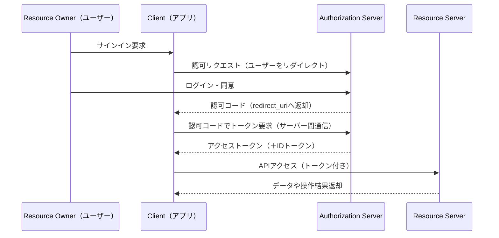

# 基本フロー：Authorization Code Flow（認可コードグラント）

---

## 概要

Authorization Code Flow（認可コードグラント）は、OAuth 2.0で最も広く使われている認可フローです。  
Webサービスやスマートフォンアプリ、API連携など、さまざまな場面で「安全かつ便利」に権限を委譲する標準的な方式です。

---

## 1. 関係者のおさらい

- **リソースオーナー（Resource Owner）：** データの所有者（通常はユーザー本人）
- **クライアント（Client）：** リソースへのアクセスを希望するWebサービスやアプリ
- **認可サーバー（Authorization Server）：** 権限を発行・管理するサーバー（例：GoogleやLINEの認可サーバー）
- **リソースサーバー（Resource Server）：** 実際にデータやAPIを持つサーバー（例：GoogleカレンダーAPI）

---

## 2. Authorization Code Flowの流れ

---

## 3. ポイント解説

- **ユーザーの認証と同意**は認可サーバーで実施され、利用者のパスワードはクライアント（サービスやアプリ）に渡りません。
- クライアントは一度「認可コード」を受け取り、バックエンドのサーバー間通信でアクセストークンを取得します。  
  → これにより、高い安全性が確保されます。
- アクセストークンを用いてリソースサーバーのAPIにアクセスできるのは、ユーザーが許可した範囲（スコープ）のみです。

---

## 4. セキュリティ上の利点

- パスワードを外部サービス（クライアント）に渡さないため、漏洩リスクを低減できます。
- 認可コードはワンタイムかつ短期間のみ有効です。トークンへの変換はクライアントのみが可能です。
- 通信はすべてHTTPSで行われ、盗聴や改ざんを防ぎます。
- 権限（スコープ）や有効期限も細かく管理でき、不要な権限の付与を防止します。

---

## 5. 実際の利用シーン

- Google、LINE、Facebookなどの「〇〇でログイン」機能
- 金融API連携（FAPI仕様などの高セキュリティ要件）
- eKYCや本人確認を伴うサービス、B2BのAPI連携

---

## 仕様参照

### RFC・仕様文書
- **[RFC 6749: Section 4.1 - Authorization Code Grant](https://tools.ietf.org/html/rfc6749#section-4.1)** - 認可コードグラント基本仕様
- **[RFC 7636: PKCE](https://tools.ietf.org/html/rfc7636)** - 認可コードフローの拡張セキュリティ
- **[OpenID Connect Core 1.0: Section 3.1](https://openid.net/specs/openid-connect-core-1_0.html#CodeFlowAuth)** - OIDC認可コードフロー
- **[OAuth 2.1 Draft](https://datatracker.ietf.org/doc/html/draft-ietf-oauth-v2-1)** - OAuth 2.1での認可コードフロー

### idp-server認可コードフロー実装

| コンポーネント | サポート状況 | 実装詳細 |
|-------------|-------------|----------|
| **基本フロー** | | |
| Authorization Endpoint | ✅ 完全対応 | RFC 6749 Section 3.1準拠 |
| Token Endpoint | ✅ 完全対応 | RFC 6749 Section 3.2準拠 |
| **セキュリティ拡張** | | |
| PKCE | ✅ 完全対応 | RFC 7636準拠 |
| State Parameter | ✅ 完全対応 | RFC 6749 Section 10.12準拠 |
| Nonce Parameter | ✅ 完全対応 | OIDC Core 1.0準拠 |
| **クライアント認証** | | |
| Client Secret Basic | ✅ 完全対応 | RFC 6749 Section 2.3.1準拠 |
| Client Secret Post | ✅ 完全対応 | RFC 6749 Section 2.3.1準拠 |
| Client Secret JWT | ✅ 完全対応 | RFC 7523準拠 |
| Private Key JWT | ✅ 完全対応 | RFC 7523準拠 |
| **レスポンスタイプ** | | |
| code | ✅ 完全対応 | 標準認可コードレスポンス |
| code id_token | ✅ 完全対応 | OIDC Core 1.0 Hybrid Flow |
| code token | ✅ 完全対応 | OIDC Core 1.0 Hybrid Flow |

### idp-server独自拡張

- **マルチテナント認可**: テナント単位での認可フロー分離
- **動的同意画面**: プラガブルな同意画面カスタマイズ
- **認可ポリシー**: カスタム認可判定ロジック
- **セキュリティ監視**: 認可フローのリアルタイム監視
- **監査証跡**: 認可リクエストの詳細ログ記録

---

> Authorization Code Flowは、現代のWebサービスやAPI連携の標準的な認可方式です。
> 安全性と利便性を両立するための必須知識ですので、しっかり理解しておきましょう。