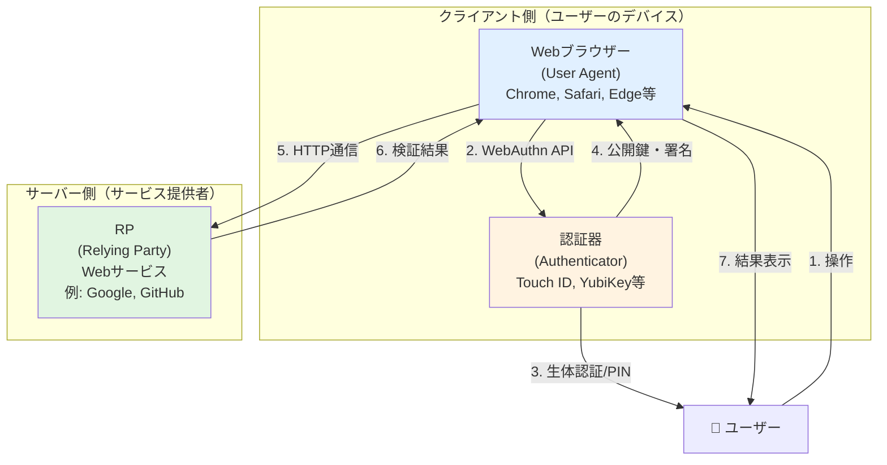
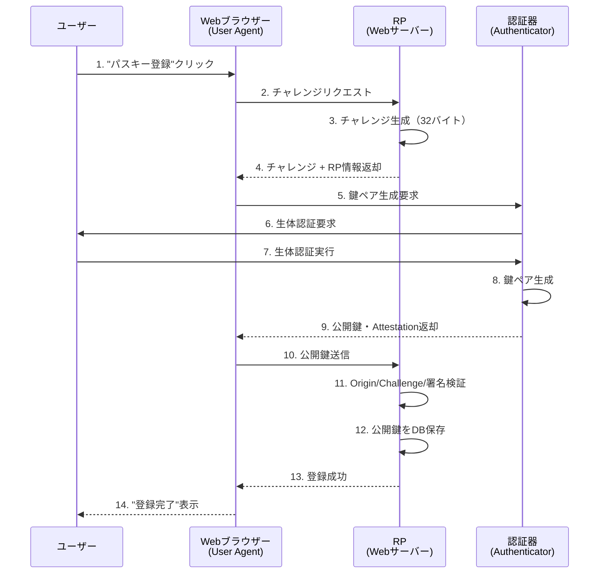
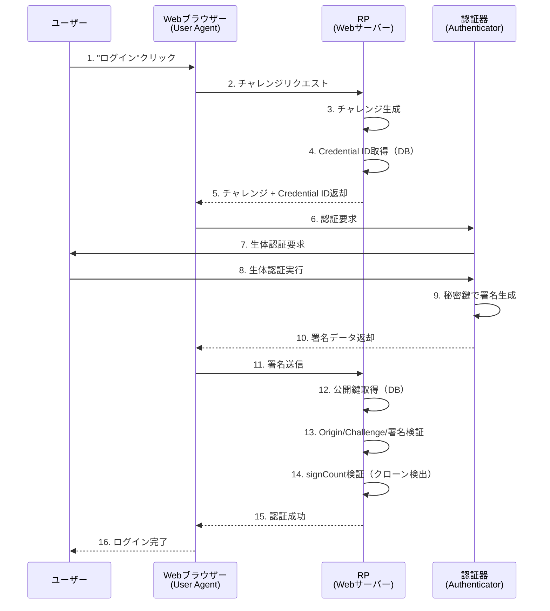

# FIDO2アーキテクチャ - RP・Webブラウザー・認証器の関係

---

## 概要

このドキュメントは、**W3C WebAuthn Level 2仕様**に基づいて、FIDO2/WebAuthnアーキテクチャの4つのコンポーネント（User、User Agent、Authenticator、Relying Party）とその関係を解説します。

**情報源**:
- [W3C WebAuthn Level 2 - Section 4. Terminology (Relying Party)](https://www.w3.org/TR/webauthn-2/#webauthn-relying-party)
- [W3C WebAuthn Level 2 - Section 5. Web Authentication API](https://www.w3.org/TR/webauthn-2/#sctn-api)

このドキュメントでは、以下を解説します：

- **W3C仕様における4つのコンポーネント**（User, User Agent, Authenticator, RP）
- **Relying Party (RP) の定義と責任**（W3C仕様準拠）
- **WebAuthn API**（`create()`と`get()`）
- **登録・認証の基本フロー**

**注意**: このドキュメントは概念の理解を目的としています。

---

## 用語の重要な注意事項

**W3C WebAuthn仕様では「FIDOサーバー」という用語は定義されていません。** 正式な用語は **Relying Party (RP)** です。

| 文脈 | 用語 | 説明 |
|------|------|------|
| **W3C WebAuthn仕様** | RP (Relying Party) | 公式用語 |
| **商用製品** | FIDOサーバー | LINE FIDO2 Server、Yubico FIDO2 Server等の**製品名** |
| **実装パターン1** | FIDO2サーバー製品を利用 | 商用製品を導入してRP機能を実現 |
| **実装パターン2** | 自前でRP実装 | WebAuthn4j等のライブラリを使用して独自実装 |

**このドキュメントでは、W3C仕様の正式用語「RP (Relying Party)」を使用します。**

---

## W3C WebAuthn仕様における4つのコンポーネント

### アーキテクチャ図



### コンポーネント定義（W3C仕様準拠）

| コンポーネント | W3C仕様用語 | 定義 | 実装例 |
|-------------|-----------|------|--------|
| **1. ユーザー** | User | 実際の人間 | あなた |
| **2. Webブラウザー** | User Agent | WebAuthn APIを実装し、RPと認証器を仲介するソフトウェア | Chrome, Safari, Edge |
| **3. 認証器** | Authenticator | 秘密鍵を保持し、公開鍵クレデンシャルを生成・署名する暗号化エンティティ | Touch ID（Platform）, YubiKey（Cross-platform） |
| **4. RP** | Relying Party | Web Authentication APIを利用してユーザーを登録・認証するWebサービス | Google, GitHub, idp-server |

### W3C仕様における各コンポーネントの役割

#### 1. User（ユーザー）
実際の人間で、認証器に対して生体認証（指紋、顔認証）やPIN入力を提供します。

#### 2. User Agent（Webブラウザー）
**定義**（W3C仕様）:
> "User Agentは、Relying Partyと認証器の間の通信を仲介するソフトウェアである。"

**役割**:
- WebAuthn API（`navigator.credentials.create()`、`navigator.credentials.get()`）を実装
- RPから受け取った情報を認証器に伝達
- 認証器からの応答をRPに返却
- **重要**: User AgentはRPと認証器を仲介するのみで、認証ロジックは持たない

#### 3. Authenticator（認証器）
**定義**（W3C仕様）:
> "認証器は、ハードウェアまたはソフトウェアに存在する暗号化エンティティであり、特定のRelying Partyにユーザーを登録し、後で登録された公開鍵クレデンシャルの所有を証明し、オプションでユーザーを検証できる。"

**役割**:
- 公開鍵・秘密鍵ペアの生成
- 秘密鍵の安全な保管
- 認証時の署名生成
- ユーザー検証（生体認証、PIN入力）

**種類**:
- **Platform Authenticator**: デバイス組み込み型（Touch ID、Face ID、Windows Hello）
- **Cross-platform Authenticator**: 外部デバイス型（YubiKey、Google Titan Key）

#### 4. Relying Party (RP)
**定義**（W3C仕様）:
> "Relying Partyは、ユーザーの登録と認証にWeb Authentication APIを利用するWebアプリケーションを持つエンティティである。"

**役割**:
- チャレンジ（ランダム値）の生成
- RP情報（rpId、rpName）の提供
- Attestation Statement（登録時）の検証
- Authentication Assertion（認証時）の検証
- 公開鍵クレデンシャルの保存・管理
- ユーザーアカウントとクレデンシャルの関連付け

**構成要素**（W3C仕様の説明より）:
- **バックエンドサーバー**: 公開鍵の保存、検証ロジックの実行
- **Webアプリケーション**: WebAuthn APIを呼び出すJavaScriptの提供
- **データベース**: ユーザー、クレデンシャル、RP IDの関連付けを保存

---

## Relying Party (RP) の責任（W3C仕様準拠）

W3C WebAuthn仕様では、RPは以下の責任を持ちます：

### 1. クレデンシャル管理

**登録時**:
- チャレンジ（ランダム値）の生成と一時保存
- RP情報（rpId、rpName）の提供
- Attestation Statementの検証
- **公開鍵クレデンシャルの永続化**

**認証時**:
- チャレンジの生成と一時保存
- **保存済み公開鍵の取得**
- Authentication Assertionの検証
- 署名の検証

> **W3C仕様より**: "RPは、登録された公開鍵クレデンシャルのコピーを保存し、それを使用して認証アサーションを検証する必要がある。"

### 2. サーバー側検証

RPは以下の検証を実行する必要があります：

| 検証項目 | 目的 | タイミング |
|---------|------|----------|
| **Origin検証** | フィッシング攻撃防止 | 登録・認証 |
| **Challenge検証** | 再利用攻撃防止 | 登録・認証 |
| **署名検証** | 認証器の正当性確認 | 登録・認証 |
| **Attestation検証** | 認証器の信頼性確認 | 登録のみ |
| **signCount検証** | クローン検出 | 認証のみ |

> **W3C仕様より**: "RPは、Attestation StatementとAuthentication Assertionを検証し、適切なセキュリティポリシーを適用する必要がある。"

### 3. プロトコル準拠

W3C仕様では、RPが以下の手順に従うことを義務付けています：

- **[Section 7.1 Registering a New Credential](https://www.w3.org/TR/webauthn-2/#sctn-registering-a-new-credential)**: 登録フローの詳細手順
- **[Section 7.2 Verifying an Authentication Assertion](https://www.w3.org/TR/webauthn-2/#sctn-verifying-assertion)**: 認証フローの検証手順

> **W3C仕様より**: "セキュリティ上の利点を実現するために、RPはこれらの手順に従う必要がある。"

### 4. セキュリティとプライバシーの考慮

W3C仕様では、RPの実装者に対して以下のセクションを注意深く読むよう要求しています：

- **[Section 13.4 Security considerations for Relying Parties](https://www.w3.org/TR/webauthn-2/#sctn-security-considerations-rp)**: セキュリティ考慮事項
- **[Section 14.6 Privacy considerations for Relying Parties](https://www.w3.org/TR/webauthn-2/#sctn-privacy-considerations-rp)**: プライバシー考慮事項

### RP実装の2つのパターン

RPの実装には、大きく2つのパターンがあります：

| パターン | 説明 | メリット | デメリット |
|---------|------|---------|----------|
| **FIDO2サーバー製品** | LINE FIDO2 Server、Yubico FIDO2 Server等の商用製品を利用 | 実装工数削減、サポート充実 | コスト、カスタマイズ制限 |
| **自前実装** | WebAuthn4j等のライブラリを使用して独自実装 | 柔軟性、コスト削減 | 実装工数、セキュリティ責任 |

idp-serverは、**自前実装パターン**を採用しています。

---

## WebAuthn API（W3C仕様準拠）

W3C WebAuthn仕様は、**PublicKeyCredential**インターフェースを中心とした**クライアント側API**を定義しています。

> **W3C仕様より**: "この仕様は、強力で、証明され、スコープ化され、公開鍵ベースのクレデンシャルをWebアプリケーションが作成・使用できるようにする。"

### 主要API

| メソッド | 用途 | 呼び出し元 | 説明 |
|---------|------|----------|------|
| `navigator.credentials.create()` | 登録 | Webアプリケーション（RP） | 新しい公開鍵クレデンシャルを生成 |
| `navigator.credentials.get()` | 認証 | Webアプリケーション（RP） | 既存のクレデンシャルを取得して署名生成 |
| `isUserVerifyingPlatformAuthenticatorAvailable()` | 機能確認 | Webアプリケーション（RP） | Platform Authenticatorの利用可能性を確認 |

### APIの役割分担

| 役割 | 実行主体 | 説明 |
|------|---------|------|
| **API呼び出し** | Webアプリケーション（RP） | JavaScriptから`create()`や`get()`を呼び出す |
| **プロトコル実装** | User Agent | WebAuthn仕様に従った処理を実行 |
| **暗号化操作** | Authenticator | 鍵ペア生成、署名生成、秘密鍵保管 |

### 重要な仕様上の注意点

> **W3C仕様より**: "この仕様は、サーバー側APIを定義していない。クライアント側APIのみを定義する。"

つまり、**RPの実装方法は各サービスの自由**です。W3C仕様はクライアント（ブラウザー）側の動作のみを標準化しています。

### WebAuthn APIの通信範囲

**重要な誤解の防止**:
- `navigator.credentials.create()`と`get()`は、**User Agentと認証器の間でのみ通信**します
- **これらのAPIはRPと直接通信しません**（ネットワーク通信は発生しない）
- RPとの通信は、別途`fetch()`等のHTTP通信で行う必要があります

```
【正しい通信フロー】
Webアプリ → fetch() → RP → チャレンジ返却
         ↓
Webアプリ → navigator.credentials.create() → 認証器（ローカル通信）
         ↓
認証器 → 公開鍵返却 → Webアプリ
                    ↓
Webアプリ → fetch() → RP → 検証・保存
```

---

## 登録・認証の基本フロー

### 登録フローの概要



**重要なポイント**:
1. **ローカル処理**: WebAuthn API（ステップ5-9）はネットワーク通信なし
2. **HTTP通信**: ブラウザー ↔ RPの通信（ステップ2, 10）
3. **検証**: RPがOrigin、Challenge、署名を検証（ステップ11）

### 認証フローの概要



**認証の2つのパターン**:

| パターン | allowCredentials | ユーザー名入力 | 用途 |
|---------|-----------------|--------------|------|
| **ユーザー名入力あり** | RPが指定（DB取得） | 必要 | 2要素認証 |
| **パスワードレス** | 空配列（Discoverable検索） | 不要 | パスワードレスログイン |

**詳細**: [basic-17: FIDO2・パスキー・Discoverable Credential](basic-17-fido2-passkey-discoverable-credential.md)

---

## まとめ

### 重要なポイント

1. **W3C仕様では4つのコンポーネントを定義**
   - **User**: 実際の人間（生体認証・PIN入力）
   - **User Agent**: Webブラウザー（WebAuthn API実装、RPと認証器の仲介）
   - **Authenticator**: 認証器（鍵ペア生成・署名生成・秘密鍵保管）
   - **Relying Party (RP)**: Webサービス（チャレンジ生成・検証・公開鍵保存）

2. **正しい用語は RP (Relying Party)**
   - W3C WebAuthn仕様の公式用語
   - 「FIDOサーバー」は商用製品の名称（LINE FIDO2 Server、Yubico FIDO2 Server等）
   - RPはWebサービス全体を指す（検証ライブラリではない）

3. **RPの主要な責任**
   - クレデンシャル管理（公開鍵の保存・管理）
   - サーバー側検証（Origin、Challenge、署名、signCount）
   - プロトコル準拠（W3C仕様の登録・認証フローに従う）
   - セキュリティとプライバシーの考慮

4. **WebAuthn APIはクライアント側のみ**
   - `navigator.credentials.create()`と`get()`は認証器とのみ通信（ローカル処理）
   - RPとの通信は別途HTTP通信（`fetch()`等）で行う
   - W3C仕様はサーバー側APIを定義していない（RP実装は自由）

5. **RP実装の2つのパターン**
   - **FIDO2サーバー製品**: LINE FIDO2 Server、Yubico FIDO2 Server等を利用
   - **自前実装**: WebAuthn4j等のライブラリを使用（idp-serverはこのパターン）

---

## 参考リソース

### W3C WebAuthn Level 2仕様
- **[Section 4. Terminology (Relying Party)](https://www.w3.org/TR/webauthn-2/#webauthn-relying-party)**: RP定義と責任
- **[Section 5. Web Authentication API](https://www.w3.org/TR/webauthn-2/#sctn-api)**: PublicKeyCredential、create()、get()
- **[Section 7.1 Registering a New Credential](https://www.w3.org/TR/webauthn-2/#sctn-registering-a-new-credential)**: 登録フローの詳細手順
- **[Section 7.2 Verifying an Authentication Assertion](https://www.w3.org/TR/webauthn-2/#sctn-verifying-assertion)**: 認証検証手順
- **[Section 13.4 Security considerations for Relying Parties](https://www.w3.org/TR/webauthn-2/#sctn-security-considerations-rp)**: RPのセキュリティ考慮事項
- **[Section 14.6 Privacy considerations for Relying Parties](https://www.w3.org/TR/webauthn-2/#sctn-privacy-considerations-rp)**: RPのプライバシー考慮事項

### 関連ドキュメント
- **[basic-16: FIDO2・WebAuthn パスワードレス認証](basic-16-fido2-webauthn-passwordless.md)**: FIDO2/WebAuthnの基礎概念
- **[basic-17: FIDO2・パスキー・Discoverable Credential](basic-17-fido2-passkey-discoverable-credential.md)**: Discoverable CredentialとConditional UI
- **[basic-19: FIDO2 登録フローとインターフェース詳細](basic-19-fido2-registration-flow-interface.md)**: 登録フロー詳細
- **[basic-20: FIDO2 認証フローとインターフェース詳細](basic-20-fido2-authentication-flow-interface.md)**: 認証フロー詳細
- **[basic-21: FIDO2・WebAuthn仕様の変遷](basic-21-fido2-webauthn-level-specification-evolution.md)**: Level 1 → 2 → 3の変遷

---

**このドキュメントは、W3C WebAuthn Level 2仕様に基づいて作成されています。**
