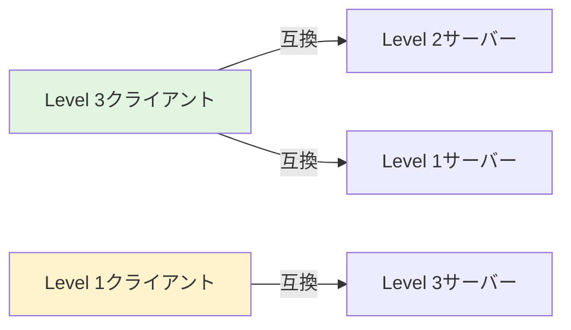

# FIDO2・WebAuthn仕様の変遷（Level 1 → 2 → 3）

---

## 概要

FIDO2は、パスワードレス認証を実現するための標準仕様であり、**WebAuthn**と**CTAP**の2つの標準で構成されています。

このドキュメントでは、**WebAuthn Level 1、Level 2、Level 3の仕様変遷**と、**各レベルで追加された主要機能**を詳細に解説します。

**情報源**:
- [W3C WebAuthn Level 1](https://www.w3.org/TR/webauthn-1/)
- [W3C WebAuthn Level 2](https://www.w3.org/TR/webauthn-2/)
- [W3C WebAuthn Level 3](https://www.w3.org/TR/webauthn-3/)
- [FIDO CTAP 2.1](https://fidoalliance.org/specs/fido-v2.1-ps-20210615/fido-client-to-authenticator-protocol-v2.1-ps-errata-20220621.html)

---

## FIDO2とWebAuthn・CTAPの関係

### FIDO2の構成要素

```
┌───────────────────────────────────────────────────┐
│                  FIDO2                            │
│  ┌─────────────────────┬──────────────────────┐  │
│  │   WebAuthn API      │       CTAP           │  │
│  │ （ブラウザAPI仕様）   │ （認証器通信プロトコル）│  │
│  │                     │                      │  │
│  │ Level 1 → 2 → 3     │  2.0 → 2.1 → 2.2     │  │
│  └─────────────────────┴──────────────────────┘  │
└───────────────────────────────────────────────────┘
```

### 各標準の役割

| 標準 | 策定組織 | 役割 | バージョン |
|------|---------|------|-----------|
| **WebAuthn** | W3C | WebブラウザとWebサービス間のAPI仕様 | Level 1 (2019) → Level 2 (2021) → Level 3 (2023) |
| **CTAP** | FIDO Alliance | クライアント（ブラウザ）と認証器間の通信プロトコル | 2.0 (2018) → 2.1 (2021) → 2.2 (2024予定) |

---

## WebAuthn Level 1（2019年3月 W3C Recommendation）

### 基本機能

WebAuthn Level 1は、FIDO2の基礎となるコア機能を定義した最初の標準仕様です。

#### 1. コア認証フロー

| フロー | API | 説明 |
|--------|-----|------|
| **登録（Registration）** | `navigator.credentials.create()` | 新しいクレデンシャル（公開鍵・秘密鍵ペア）を作成 |
| **認証（Authentication）** | `navigator.credentials.get()` | 既存のクレデンシャルで署名して認証 |

#### 2. 認証器タイプ

```javascript
// Platform Authenticator（内蔵型）
authenticatorSelection: {
  authenticatorAttachment: "platform"
}

// Cross-Platform Authenticator（外付け型）
authenticatorSelection: {
  authenticatorAttachment: "cross-platform"
}
```

| 認証器タイプ | 説明 | 例 |
|------------|------|---|
| **Platform Authenticator** | デバイス内蔵の認証器 | Touch ID, Face ID, Windows Hello |
| **Cross-Platform Authenticator** | 外部接続の認証器 | YubiKey, Titan Key |

#### 3. ユーザー検証（User Verification）

```javascript
authenticatorSelection: {
  userVerification: "required"    // 生体認証・PIN必須
  // userVerification: "preferred" // 可能なら実行
  // userVerification: "discouraged" // 不要
}
```

#### 4. Attestation（認証器の正当性証明）

```javascript
attestation: "none"      // Attestation不要（最も一般的）
// attestation: "indirect" // 匿名化されたAttestation
// attestation: "direct"   // 認証器の証明書チェーン付き
```

#### 5. 拡張機能（Extensions）の基本フレームワーク

Level 1では拡張機能の**フレームワークのみ定義**され、具体的な拡張は少数でした。

### Level 1の制限事項

- ❌ Resident Key（Discoverable Credential）の明示的な制御パラメータなし
- ❌ Conditional UI（オートフィル）未対応
- ❌ 高度な認証器管理機能なし
- ❌ JSON シリアライゼーション機能なし

---

## WebAuthn Level 2（2021年4月 W3C Recommendation）

### 主要な追加機能

Level 2では、Level 1の基本機能を拡張し、実用性とセキュリティを大幅に向上させました。

### 1. Resident Key（Discoverable Credential）の明示的制御

#### 新パラメータ: `residentKey`

Level 1では`requireResidentKey`（boolean型）のみでしたが、Level 2で**3段階の制御**が可能になりました。

```javascript
// Level 1（レガシー）
authenticatorSelection: {
  requireResidentKey: true  // boolean型のみ
}

// Level 2（標準）
authenticatorSelection: {
  residentKey: "required"   // 3段階制御
}
```

| 値 | 動作 | 用途 |
|---|------|------|
| `"required"` | Discoverable必須（作成できない場合はエラー） | パスワードレス認証 |
| `"preferred"` | 可能ならDiscoverable、不可能ならNon-Discoverable | 柔軟な実装 |
| `"discouraged"` | Non-Discoverable推奨（Discoverableも許容） | 2要素認証の2要素目 |

**重要な変更点**: Level 2から「Client-side discoverable credentials」という正式名称が採用され、`residentKey`パラメータが標準化されました。

### 2. FIDO U2F後方互換性拡張

#### appid拡張

```javascript
extensions: {
  appid: "https://example.com/u2f-appid.json"
}
```

| 拡張 | 用途 | 説明 |
|------|------|------|
| **appid** | 認証時 | FIDO U2Fで登録したクレデンシャルをWebAuthnで使用 |
| **appidExclude** | 登録時 | FIDO U2Fの既存クレデンシャルと重複登録を防止 |

### 3. 拡張機能の正式化

Level 2では多数の拡張機能が正式に定義されました。

| 拡張 | 説明 | 用途 |
|------|------|------|
| **credProps** | クレデンシャルプロパティ取得 | Resident Key作成確認 |
| **credProtect** | クレデンシャル保護レベル設定 | User Verification要件の強制 |
| **uvm** | User Verification Method | 使用された検証方法の取得 |
| **largeBlob** | 大容量データ保存 | 追加データの認証器保存 |
| **credBlob** | 小容量データ保存 | 認証器に小規模データ保存 |

#### credProps拡張の実装例

```javascript
// 登録時
extensions: {
  credProps: true
}

// レスポンス
credential.getClientExtensionResults() === {
  credProps: {
    rk: true  // Resident Keyとして作成されたか？
  }
}
```

### 4. AbortSignal統合（操作中断機能）

```javascript
const controller = new AbortController();

// WebAuthn操作を中断可能に
navigator.credentials.get({
  publicKey: options,
  signal: controller.signal
});

// 5秒後に中断
setTimeout(() => controller.abort(), 5000);
```

**用途**: タイムアウト処理、ユーザーによる操作キャンセル、複数認証フローの切り替え

### 5. PRF拡張（Pseudo-Random Function）

```javascript
extensions: {
  prf: {
    eval: {
      first: new Uint8Array([/* salt */])
    }
  }
}
```

**用途**: 認証器から擬似乱数値を取得（暗号化キー派生等）

### Level 2での改善まとめ

| 項目 | Level 1 | Level 2 |
|------|---------|---------|
| **Resident Key制御** | `requireResidentKey` (boolean) | `residentKey` (3段階) |
| **U2F互換** | なし | appid/appidExclude拡張 |
| **拡張機能** | 基本フレームワークのみ | 多数の実用拡張を正式化 |
| **操作中断** | なし | AbortSignal統合 |
| **自動化サポート** | なし | WebDriver統合 |

---

## WebAuthn Level 3（2023年10月 W3C Working Draft → 現行標準）

### 主要な追加機能

Level 3では、**ユーザー体験の大幅改善**と**マルチデバイス対応**が中心テーマです。

### 1. Conditional UI（オートフィル認証） ⭐ 最重要

**WebAuthn Level 3の最大の革新機能**

```javascript
// HTML
<input type="text"
       name="username"
       autocomplete="username webauthn" />

// JavaScript
const credential = await navigator.credentials.get({
  publicKey: publicKeyOptions,
  mediation: 'conditional'  // ← Conditional UI有効化
});
```

#### Conditional UIの特徴

| 項目 | 説明 |
|------|------|
| **表示方法** | ユーザー名入力欄のオートフィル候補としてパスキーが表示 |
| **動作タイミング** | ページロード時に自動的にバックグラウンドで起動 |
| **ユーザー操作** | 入力欄をタップ/クリックするだけでパスキー選択 |
| **ブラウザサポート** | Chrome 108+, Safari 16+, Edge 108+ |
| **標準化状況** | W3C Working Draft（現行標準） |

#### 実装例

```javascript
// 1. Conditional UI対応確認
if (PublicKeyCredential.isConditionalMediationAvailable &&
    await PublicKeyCredential.isConditionalMediationAvailable()) {

  // 2. ページロード時に起動（バックグラウンド）
  const credential = await navigator.credentials.get({
    publicKey: {
      challenge: challengeFromServer,
      allowCredentials: []  // 空 = Discoverable検索
    },
    mediation: 'conditional'
  });
}
```

**詳細**: [basic-17: FIDO2・パスキー・Discoverable Credential](basic-17-fido2-passkey-discoverable-credential.md)

### 2. JSON シリアライゼーション

Level 3では、ArrayBufferとJSONの相互変換機能が追加されました。

```javascript
// サーバーから受信したJSON
const optionsJSON = {
  challenge: "Y2hhbGxlbmdl",  // Base64URL文字列
  timeout: 60000,
  userVerification: "required"
};

// JSONからWebAuthnオプションに変換
const options = PublicKeyCredential.parseCreationOptionsFromJSON(optionsJSON);

// WebAuthn API呼び出し
const credential = await navigator.credentials.create({ publicKey: options });

// 結果をJSONに変換
const credentialJSON = credential.toJSON();

// サーバーに送信
await fetch('/register', {
  method: 'POST',
  body: JSON.stringify(credentialJSON)
});
```

#### 追加されたメソッド

| メソッド | 用途 |
|---------|------|
| `parseCreationOptionsFromJSON(json)` | 登録オプションのJSON→WebAuthn変換 |
| `parseRequestOptionsFromJSON(json)` | 認証オプションのJSON→WebAuthn変換 |
| `credential.toJSON()` | クレデンシャルのWebAuthn→JSON変換 |

**メリット**:
- ArrayBuffer ↔ Base64URL変換コードが不要
- サーバー・クライアント間のデータ送受信が簡単
- 実装コード量の削減

### 3. getClientCapabilities()

クライアントが対応している機能を取得できるメソッドが追加されました。

```javascript
const capabilities = PublicKeyCredential.getClientCapabilities();

// 結果例
{
  conditionalCreate: true,      // Conditional UI（登録）対応
  conditionalGet: true,         // Conditional UI（認証）対応
  hybridTransport: true,        // Hybrid Transport対応
  passkeyPlatformAuthenticator: true,  // Passkeyサポート
  userVerifyingPlatformAuthenticator: true,  // Platform認証器あり
  relatedOrigins: false         // Related Origins拡張未対応
}
```

**用途**:
- 機能検出によるフォールバック実装
- ブラウザ対応状況の確認
- 適切なUI表示の判断

### 4. Signal Methods（認証器通知メソッド）

認証器に対してクレデンシャルの変更を通知するメソッド群が追加されました。

```javascript
// 1. 不明なクレデンシャルを通知
PublicKeyCredential.signalUnknownCredential({
  rpId: "example.com",
  credentialId: unknownCredentialId
});

// 2. 有効なクレデンシャル一覧を通知
PublicKeyCredential.signalAllAcceptedCredentials({
  rpId: "example.com",
  allAcceptedCredentialIds: [id1, id2, id3]
});

// 3. 現在のユーザー情報を通知
PublicKeyCredential.signalCurrentUserDetails({
  rpId: "example.com",
  userId: currentUserId,
  name: "user@example.com",
  displayName: "ユーザー名"
});
```

| メソッド | 用途 |
|---------|------|
| **signalUnknownCredential()** | 認証失敗したクレデンシャルを認証器に通知 |
| **signalAllAcceptedCredentials()** | 有効なクレデンシャル一覧を同期 |
| **signalCurrentUserDetails()** | ユーザー情報の更新を通知 |

**効果**:
- 認証器内の古いクレデンシャルを削除
- Conditional UIの表示候補を最適化
- ユーザー名変更時の同期

### 5. Backup State/Eligibilityフラグ

`authenticatorData`のflagsに**マルチデバイス対応状況**を示すフラグが追加されました。

#### flags構造（Level 3）

| ビット | 名称 | Level | 説明 |
|-------|------|-------|------|
| bit 0 | UP (User Present) | Level 1 | ユーザーがタップした |
| bit 2 | UV (User Verified) | Level 1 | 生体認証・PIN完了 |
| bit 6 | AT (Attested Credential Data) | Level 1 | attestedCredentialData存在 |
| **bit 3** | **BE (Backup Eligibility)** | **Level 3** | **バックアップ可能** |
| **bit 4** | **BS (Backup State)** | **Level 3** | **バックアップ済み** |
| bit 5 | ED (Extension Data) | Level 2 | 拡張データ存在 |

#### Backup State/Eligibilityの判定

```javascript
// authenticatorDataのflagsから判定
const flags = authenticatorData[32];  // 33バイト目

const backupEligible = (flags & 0x08) !== 0;  // bit 3
const backupState = (flags & 0x10) !== 0;     // bit 4

// 認証器タイプの判定
if (backupEligible && backupState) {
  console.log("マルチデバイス認証器（クラウド同期済み）");
  // 例: iCloud Keychain, Google Password Manager
} else if (backupEligible && !backupState) {
  console.log("マルチデバイス認証器（未同期）");
} else {
  console.log("シングルデバイス認証器");
  // 例: YubiKey, TPMローカル保存
}
```

#### 用途

| 認証器タイプ | BE | BS | 説明 | 例 |
|------------|----|----|------|---|
| **マルチデバイス（同期済み）** | 1 | 1 | クラウド同期されたパスキー | Apple Passkey, Google Passkey |
| **マルチデバイス（未同期）** | 1 | 0 | 同期可能だが未実行 | - |
| **シングルデバイス** | 0 | 0 | デバイス固有のクレデンシャル | YubiKey, セキュリティキー |

**セキュリティポリシーへの応用**:
- 企業環境でシングルデバイス認証器のみ許可
- マルチデバイス認証器のみ許可（利便性重視）
- 認証器タイプに応じたリスクベース認証

### 6. Related Origins拡張

複数の関連ドメイン間でクレデンシャルを共有できる拡張機能です。

```javascript
// 登録時
extensions: {
  relatedOrigins: ["https://example.com", "https://app.example.com"]
}
```

**用途**: 同一組織内の複数サブドメイン間でのSSO実現

### 7. Hints（認証器タイプのヒント）

```javascript
hints: ["security-key", "client-device", "hybrid"]
```

| hint値 | 説明 |
|--------|------|
| `"security-key"` | セキュリティキーを優先 |
| `"client-device"` | Platform Authenticatorを優先 |
| `"hybrid"` | スマートフォン連携を優先 |

**効果**: ブラウザがユーザーに最適な認証器を提案

### Level 3での改善まとめ

| 項目 | Level 2 | Level 3 |
|------|---------|---------|
| **UX** | 通常のフロー | Conditional UI（オートフィル） |
| **JSON処理** | 手動変換必要 | toJSON()/parseFromJSON()で自動 |
| **機能検出** | 限定的 | getClientCapabilities()で詳細取得 |
| **認証器管理** | なし | Signal Methods（通知機能） |
| **マルチデバイス対応** | 不明 | BE/BSフラグで明示 |
| **関連ドメイン** | なし | Related Origins拡張 |

---

## CTAP（Client to Authenticator Protocol）の変遷

### CTAP 2.0（2018年）

**基本機能**: WebAuthn Level 1に対応する認証器プロトコル

| 機能 | 説明 |
|------|------|
| **makeCredential** | 新しいクレデンシャル作成 |
| **getAssertion** | 認証署名生成 |
| **getInfo** | 認証器情報取得 |
| **clientPIN** | PIN設定・変更 |
| **reset** | 認証器リセット |

### CTAP 2.1（2021年）

**主要な追加機能**:

| 機能 | 説明 | 用途 |
|------|------|------|
| **credProtect拡張** | クレデンシャル保護レベル設定 | User Verification要件の強制 |
| **minPinLength** | 最小PIN長の設定 | セキュリティポリシー強化 |
| **Enterprise Attestation** | 企業向けAttestation | 企業管理デバイスの識別 |
| **alwaysUv** | 常時User Verification | User Verification必須化 |
| **credBlob** | 小容量データ保存 | 追加メタデータの保存 |

#### credProtect拡張の保護レベル

```javascript
extensions: {
  credentialProtectionPolicy: "userVerificationRequired",
  enforceCredentialProtectionPolicy: true
}
```

| レベル | 値 | 説明 |
|-------|---|------|
| **Level 1** | `userVerificationOptional` | User Verification任意 |
| **Level 2** | `userVerificationOptionalWithCredentialIDList` | allowCredentials指定時のみUV任意 |
| **Level 3** | `userVerificationRequired` | 常にUser Verification必須 |

### CTAP 2.2（2024年予定）

予定されている機能:
- Hybrid Transport（QRコード連携）の正式化
- 認証器の高度な管理機能

---

## ブラウザサポート状況

### WebAuthn Level別サポート

| ブラウザ | Level 1 | Level 2 | Level 3 Conditional UI | Level 3 JSON | 備考 |
|---------|---------|---------|----------------------|-------------|------|
| **Chrome** | 67+ (2018/5) | 90+ (2021/4) | 108+ (2022/10) | 108+ | フルサポート |
| **Safari** | 13+ (2019/9) | 14+ (2020/9) | 16+ (2022/9) | 16+ | iOS/macOS両対応 |
| **Edge** | 18+ (2018/10) | Chromiumベース | Chromiumベース | Chromiumベース | Chrome同等 |
| **Firefox** | 60+ (2018/5) | 91+ (2021/8) | ❌ 未対応 | 119+ (2023/10) | Conditional UI未実装 |

### Platform Authenticatorサポート

| プラットフォーム | サポート | 認証方式 | クラウド同期 |
|----------------|---------|----------|------------|
| **iOS 16+** | ✅ | Face ID, Touch ID | iCloud Keychain |
| **macOS Ventura+** | ✅ | Touch ID, パスワード | iCloud Keychain |
| **Android 9+** | ✅ | 指紋認証, 顔認証, PIN | Google Password Manager |
| **Windows 10+** | ✅ | Windows Hello | Microsoft Account |

---

## 互換性と後方互換性

### 1. レベル間の互換性



**重要な原則**:
- ✅ 新しいクライアントは古いサーバーと互換性あり
- ✅ 古いクライアントは新しいサーバーと基本的に互換性あり
- ⚠️ Level 3固有機能（Conditional UI等）は古いクライアントで動作しない

### 2. residentKeyパラメータの互換性

```javascript
// Level 1（レガシー）
authenticatorSelection: {
  requireResidentKey: true
}

// Level 2/3（標準）
authenticatorSelection: {
  residentKey: "required"
}

// 互換性のある実装（両方指定）
authenticatorSelection: {
  requireResidentKey: true,   // Level 1互換
  residentKey: "required"     // Level 2/3標準
}
```

**推奨**:
- 新規実装: `residentKey`のみ使用（Level 2/3標準）
- 既存システム: 両方指定で互換性確保

### 3. 機能検出パターン

```javascript
// Conditional UI対応確認
if (PublicKeyCredential.isConditionalMediationAvailable) {
  const supported = await PublicKeyCredential.isConditionalMediationAvailable();
  if (supported) {
    // Conditional UI使用
  } else {
    // 通常フローにフォールバック
  }
}

// JSON serialization対応確認
if (PublicKeyCredential.parseCreationOptionsFromJSON) {
  // JSON APIを使用
} else {
  // 手動でArrayBuffer変換
}
```

---

## 実装時の選択基準

### 1. Level別の推奨用途

| Level | 推奨用途 | 理由 |
|-------|---------|------|
| **Level 1** | レガシーブラウザ対応 | 最低限の互換性 |
| **Level 2** | 標準実装 | Resident Key明示制御、実用拡張機能 |
| **Level 3** | 最新実装 | Conditional UI、JSON API、最高のUX |

### 2. 実装パターン別の推奨Level

| 実装パターン | 推奨Level | 必須機能 |
|------------|----------|---------|
| **パスワードレス認証** | Level 2+ | `residentKey: "required"` |
| **パスワードレス（最高UX）** | Level 3 | Conditional UI |
| **2要素認証の2要素目** | Level 1+ | 基本機能のみ |
| **企業セキュリティキー** | Level 2+ | credProtect拡張 |
| **マルチデバイス対応** | Level 3 | BE/BSフラグ確認 |

### 3. 機能別の最小要件Level

| 機能 | 最小Level | 代替手段 |
|------|----------|---------|
| **基本認証** | Level 1 | - |
| **Resident Key明示制御** | Level 2 | Level 1は`requireResidentKey`のみ |
| **Conditional UI** | Level 3 | Level 2以下は通常フロー |
| **JSON API** | Level 3 | Level 2以下は手動変換 |
| **Backup State確認** | Level 3 | Level 2以下は確認不可 |

### 4. 実装チェックリスト

#### Level 2実装

- [ ] `residentKey`パラメータを使用（`requireResidentKey`は互換性目的のみ）
- [ ] 必要に応じて拡張機能（credProps、credProtect）を使用
- [ ] AbortSignalでタイムアウト処理
- [ ] WebDriver自動化サポート（テスト環境）

#### Level 3実装

- [ ] Conditional UI対応（`mediation: 'conditional'`）
- [ ] JSON API使用（`toJSON()`/`parseFromJSON()`）
- [ ] `getClientCapabilities()`で機能検出
- [ ] Backup State/Eligibilityフラグでポリシー制御
- [ ] Signal Methodsで認証器と同期
- [ ] `autocomplete="username webauthn"`属性追加

---

## まとめ

### 各Levelの主要な特徴

| Level | 公開年 | 主要機能 | 推奨用途 |
|-------|-------|---------|---------|
| **Level 1** | 2019 | 基本認証フロー、Platform/Cross-Platform認証器 | レガシー互換 |
| **Level 2** | 2021 | Resident Key明示制御、拡張機能正式化、AbortSignal | 標準実装 |
| **Level 3** | 2023 | Conditional UI、JSON API、Backup State/Eligibility | 最新実装 |

### 実装の推奨方針

1. **新規プロジェクト**: Level 3を標準とし、Level 2へのフォールバック実装
2. **既存プロジェクト**: Level 2実装を維持し、段階的にLevel 3機能を追加
3. **エンタープライズ**: Level 2の安定機能を基本とし、Level 3のConditional UIを段階導入

### Level間の互換性

- ✅ 完全な後方互換性あり
- ✅ 新しいクライアント ↔ 古いサーバー: 動作
- ✅ 古いクライアント ↔ 新しいサーバー: 基本機能動作
- ⚠️ Level 3固有機能は機能検出必須

---

## 参考リソース

### W3C仕様

- **[WebAuthn Level 1](https://www.w3.org/TR/webauthn-1/)** - W3C Recommendation (2019)
- **[WebAuthn Level 2](https://www.w3.org/TR/webauthn-2/)** - W3C Recommendation (2021)
- **[WebAuthn Level 3](https://www.w3.org/TR/webauthn-3/)** - W3C Working Draft (2023)

### FIDO仕様

- **[CTAP 2.0](https://fidoalliance.org/specs/fido-v2.0-ps-20190130/fido-client-to-authenticator-protocol-v2.0-ps-20190130.html)** - FIDO Alliance (2018)
- **[CTAP 2.1](https://fidoalliance.org/specs/fido-v2.1-ps-20210615/fido-client-to-authenticator-protocol-v2.1-ps-errata-20220621.html)** - FIDO Alliance (2021)

### 関連ドキュメント

- **[basic-16: FIDO2・WebAuthn パスワードレス認証](basic-16-fido2-webauthn-passwordless.md)** - FIDO2基礎概念
- **[basic-17: FIDO2・パスキー・Discoverable Credential](basic-17-fido2-passkey-discoverable-credential.md)** - Conditional UI詳細
- **[basic-18: FIDO2アーキテクチャ - RP・Webブラウザー・認証器の関係](basic-18-fido2-architecture-rp-browser-authenticator.md)** - 4つのコンポーネント
- **[basic-19: FIDO2 登録フローとインターフェース詳細](basic-19-fido2-registration-flow-interface.md)** - 登録フロー
- **[basic-20: FIDO2 認証フローとインターフェース詳細](basic-20-fido2-authentication-flow-interface.md)** - 認証フロー

---

**このドキュメントは、W3C WebAuthn仕様とFIDO Alliance CTAP仕様に基づいて作成されています。**
