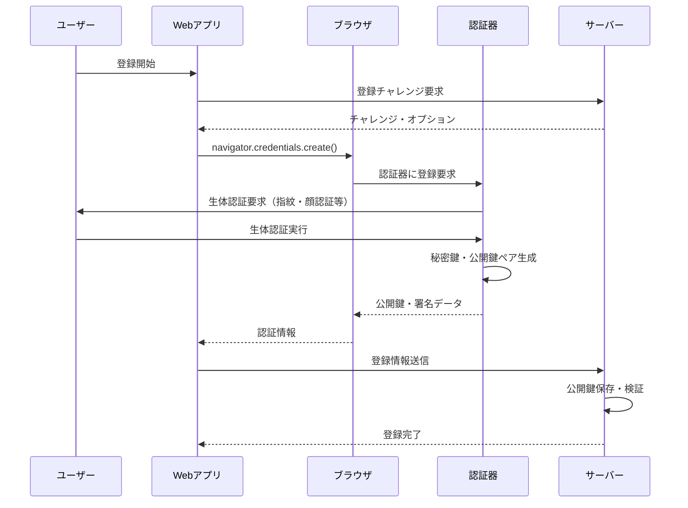
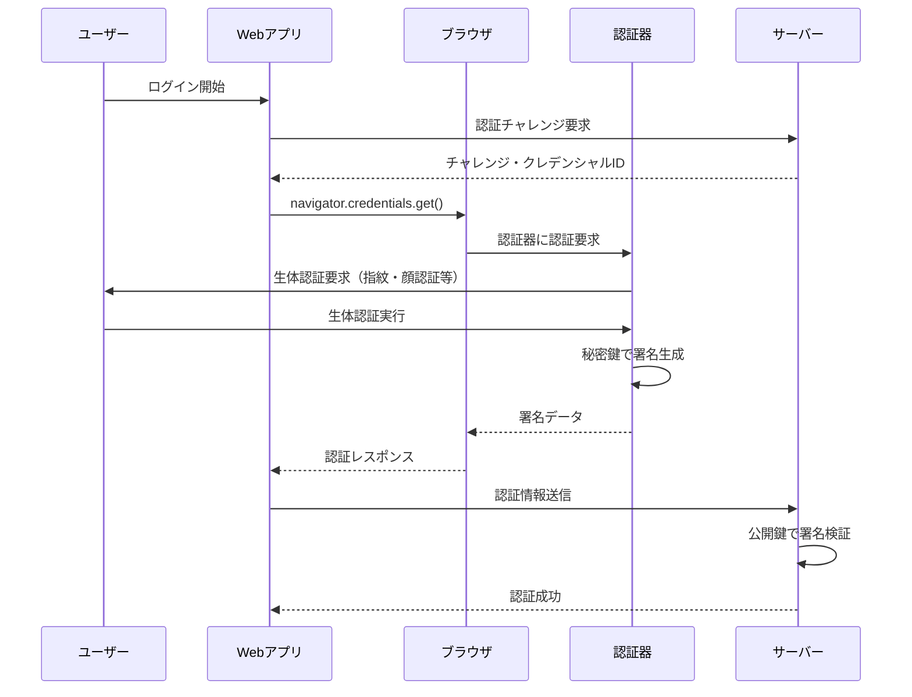

# FIDO2・WebAuthn パスワードレス認証

---

## 概要

FIDO2・WebAuthnは、パスワードに依存しない**パスワードレス認証**を実現するWeb標準技術です。公開鍵暗号方式を基盤とし、ユーザーの認証器（スマートフォンの生体認証、セキュリティキーなど）を使って、安全性と利便性を両立した認証を可能にします。

---

## なぜパスワードレス認証が必要か？

### パスワード認証の課題

- **セキュリティリスク**: パスワードの使い回し、推測しやすいパスワード
- **フィッシング攻撃**: 偽サイトでのパスワード窃取
- **管理負荷**: 複数サービスでの複雑なパスワード管理
- **ユーザビリティ**: パスワード忘れによるログイン失敗

### パスワードレス認証のメリット

- **フィッシング耐性**: 公開鍵暗号による認証でフィッシング攻撃が無効
- **強固なセキュリティ**: 認証器に格納された秘密鍵は取り出し不可
- **優れたUX**: 生体認証やワンタップでの簡単ログイン
- **管理コスト削減**: パスワードリセットなどの運用負荷軽減

---

## FIDO2とWebAuthnの関係

### FIDO2
- **FIDO Alliance**が策定したパスワードレス認証の標準仕様
- 2つの主要コンポーネントで構成：
  - **WebAuthn**: Web APIの標準仕様
  - **CTAP**: 認証器とクライアント間の通信プロトコル

### WebAuthn（Web Authentication）
- **W3C**が標準化したWebブラウザ向けAPI仕様
- JavaScriptから認証器にアクセスする標準インターフェース
- FIDO2の一部として、Web環境でのパスワードレス認証を実現

```
┌─────────────────┐    ┌──────────────┐    ┌─────────────────┐
│  Webアプリ       │    │   ブラウザ    │    │    認証器        │
│                 │    │  (WebAuthn)  │    │ (スマホ・キー等)  │
│  ├─ 登録要求    │───▶│ navigator.   │───▶│  秘密鍵生成      │
│  └─ 認証要求    │    │ credentials  │    │  署名・検証      │
└─────────────────┘    └──────────────┘    └─────────────────┘
```

---

## FIDO2とPasskeyの関係

### Passkeyとは

**Passkey（パスキー）**は、FIDO2/WebAuthnを使用した**パスワードレス認証のユーザーフレンドリーな呼称**です。

- **技術的には**: FIDO2/WebAuthn準拠のクレデンシャル
- **ユーザーから見ると**: 生体認証やPINで使える、パスワードの代替手段
- **業界標準用語**: Apple、Google、Microsoftが共同で推進

### FIDO2とPasskeyの関係図

```
┌─────────────────────────────────────────────────┐
│              FIDO2（技術標準）                     │
│  ┌───────────────────┬───────────────────────┐  │
│  │   WebAuthn API    │       CTAP 2.x        │  │
│  │ （ブラウザAPI仕様） │ （認証器通信プロトコル） │  │
│  └───────────────────┴───────────────────────┘  │
└─────────────────────────────────────────────────┘
                      ↓ 実装
┌─────────────────────────────────────────────────┐
│           Passkey（実装・ブランド名）               │
│  ┌──────────────┬──────────────┬────────────┐  │
│  │ Apple Passkey│ Google Passkey│ Microsoft  │  │
│  │ (iCloud同期) │ (Google同期)  │ (MS同期)   │  │
│  └──────────────┴──────────────┴────────────┘  │
└─────────────────────────────────────────────────┘
```

**重要**: Passkeyは新しい標準ではなく、**既存のFIDO2/WebAuthn標準を活用した実装**です。

---

### Passkeyの種類

#### 1. 同期されるPasskey（Multi-device Credentials）

**特徴**:
- 複数デバイスで使用可能
- クラウド経由で同期される
- 一般的に「Passkey」と呼ばれるのはこのタイプ

**実装例**:

| プロバイダー | 同期方法 | 対応デバイス |
|------------|---------|------------|
| **Apple** | iCloud Keychain | iPhone/iPad/Mac |
| **Google** | Google アカウント | Android/Chrome |
| **Microsoft** | Microsoft アカウント | Windows デバイス |
| **1Password/Bitwarden等** | サードパーティクラウド | クロスプラットフォーム |


---

#### 2. 端末固有のPasskey（Device-bound Credentials）

**特徴**:
- 特定のデバイスにのみ存在
- 同期されない
- セキュリティキーが典型例

**実装例**:

| デバイス | 特徴 | ユースケース |
|---------|------|------------|
| **YubiKey** | ハードウェアセキュリティキー | 企業セキュリティ、高セキュリティ環境 |
| **Titan Key** | Google製セキュリティキー | 2要素認証、企業環境 |
| **TPMローカル保存** | Windows Hello（非同期） | 企業管理デバイス |

---

### Passkeyまとめ

| 項目 | 内容                                          |
|-----|---------------------------------------------|
| **定義** | FIDO2/WebAuthn標準を活用した、パスワードの代替手段            |
| **新しい標準？** | ❌ いいえ。既存のFIDO2標準の実装/ブランド名                   |
| **種類** | **同期型**: 複数デバイスで使用可能<br/>**端末固有**: 特定デバイスのみ |
| **主な提供者** | Apple (iCloud)、Google、Microsoft、1Password等  |
| **ユーザー体験** | 生体認証やPINで、パスワード入力なしでログイン                    |
| **サービス提供者の対応** | 端末固有のみのユーザーには追加認証器の登録を推奨                    |

**ポイント**: Passkeyは「FIDO2をより身近にする名称」であり、技術的には従来のFIDO2/WebAuthnと同じものです。

---

## 技術的な仕組み

### 1. 登録フロー（Registration）



### 2. 認証フロー（Authentication）



### 3. Conditional UI（Autofill）による認証

**Conditional UI**は、WebAuthn Level 3で標準化された、パスキーをよりシームレスに使用できる機能です。

#### 特徴

| 項目 | 説明 |
|------|------|
| **表示方法** | ユーザー名入力欄のオートフィル候補としてパスキーが表示される |
| **動作タイミング** | ページロード時に自動的にバックグラウンドで起動 |
| **ユーザー操作** | 入力欄をタップ/クリックするだけでパスキー選択が可能 |
| **ブラウザサポート** | iOS Safari 16+, Chrome 108+, Edge 108+ |

#### 実装方法

```javascript
// HTML: autocomplete属性を設定
<input type="text"
       name="username"
       autocomplete="username webauthn" />

// JavaScript: mediation: 'conditional' で起動
const credential = await navigator.credentials.get({
  publicKey: publicKeyOptions,
  mediation: 'conditional'  // ← Conditional UI を有効化
});
```

#### 通常認証との比較

| モード | トリガー | ユーザー操作 | 用途 |
|--------|---------|------------|------|
| **Conditional UI** | ページロード時 | 入力欄タップ → パスキー選択 | スムーズな認証体験 |
| **Manual（通常）** | ボタンクリック | ボタンクリック → パスキー選択 | 明示的な認証操作 |

#### 並行動作

idp-serverの実装では、Conditional UIとManualボタンが並行動作します：

- **Conditional UI**: ページロード時にバックグラウンドで起動し、ユーザーの操作を待機
- **Manualボタン**: いつでもクリック可能。クリック時は`AbortController`でConditional UIを中断してManual認証に切り替え

```javascript
// Conditional UI（バックグラウンド起動）
useEffect(() => {
  authChallenge(true);  // isConditional = true
}, []);

// Manualボタン（既存のConditional UIを中断）
const handleNext = async () => {
  if (currentCredentialGetController) {
    currentCredentialGetController.abort();  // Conditional UIを中断
  }
  await authChallenge(false);  // isConditional = false
};
```

### 4. 主要コンポーネント

| コンポーネント | 役割 | 実装例 |
|-------------|------|--------|
| **Relying Party (RP)** | 認証を要求するWebサービス | idp-server |
| **User Agent** | WebAuthn APIを提供 | Chrome, Safari, Firefox |
| **Authenticator** | 秘密鍵保管・署名実行 | Touch ID, セキュリティキー |
| **WebAuthn API** | ブラウザ標準API | `navigator.credentials` |

---

## 認証器の種類

### Platform認証器（内蔵型）
- **デバイス内蔵**: スマートフォン・PCの生体認証機能
- **例**: Touch ID, Face ID, Windows Hello
- **特徴**: 持ち運び不要、デバイス固有

### Cross-Platform認証器（Roaming 外付け型）
- **外部デバイス**: USBキー、NFCキー、Bluetoothキー
- **例**: YubiKey, Google Titan Key
- **特徴**: 複数デバイス間で共有可能、物理的セキュリティ

### 認証器の選択基準

| 用途 | Platform認証器 | Cross-Platform認証器 |
|------|--------------|-------------|
| **個人利用** | ✅ 高い利便性 | △ 持ち運び必要 |
| **企業利用** | △ デバイス依存 | ✅ 統一管理可能 |
| **セキュリティ** | ✅ 高（デバイス固有） | ✅ 高（物理分離） |
| **コスト** | ✅ 追加費用なし | ❌ 専用キー購入 |

---

## セキュリティ特性

### 暗号学的セキュリティ
- **公開鍵暗号方式**: RSA 2048bit以上、ECDSA P-256
- **秘密鍵保護**: 認証器内TEE/Secure Elementで保護
- **署名検証**: サーバーサイドでの厳密な検証

### フィッシング耐性
- **Origin Binding**: 登録時のOriginと認証時のOriginを照合
- **Challenge-Response**: 毎回異なるチャレンジで署名検証
- **ドメイン検証**: 認証器レベルでのドメイン確認

### プライバシー保護
- **匿名性**: 認証器IDからユーザー特定は不可
- **サイト間追跡防止**: サイトごとに異なる鍵ペア生成
- **生体情報非送信**: 生体データはデバイス外に出ない

---

## 仕様参照

### W3C・FIDO仕様
- **[WebAuthn Level 2](https://www.w3.org/TR/webauthn-2/)** - W3C WebAuthn標準仕様
- **[WebAuthn Level 3](https://w3c.github.io/webauthn/)** - WebAuthn最新ドラフト
- **[FIDO2 Overview](https://fidoalliance.org/fido2/)** - FIDO2概要
- **[CTAP2.1](https://fidoalliance.org/specs/fido-v2.1-ps-20210615/fido-client-to-authenticator-protocol-v2.1-ps-errata-20220621.html)** - Client to Authenticator Protocol

### idp-server WebAuthn機能サポート

| 機能 | サポート状況 | 実装詳細 |
|------|-------------|----------|
| **基本認証フロー** | | |
| Registration | 🔄 調整中 | [WebAuthn設定](../../content_06_developer-guide/05-configuration/authn/webauthn.md) |
| Authentication | 🔄 調整中 | チャレンジ・レスポンス検証 |
| **認証器タイプ** | | |
| Platform Authenticator | 🔄 調整中 | Touch ID, Face ID, Windows Hello |
| Roaming Authenticator | 🔄 調整中 | YubiKey, セキュリティキー |
| **署名アルゴリズム** | | |
| ECDSA (ES256) | 🔄 調整中 | P-256曲線対応 |
| RSA (RS256) | 🔄 調整中 | 2048bit以上 |
| **拡張機能** | | |
| User Verification | 🔄 調整中 | 生体認証・PIN確認 |
| Resident Key | 🔄 調整中 | ユーザー名なしログイン |
| **外部連携** | | |
| 外部FIDOサーバー | 🔄 調整中 | API連携による外部認証 |
| WebAuthn4j | 🔄 調整中 | Java WebAuthnライブラリ |

### idp-server独自WebAuthn拡張

- **マルチテナント対応**: テナント単位でのWebAuthn設定・認証器管理
- **プラガブルアーキテクチャ**: WebAuthnExecutorプラグインによる拡張
- **監査ログ**: WebAuthn認証の詳細な証跡記録
- **デバイス管理**: 認証器の登録・削除・一覧管理機能
- **外部FIDO連携**: 企業FIDO基盤との連携対応

---

## 実装における考慮事項

### ユーザー体験設計
- **フォールバック**: WebAuthn非対応環境での代替認証
- **デバイス登録**: 初回登録時のわかりやすいUX設計
- **エラーハンドリング**: 認証失敗時の適切なガイダンス

### セキュリティ設計
- **Relying Party検証**: Origin、チャレンジの厳密な検証
- **タイムアウト設定**: 認証操作の適切な制限時間
- **認証器ポリシー**: User Verification、Resident Keyの要件定義

### 運用・管理
- **認証器ライフサイクル**: 登録・更新・削除の管理
- **クレデンシャル管理**: 複数認証器への対応
- **監査・コンプライアンス**: 認証ログの記録・保管

---

## まとめ

FIDO2・WebAuthnは、パスワードの課題を根本的に解決する次世代認証技術です。
公開鍵暗号による強固なセキュリティと、生体認証による優れたユーザー体験を両立し、
現代のWebサービスに不可欠な認証基盤となっています。

idp-serverは、WebAuthn標準に完全準拠した実装により、
企業レベルのパスワードレス認証基盤を提供します。

---

## よくある質問（FAQ）

### Q1. パスキーとは何ですか？
**A:** パスキーはパスワードの代替手段です。パスワードが記憶して入力するものであるのに対し、パスキーはユーザーのデバイスに保存された秘密情報で、デバイスのロック解除と同じ方法（生体認証、PIN、パターンなど）で認証します。技術的には、パスキーはパスワードレス認証のためのFIDO認証情報であり、フィッシング耐性のあるサインインセキュリティと改善されたユーザー体験のために、暗号化キーペアでパスワードを置き換えます。

### Q2. パスキーのユーザー体験はどのようなものですか？
**A:** ユーザーがアプリやWebサイトへのサインインを求められたとき、デバイス（スマートフォン、コンピュータ、セキュリティキー）のロック解除に使用するのと同じ生体認証やPIN、デバイスパスワードでサインインを承認します。アプリやWebサイトは、従来のユーザー名とパスワードの代わりにこの仕組みを使用できます。

### Q3. パスキーは新しいFIDO Alliance標準ですか？
**A:** いいえ、パスキーはFIDO2（WebAuthnとCTAP）として知られる既存の標準を活用してデプロイされます。WebAuthn標準は、パスキーを管理するブラウザAPIをカバーしています。

### Q4. パスキーサインイン時の生体情報は安全ですか？
**A:** はい、ユーザーデバイス（スマートフォン、コンピュータ、セキュリティキー）が現在行っているローカル生体認証処理に変更はありません。生体情報と処理は引き続きデバイス上に留まり、リモートサーバーには送信されません。サーバーは生体認証チェックが成功したという保証のみを受け取ります。

### Q5. パスキーのユースケースは何ですか？
**A:** パスキーの主なユースケースは、アカウント認証の第一/主要要素としてパスワードを置き換えることです。パスキーはフィッシング耐性があり使いやすいため、パスワード + SMS OTPなどの従来の多要素認証フローも置き換えることができます。その他にも、オンライン決済、アイデンティティウォレット、自動車分野などの用途があります。

### Q6. なぜパスキーはパスワード+第二要素より優れているのですか？
**A:** 長年にわたり、パスワードはパスワードの再利用とデータベース漏洩の蔓延により、フィッシング攻撃と認証情報詰め込み攻撃の対象となってきました。主要要素であるパスワードが根本的に複数の方法で破綻しているため、業界では追加の第二要素を重ねることが広く採用されています。しかし、最も人気のある第二要素の形式（ワンタイムパスワード（OTP）や電話承認など）は、不便でありながらフィッシング可能です。パスキーは、単独で「パスワード + OTP」や「パスワード + 電話承認」の組み合わせよりも安全な主要要素です。

### Q7. パスキープロバイダーとは何ですか？
**A:** パスキープロバイダーは、ユーザーのパスキーの作成と管理を担当します。パスキープロバイダーは、内蔵クレデンシャルマネージャー（iCloudキーチェーンやGoogleパスワードマネージャーなど）内でパスキーが保存・同期されるブラウザまたはオペレーティングシステムベンダー、またはサードパーティアプリやブラウザ拡張機能（1PasswordやDashlaneなど）内でパスキーが保存・同期されるサードパーティプロバイダーです。

### Q8. パスキーの同期は安全ですか？
**A:** はい。パスキーの同期は端末間暗号化されており、パスキープロバイダーは強力なアカウントセキュリティ保護を備えています。

### Q9. パスキーの同期にはどのような利点がありますか？
**A:** 同期は以下の3つの次元でパスワードと「競合」するため、パスワードを可能な限り多くの場所で置き換えるというFIDO Allianceのミッションを達成する上で非常に重要です：
- **速度**: パスワードの作成や使用より高速であるべき
- **利便性**: パスワードの使用と少なくとも同等以上に便利であるべき
- **セキュリティ**: フィッシング耐性があり、アプリ/Webサイト/サービスごとに一意であることが保証されるべき

### Q10. オンラインサービス（RP）はユーザー認証にパスキーをどう実装しますか？
**A:** RPは内蔵のWebAuthn API（Webサイト用）とプラットフォームFIDO API（アプリ用）を使用してサインイン用のパスキーを実行します。

### Q11. 各OSプラットフォームでのパスキーの利用可能性は？
**A:** パスキーは、すべての主要オペレーティングシステム、インターネットブラウザ、およびサードパーティパスキープロバイダーでサポートされています。

### Q12. パスキーはユーザーのデバイス間でどのように利用可能になりますか？
**A:** ユーザーがデバイスのいずれかでパスキーを作成すると、同じパスキープロバイダーを使用し、同じユーザーアカウントにサインインしているユーザーの他のすべてのデバイスに同期されます。特に、ユーザーが新しいデバイスを取得してパスキープロバイダーでセットアップした場合、ユーザーのパスキーは新しいデバイスで同期され、サインインに利用可能になります。

### Q13. RPのパスキーがデバイスで利用できない場合、ユーザーはどうサインインしますか？
**A:** FIDOはこのユースケースのためにクロスデバイス認証を定義しています。クロスデバイス認証により、ユーザーはQRコードを使用してデバイスでサインインできます。FIDO Cross-Device Authentication（CDA）は、あるデバイスのパスキーを別のデバイスでのサインインに使用することを可能にします。例えば、スマートフォンをラップトップにリンクして、スマートフォンのパスキーを使用してラップトップのサービスにサインインできます。

### Q14. Bluetoothを使用するFIDOクロスデバイス認証は安全ですか？
**A:** CTAP 2.2を活用するFIDOクロスデバイス認証フローは、物理的な近接性を確認するためにBluetooth Low Energy（BLE）を使用しますが、サインインの実際のセキュリティについてはBluetoothのセキュリティプロパティに依存しません。「ハイブリッド」と名付けられたCTAPトランスポートは、標準的なBluetoothセキュリティプロパティの上に標準的な暗号化技術の追加レイヤーを使用してデータを保護します。

### Q15. パスキーは多要素認証とみなされますか？
**A:** パスキーは認証に複数の要素を活用します：パスキーはユーザーのデバイス上に保持され（ユーザーが「持っている」もの）、RPがUser Verificationを要求する場合、生体認証やPIN（ユーザーが「である」ものや「知っている」もの）によってのみ実行できます。一部の規制制度では、パスキーを正式にリストされた多要素の形式の一つとして認識するよう進化する必要があります。これはFIDO Allianceの積極的な取り組み分野です。

### Q16. セキュリティキーはパスキーをサポートできますか？
**A:** はい、今日のFIDOセキュリティキーはデバイス固有のパスキーを格納でき、FIDO2がユーザー検証付きの発見可能なクレデンシャルを介したパスワードレスサインインのサポートを追加した2019年から実行しています。すべてのクライアントプラットフォームとブラウザは、セキュリティキーを実行するネイティブサポートを既に持っています。セキュリティキーベンダーは将来的にパスキー同期をサポートすることを選択するかもしれません。

### Q17. 新しいモバイルプラットフォームへの切り替えはどうしますか？
**A:**
- **クロスプラットフォームプロバイダー**: Google Password ManagerやBitwardenなどを使用している場合、新しいデバイスでプロバイダーを設定するとパスキーが利用可能になります
- **セキュリティキー**: FIDOセキュリティキーに保存されている場合、新しいデバイスで安全に認証できます
- **古いデバイス使用**: 古いデバイスのパスキーを使用して新しいデバイスでアカウントにサインインし、新しいデバイスでパスキーを作成
- **アカウント回復**: その他の場合、RPは通常のアカウント回復として処理

### Q18. Discoverable Credentialとは何ですか？通常のパスキーとの違いは？
**A:** Discoverable Credential（発見可能なクレデンシャル）は、**ユーザー名なしでログイン可能なパスキー**です。

#### 技術的な違い

| 項目 | Non-Discoverable Credential | Discoverable Credential |
|------|----------------------------|------------------------|
| **別名** | Server-side Credential | Resident Key, Client-side Credential |
| **ユーザー名** | 必須 | 不要（認証器内に保存） |
| **保存場所** | サーバーのみ | サーバー + 認証器内 |
| **WebAuthn設定** | `requireResidentKey: false` | `requireResidentKey: true` |
| **登録時の動作** | Credential IDのみ認証器に保存 | Credential ID + ユーザー情報を認証器に保存 |
| **認証時のフロー** | サーバーが`allowCredentials`で指定 | 認証器が保存済みクレデンシャルを自動提示 |

#### 実装例

```javascript
// Non-Discoverable Credential（通常）
const credential = await navigator.credentials.create({
  publicKey: {
    authenticatorSelection: {
      requireResidentKey: false,  // サーバー側で管理
      residentKey: "discouraged"
    }
  }
});

// Discoverable Credential（ユーザー名不要）
const credential = await navigator.credentials.create({
  publicKey: {
    authenticatorSelection: {
      requireResidentKey: true,   // 認証器内に保存
      residentKey: "required"
    }
  }
});
```

#### ユーザー体験の違い

**Non-Discoverable（従来型）**:
1. ユーザー名を入力
2. サーバーが該当ユーザーのCredential IDを返す
3. そのCredential IDで認証

**Discoverable（パスキー標準）**:
1. ユーザー名入力不要
2. 認証器が保存済みクレデンシャル一覧を表示
3. ユーザーが選択して認証

#### どちらを使うべきか？

| ユースケース | 推奨 | 理由 |
|------------|------|------|
| **一般消費者向けサービス** | Discoverable | 最高のUX、ユーザー名入力不要 |
| **企業向けサービス** | Discoverable | SSO統合、ユーザー名管理の簡素化 |
| **認証器の容量制約** | Non-Discoverable | セキュリティキーの容量節約 |
| **レガシー互換** | Non-Discoverable | 古い認証器との互換性 |

#### Conditional UIとの関係

**Conditional UI（オートフィル）**は、Discoverable Credentialと組み合わせることで最大の効果を発揮します：

- **Discoverable + Conditional UI**: ユーザー名入力欄をタップするだけで、認証器内の全パスキーが候補として表示される
- **Non-Discoverable + Conditional UI**: ユーザー名を入力後、該当するパスキーのみが表示される

**idp-serverの実装**: デフォルトでDiscoverable Credential（`requireResidentKey: true`）を使用し、最高のユーザー体験を提供しています。

### Q19. Conditional UIとDiscoverable Credentialは必須ですか？
**A:**

| 機能 | 必須か | 理由 |
|------|--------|------|
| **Discoverable Credential** | ❌ 任意（推奨） | Non-Discoverableでも動作するが、UXが劣る |
| **Conditional UI** | ❌ 任意（推奨） | Manualボタンのみでも動作可能 |
| **組み合わせ** | ✅ 強く推奨 | 最高のUXを実現（SBI証券、Google等が採用） |

**ベストプラクティス**:
- 登録時: `requireResidentKey: true` でDiscoverable Credentialとして登録
- 認証時: Conditional UI + Manual ボタンの両方を提供（idp-serverの実装）

---

> パスワードレス認証は、セキュリティとユーザビリティの両方を大幅に改善します。
> WebAuthn対応により、フィッシング耐性の高い認証基盤を構築しましょう！