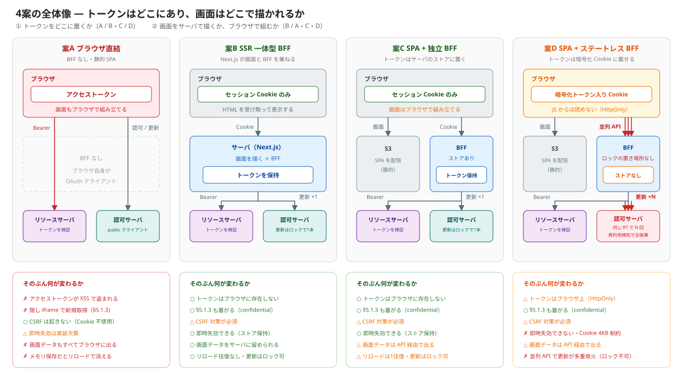

# 実践編: AWS で公開 Web アプリケーションを構築する

[Cookie と CSRF のアンチパターン集](./10-cookie-csrf-antipatterns.md) と [RFC 10017](../16-oauth-oidc-rfc/security/rfc10017-browser-based-apps.md) で挙げた論点を、実際の AWS 構成に落とす。

同じ「認証付きの公開 Web アプリ」でも、**セキュリティ・可用性・コストのどこを取るか**で構成が変わる。ここでは代表的な4案を比較する。

## このドキュメントの目的

**構成を選ぶ判断材料を持つ**ことが目標です。

- 各案が防げる脅威・防げない脅威
- フレームワーク / ライブラリの選択が何を決めるか
- 可用性とコストの増減要因

:::note 金額は書きません
AWS の料金は変動し、リージョン・使用量・契約形態で大きく変わります。ここでは**何に対して課金されるか（コスト要因）**と相対的な大小のみ扱います。実際の見積もりは AWS Pricing Calculator を使ってください。
:::

---

## 1. 決めることは2つ

構成の違いは、**独立した2つの判断**の組み合わせで説明できます。

| | 判断すること | 決まるもの |
|---|---|---|
| **①** | トークンをどこに置くか | **アプリ層の脅威**。XSS で盗まれるか、即時失効できるか |
| **②** | 画面をサーバで描くか、ブラウザで組むか | **データ露出・CSP・BFF の責務**。画面と BFF が一体か分離か |

**本質的な分岐は①**です。②は BFF を選んだあとの設計判断で、詳しくは7章で扱います。

### 4案はこの組み合わせ

| 案 | ① トークンの置き場所 | ② 画面と BFF |
|---|---|---|
| **A** ブラウザ直結 | **ブラウザ**（JS から読める） | 静的 SPA（BFF なし） |
| **B** SSR 一体型 BFF | **サーバ**（セッションストア） | **一体**。Next.js が UI と BFF を兼ねる |
| **C** SPA + 独立 BFF | **サーバ**（セッションストア） | **分離**。S3 の SPA と Fargate の BFF |
| **D** SPA + ステートレス BFF | **ブラウザ**（暗号化 Cookie・JS からは読めない） | **分離**。BFF がストアを持たない |

①は「出す / 出さない」の二択ではありません。**案D はその中間**で、トークンはブラウザ上にあるが JS からは読めない、という位置に立ちます。



:::note ステートレスかどうかは②と独立です
案D は分離型（SPA + 独立 BFF）の代表例として示していますが、**トークンを Cookie に載せる選択は一体型でも取れます**。実際 **Auth.js の既定は JWT 戦略**（＝ステートレス）なので、案B の構成でそのまま使うと案D と同じ性質になります（4章）。「BFF を置いた ＝ サーバがトークンを保持している」ではありません。
:::

:::note 実行形態とネットワーク構成は扱いません
コンテナかサーバーレスか（Fargate / Lambda）、リソースサーバをインターネットから閉じるか、といった判断は**アプリ層のセキュリティ特性を変えません**。インフラ層の対策は9章にまとめます。
:::

### 判断フロー

```
① トークンをどこに置くか
   │
   ├─ ブラウザ（JS から読める）─────────────────────→ 案A
   │
   ├─ サーバ（セッションストアに保持）
   │     │
   │     └ ② 画面をどう描くか
   │         ├─ サーバで描く（SSR）───────────────→ 案B
   │         └─ ブラウザで組む（SPA）─────────────→ 案C
   │
   └─ ブラウザ（暗号化 Cookie・ストアを持たない）───→ 案D
```

**迷ったら案B**。トークンをブラウザから外すことが、[RFC 10017](../16-oauth-oidc-rfc/security/rfc10017-browser-based-apps.md) が推す方向であり、効果が最も大きい。SSR 一体型は②の打ち手（7章）も自然に安全側へ倒れます。

**案C が劣るわけではありません。** フロントとバックを別チームで回せる、画面を CDN に載せられるといった利点があります。ただし分離したぶん、7章の論点を自分で塞ぐ必要があります。

**案D はストアを1つ減らす代わりに、即時失効を差し出します。** XSS には HttpOnly で耐えますが、ログアウトしてもトークンは exp まで生き、端末を取られれば Cookie ごと抜かれます（6章）。

---

## 2. 前提

### 登場人物

本ドキュメントは **リソースサーバが独立して存在する** 前提で書いています。認可サーバ（IdP）を使う以上、保護対象の API が別に居るのが通常の構成です。

| 本文の呼び方 | OAuth のロール | 役割 |
|---|---|---|
| IdP / 認可サーバ | **Authorization Server** | トークンを発行する |
| BFF | **Client**（confidential） | トークンを取得し、提示する |
| API / RS | **Resource Server** | トークンを検証し、リソースを返す |
| ブラウザ | User Agent | ロールではない |

```
   ブラウザ ──────→ BFF ──Bearer──→ API
                     │              ↑
                  Client      Resource Server
                     │
                     └──認可コードフロー──→ 認可サーバ
```

**BFF（Backend For Frontend）**とは、認可サーバとのやり取りを引き受け、トークンをブラウザの JS から隔離するサーバのことです。ブラウザに返すのはセッション Cookie（案B・C）か、暗号化したトークン入り Cookie（案D）です。OAuth のロールとしては confidential クライアントで、**フロントエンドアプリの構成要素**にあたります（リバースプロキシや API Gateway とは別物）。

リソースサーバは**自社の API とは限りません**。IdP の利用者が運用する API であることも多く、その場合は自分たちの裁量が及ぶのは BFF までになります。

### 脅威は2層に分かれる

| 層 | 脅威 | 主な対策の置き場所 |
|---|---|---|
| **アプリ層** | XSS、CSRF、トークン窃取、セッション乗っ取り | フレームワーク / ライブラリ / 構成の選択 |
| **インフラ層** | DDoS、ボット、脆弱性スキャン、TLS | WAF / CloudFront / Shield / ACM |

**この2層は代替関係にありません。** WAF を入れても XSS が消えるわけではなく、CSP を入れても DDoS は止まりません。両方要ります。

### 認証だけに OAuth を使う構成は対象外

ログイン（OIDC）だけに使い、保護された API を呼ばない構成では、リソースサーバもアクセストークンも登場しません。その場合は本ドキュメントの比較軸の多くが当てはまらないため、[セッションセキュリティ](./07-session-security.md)を参照してください。

---

## 3. 案A: ブラウザ直結（BFF なし）

**ブラウザ自身が OAuth クライアントになり、アクセストークンを直接リソースサーバに提示する。**

```
   ブラウザ（Client）
      │
      ├── CloudFront ──── S3（静的 SPA）
      │
      ├──Bearer──→ API Gateway ──── Lambda（Resource Server）
      │
      └──認可コードフロー（PKCE）──→ 認可サーバ
```

リソースサーバはインターネットに公開されている必要があります。ブラウザが直接叩くためです。

**別サイトでも成立します。** `Authorization` ヘッダは JS が明示的に付けるため、Cookie のような同一サイト制約がありません（CORS の設定は要る）。BFF 構成が同一サイトに収める必要があるのと対照的です。

言い換えると、**Cookie を使わないことで構成の自由度を得て、代わりにトークンをブラウザに晒している**ということです。[RFC 10017](../16-oauth-oidc-rfc/security/rfc10017-browser-based-apps.md) が「すべての攻撃シナリオに脆弱」と評価する構成にあたります（詳細は 8.1 の比較表）。

### フレームワーク / ライブラリ

| 役割 | 選択肢 | 注意点 |
|---|---|---|
| SPA | React / Vue / Svelte（静的ビルド） | — |
| OAuth クライアント | `oidc-client-ts`、`@auth0/auth0-spa-js` | **state / PKCE / nonce を自前で管理**する |
| 認可サーバ | Cognito User Pool、Auth0、idp-server | — |

:::warning ライブラリ選択がアンチパターンを左右します
`oidc-client-ts` は既定で `sessionStorage` に state と code_verifier を置きます。これは [C-3](./10-cookie-csrf-antipatterns.md) と [E-2](./10-cookie-csrf-antipatterns.md) にそのまま該当します。

複数タブ対応（[D-4](./10-cookie-csrf-antipatterns.md)）やコールバック後の URL 掃除（[E-1](./10-cookie-csrf-antipatterns.md)）も、ライブラリ任せにせず確認が要ります。
:::

### 可用性・コスト

| | |
|---|---|
| 可用性 | **高い**。CloudFront / S3 / API Gateway / Lambda はいずれもマネージドで冗長化済み |
| コスト | **最小**。リクエスト課金のみで、アイドル時はほぼゼロ |
| 運用負荷 | **低い**。サーバの面倒を見る箇所が無い |

### 向くケース

- 公開情報中心で、扱う権限が読み取り主体
- アクセストークンの寿命を数分に絞れる
- トラフィックが読めない、またはゼロの時間帯が長い

### 選ぶ場合は代償を減らす

トークンがブラウザに出ることを自覚したうえで、影響範囲を絞ります。

- アクセストークンの寿命を数分にする
- リフレッシュトークンを発行しない（またはローテーション + 再利用検知）
- スコープを最小化する
- `resource`（[RFC 8707](../16-oauth-oidc-rfc/extensions/rfc8707-resource-indicators.md)）で単一リソースに限定する
- **リソースサーバ側で `aud` を検証する**（[RFC 9068](https://www.rfc-editor.org/rfc/rfc9068.html)）。ブラウザが直接叩く以上、宛先の確認はリソースサーバの責務になる

ただし**保存場所を絞るほどリロードで認証状態が消えます**。メモリのみに置く構成は窃取の窓が最も狭い一方、リロードのたびに認証をやり直すことになります（7章）。

---

## 4. 案B: SSR 一体型 BFF

**BFF がトークンを保持し、リソースサーバへ提示する。ブラウザにはセッション Cookie だけを渡す。画面も同じサーバが描く。**

```
   ブラウザ
      │  https://app.example.com（単一オリジン）
      │  セッション Cookie（HttpOnly）
      ▼
  CloudFront ──── ALB ──── ECS Fargate（Next.js + Auth.js）※ Client
                              │  UI と Route Handler の両方を提供
                              │
                              ├── ElastiCache（セッション）
                              │
                              ├──Bearer──→ リソースサーバ        
                              │
                              └──認可コードフロー──→ 認可サーバ
```

守る対象が**トークンからセッションに移ります**。セッションはサーバ側で即座に無効化できるぶん、取り消せないトークンより扱いやすい。代わりに Cookie を使う以上、**CSRF 対策が必須**になります。

Next.js が UI と Route Handler の両方を提供するため、**画面と BFF が同じプロセスに同居します**（②が「一体」）。ブラウザから見えるオリジンは1つで、画面はサーバ側で描かれます。この結合が何を楽にするかは7章で扱います。

### フレームワーク / ライブラリ

| 役割 | 選択肢 | 備考 |
|---|---|---|
| フロント + BFF | **Next.js**（App Router） | Route Handler が BFF（Client）になる |
| 認証 | **Auth.js（NextAuth）** | CSRF・セッションが組み込み |
| セッションストア | JWT 戦略（Cookie に JWE）／ Database 戦略（ElastiCache・RDS） | 下記参照 |

Auth.js は [D-3](./10-cookie-csrf-antipatterns.md) の **signed double submit cookie** を実装しています。ランダム値をサーバの secret と連結して SHA256 し、`<token>|<hash>` を HttpOnly / host-only Cookie に格納。素の double submit と違い、攻撃者が Cookie を仕込んでも hash を作れません。

:::tip セッション戦略の選択が失効可否を決めます

| 戦略 | Cookie の中身 | 即時失効 | コスト |
|---|---|---|---|
| **JWT 戦略**（既定） | 暗号化されたセッション（JWE） | **できない**（exp まで有効） | ストア不要 |
| **Database 戦略** | セッション ID のみ | できる | セッションストアが要る（下記） |

[C-2](./10-cookie-csrf-antipatterns.md) / [C-4](./10-cookie-csrf-antipatterns.md) の論点そのものです。ログアウトで即座に切りたい要件があるなら Database 戦略を選びます。
:::

**Java で組む場合**は Spring Boot + Spring Security が同じ位置に来ます。サーバーサイドセッションと CSRF 対策が既定で有効なので、Cookie ベースの前提に自然に乗ります（8.6 で比較）。

### セッションストアの選択（BFF 共通）

Database 戦略を選んだら、次は**どこに置くか**です。案B / C 共通の判断で、**可用性・即時失効・コスト**が決まります。左端の Cookie（JWE）列だけは性質が違い、これを選ぶと**ストアを持たない構成＝案D**（6章）になります。

| | Cookie（JWE） | ElastiCache（ノードベース） | ElastiCache Serverless | DynamoDB |
|---|---|---|---|---|
| **即時失効** | **できない** | できる | できる | できる |
| **可用性** | ストアが無いので落ちない | **構成次第**。既定の単一ノードは**単一障害点** | **3 AZ に自動で冗長化**（99.99% SLA） | **3 AZ に自動レプリケーション**（99.99% SLA） |
| **Multi-AZ の代償** | — | **別 AZ にレプリカが必要 → ノード数と料金が倍** | 不要（既定で有効） | 不要（既定で有効） |
| フェイルオーバー時 | 影響なし | **直近の書き込みが失われうる**（非同期レプリケーション） | 同左（非同期） | — |
| **課金** | 無し | **ノード稼働時間** | 従量（下限あり） | 従量（オンデマンド） |
| アイドル時のコスト | 無し | **かかる** | 小さい | ほぼ無し |
| サイズ制限 | **4KB** | 実質なし | 実質なし | 400KB / 項目 |
| VPC への配置 | 不要 | **必要** | **必要** | 不要（VPC エンドポイント可） |
| 期限切れの掃除 | Cookie の expiry | TTL で即時 | TTL で即時 | **TTL は遅延あり** |

判断に効くのは次の4点です。

- **ElastiCache は「Multi-AZ にして初めて」可用性が確保される。** 単一ノードのままだとセッションストアが単一障害点になり、落ちれば**全ユーザーが一斉にログアウト**します。Multi-AZ にはシャードごとにプライマリ＋別 AZ のレプリカが必要で、ノード数と料金が倍になります。DynamoDB と ElastiCache Serverless は既定で 3 AZ に冗長化されるため、この判断自体が発生しません。
- **フェイルオーバーでセッションが消えることがある。** ElastiCache のレプリケーションは非同期なので、昇格の直前に書かれたセッションは失われます。「ログイン直後のユーザーだけが弾かれる」という形で出ます。ゼロデータロスが要るなら Valkey 9.0 以降の durability（Multi-AZ トランザクションログによる同期書き込み）を検討します。
- **アイドル時のコストは、コンピュートよりセッションストアで決まることがある。** Fargate を止められなくても、ElastiCache を DynamoDB に替えれば常時課金は減ります。案B / C の「アイドル時課金あり」は Fargate だけの話ではありません。Multi-AZ 化でノードが倍になることを考えると差はさらに開きます。
- **DynamoDB を使うなら2つ注意する。** TTL による削除は即時ではなく通常48時間以内なので、**有効期限の判定はアプリ側で `expires_at` を見て行う**（TTL は掃除専用と考える）。また既定の読み取りは結果整合性なので、セッション ID 再生成の直後に古い状態を読む可能性があります。強整合性読み取りを使ってください。

Cookie（JWE）は**ストアを1つも増やさずに済む**（＝ストア障害という失敗モードが存在しない）代わりに、[C-2](./10-cookie-csrf-antipatterns.md) の Cookie 4KB 制約と失効不可をそのまま引き受けます。

なお **Memcached はセッションストアに使えません**。レプリケーションもフェイルオーバーも持たないため、Multi-AZ 構成そのものが提供されていません。

### ドメイン構成（BFF 共通）

Cookie を使う以上、**Web と BFF をどのドメインに置くか**が防御力を左右します。案B / C に共通する判断です。

| 構成 | 例 | Cookie は送られるか | SameSite | CORS |
|---|---|---|---|---|
| **同一オリジン** | `app.example.com` のみ | ○ | **Lax でOK** | 不要 |
| **サブドメイン違い**（同一 site） | `app.example.com` / `api.example.com` | ○ | **Lax でOK** | **必要** |
| **別サイト** | `app.example.com` / `api.other.com` | **✗** | **`None` 必須** | 必要 |

分かれ目は [アンチパターン集の前提](./10-cookie-csrf-antipatterns.md) にある**判定単位のズレ**です。

- **SameSite は site 単位**（schemeful eTLD+1）→ サブドメイン違いは**同一サイト扱い**なので Cookie は送られる
- **CORS はオリジン単位**（`scheme://host:port`）→ サブドメインが違えば**別オリジン**なので CORS が要る

:::warning ドメインを分けるほど CSRF 防御が弱くなります
**サブドメイン違い**では Cookie は送られますが、SameSite が防御になりません。`evil.example.com` も同一サイト扱いなので、そこに XSS が1つあれば CSRF が成立します（[B-1](./10-cookie-csrf-antipatterns.md)）。

**別サイト**にすると `SameSite=None` が必要になり、SameSite による防御はゼロになります（[B-3](./10-cookie-csrf-antipatterns.md)）。BFF 構成で別サイトを選ぶ理由は通常ありません。

同一オリジンに収めるのが基本。分けるなら **Origin 検証と CSRF トークンを必ず併用**してください。
:::

案B は Next.js が UI と Route Handler の両方を提供するため、自然に単一オリジンになります。案C のように画面と BFF を分ける場合も、CloudFront のパス振り分け（`/*` → S3、`/api/*` → ALB）で単一オリジンに保てます。

### 可用性・コスト

| | |
|---|---|
| 可用性 | **Multi-AZ で確保**。Fargate タスクを複数 AZ に配置し、ALB で分散。**セッションストアを Multi-AZ にしないとそこが単一障害点として残る**（上記） |
| コスト | **中**。Fargate と ALB は**起動している限り課金**される。アイドル時もゼロにならない |
| 運用負荷 | **中**。コンテナイメージの更新、タスク数の調整、セッションストアの運用 |

コスト要因:

| 要素 | 課金 |
|---|---|
| **ALB** | 時間課金 + LCU |
| **Fargate** | vCPU / メモリ × 稼働時間 |
| **ElastiCache** | ノード稼働時間（Database 戦略時）。**Multi-AZ にするとレプリカ分が上乗せ** |
| **NAT Gateway** | 時間課金 + データ処理量。**トラフィックが少なくても定額が乗る** |

NAT Gateway は見落とされやすい項目です。Fargate をプライベートサブネットに置いて外部 IdP や外部 API を呼ぶなら必要になります。VPC エンドポイントで代替できる通信（S3 / DynamoDB / ECR など）は置き換えると削減できます。

### 向くケース

- 状態変更を伴う操作が中心
- 即時ログアウトが要件
- 常時ある程度のトラフィックがある

---

## 5. 案C: SPA + 独立 BFF

**画面は静的 SPA として S3 から配り、BFF は独立したサービスとして動かす。トークンの扱いは案B と同じで、違うのは画面と BFF が分かれていること。**

```
   ブラウザ
      │  すべて https://app.example.com（単一オリジン）
      │  セッション Cookie（HttpOnly）
      ▼
  CloudFront ──┬── /*      → S3（静的 SPA）
               │
               └── /api/*  → ALB ──→ Fargate（BFF）※ Client
                                        ├ Cookie を検証しセッションを引く
                                        ├ セッションからアクセストークンを取り出す
                                        ├ Authorization: Bearer を付けて RS へ転送
                                        │
                                        ├── ElastiCache（セッション）
                                        │
                                        ├──Bearer──→ リソースサーバ
                                        │
                                        └──認可コードフロー──→ 認可サーバ
```

CloudFront をパスで振り分けることで、**画面と BFF は分離していてもオリジンは1つに保てます**。ここを分けるとドメイン構成の問題（4章）を引き受けることになるので、単一オリジンに収めるのが基本です。

### 案B との違い

| | 案B | 案C |
|---|---|---|
| ① トークンの置き場所 | BFF | **BFF（同じ）** |
| **② 画面と BFF** | 一体（同一プロセス） | **分離**（S3 / Fargate） |
| 画面の配信 | Next.js が SSR で返す | S3 から静的配信 |
| デプロイ単位 | 1つ | 2つ |

**セキュリティ特性は①の観点では案B と同じ**です。差が出るのは②の4点（7章）で、いずれも案C 側が自分で塞ぐ側に回ります。

### BFF と業務 API の分業

BFF を独立させると、BFF とリソースサーバの責務の違いがはっきりします。

| | OAuth ロール | 知っていること |
|---|---|---|
| **BFF** | Client | 誰がログインしているか（セッション） |
| **業務 API** | Resource Server | 何をしてよいか（トークンのスコープ） |

**BFF は業務ロジックを持ちません。** Cookie をトークンに載せ替えて転送するだけです。
**業務 API は Cookie を知りません。** トークンだけを見ます。

この分業により、BFF が侵害されても攻撃者が得るのは「BFF ができること」までで、DB への直接アクセスは残りません。ただし**その範囲は BFF の API 設計で決まります**（7章）。

### 送信者制約トークン（BFF 共通）

BFF ↔ API 間はブラウザを経由しないため、[DPoP](../16-oauth-oidc-rfc/extensions/rfc9449-dpop.md) や mTLS を使えます。トークンが漏れても鍵が無ければ使えません。

ブラウザ ↔ BFF 間には効きません。RFC 10017 §9.2 が明記するとおり、ブラウザのみのクライアントが抱える制約は sender-constrained token では解決しません。

### 可用性・コスト

| | |
|---|---|
| 可用性 | **案B と同等**。Fargate を Multi-AZ に配置し、ALB で分散。画面は S3 / CloudFront で冗長 |
| コスト | **案B よりやや高い**。画面と BFF を別々に持つぶん構成要素が増える。ただし画面は静的配信なので配信コストは下がる |
| 運用負荷 | **やや高い**。デプロイ対象が2つに増え、両者のバージョン整合を見る必要がある |

### 向くケース

- フロントとバックエンドをチーム・リポジトリ・リリースサイクルで分けたい
- 画面を CDN に載せ、配信を BFF から切り離したい
- 既存の SPA があり、BFF を後から前段に足す

---

## 6. 案D: SPA + ステートレス BFF

**トポロジは案C と同じ（SPA + 独立 BFF）。違いは BFF がセッションストアを持たず、トークンを暗号化して Cookie に載せること。**

```
   ブラウザ
      │  すべて https://app.example.com（単一オリジン）
      │  暗号化トークン入り Cookie（HttpOnly）
      ▼
  CloudFront ──┬── /*      → S3（静的 SPA）
               │
               └── /api/*  → ALB ──→ Fargate（BFF・ストアなし）
                                        ├ Cookie を復号してアクセストークンを取り出す
                                        ├ Authorization: Bearer を付けて RS へ転送
                                        ├ 期限が近ければ更新し、新しい Cookie を返す
                                        │
                                        ├──Bearer──→ リソースサーバ
                                        │
                                        └──認可コードフロー──→ 認可サーバ
```

BFF は**リクエスト間で何も覚えません**。トークンの置き場所はブラウザですが、暗号化されているため JS からは読めません。

### 案C との違い

| | 案C（ストア保持） | 案D（ステートレス） |
|---|---|---|
| ② 画面と BFF | 分離 | **分離（同じ）** |
| Cookie の中身 | セッション ID | **暗号化されたトークン** |
| トークンの置き場所 | サーバのストア | **ブラウザ** |
| セッションストア | ElastiCache / DynamoDB | **不要** |
| 即時失効 | できる | **できない** |
| スケールアウト | ストアを共有する | サーバ間で何も共有しない |

### 得られるもの

- **ストアが1つ減る**。ElastiCache の Multi-AZ もノード倍増も、DynamoDB の TTL 遅延も考えなくてよくなり、4章の判断が丸ごと消えます
- **ストア障害という失敗モードが存在しない**。可用性の弱点が1つ減ります
- **スケールアウトが素直**。どのタスクに振られても Cookie だけで処理できます

### 差し出すもの

4つあります。いずれも [C-2](./10-cookie-csrf-antipatterns.md) の論点です。

| | 内容 |
|---|---|
| **即時失効できない** | ログアウトしても Cookie 内のトークンは exp まで有効。「今すぐ切る」ができない |
| **Cookie 4KB 制約** | [RFC 9068](https://www.rfc-editor.org/rfc/rfc9068.html) 準拠の JWT に claim を盛ると超える。分割し始めると壊れる |
| **ローテーションが競合する** | 画面が並列に API を叩くと更新が同時発火し、古いリフレッシュトークンの使用が再利用検知に引っかかって全セッション破棄、という事故が起きる。**ストアが無いのでロックで直列化できない**（7章） |
| **端末侵害に無力** | ディスク上の Cookie ストアを抜かれれば[トークンそのものを持っていかれます](./07-session-security.md#4-端末侵害によるセッション窃取infostealer)。セッション ID と違い、サーバ側で無効化もできない |

XSS に対しては HttpOnly が効くので、**案A よりは明確に強い**。しかし**案B / C よりは明確に弱い**、というのが位置づけです。

Cookie 4KB 制約には副作用もあります。Cookie は**毎リクエストに載る**ため、大きくすればそのぶん帯域とレイテンシに効きます。

### 代償を減らす

- **アクセストークンを短命にする**。失効できない期間そのものを縮める
- **Cookie に入れる情報を絞る**。ユーザー属性は毎回リソースサーバから取り、Cookie にはトークンだけ載せる
- **失効が要るなら、失効した分だけを持つ**。フルセッションストアの代わりに「無効化した識別子の denylist」を薄く置く折衷案。ストアは残るが、規模が桁違いに小さい
- **暗号鍵のローテーション手順を用意する**。ステートレス構成では鍵がすべてで、漏れれば全ユーザーの Cookie が復号されます。鍵を差し替えても既存 Cookie を一定期間読めるよう、複数鍵での復号を許す設計にしておく

:::warning 即時失効が要件なら案D は選べません
「ログアウトで即座に切る」「侵害時に一括失効させる」が要件に入っているなら、ここは設計で埋められません。案B / C の Database 戦略にします。

逆に言えば、**即時失効を求めないと決めた場合にだけ**案D は有利です。
:::

### 可用性・コスト

| | |
|---|---|
| 可用性 | **案C より高い**。セッションストアという単一障害点が無い |
| コスト | **案C より低い**。ElastiCache / DynamoDB のぶんが丸ごと不要 |
| 運用負荷 | **中**。ストアの運用は消えるが、暗号鍵の管理とローテーションが増える |

### 向くケース

- 読み取り主体で、即時ログアウトが要件でない
- セッションに載せる情報が小さく収まる
- 運用体制が小さく、増やすコンポーネントを減らしたい

---

## 7. 画面と BFF の関係

BFF を選んだあとに決めるのが②です。**画面をサーバで描くか（一体型 = 案B）、ブラウザで組むか（分離型 = 案C / D）**で、打ち手が変わります。

| | 案B: SSR 一体型 | 案C / D: SPA + 独立 BFF |
|---|---|---|
| 画面に出るデータ | **サーバ側に留められる** | **API 経由で必ずブラウザに出る** |
| CSP | **nonce ベースが使える** | 静的配信は nonce 不可 → ハッシュ / `strict-dynamic` |
| BFF の API 形状 | 画面が必要な分だけ返す | **透過プロキシに倒れやすい** |
| セッション切れ | 画面遷移でリダイレクト | 401 を返し、JS 側で遷移させる |
| リロード後の復元 | HTML に反映済み | **1往復して問い合わせる** |
| デプロイ単位 | 1つ | 2つ（画面と BFF を別々に更新できる） |

分離型が悪いわけではありません。**フロントとバックを別チームで回せる**、画面を CDN に載せられる、といった利点があります。ただし下記は自分で塞ぐ必要があります。

### BFF の API 形状が §5.1.4 の被害範囲を決める

[RFC 10017](../16-oauth-oidc-rfc/security/rfc10017-browser-based-apps.md) §5.1.4（ブラウザ経由のリクエスト代行）は BFF でも防げません。ただし**攻撃者が到達できる範囲は BFF の API 設計で変わります**。

| | 透過プロキシ | 画面単位の集約 API |
|---|---|---|
| BFF がやること | `/api/*` をそのまま RS へ転送 | 画面が必要な呼び出しだけを公開 |
| XSS 時に到達できる範囲 | **アクセストークンの全スコープ** | **BFF が公開しているエンドポイントだけ** |
| 実装コスト | 低い | 画面ごとに API を設計する |

透過プロキシは「BFF をリバースプロキシとして置いただけ」の状態です。トークンは隠せていても、**攻撃者にできることは案A と大きく変わりません**。集約 API にすると BFF が許可リストとして働きます。

分離型は API 境界が先にあるぶん透過プロキシへ倒れやすく、一体型は画面ごとに Route Handler / Server Action を書くため自然に集約側へ寄ります。

### BFF はトークンを隠すが、データは隠さない

- **SSR（案B）**: セッションを読んでサーバ側で描画するため、**画面に出さない項目はブラウザに送らずに済む**
- **SPA（案C）**: 描画に必要なデータは全部 API 経由でブラウザに出る。レスポンスを絞らない限り、余分な個人情報もそのまま届く

一体型でも油断はできません。Server Component から Client Component へ props で渡した値は、**シリアライズされてブラウザに送られます**。「サーバで描いているから安全」ではなく、境界を意識して渡す必要があります。

### CSP の打ち手が配信元で変わる

nonce はリクエストごとに新しい値を発行して初めて意味を持ちます。

| | 案B（Next.js が返す） | 案C（S3 が返す） |
|---|---|---|
| nonce ベース CSP | **使える**（レスポンスごとに生成） | **使えない**（同じファイルを返すため） |
| 代替 | — | ハッシュベース、`strict-dynamic` |

CloudFront Functions で HTML を書き換えて nonce を差し込む手もありますが、**キャッシュとの両立**が必要になります（レスポンスごとに違う HTML を返すなら、その分キャッシュが効きません）。

### セッション切れの伝え方

一体型は画面遷移なので、セッションが切れていればログイン画面へリダイレクトすれば済みます。

分離型では **fetch に 302 を返してはいけません**。fetch は既定でリダイレクトを追うため、ログイン画面の HTML が 200 で返り、それを JSON としてパースして落ちます。原因が分かりにくいエラーになります。

- BFF は **401 を返す**
- 画面側が 401 を捕まえ、ログイン開始 URL へ**トップレベル遷移**させる

認可コードフローは**トップレベル遷移が必須**です。認可サーバのログイン画面は fetch では表示できず、CORS でも失敗します。分離型ではこの導線を明示的に実装します。

### リロードで認証状態が戻るか

ここから2つは①（トークンの置き場所）と②の**両方**が効く論点です。

| | 戻るか | 戻し方 |
|---|---|---|
| **案A** | **保存場所次第** | メモリのみなら戻らない。Web Storage なら戻るが JS から読める |
| **案B** | 戻る | Cookie → サーバがストアを引き、**認証済みの HTML を返す** |
| **案C** | 戻る | Cookie → SPA 起動後に `/api/me` 等を1往復して復元 |
| **案D** | 戻る | Cookie 自体がトークン。サーバ側の状態に依存しない |

**案A は「リロードで維持」と「XSS 耐性」が二者択一になります。** メモリだけに置けば窃取の窓は狭まりますが、リロードのたびに認証をやり直すことになります。[C-1](./10-cookie-csrf-antipatterns.md) が「メモリ変数 △」としている構成が実務で採用されにくいのはこのためです。

復帰手段として隠し iframe + `prompt=none` のサイレント認証がありますが、**Safari と Firefox はサードパーティ Cookie をブロック・分割する**ため、IdP のセッション Cookie が iframe に載らず失敗します。Chrome は既定でブロックしませんが、ユーザー選択に委ねる方向なので前提にはできません。IdP が同一サイトにあるなら成立します。

**案B だけは往復が要りません。** SSR なのでサーバがセッションを読んで認証済みの HTML を返します。分離型（案C / D）は SPA 起動後に自分がログイン済みか問い合わせる必要があり、**未ログイン画面が一瞬出るちらつき**はここで起きます。ローディング状態の設計が要ります。

### 並列リクエストで壊れないか

リロード直後に画面が複数の API を同時に叩くのは普通のことです。ここで**案D だけが構造的な弱点を持ちます**。

Cookie は**リクエストごとのスナップショット**なので、read-modify-write が原子的になりません。並列リクエストは全部が同じ古い Cookie を読み、それぞれ独立に書き戻すため後勝ちになります。

| 現れ方 | 起きること |
|---|---|
| **トークン更新の競合** | 全部が同じリフレッシュトークンで更新を掛ける。ローテーション + 再利用検知が有効だと2本目以降が再利用と判定され、[RFC 9700](https://www.rfc-editor.org/rfc/rfc9700.html) はグラント全体の失効を推奨しているため、実装によっては**全セッション破棄＝強制ログアウト** |
| **分割 Cookie の混線** | Cookie 4KB 制約を超えて分割している場合、チャンクごとに別レスポンス由来の値が混ざりうる。結合しても復号できず**セッションが壊れる** |
| **セッション状態の lost update** | トークン以外にセッションへ書くもの（`last_seen`、ウィザードの途中状態）があれば、片方の書き込みが消える |

**案C なら直列化できます。** セッション ID をキーにストアでロックを取り、1本だけ更新させて残りは新しいトークンを読む、という定石が使えます。**ステートレスにはそのロックの置き場所がありません。** これが「ストアを1つ減らす」ことの隠れたコストです。

緩和策を現実的な順に挙げます。

| 手段 | 効果 | 制約 |
|---|---|---|
| **画面側で single-flight にする** | 更新中は他の API を待たせる。最も現実的 | フロント実装の責任。**タブが複数あると効かない** |
| 認可サーバに RT 再利用の猶予を設ける | 根本的に楽になる | **自社で IdP を運用している場合のみ** |
| アクセストークンの寿命を延ばす | 発生確率を下げるだけ | 失効できない時間も伸び、案D の弱点を悪化させる |
| ロック用の小さなストアだけ持つ | 確実 | ストアが復活し、案D の利点が減る |

---

## 8. 比較表

### 8.1 セキュリティ（①で決まる）

**ブラウザにトークンを出すかどうか**だけで決まります。BFF である B・C の間に差はありません。

| 脅威 | 案A ブラウザ直結 | 案B / C（ストア保持） | 案D（ステートレス） |
|---|---|---|---|
| XSS でアクセストークンを盗まれる | **起きる** | 起きない（ブラウザに無い） | 起きない（HttpOnly で読めない） |
| XSS でリフレッシュトークンを盗まれる | **起きる** | 起きない | 起きない |
| 隠し iframe で新しいトークンを取り直される（§5.1.3） | **起きる**（public クライアント） | 起きない（confidential クライアント） | 起きない（confidential クライアント） |
| ブラウザ経由でリクエストを代行される（§5.1.4） | 起きる | **起きる**（BFF にリクエストは送れる） | **起きる** |
| CSRF | 起きない（Cookie を使わないため） | **起きる → 対策必須** | **起きる → 対策必須** |
| [端末侵害（infostealer）](./07-session-security.md#4-端末侵害によるセッション窃取infostealer) | 起きる（トークンごと） | 起きる（セッション ID のみ・失効可能） | **起きる（トークンごと・失効不可）** |
| ログアウト時の即時失効 | 実装次第 | **できる** | **できない**（exp まで有効） |

§5.1.3 と §5.1.4 は**トークンの保存場所に依存しません**。「メモリに置けば安全」という理解はこの2つを見落としています。BFF はこのうち §5.1.3 までを構造的に塞ぎ、§5.1.4 は残ります。

案D は XSS の列では案B / C と並びますが、**下2行で差が出ます**。ブラウザ上にトークンの実体がある以上、端末を取られれば持ち去られ、しかもサーバ側に無効化する手段がありません。

### 8.2 画面と BFF の関係（②で決まる）

| | 案A ブラウザ直結 | 案B SSR 一体型 | 案C / D（SPA + BFF） |
|---|---|---|---|
| 画面に出るデータ | すべてブラウザ | **サーバ側に留められる** | API 経由で必ず出る |
| CSP の nonce | 使えない（静的配信） | **使える** | 使えない（静的配信） |
| §5.1.4 の被害範囲 | **全スコープ** | BFF が公開した分だけ | **API 設計次第** |
| セッション切れ | — | 画面遷移でリダイレクト | 401 + JS 側で遷移 |
| **リロード後の復元** | **保存場所次第**（メモリなら戻らない） | HTML に反映済み・往復不要 | 1往復して問い合わせる |
| **並列リクエスト** | 画面側で single-flight が要る | ストアでロックできる | C はロック可・**D は不可** |

②は案C と案D で同じです。ただし最後の行だけは①の差で、**ステートレスな案D はサーバ側で直列化できません**。詳細は7章。

### 8.3 可用性・コスト・運用

| | 案A | 案B | 案C | 案D |
|---|---|---|---|---|
| **可用性** | 高 | 中〜高 | 中〜高 | **高**（ストアが無い） |
| **コスト** | **最小** | 中 | 中 | 中（ストアのぶん低い） |
| アイドル時課金 | ほぼ無し | **有り** | **有り** | **有り**（ストア分は無し） |
| **運用負荷** | 低 | 中 | やや高（デプロイ2系統） | やや高（+ 暗号鍵の管理） |

案B / C の「アイドル時課金」には Fargate と ALB のほかに **ElastiCache のノード稼働ぶんが含まれます**（Multi-AZ ならレプリカ分も）。セッションストアを DynamoDB に替えれば従量課金になり、**Multi-AZ 構成にする手間自体も無くなります**（4章）。案D はその判断ごと消える代わりに、即時失効を失います。

なお案B / C の「可用性 中〜高」は**セッションストアを Multi-AZ にした場合**の評価です。単一ノードの ElastiCache を置いている限り、アプリ側をいくら冗長化してもそこが単一障害点として残ります。

### 8.4 構成要素

| | 案A | 案B | 案C | 案D |
|---|---|---|---|---|
| **フロント** | React / Vue / Svelte（静的） | Next.js（App Router / SSR） | 静的 SPA（S3） | 静的 SPA（S3） |
| **Client**（BFF） | **無し**（ブラウザが Client） | Next.js Route Handler（画面と同居） | **独立した BFF**（Fargate） | **独立した BFF**（Fargate） |
| **Resource Server** | ブラウザが直接叩く | BFF が叩く | BFF が叩く | BFF が叩く |
| **認証ライブラリ** | `oidc-client-ts` 等 | **Auth.js** / Spring Security | Auth.js / Spring Security | Auth.js（JWT 戦略）等 |
| **セッションストア**（比較は4章） | 無し | ElastiCache / DynamoDB / Cookie(JWE) | ElastiCache / DynamoDB | **無し**（Cookie に載せる） |
| **ブラウザが持つ資格情報** | **アクセストークン**（+ リフレッシュトークン） | **セッション Cookie** | **セッション Cookie** | **暗号化トークン入り Cookie** |
| ブラウザ → サーバの認証方式 | `Authorization: Bearer` | Cookie（HttpOnly） | Cookie（HttpOnly） | Cookie（HttpOnly） |
| **Web と BFF のドメイン** | 別サイトでも可 | 同一 or サブドメイン違い | 同一 or サブドメイン違い | 同一 or サブドメイン違い |

### 8.5 フレームワークが提供するセキュリティ機能

**何が組み込みで、何を自前で実装するか**が構成選択と同じくらい効きます。

| 機能 | Next.js + Auth.js | Spring Boot + Spring Security | SPA + `oidc-client-ts` |
|---|---|---|---|
| **CSRF 対策** | ○ signed double submit（[D-3](./10-cookie-csrf-antipatterns.md)） | ○ synchronizer token（既定で有効） | — （Cookie を使わないため不要） |
| **セッション管理** | ○ JWT / Database 戦略を選択 | ○ サーバーサイドセッション | **✗ 無し** |
| **state 検証** | ○ サーバ側で保持・照合 | ○ | **△ `sessionStorage` に保存** |
| **PKCE** | ○ | ○ | ○（`code_verifier` はブラウザ） |
| **nonce 検証** | ○ | ○ | ○ |
| **トークン保管** | ○ サーバ側 | ○ サーバ側 | **✗ ブラウザ** |
| **XSS 出力エスケープ** | ○ JSX が既定でエスケープ | ○ Thymeleaf 等 | ○ フレームワーク依存 |
| **セキュリティヘッダー** | △ 設定が要る（`next.config`） | ○ 既定で複数付与 | △ CloudFront / S3 側で設定 |
| **多タブ対応**（[D-4](./10-cookie-csrf-antipatterns.md)） | ○ サーバセッションのため | ○ | **✗ 自前実装** |

:::warning ✗ の欄は自前実装になります
案A（SPA + `oidc-client-ts`）を選ぶと、[アンチパターン集](./10-cookie-csrf-antipatterns.md)の **C-3 / D-1 / D-4 / E-1 / E-2** をすべて自分で回避する必要があります。

フレームワークが担当していた部分が、そのままレビュー対象・テスト対象として残ります。**構成の選択はコードの量と質の選択でもあります。**
:::

### 8.6 Auth.js と Spring Security

Java で BFF を組むなら Spring Boot + Spring Security が案B / 案C の位置に来ます。

| | Auth.js | Spring Security |
|---|---|---|
| CSRF の方式 | signed double submit cookie | synchronizer token（セッション保持） |
| セッション | JWT 戦略 / Database 戦略 | サーバーサイドセッション（既定） |
| 即時失効 | 戦略次第 | **既定で可能** |
| OAuth クライアント | Auth.js Provider | `spring-security-oauth2-client` |

Spring Security は**既定がサーバーサイドセッション**なので、[C-4](./10-cookie-csrf-antipatterns.md) の失効の問題を最初から回避します。一方 Auth.js は既定が JWT 戦略なので、失効が要件なら明示的に Database 戦略を選ぶ必要があります。

**既定値がどちらに倒れているか**は選定時に確認すべき点です。

---

## 9. どの案でも必要なもの

構成に関係なく共通のベースラインです。

### アプリ層

- [ ] CSP を設定している（nonce ベースまたはハッシュベース）
- [ ] フレームワークのエスケープを無効化していない（`dangerouslySetInnerHTML` 等の監査）
- [ ] 依存関係の脆弱性を継続的にスキャンしている
- [ ] Cookie を使うなら [10-cookie-csrf-antipatterns](./10-cookie-csrf-antipatterns.md) のチェックリストを通している
- [ ] state / PKCE / nonce を正しく検証している

### インフラ層

アプリ層とは別軸の脅威（DDoS、ボット、スキャン）に対する備えです。**アプリ層の対策とは代替関係にありません。**

| 対策 | 防ぐもの | 注意点 |
|---|---|---|
| **AWS WAF** | SQLi / XSS パターン、レート超過、ボット | 既知パターンのみ。**アプリ層の対策の代替にはならない** |
| **Shield Standard** | L3/L4 DDoS | 自動適用・追加費用なし |
| **Shield Advanced** | L7 DDoS、コスト保護、DRT 支援 | **月額固定が高額**。要件次第 |
| **CloudFront** | オリジン隠蔽、TLS 終端、キャッシュ | オリジンへの直接アクセスを塞ぐ設定が要る |
| **ACM** | 証明書管理 | 自動更新 |

WAF が弾くのは既知の攻撃パターンです。アプリ固有のロジックの穴（認可漏れ、IDOR、CSRF）は通ります。[アンチパターン集](./10-cookie-csrf-antipatterns.md)の項目はすべてアプリ層の話で、**WAF では1つも解決しません**。

- [ ] TLS を強制している（HTTP からのリダイレクト、HSTS）
- [ ] オリジンへの直接アクセスを塞いでいる（CloudFront 経由のみ）
- [ ] セキュリティグループが最小権限になっている
- [ ] Secrets Manager / Parameter Store で機密情報を管理している（環境変数への直書きを避ける）
- [ ] CloudTrail / アクセスログを取得している

### 運用

- [ ] セキュリティイベントを記録している（[セキュリティログと監視](./09-security-logging.md)）
- [ ] 侵害時にセッション / トークンを一括失効させる手順がある
- [ ] 依存ライブラリの更新フローがある

---

## 関連ドキュメント

| ドキュメント | 内容 |
|---|---|
| [Cookie と CSRF のアンチパターン集](./10-cookie-csrf-antipatterns.md) | アプリ層の具体的な失敗例 |
| [RFC 10017](../16-oauth-oidc-rfc/security/rfc10017-browser-based-apps.md) | アーキテクチャ選択の根拠 |
| [トークン保存のセキュリティ](./05-token-storage-security.md) | 保存場所ごとの性質 |
| [セキュリティヘッダー](./06-security-headers.md) | CSP / HSTS の設定 |
| [セキュリティログと監視](./09-security-logging.md) | 監査ログ設計 |

---

**最終更新**: 2026-08-28
**対象**: アーキテクト、バックエンド開発者、インフラエンジニア
