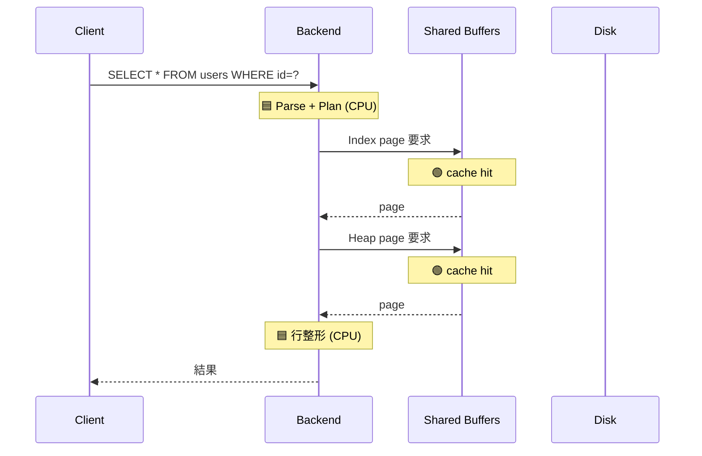
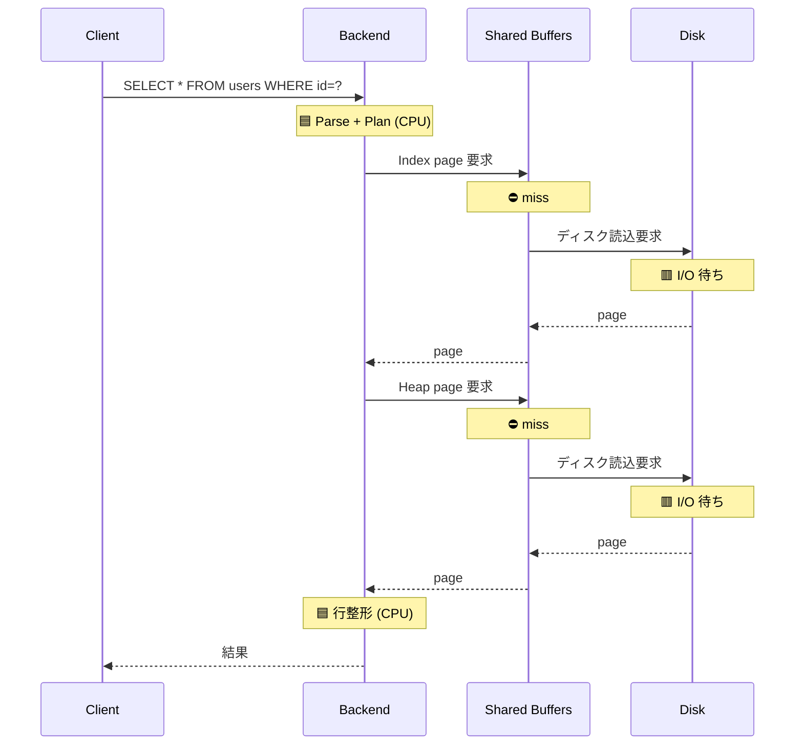
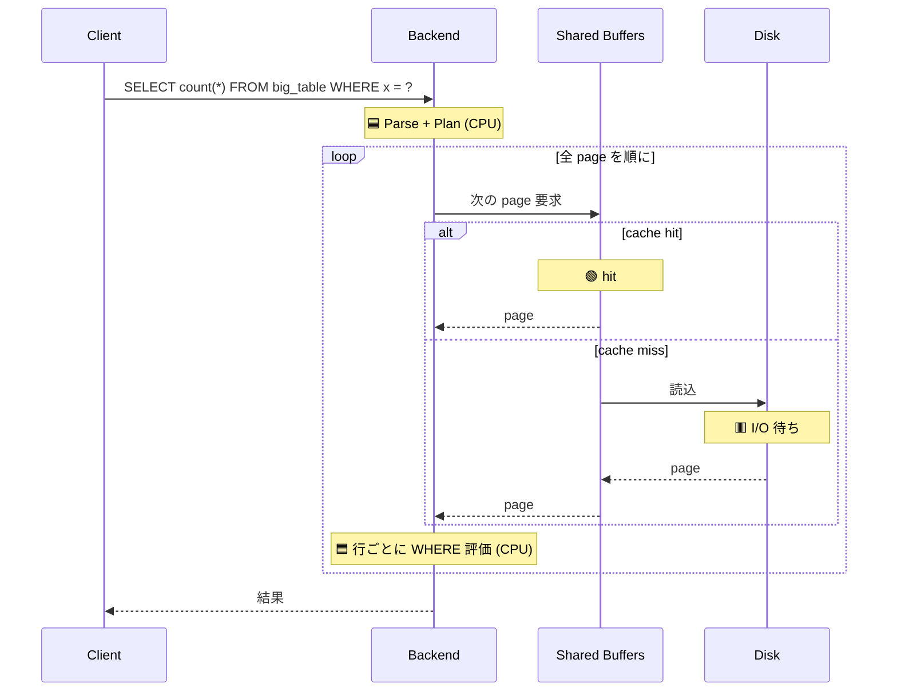
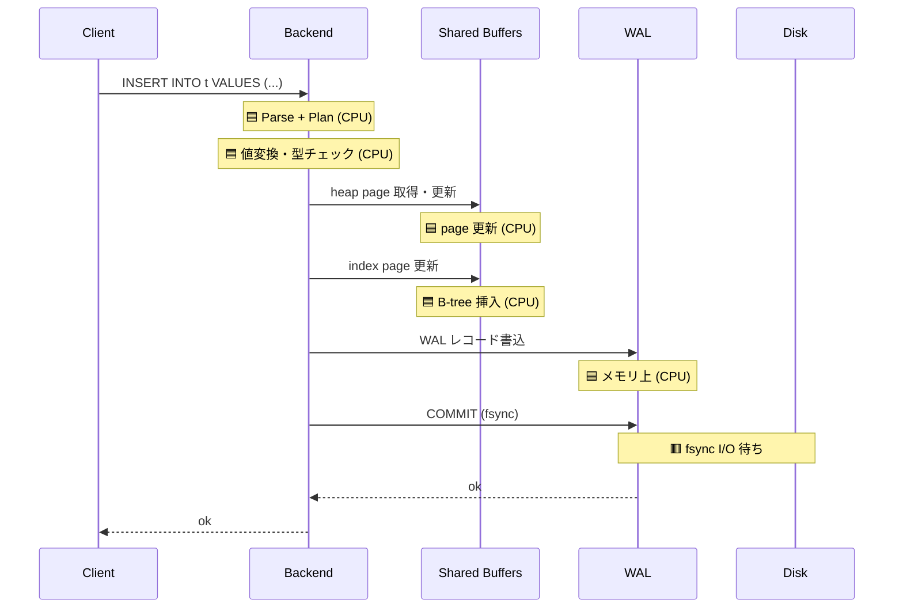
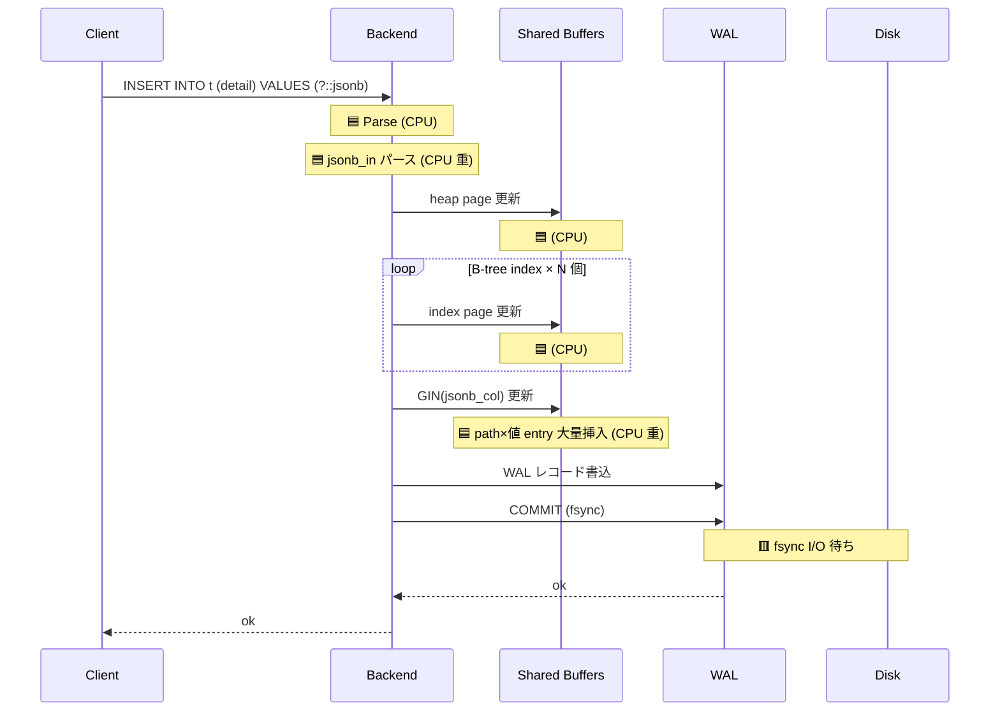
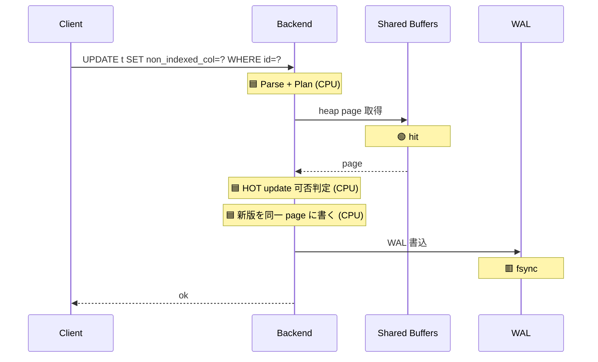
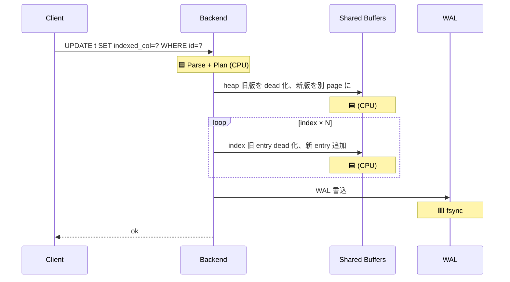
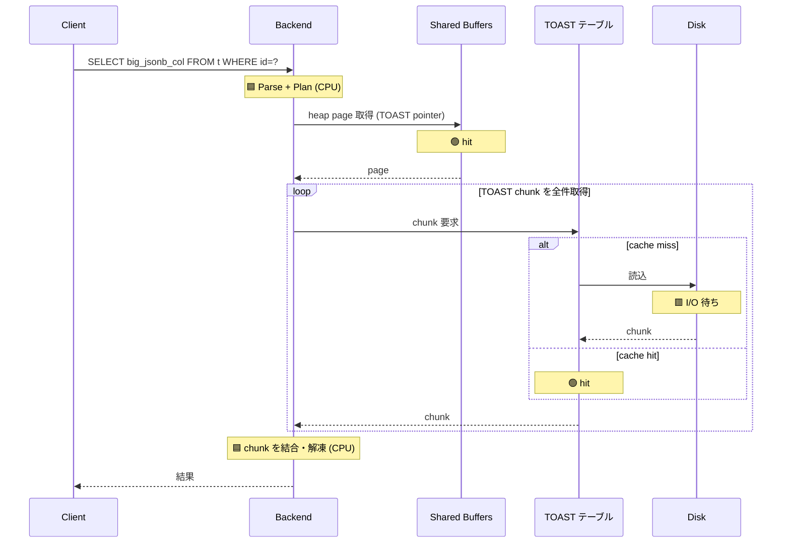

# PostgreSQL のスループットとレイテンシ

「**SQL の実行数が増えると CPU 使用率と実行時間がどう変わるか**」を、PostgreSQL の挙動と合わせて理解するための学習ドキュメント。

「平均は良いのにピークで急に遅くなる」「使用率 80% は危険水域」といった**経験則の根拠**を、待ち行列の基本と PostgreSQL 固有要因の両面から説明する。

関連:
- [00-overview.md](00-overview.md): PostgreSQL 内部構造
- [dev-09-cpu-consumption.md](dev-09-cpu-consumption.md): CPU 消費パターン
- [dev-06-connection-pooling.md](dev-06-connection-pooling.md): 接続プーリング
- [dba-05-monitoring.md](dba-05-monitoring.md): 監視

---

## 目次

1. [SQL 実行数と内容が DB の負荷を決める](#1-sql-実行数と内容が-db-の負荷を決める)
2. [使用率と応答時間の関係](#2-使用率と応答時間の関係)
3. [ホッケースティック曲線](#3-ホッケースティック曲線)
4. [PostgreSQL 固有の悪化要因](#4-postgresql-固有の悪化要因)
5. [pg_stat_* で見る飽和兆候](#5-pg_stat_-で見る飽和兆候)
6. [テールレイテンシ（p99）の悪化メカニズム](#6-テールレイテンシp99の悪化メカニズム)
7. [健全な使用率の目安](#7-健全な使用率の目安)
8. [スケール戦略](#8-スケール戦略)
9. [負荷試験で「曲がる点」を見つける](#9-負荷試験で曲がる点を見つける)
10. [まとめ](#10-まとめ)

---

## 1. SQL 実行数と内容が DB の負荷を決める

PostgreSQL から見た負荷は **「どんな SQL が、何回、どれくらいの所要時間で実行されるか」** の 3 軸で決まる。

### 1.1 DB 負荷の 3 要素

| 要素 | 単位 | 観測指標 |
|---|---|---|
| **スループット** | QPS（Queries Per Second）| `pg_stat_statements.calls / 計測秒数` |
| **1 SQL のサービス時間** | ミリ秒 | `pg_stat_statements.mean_exec_time` |
| **同時実行数** | 接続数 | `pg_stat_activity` で state='active' のカウント |

おおまかには `DB CPU 使用率 ≈ QPS × mean_exec_time / 利用可能 CPU 時間` で見積もれる。

### 1.2 同じ「DB の重さ」でも QPS は桁違いになりうる

DB が必要とする CPU 時間は次のように見積もる:

```
1 秒間に必要な合計 CPU 時間 (ms) = QPS × mean_exec_time(ms)
```

これを実行するには、1 コアあたり 1 秒に最大 1000 ms 分の処理能力なので:

```
必要 vCPU 数 ≒ (QPS × mean_exec_time) / 1000
```

例:

| ケース | QPS | mean | 合計 CPU 時間 / 秒 | 必要 vCPU |
|---|---:|---:|---:|---:|
| **A: 軽い SELECT** | 10,000 | 0.2 ms | 10,000 × 0.2 = **2,000 ms** | **約 2 vCPU** |
| **B: 重い JSONB INSERT** | 200 | 10 ms | 200 × 10 = **2,000 ms** | **約 2 vCPU** |

→ QPS は 50 倍違うが、**DB の CPU 負荷はほぼ同じ**。

直感的に言うと:
- 1 コアは 1 秒間に「1000 ms 分の仕事」をこなせる
- 軽い SELECT (0.2 ms) なら 1 秒に 5,000 件捌ける → 10,000 QPS には 2 コア必要
- 重い INSERT (10 ms) なら 1 秒に 100 件 → 200 QPS には 2 コア必要

→ **QPS だけ見ても負荷はわからない**。`mean_exec_time` と組み合わせて初めて意味が出る。

### ⚠️ `mean_exec_time` は CPU 時間ではない（重要）

`pg_stat_statements.mean_exec_time` は **経過時間（wall-clock）** であって、CPU が実際に使った時間ではない。待ち時間も全部含まれる。

**経過時間 = CPU 時間 + I/O 待ち + ロック待ち + ネットワーク待ち + ...**

クエリの性質によって、経過時間と CPU 時間の関係が変わる：

| クエリの性質 | 経過時間 vs CPU 時間 | 例 |
|---|---|---|
| CPU バウンド（キャッシュに乗った計算） | ≒ ほぼ等しい | 軽い SELECT、計算式評価、JSONB パース |
| **I/O バウンド** | 経過時間 >> CPU 時間 | shared_buffers ミスでディスク読み込み、TOAST フェッチ |
| **ロック待ち** | 経過時間 >> CPU 時間 | 行ロック競合、LWLock |
| **クライアント待ち** | 経過時間 >> CPU 時間 | 大量結果の送信中、ClientRead |

→ 「**ざっくり CPU 時間として扱っていいのは CPU バウンドな処理が中心のとき**」と覚えておく。

### 厳密に CPU 時間と待ち時間を分けたいとき

`postgresql.conf` で `track_io_timing = on` を有効化すると、`pg_stat_statements` に I/O 時間が別途記録される：

```sql
SELECT substring(query, 1, 60),
       round(total_exec_time::numeric, 0) AS total_ms,
       round(blk_read_time::numeric, 0) AS io_read_ms,
       round(blk_write_time::numeric, 0) AS io_write_ms,
       round((total_exec_time - blk_read_time - blk_write_time)::numeric, 0) AS approx_non_io_ms
FROM pg_stat_statements
WHERE calls > 100
ORDER BY total_exec_time DESC LIMIT 10;
```

`total - blk_read_time - blk_write_time` で **I/O を除いた時間（CPU + ロック待ち等）** が概算できる。

待機イベント分布も合わせて見ると、何で時間を食ってるかが分かる：

```sql
SELECT wait_event_type, wait_event, count(*)
FROM pg_stat_activity WHERE state = 'active'
GROUP BY 1, 2 ORDER BY 3 DESC;
```

- `wait_event_type` が NULL → CPU 実行中（CPU バウンド）
- `IO` → ディスク待ち
- `Lock` / `LWLock` → ロック競合

### 1.3 SQL の「重さ」を決める要素

| 要素 | 重さに効く理由 |
|---|---|
| 対象テーブルの **行数 / index 構造** | スキャン量・index 走査コスト |
| **JSONB / TEXT カラムのサイズ** | パース・TOAST フェッチコスト |
| **複数 index の更新**（書き込み時） | index ごとにページ更新 |
| **GIN / GiST** 等の重い index | 1 INSERT で複数 entry 更新 |
| **JOIN の本数・種類** | Hash / Merge / Nested Loop の選択 |
| **ソート・集計（ORDER BY / GROUP BY）** | `work_mem` を超えるとディスクソート |
| **暗号化・関数評価** | 列・行ごとに CPU |
| **WAL 生成量**（書き込み時） | fsync 頻度・I/O 圧迫 |

### 1.4 SQL 処理パターン別の CPU/IO（視覚化）

各 SQL がどのステージで CPU を使い、どこで I/O 待ちになるかをシーケンス図で示す。

凡例:
- 🟦 **CPU 処理**
- 🟢 **キャッシュヒット**（shared_buffers / OS page cache）
- 🟥 **I/O 待ち**（ディスク read / write、fsync）
- 🟧 **ロック待ち**

---

#### A. PK SELECT（キャッシュヒット）— 全て CPU

shared_buffers にデータが乗っている状態。**最速ケース**。



→ **全 CPU、I/O ゼロ**。0.1〜0.5ms オーダー。

---

#### B. PK SELECT（キャッシュミス）— I/O 待ち発生

shared_buffers に無く、ディスクから読み込む。



→ **大半が I/O 待ち**。5〜20ms オーダー。

---

#### C. 大規模 Seq Scan — 大量 I/O + 中程度 CPU

WHERE 条件が index を使えず、テーブル全件スキャン。



→ テーブルサイズに比例して **時間も I/O も線形に増加**。100ms〜数秒。

---

#### 補足: Index Scan vs Seq Scan の CPU 消費比較

同じクエリでも、index を使えるかどうかで CPU 消費は桁違い。
B-tree index は **O(log N)**、Seq Scan は **O(N)** の計算量。

##### データ規模別の比較（cache hit 前提、目安値）

| データ件数 | Index Scan | Seq Scan | 倍率 |
|---:|---:|---:|---:|
| 100 件 | 0.05 ms | 0.3 ms | × 6 |
| 1 万件 | 0.1 ms | 10 ms | × 100 |
| 100 万件 | 0.3 ms | 500 ms | × 1,700 |
| 1 億件 | 0.5 ms | 30,000 ms | × 60,000 |

→ データが増えるほど差が指数的に広がる。

##### 各処理の中身

**Index Scan (B-tree)**:
- B-tree を 3-4 段降りる（log N の page アクセス）
- 該当行を heap から取得
- 合計 5-10 page の CPU + 1 行の WHERE 評価

**Seq Scan**:
- テーブル全 page を順に読む（N に比例）
- 各行で WHERE 評価
- 合計 N 行 × WHERE 評価の CPU 消費

##### 視覚的比較（100 万件想定）

```
Index Scan ( 0.3ms):  █▏
Seq Scan   (500ms ):  ███████████ ...（× 1,700）
```

##### 高 QPS での累積影響

100 QPS で同時実行された場合の DB CPU 必要量：

| プラン | 1 クエリ | 100 QPS の合計 CPU 時間/秒 | 必要 vCPU |
|---|---:|---:|---:|
| Index Scan | 0.3 ms | 30 ms | **0.03 vCPU** |
| Seq Scan | 500 ms | **50,000 ms** | **50 vCPU** ⚠️ |

→ **index 一つで vCPU 1,700 倍の差**。
→ 「データが少ない時は Seq Scan でも気にならない」が、データ量 × QPS の二重増加で**ある日突然 DB CPU 100% 張り付き**する典型パターン。

→ 設計時に「**この WHERE 条件は index が効くか**」を必ず確認するのが防衛策。

---

#### D. シンプル INSERT（軽い index）— ほぼ CPU + WAL fsync

PK + 1〜2 個の B-tree index 程度。



→ CPU が大半、commit 時の fsync で少し I/O。1〜3ms。

---

#### E. 重い INSERT（GIN + 多 index + 大きい JSONB）— CPU 重い

書き込み hotspot の典型悪化パターン。



→ **CPU が大半（80-90%）**、I/O は fsync 分のみ。10〜20ms に達することも。

---

#### F. UPDATE（HOT update 成立）— 軽い

index 対象カラムを変更しない UPDATE。**index 更新が省略される**。



→ index 更新スキップで **軽い**。1〜2ms。

---

#### G. UPDATE（non-HOT、複数 index 更新あり）— 重い

index 対象カラムが変わる UPDATE。**全 index 更新が必要**。



→ **全 index に新 entry**、CPU + WAL 量が増える。3〜10ms。

---

#### H. TOAST フェッチ（大きい JSONB の SELECT）— I/O 多発

行サイズが TOAST 閾値（〜2KB）を超えるカラムを含む SELECT。



→ **大きい列は TOAST 経由で追加 I/O**。10ms 以上もありえる。

---

#### まとめ表

| パターン | CPU 比率 | I/O 比率 | 主なボトルネック |
|---|---:|---:|---|
| A. PK SELECT (cache hit) | ~100% | ~0% | 何もボトルネックなし |
| B. PK SELECT (cache miss) | 〜30% | 〜70% | shared_buffers 不足 |
| C. 大規模 Seq Scan | 〜30% | 〜70% | テーブル設計（index 追加検討）|
| D. シンプル INSERT | 〜90% | fsync 分 | 健全 |
| E. 重い INSERT（GIN + 多 index）| 80-90% | fsync 分 | **CPU バウンド** |
| F. UPDATE (HOT) | ~100% | fsync 分 | 健全、軽い |
| G. UPDATE (non-HOT) | 〜80% | fsync 分 | index 更新コスト |
| H. TOAST フェッチ | 〜30% | 〜70% | 大きい列の I/O |

→ **同じ「mean 10ms」でも、E と H では原因が違う**。改善方向も違う。

---

### 1.5 計測

```sql
-- 計測期間中の QPS と平均サービス時間
SELECT
  sum(calls) AS total_calls,
  round(sum(calls) / EXTRACT(EPOCH FROM (now() - stats_reset)), 1) AS avg_qps,
  round((sum(total_exec_time) / sum(calls))::numeric, 3) AS avg_mean_ms
FROM pg_stat_statements
CROSS JOIN pg_stat_database
WHERE pg_stat_database.datname = current_database();
```

```sql
-- 重い SQL TOP 10（total_exec_time = mean × calls）
SELECT substring(query, 1, 60) AS q,
       calls,
       round(mean_exec_time::numeric, 2) AS mean_ms,
       round(total_exec_time::numeric, 0) AS total_ms,
       round((100 * total_exec_time / sum(total_exec_time) OVER ())::numeric, 1) AS pct
FROM pg_stat_statements
ORDER BY total_exec_time DESC LIMIT 10;
```

`mean × calls` の分解で「**重い SQL が稀に走る**」のか「**軽い SQL が大量に走る**」のかを切り分ける。  
→ 改善方向が変わる（前者: クエリチューニング、後者: 呼び出し回数削減）。

---

## 2. 使用率と応答時間の関係

### 直感: 銀行の窓口

窓口 1 つに客が並ぶ場面を想像する：

```
使用率 30% : ほぼ待たない    → サービス時間そのまま
使用率 50% : たまに 1 人待ち  → サービス時間の 2 倍
使用率 80% : 数人並ぶ        → サービス時間の 5 倍
使用率 95% : 行列ができる    → サービス時間の 20 倍
使用率 100%: 永遠に待つ       → 発散
```

### 待ち行列の基本式（M/M/1 モデル）

理想化された待ち行列の数式：

```
平均応答時間 ≈ サービス時間 / (1 − 使用率)
```

| 使用率 ρ | 応答時間倍率 | 直感 |
|---:|---:|---|
| 0.5 | × 2 | 余裕 |
| 0.7 | × 3.3 | やや混雑 |
| 0.8 | × 5 | 警報レベル |
| 0.9 | **× 10** | 危険水域 |
| 0.95 | × 20 | サチュレーション間近 |
| 0.99 | × 100 | 行列爆発 |

→ **使用率 70% を超えると急速にレイテンシが伸びる**。

### PostgreSQL に当てはめると

```
DB CPU 使用率 50% : クエリ平均 1ms → ~2ms
DB CPU 使用率 80% : クエリ平均 1ms → ~5ms
DB CPU 使用率 95% : クエリ平均 1ms → ~20ms
```

平均だけ見るとそれほどでもないが、**p95 / p99 はもっと悪化する**（次章）。

---

## 3. ホッケースティック曲線

章 2 で見た `1/(1-ρ)` の関数形をグラフにしたもの。**経験則ではなく、待ち行列理論から数学的に導かれる性質**。実システムでも同じ形が普遍的に観察される。

棒に持ち手がつくような形になる：

```
応答時間
    │                                              ╱│  ← 急増
    │                                            ╱  │
    │                                          ╱    │
    │                                        ╱
    │                                      ╱
    │                                  ╱╱
    │                              ╱╱
    │ ─────────────────────────╱╱        ← 平坦
    │
    └──────────────────────────────────────────────→ 使用率
    0%      30%    50%    70%    80%   90%  95% 100%
                                  ↑
                                曲がる点
                              （Knee Point）
```

### このグラフが意味すること

- 使用率 70% 付近までは「**負荷を倍にしても応答時間はそれほど変わらない**」
- そこを超えると「**わずかな負荷増で応答時間が大幅悪化**」
- 100% 近くでは「**システムが詰まる**」

### 実運用での示唆

- 「使用率 50% でも全然余裕」と思って負荷を増やすと、いつのまにか 80% に達する
- 80% を超えたあたりで初めて「急に遅くなる」と気づくが、もう手遅れ
- **健全な運用は曲がる点（Knee Point）の手前 50-70% に保つ**

### なぜ急に曲がるか（直感的説明）

- 使用率が低いとき: 新しいリクエストはすぐ処理開始
- 使用率が上がると: 前のリクエストが終わるまで待つ確率が上がる
- 待ち時間 = 自分のサービス時間 + 前の人の残り時間
- 後ろが詰まると、さらに後ろの人の待ち時間が雪だるま式に増える

身近な例え: **高速道路の渋滞**と同じ現象。交通量がキャパに近づくと 1 台のブレーキが後続に波及し、自然渋滞が発生する。レジの行列、空港保安検査、銀行窓口も同じく待ち行列理論で説明できる普遍的なパターン。

---

## 4. PostgreSQL 固有の悪化要因

待ち行列モデルだけだと「使用率と応答時間」が連動するだけだが、PostgreSQL では **複数の悪化要因が連鎖**して、理論モデルより急に悪化する。

### 4.1 接続プール枯渇

- PostgreSQL は **1 接続 = 1 OS プロセス**
- `max_connections` を超える接続要求は拒否
- アプリ側プール（HikariCP 等）の枯渇 → リクエスト待機

```
RPS 増 → 同時実行 tx 数増 → プール枯渇 → アプリでリクエスト待ち
                                              ↓
                                          タイムアウト連鎖
```

### 4.2 shared_buffers の取り合い

- shared_buffers は固定サイズ
- 同時実行クエリが増えると、それぞれが必要なページをキャッシュに乗せようとして競合
- **buffer hit ratio が低下** → ディスク I/O 増 → 各クエリが遅くなる

### 4.3 autovacuum が追いつかない正帰還

```
高 RPS で UPDATE/DELETE 多発
    ↓
dead tuple 急増
    ↓
autovacuum が追いつかない
    ↓
bloat 蓄積
    ↓
クエリ走査時間が伸びる（dead をスキップしないと真の行に到達しない）
    ↓
1 クエリの所要時間が伸びる
    ↓
同時実行 tx 数がさらに増える ← 正帰還！
```

### 4.4 WAL writer / checkpointer の競合

- 高負荷 = WAL 大量生成
- checkpointer が定期的に dirty page を heap に書き出す
- checkpoint 中は I/O が集中 → **レイテンシスパイク**

### 4.5 LWLock 競合

- shared_buffers のページ更新、`ProcArrayLock`、`WALInsertLock` 等の内部ロック
- 高同時実行で取り合いが激化
- `pg_stat_activity.wait_event_type = 'LWLock'` で観測される

### 4.6 Context Switch 増

- 接続数 >> CPU コア数 で context switch 多発
- CPU の sys 時間が増え、user 時間（実際の SQL 処理）が圧迫
- → 同じクエリでも遅くなる

### 4.7 統計情報の鮮度低下

- 高 RPS で書き込み多発 → テーブルのデータ分布が変わる
- ANALYZE 追いつかず古い統計で planner が悪いプランを選ぶ
- → クエリが急に Seq Scan に切替などの劣化

---

## 5. pg_stat_* で見る飽和兆候

### `pg_stat_activity`（リアルタイム）

```sql
SELECT wait_event_type, wait_event, count(*)
FROM pg_stat_activity
WHERE state = 'active'
GROUP BY 1, 2 ORDER BY 3 DESC;
```

飽和に向かっているとき、wait_event の **分布が変わる**：

| 健全 | 飽和近く |
|---|---|
| `(NULL)` 多い（CPU 実行中）| `LWLock` `BufferPin` `Lock` 急増 |
| `ClientRead` 多い（idle）| `ClientRead` 減少（みんな busy） |
| アクティブ数 < vCPU × 数 | アクティブ数 >> vCPU × 数 |

### `pg_stat_database`

```sql
SELECT datname,
       xact_commit, xact_rollback,
       blks_read, blks_hit,
       round(100.0 * blks_hit / NULLIF(blks_read + blks_hit, 0), 2) AS hit_ratio,
       deadlocks, conflicts,
       temp_files, temp_bytes
FROM pg_stat_database WHERE datname = current_database();
```

- `hit_ratio` 99% 未満 → shared_buffers / OS cache 不足
- `temp_files` 急増 → work_mem 不足でディスクソート発生
- `deadlocks` 増 → ロック競合の兆候

### `pg_stat_bgwriter` / `pg_stat_wal`

- `checkpoints_req`（要求された checkpoint）が `checkpoints_timed` を上回る → I/O 飽和の兆し
- `buffers_backend` の比率が高い → backend が直接書き出してる（bg writer 追いつかず）

### `pg_stat_user_tables`

```sql
SELECT relname, n_live_tup, n_dead_tup,
       round(100.0 * n_dead_tup / NULLIF(n_live_tup, 0), 1) AS dead_pct,
       last_autovacuum
FROM pg_stat_user_tables
ORDER BY n_dead_tup DESC LIMIT 10;
```

- `dead_pct > 30%` → autovacuum が追いついてない
- これが続くと「正帰還」（4.3 節）に入る

---

## 6. テールレイテンシ（p99）の悪化メカニズム

### 平均は良いが p99 が悪い、はなぜ起きるか

```
RPS 100, クエリ 1000 個実行
  - 950 個は 1ms で完了
  -  40 個は 10ms（軽い待ち）
  -   9 個は 100ms（重い待ち）
  -   1 個は 1000ms（最悪ケース）

平均 = (950 × 1 + 40 × 10 + 9 × 100 + 1 × 1000) / 1000 ≈ 3.2ms
p99 = 100ms
p999 = 1000ms
```

→ **平均だけ見ると気づかない悪化**が p99 / p999 にだけ現れる。

### なぜ p99 が先に悪化するか

待ち行列ではサービス時間にばらつきがあり、**たまたま長いクエリの後ろに並ぶ確率**が使用率と共に増える：

```
使用率 50%: 99 人に 1 人だけ運悪く長い行列に並ぶ → p99 ≈ 数倍
使用率 80%: 99 人に 1 人どころか、5 人に 1 人くらい混雑に当たる → p99 ≈ 10 倍
使用率 95%: ほぼ全員が混雑、特に p99 は爆発 → p99 ≈ 100 倍
```

### PostgreSQL での p99 急悪化の典型要因

| 要因 | 説明 |
|---|---|
| **checkpoint スパイク** | 定期 checkpoint で I/O 集中、その間のクエリが遅延 |
| **autovacuum 起動** | 大きいテーブルで vacuum が始まると I/O / CPU 圧迫 |
| **GC pause（アプリ側）** | Stop-the-world で全リクエスト遅延 |
| **TOAST フェッチ** | 大きい列の取得で I/O 追加 |
| **GIN pending list マージ** | 普段軽い GIN INSERT がたまに重くなる |
| **接続確立コスト** | プールミスで新規接続作成（fork） |
| **planner の悪いプラン** | 統計情報古い時に発火、たまに「悪いプラン」を選ぶ |

### モニタリングでは平均より p95/p99 を見る

```sql
-- pg_stat_statements で各クエリの mean と max を見る
SELECT substring(query, 1, 60),
       calls,
       round(mean_exec_time::numeric, 2) AS mean_ms,
       round(max_exec_time::numeric, 2) AS max_ms,
       round(stddev_exec_time::numeric, 2) AS stddev_ms
FROM pg_stat_statements
WHERE calls > 100
ORDER BY max_exec_time DESC LIMIT 20;
```

`stddev_exec_time` がデカい SQL は **不安定**な実行時間のサイン。

---

## 7. 健全な使用率の目安

### CPU 使用率

以下は **ピーク時の CPU 使用率**の目安。平均値はこれより低くなる。

| 範囲 | 状態 | アクション |
|---:|---|---|
| 〜 50% | 余裕 | 通常運用、コスト最適化検討も可 |
| 50-70% | 適正 | 通常運用、監視継続 |
| 70-80% | 警戒水域 | 改善計画着手 |
| 80-90% | 危険水域 | スケール / 改善必須 |
| 90% 以上 | サチュレーション間近 | 緊急対応 |

ピーク時に 70% を超え始めたら**早めに動く**。曲がる点に到達してからでは遅い。
平均値での目安は、ピーク値の半分〜2/3 程度を狙う。

### 接続数

- `max_connections` の **50-70%** を運用上限の目安
- 同時アクティブ接続数（state='active'）が vCPU 数の 2-4 倍超え → context switch 過多
- 超えるなら **PgBouncer / RDS Proxy** で集約

### Buffer hit ratio

- **99% 以上**を目標
- 95% 未満 → shared_buffers 不足、または ワーキングセットがメモリに収まらない

### dead tuple 比率

- `n_dead_tup / n_live_tup` を **20% 以内**に
- 超えるなら autovacuum パラメータ強化

---

## 8. スケール戦略

PostgreSQL は単一マスター構成が基本。負荷が増えたときの選択肢を整理する。

### 8.1 スケールアップ（縦）

| 内容 | 効果 | 制約 |
|---|---|---|
| vCPU を増やす | CPU バウンドな処理は概ね線形に改善 | クラウドのインスタンスサイズ上限まで |
| メモリを増やす | shared_buffers, work_mem に振れる | 同上 |
| ストレージ I/O を増やす | I/O バウンドな処理改善 | クラウドの IOPS 上限まで |

→ **最初の選択肢**として有力。即効性あり。

### 8.2 接続集約

| 内容 | 効果 |
|---|---|
| PgBouncer / RDS Proxy 導入 | 接続数を集約、context switch 削減 |
| transaction pooling | 短命 tx 多数のワークロードで効果大 |

→ アプリを変えずに、接続数の問題を解消できる。

### 8.3 読み取り分散（Streaming Replication）

| 内容 | 効果 | 制約 |
|---|---|---|
| Read Replica を追加 | 読み取り負荷を分散 | 書き込みは Primary のみ |
| 同期 vs 非同期 | 同期は遅延小、非同期は性能優先 | レプリ遅延を考慮した設計が必要 |

→ 読み取り中心のワークロードに有効。

### 8.4 パーティショニング

| 内容 | 効果 |
|---|---|
| 時間軸でパーティション | 古いパーティション DROP で即座にデータ削除 |
| テナント軸 | 巨大テーブルを分割、特定テナントのスキャン高速化 |
| パーティション pruning | 範囲条件で対象パーティションだけスキャン |

→ 巨大テーブルの操作を高速化、bloat も部分的に分離。

詳細: [dba-07-partitioning.md](dba-07-partitioning.md)

### 8.5 シャーディング

| 内容 | 効果 | 制約 |
|---|---|---|
| アプリ層シャーディング | DB を完全分割 | アプリ実装複雑、JOIN 不可 |
| Citus 等の拡張 | 透過的シャーディング | 学習・運用コスト |

→ 単一マスターの限界を超えたいとき。最終手段。

### 8.6 アプリ層改善（負荷削減）

- **キャッシュ**: Redis 等で頻繁な SELECT を逃がす
- **N+1 解消**: JOIN や IN 句で 1 クエリに集約
- **不要クエリ削除**: 同じデータを何度も問い合わせない
- **非同期化**: 監査ログや統計を user-facing path から外す

→ **スケールアップせずに天井を上げる**最も持続的な対策。

---

## 9. 負荷試験で「曲がる点」を見つける

### 段階的な負荷試験

```
ステップ 1: RPS 100  → 計測（CPU、p95、エラー率）
ステップ 2: RPS 200  → 計測
ステップ 3: RPS 500  → 計測
ステップ 4: RPS 1000 → 計測
...
急悪化したら停止
```

### 観測すべき指標

| 指標 | しきい値 |
|---|---|
| DB CPU 使用率 | 80% 超で停止 |
| p95 レイテンシ | 目標値の 2 倍超で停止 |
| p99 レイテンシ | 目標値の 5 倍超で停止 |
| エラー率 | 1% 超で停止 |
| 接続数 | max_connections の 70% 超で停止 |

### 曲がる点を見つけたら

「**曲がる点の 50-70% を運用上限**」とする。

例: 曲がる点が RPS 1000 なら、運用上限は RPS 500-700。  
それ以上の負荷が見込まれるなら、対応が必要：
- スケールアップ
- アプリ改善
- 読み取り分散
- パーティション
- 等

### よくある落とし穴

- **ローカル計測だけで判断しない**: 本番想定データ量で再計測
- **warm-up を捨てる**: 初回 Run は JIT/cache が未温
- **平均だけ見ない**: p95/p99 を必ず確認
- **環境変動を考慮**: PC 負荷、autovacuum タイミング等で揺れる

---

## 10. まとめ

### キーメッセージ

1. **DB 負荷は「QPS × mean_exec_time」で決まる**。QPS だけ見ても判断不可
2. **使用率 70% を超えると応答時間が急増する**（待ち行列の数学的性質）
3. **PostgreSQL では複数の悪化要因が連鎖**（接続枯渇、bloat 正帰還、I/O 競合 等）
4. **テールレイテンシ（p99）は平均より先に悪化**する
5. **健全な運用は 50-70% 使用率**、80% 超は警報レベル
6. スケール戦略は **縦 → 接続集約 → 読み取り分散 → パーティション → シャーディング** の順で検討
7. **アプリ層改善（N+1 解消、キャッシュ）が一番持続的**
8. 負荷試験で「**曲がる点**」を見つけて、その 50-70% を運用上限に

### 関連ドキュメント

- [00-overview.md](00-overview.md): PostgreSQL の仕組み
- [dev-04-transactions.md](dev-04-transactions.md): トランザクション・ロック
- [dev-05-query-optimization.md](dev-05-query-optimization.md): クエリ最適化
- [dev-06-connection-pooling.md](dev-06-connection-pooling.md): 接続プーリング
- [dev-09-cpu-consumption.md](dev-09-cpu-consumption.md): CPU 消費パターン
- [dba-03-replication-ha.md](dba-03-replication-ha.md): レプリケーション
- [dba-05-monitoring.md](dba-05-monitoring.md): 監視
- [dba-06-maintenance.md](dba-06-maintenance.md): メンテナンス
- [dba-07-partitioning.md](dba-07-partitioning.md): パーティショニング

### 参考リンク

- [Little's Law](https://en.wikipedia.org/wiki/Little%27s_law) - 待ち行列の基本則
- [M/M/1 queue](https://en.wikipedia.org/wiki/M/M/1_queue) - 単一サーバ待ち行列モデル
- [USE Method](https://www.brendangregg.com/usemethod.html) - Utilization / Saturation / Errors の観察法
- PostgreSQL [Monitoring Database Activity](https://www.postgresql.org/docs/current/monitoring.html)
