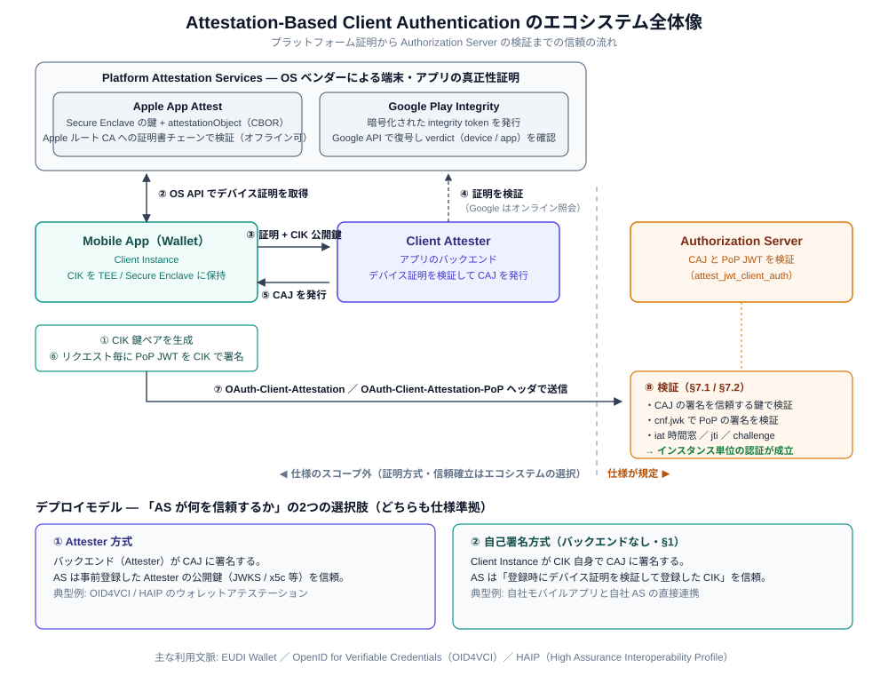

# Attestation-Based Client Authentication 実践編

[仕様編](./attestation-based-client-auth.md)では draft-ietf-oauth-attestation-based-client-auth の仕様そのものを解説しました。この実践編では、**登録から認証までを実際のモバイルアプリで実現するために必要な知識**をまとめます。

仕様が規定するのは「2つの JWT のワイヤ形式と検証ルール」だけです。実際に動かすには、その外側 — 「Attester はどうやってアプリの正当性を確認するのか」「AS は誰の鍵を信頼するのか」 — をエコシステムとして設計する必要があります。



---

## 第1部: 全体の流れ — 2つのフェーズ

実装は「登録」と「認証」の2フェーズに分かれます。

```
【登録フェーズ】インストール後に1回（+ 鍵やアプリの状態が変わったら再実行）

  アプリ                                  Attester / AS
    │                                        │
    │ 1. CIK 鍵ペアを生成                    │
    │    (TEE / Secure Enclave)              │
    │                                        │
    │ 2. チャレンジ取得                      │
    │ ◄──────────────────────────────────── │
    │                                        │
    │ 3. OS API でデバイス証明を取得         │
    │    (チャレンジ + CIK を織り込む)       │
    │                                        │
    │ 4. デバイス証明 + CIK 公開鍵を送付     │
    │ ──────────────────────────────────► 5. 証明を検証
    │                                        │
    │ 6. CAJ 発行（Attester 方式）           │
    │    or CIK 登録完了（自己署名方式）     │
    │ ◄──────────────────────────────────── │

【認証フェーズ】クライアント認証が必要なリクエスト毎

  アプリ                                  Authorization Server
    │                                        │
    │ 1. PoP JWT を CIK で署名               │
    │    (aud / jti / iat)                   │
    │                                        │
    │ 2. OAuth-Client-Attestation +          │
    │    OAuth-Client-Attestation-PoP        │
    │ ──────────────────────────────────► 3. CAJ + PoP を検証
    │                                        │
    │ 4. トークン応答 or エラー              │
    │ ◄──────────────────────────────────── │
```

登録フェーズの信頼の質が、その後のすべての認証の質を決めます。

---

## 第2部: モバイル側の鍵管理

### iOS と Android で「鍵」と「証明」の関係が違う

| | iOS | Android |
|---|---|---|
| 鍵の保管先 | Secure Enclave | Android Keystore（StrongBox 対応端末ならハードウェア） |
| アプリ・端末の証明 | App Attest（`attestationObject`） | Play Integrity（verdict） |
| **鍵そのものの証明** | App Attest の鍵は生成時点で証明される | **Key Attestation**（鍵の証明書チェーン） |

ここに実装上の重要な非対称性があります。

- **iOS**: App Attest の鍵は `generateAssertion` で `clientDataHash` に署名する専用鍵で、**任意の JWS（PoP JWT）には使えません**。したがって CIK は Secure Enclave 上の別鍵として生成し、App Attest の `clientData` に CIK 公開鍵（のハッシュ）を含めることで「この正規アプリがこの CIK を持っている」を紐づけます
- **Android**: Play Integrity はアプリと端末の判定を返しますが、**特定の鍵は証明しません**。CIK の証明には Key Attestation（鍵生成時に `attestationChallenge` を指定して得られる証明書チェーン）を使い、Play Integrity と組み合わせます

### 鍵の性質として押さえること

- 秘密鍵は非エクスポートで生成する（TEE / Secure Enclave から出さない）
- 鍵はアプリの再インストールや機種変更で失われる。**再登録フローは異常系ではなく平常運転**として設計する
- CIK を新しくしたら CAJ も取り直しが必須（仕様 §9.6）

---

## 第3部: デバイス証明の取得と検証

### 共通の鉄則: サーバー発行チャレンジを必ず織り込む

App Attest も Play Integrity / Key Attestation も、「サーバーが発行したチャレンジ（ノンス）を証明の生成に含める」設計になっています。登録 API の設計でチャレンジ発行のステップを省くと、**デバイス証明そのものがリプレイ可能**になります。登録フローは必ず「チャレンジ取得 → 証明生成 → 送付」の順にします。

### Apple App Attest

| | クライアント側 | サーバー側の検証 |
|---|---|---|
| 手順 | `DCAppAttestService.generateKey` → `attestKey(keyId, clientDataHash)` | 証明書チェーンを Apple の App Attest ルート CA へ検証 → nonce（チャレンジ由来）の一致 → App ID の一致 → カウンタ確認 |
| 特徴 | 鍵は Secure Enclave 生成。シミュレータでは動かない | オフライン検証可能（ルート CA は公開されている） |

### Google Play Integrity + Key Attestation

| | クライアント側 | サーバー側の検証 |
|---|---|---|
| Play Integrity | Integrity API にリクエスト（チャレンジを `requestHash` に） | 暗号化トークンを Google API で復号し、verdict（`MEETS_DEVICE_INTEGRITY` / アプリの Play 配布判定等）をポリシーと突き合わせ |
| Key Attestation | `KeyGenParameterSpec` に `setAttestationChallenge(チャレンジ)` を指定して CIK を生成 | 証明書チェーンをハードウェア・アテステーションのルートへ検証し、拡張領域のチャレンジ・鍵属性を確認 |

Play Integrity の復号はオンライン（Google API）が基本です。可用性設計（Google 側障害時に登録を止めるか、リスク許容するか）もポリシーとして決めておきます。

---

## 第4部: Client Attester の構築 — 必要な設定と検証事項

### 事前に必要な設定

Attester を立てるには、プラットフォーム側・自分自身・AS 側の3方向の設定が必要です。

**1. Attester 自身の署名まわり**

| 設定 | 内容 |
|------|------|
| CAJ 署名鍵 | 非対称鍵（ES256 等）。HSM / KMS 等での保管が望ましい。`kid` を付与する |
| 公開鍵の配布 | AS へ事前登録（静的 JWKS）、または JWKS エンドポイント / `x5c` チェーンで公開。ローテーション時は新旧の鍵を並行公開する |
| CAJ 発行ポリシー | `exp` の長さ（長い = Attester 負荷減・失効反映が遅い ／ 短い = 逆）。`alg` は AS の `client_attestation_signing_alg_values_supported` と整合させる |

**2. プラットフォーム側の事前設定**

| プラットフォーム | 必要な設定 |
|----------------|-----------|
| Apple App Attest | 対象アプリの App ID（Team ID + Bundle ID）の管理、App Attest ルート CA 証明書の入手、開発（サンドボックス）/ 本番環境の区別 |
| Google Play Integrity | Play Console で Integrity API を有効化（Google Cloud プロジェクトと連携）、復号方式の選択（Google 管理鍵 = API 復号 ／ 自己管理鍵）、復号 API 呼び出し用のサービスアカウント、対象アプリのパッケージ名・署名証明書ダイジェスト |
| Android Key Attestation | Google のハードウェア・アテステーション用ルート証明書、アテステーション鍵の失効リスト（CRL）の取得手段 |

**3. 検証ポリシー（何を「正規」と見なすか）**

| ポリシー項目 | 例 |
|-------------|-----|
| verdict の水準 | `MEETS_DEVICE_INTEGRITY` で許容するか、より強い水準を要求するか |
| 鍵の保護レベル | StrongBox / Secure Enclave 必須か、ソフトウェア鍵も許容するか |
| 環境の扱い | rooted / エミュレータ / 開発環境ビルドを弾くか |
| チャレンジ | 有効期限（短命）と単回使用の強制 |

この表の判断はセキュリティ要件と UX（古い端末の切り捨て）のトレードオフそのものなので、「設定できる」ようにしておくのが実務的です。

### CAJ 発行時に検証すべき事項（チェックリスト）

CAJ の発行は「AS に代わって信頼を裏書きする」行為です。発行前に以下をすべて確認します。

1. **チャレンジ**: 自分が発行したもので、未使用・有効期限内か
2. **デバイス証明の正当性**: 第3部のプラットフォーム別検証（証明書チェーン / 復号と verdict / Key Attestation チェーン）
3. **CIK との紐づけ**: 証明が**この CIK** に対して作られたか（`clientData` / `attestationChallenge` に CIK が織り込まれているか）。ここが抜けると「正規アプリの証明 + 攻撃者の鍵」を受け入れてしまう
4. **client_id との対応**: この CIK を紐づけてよい `client_id` か（`sub` に入れる値の正当性）
5. **鍵の健全性**: `client_instance_key` が公開鍵のみか（秘密鍵成分の混入拒否）、許容アルゴリズムか
6. **ポリシー判定**: 上記の検証ポリシー（verdict 水準・保護レベル・環境）を満たすか
7. **レート制限・重複**: 同一端末からの異常な登録頻度、既存インスタンスとの重複登録の扱い

### 登録エンドポイントの設計

Attester（または自己署名方式の AS）が提供する登録 API の最小構成です。

```
1. POST /attestation/challenge
   ← { "challenge": "..." }（短命・単回使用）

2. POST /attestation/register
   → {
       "client_id": "...",
       "client_instance_key": { "kty": "EC", "crv": "P-256", ... },  // 公開鍵のみ
       "platform": "ios" | "android",
       "evidence": { ... attestationObject / integrity token / 証明書チェーン ... }
     }
   ← Attester 方式:   { "client_attestation": "eyJ...（CAJ）" }
   ← 自己署名方式:    登録完了（AS が CIK を信頼リストに登録）
```

受け付けたリクエストには前述の「CAJ 発行時に検証すべき事項」をすべて適用します。検証に使った evidence（verdict やチェーンの検証結果）は、インスタンスの属性として保存しておくと、後の失効判断やリスク評価に使えます。

---

## 第5部: 認証フェーズの実装

### CAJ の管理

- CAJ は端末に保管し、`exp` を監視して失効前に再取得する
- サーバーから `use_fresh_attestation` が返ったら、CAJ を取り直してリトライする

### PoP JWT 生成の実装ポイント

| クレーム | 実装 |
|---------|------|
| `aud` | AS の issuer identifier URL。ハードコードせず Discovery（`/.well-known/oauth-authorization-server` 等）から取得。**宛先毎に PoP を生成**する |
| `jti` | リクエスト毎に UUID 等で一意に |
| `iat` | 端末の現在時刻。端末の時計ズレはサーバーの許容窓で吸収されるが、大きくズレた端末では認証が失敗する。チャレンジ方式に対応しておくと時計ズレ問題自体が消える |
| `challenge` | サーバーがチャレンジを提供している場合は必須 |

ヘッダの `typ`（`oauth-client-attestation-pop+jwt`）を忘れると検証で弾かれます。JWT ライブラリのデフォルト（`JWT`）のままにしないこと。

### エラーハンドリング

| 受け取ったエラー | クライアントの挙動 |
|----------------|------------------|
| `invalid_client`（+ `invalid_client_attestation`） | CAJ / PoP の生成ミスか、登録が無効化された可能性。リトライ前に CAJ 再取得 → それでも失敗なら再登録フローへ |
| `use_fresh_attestation` | CAJ を再取得してリトライ |
| `use_attestation_challenge` | レスポンスの `OAuth-Client-Attestation-Challenge` ヘッダのチャレンジを `challenge` クレームに入れて PoP を作り直しリトライ |

---

## 第6部: 運用で効いてくる論点

| 論点 | 押さえること |
|------|-------------|
| 再インストール・機種変更 | 鍵は失われる。再登録を平常のフローとして UX 設計する |
| 鍵ローテーション | 新しい CIK には新しい CAJ が必須（§9.6）。登録 API をそのまま再実行できる設計に |
| インスタンス単位の失効 | 「この端末のこのアプリだけ止める」を、ユーザーアカウントを巻き込まずにできるようにしておく |
| リフレッシュトークン | インスタンス鍵に束縛される（§9.3）。機種変更後は RT も引き継げない前提で設計する |
| プライバシー | AS / RS 毎に別の CAJ・CIK を使う（§10.1）。使い回すとサーバー間でインスタンスを突合できてしまう |
| Attester の可用性 | CAJ の再取得や登録が Attester 障害で止まると全インスタンスの認証に波及する。CAJ の寿命設計とセットで考える |

---

## デプロイモデルの選び方（再掲）

| モデル | 向いているケース | 実装の重心 |
|--------|----------------|-----------|
| **Attester 方式** | ウォレット等、AS と アプリ提供者が別組織（OID4VCI / HAIP） | Attester バックエンドの構築と鍵管理、AS への Attester 鍵登録 |
| **自己署名方式** | 自社アプリ × 自社 AS の直接連携 | 登録フローでのデバイス証明検証と、AS 側の CIK 登録・照合 |

どちらのモデルでも、この実践編の「登録フェーズの設計」（チャレンジ・デバイス証明検証・CIK の紐づけ）はそのまま必要になります。
