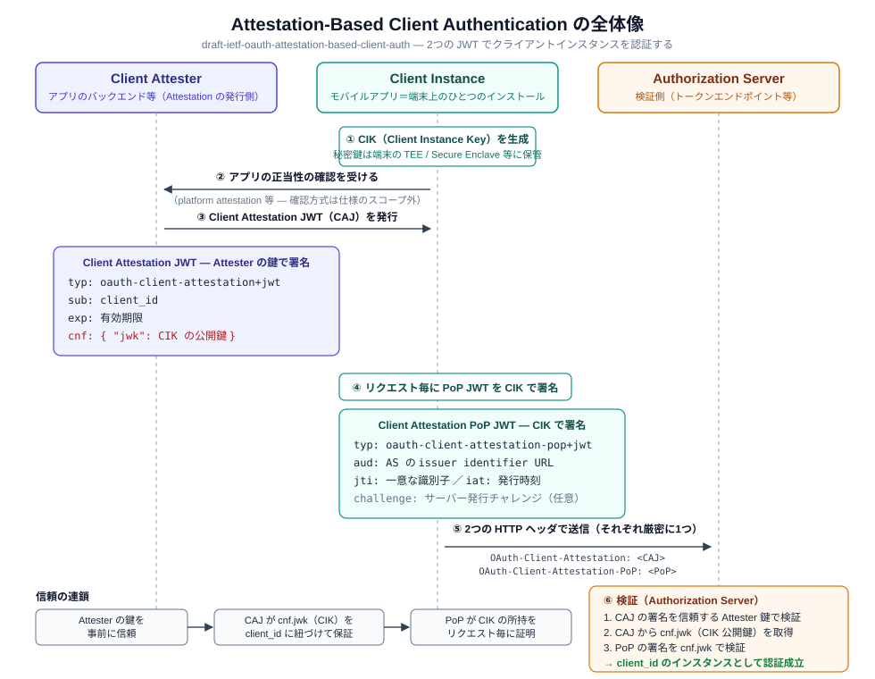

# Attestation-Based Client Authentication

OAuth 2.0 Attestation-Based Client Authentication（draft-ietf-oauth-attestation-based-client-auth）は、モバイルアプリのような「秘密を安全に保管できないクライアント」を、インスタンス単位で認証するための仕様です。このドキュメントでは draft-10 時点の仕様を解説します。

> ⚠️ 本仕様は IETF で策定中の Internet-Draft です。今後のバージョンで内容が変わる可能性があります。

まず全体像です。3人の登場人物と2つの JWT、そして「信頼の連鎖」がこの仕様のすべてです。



---

## 第1部: 概要編

### なぜ必要なのか？

モバイルアプリのクライアント認証には、長年のジレンマがあります。

| 方式 | 問題 |
|------|------|
| `client_secret` を埋め込む | 全インスタンスで同じ秘密になり、リバースエンジニアリングで抽出できてしまう |
| public client（`none`）+ PKCE | 認可コード横取りは防げるが、「正規アプリの正規インスタンスか」は何も証明できない |

Attestation-Based Client Authentication はこのギャップを埋めます。

- **Client Attester** がアプリの正当性を確認し、そのインスタンスの鍵を保証する証明書（**Client Attestation JWT**）を発行する
- インスタンスはリクエスト毎に自分の鍵で所持証明（**Client Attestation PoP JWT**）を署名する
- 秘密（インスタンス鍵）は端末の TEE / Secure Enclave から出ず、ワイヤ上を流れない

### 登場人物は3人

| 役割 | 説明 |
|------|------|
| **Client Attester** | アプリの正当性を確認して Client Attestation JWT を発行する。典型的にはアプリのバックエンド |
| **Client Instance** | 特定の端末上にインストールされたアプリの1インスタンス。Client Instance Key（CIK）を保持する |
| **Authorization Server / Resource Server** | 2つの JWT を検証する側 |

Attester は必須の別サーバーではありません。仕様はバックエンドを持たない構成も明示的に想定しています。

> "this specification is designed to be flexible and can be implemented even in scenarios where the client does not have a backend serving as a Client Attester. In such cases, each Client Instance is responsible for performing the functions typically handled by the Client Attester on its own."（§1）

つまり「Attester をどう信頼するか」は仕様準拠の問題ではなく、エコシステム側の実装選択です（§9.8 で明示的にスコープ外）。

### 2つの JWT の役割分担

| | Client Attestation JWT（CAJ） | Client Attestation PoP JWT |
|---|---|---|
| 発行者（署名鍵） | Client Attester | Client Instance（CIK） |
| 寿命 | 比較的長い（`exp` で管理） | リクエスト毎に生成（`iat` の時間窓で検証） |
| 役割 | 「この CIK は client_id の正規インスタンスの鍵」という保証 | 「私はいま CIK を持っている」という所持証明 |

---

## 第2部: 仕組み編

### Client Attestation JWT（§4）

Client Attester が署名する JWT です。

**JOSE ヘッダ**

| パラメータ | 要件 | 値 |
|-----------|------|-----|
| `typ` | REQUIRED | `oauth-client-attestation+jwt` |
| `alg` | REQUIRED | 署名アルゴリズム。`none` は不可 |

**クレーム**

| クレーム | 要件 | 説明 |
|---------|------|------|
| `sub` | REQUIRED | クライアントの `client_id` |
| `exp` | REQUIRED | 有効期限。期限切れは拒否される |
| `cnf` | REQUIRED | Client Instance Key。**`jwk` 表現が必須**（RFC 7800） |
| `iat` | OPTIONAL | 発行時刻 |

```json
{
  "sub": "https://client.example.com",
  "iat": 1772487595,
  "exp": 2529866394,
  "cnf": {
    "jwk": {
      "kty": "EC",
      "use": "sig",
      "crv": "P-256",
      "x": "VcKVNBZ4IaBAYW3jxM4w3TJFVA7myeUGQyGt-g_yvpQ",
      "y": "f-E-hYE3TAWKwhVv9pej9NABs9SX9XsNO80x57jFTyU"
    }
  }
}
```

署名はデジタル署名または MAC が許可されますが、MAC は Attester と検証サーバーが信頼関係を持つ特殊なケース向けで、通常はデジタル署名が推奨されます（§11.2）。理解できないクレームは無視しなければなりません（MUST）。

### Client Attestation PoP JWT（§5.1）

Client Instance が CIK で署名する JWT です。**非対称署名のみ**が許可され（MAC 不可）、検証には CAJ の `cnf` クレームの鍵が使われます。

**JOSE ヘッダ**

| パラメータ | 要件 | 値 |
|-----------|------|-----|
| `typ` | REQUIRED | `oauth-client-attestation-pop+jwt` |
| `alg` | REQUIRED | 非対称署名アルゴリズム。`none` 不可 |

**クレーム**

| クレーム | 要件 | 説明 |
|---------|------|------|
| `aud` | REQUIRED | 提示先の識別子。Authorization Server なら **RFC 8414 の issuer identifier URL**、Resource Server なら RFC 9728 の resource identifier URL |
| `jti` | REQUIRED | 一意な識別子（リプレイ検出に使う） |
| `iat` | REQUIRED | 発行時刻 |
| `challenge` | OPTIONAL | サーバーが発行したチャレンジ（後述） |

```json
{
  "aud": "https://as.example.com",
  "jti": "d25d00ab-552b-46fc-ae19-98f440f25064",
  "iat": 1772487595,
  "challenge": "5c1a9e10-29ff-4c2b-ae73-57c0957c09c4"
}
```

PoP JWT は単一の宛先向けです。複数のサーバーに送る場合は宛先毎に生成しなければなりません（MUST）。

### HTTP ヘッダでの送信

2つの JWT はそれぞれ専用の HTTP ヘッダで送ります。**各ヘッダは厳密に1つ**でなければなりません（§7.1 / §7.2 の検証ルール1）。

```http
POST /token HTTP/1.1
Host: as.example.com
Content-Type: application/x-www-form-urlencoded
OAuth-Client-Attestation: eyJ...（Client Attestation JWT）
OAuth-Client-Attestation-PoP: eyJ...（Client Attestation PoP JWT）

grant_type=authorization_code&code=...&client_id=https%3A%2F%2Fclient.example.com
```

トークンエンドポイントに限らず、PAR や CIBA のバックチャネル認証エンドポイントなど「クライアント認証が行われるエンドポイント」で同じように使えます。`token_endpoint_auth_method` としての名前は **`attest_jwt_client_auth`** です。

### サーバー側の検証ルール（§7.1 / §7.2）

**Client Attestation JWT の検証（§7.1）**

1. `OAuth-Client-Attestation` ヘッダが厳密に1つある
2. §4 の必須クレーム・ヘッダをすべて含む
3. `alg` が登録済みアルゴリズムで、`none` でなく、ポリシー上許容される
4. 署名が「既知かつ信頼された Client Attester」の公開鍵で検証できる
5. `cnf` の鍵が秘密鍵でない
6. `iat` / `exp` によりローカルポリシー上十分新しい
7. リクエストに `client_id` パラメータがあれば `sub` と一致する

**Client Attestation PoP JWT の検証（§7.2）**

1. `OAuth-Client-Attestation-PoP` ヘッダが厳密に1つある
2. §5.1 の必須クレーム・ヘッダをすべて含む
3. `alg` が登録済みアルゴリズムで、`none` でなく、ポリシー上許容される
4. 署名が **CAJ の `cnf` クレームの公開鍵**で検証できる
5. サーバーがチャレンジを提供していた場合、`challenge` クレームが存在し一致する
6. `iat`（またはチャレンジ経由のサーバー管理タイムスタンプ）が許容時間窓内
7. `aud` が受信サーバーを識別している（AS なら issuer identifier URL）
8. チャレンジエンドポイント等で受け取ったチャレンジと一致する
9. デプロイの要件に応じてリプレイ保護の追加チェック（§11.1）

### チャレンジ（§6）

サーバーは時刻同期やリプレイ対策のために、自分が発行したチャレンジを PoP に含めるよう要求できます。提供方法は2つあります。

| 方法 | 説明 |
|------|------|
| **チャレンジエンドポイント**（§6.1） | `POST /challenge` → `200 OK` で `attestation_challenge` を返す。レスポンスは `Cache-Control: no-store` 必須。メタデータ `challenge_endpoint` で公開する（公開したらクライアントは取得・使用が MUST） |
| **前回レスポンスへの同梱**（§6.2） | 任意の HTTP レスポンスの `OAuth-Client-Attestation-Challenge` ヘッダで新しいチャレンジを配る。クライアントは次の PoP でそれを使う（MUST） |

### DPoP combined mode（§5.2 / §7.3）

PoP JWT の代わりに **DPoP proof（RFC 9449）を所持証明として使う**モードもあります（`attest_jwt_client_auth_dpop`）。

- DPoP proof の `jwk` ヘッダの公開鍵が CAJ の `cnf` の鍵と**同一**でなければならない（MUST）
- チャレンジは PoP JWT の `challenge` ではなく DPoP proof の `nonce` クレームで照合する
- `OAuth-Client-Attestation-PoP` ヘッダがあれば §7.2、なければ DPoP proof を見て §7.3 のルールを適用する

### エラーレスポンス（§7.4）

RFC 6749 / 6750 のエラーコードに加えて、次の3つが定義されています。

| エラーコード | 使いどころ |
|-------------|-----------|
| `use_attestation_challenge` | PoP が期待されたサーバー発行チャレンジを使っていない。**`OAuth-Client-Attestation-Challenge` ヘッダを必ず同梱**して新しいチャレンジを渡す |
| `use_fresh_attestation` | Client Attestation JWT がサーバーの基準で十分新しくない |
| `invalid_client_attestation` | 検証失敗。汎用の `invalid_client` に**追加して** MAY で使える |

### サーバーメタデータ（§8）

| メタデータ | 説明 |
|-----------|------|
| `token_endpoint_auth_methods_supported` | `attest_jwt_client_auth`（PoP JWT 方式）/ `attest_jwt_client_auth_dpop`（DPoP combined）を含めて支持を表明（SHOULD） |
| `client_attestation_signing_alg_values_supported` | CAJ の署名アルゴリズム一覧。**PoP JWT 方式を使うなら必須（MUST）** |
| `client_attestation_pop_signing_alg_values_supported` | PoP JWT の署名アルゴリズム一覧。**同上（MUST）** |
| `dpop_signing_alg_values_supported` | DPoP combined を使うなら必須（MUST） |
| `challenge_endpoint` | チャレンジエンドポイントの URL |
| `client_attestation_pop_methods_supported` | Attestation を「追加のセキュリティシグナル」として要求する場合の PoP 方式一覧（§7.6）。受け入れない方式を含めてはならず、空配列も不可 |

---

## 第3部: セキュリティ編

### リプレイ対策（§9.7 / §11.1）

PoP JWT は有効時間内なら何度でも提示できてしまうため、サーバーは対策を実装すべき（SHOULD）とされています。

1. まず `iat` を評価し、時間窓の外なら拒否する（MUST）
2. 時間窓内で目撃した `jti`（またはチャレンジ）のリストを管理し、再出現したら拒否する
3. クライアントの時計に依存したくない場合は、サーバー発行チャレンジに時刻を織り込む方法も使える（MAY）

### リフレッシュトークンのインスタンス束縛（§9.3）

この認証方式でリフレッシュトークンを発行する場合、**RT はクライアントではなく Client Instance（とその鍵）に束縛しなければなりません（MUST）**。リフレッシュ時も同じ attestation 機構を使い、発行時と同じ `cnf` の鍵で所持証明することが必須です。他のプロトコルアーティファクトも可能な限りインスタンスに束縛することが推奨されています（§9.4）。

### 鍵のローテーション（§9.6）

Client Instance Key を新しくする場合は、Attester から新しい Client Attestation JWT の発行を受けなければなりません（MUST）。

### トラスト確立は仕様のスコープ外（§9.8）

「AS が Attester の公開鍵をどう入手・信頼するか」は意図的に規定されていません。`x5c` ヘッダによる証明書チェーンなど、複数の選択肢からエコシステムが選ぶことになっています。大きく分けると次の2モデルになります。

| モデル | 信頼の起点 |
|--------|-----------|
| Attester 方式 | AS に事前登録した Attester の公開鍵（JWKS）。CAJ はバックエンドが署名 |
| 自己署名方式 | 登録時に検証済みの CIK そのもの。CAJ を CIK 自身で署名（§1 のバックエンドなし構成） |

### プライバシー: インスタンス追跡（§10.1）

同じ CAJ / CIK を複数の AS・RS に使い回すと、サーバー間でインスタンスを突合・追跡できてしまいます。デプロイでは **AS / RS 毎に異なる CAJ と CIK を使うことが推奨（RECOMMENDED）**されています。

---

## 実践編へ

仕様が規定するのは「2つの JWT のワイヤ形式と検証ルール」だけです。プラットフォーム・アテステーション（App Attest / Play Integrity）との組み合わせ方、登録エンドポイントの設計、デプロイモデルの選び方など、**実際のモバイルアプリで登録から認証までを実現するための知識**は[実践編](./attestation-based-client-auth-practice.md)にまとめています。

---

## 関連仕様との関係

| 仕様 | 関係 |
|------|------|
| RFC 7523（`private_key_jwt`） | 「クライアント自身の鍵」で認証する方式。ABCA は「第三者（Attester）の保証 + インスタンス毎の鍵」という点が異なる |
| RFC 9449（DPoP） | DPoP は**アクセストークン**を鍵に束縛する仕組み。ABCA は**クライアント認証**そのもの。combined mode で DPoP proof を所持証明に流用できる |
| RFC 7800（`cnf` クレーム） | CAJ が CIK を運ぶために使う所持鍵表現 |
| OpenID for Verifiable Credentials | ウォレットの正当性証明（Wallet Attestation）として本仕様の主要ユースケースのひとつ |

## まとめ

- **2つの JWT**: Attester が保証する CAJ（`sub` / `exp` / `cnf.jwk`）と、インスタンスが署名する PoP（`aud` / `jti` / `iat`）
- **2つのヘッダ**: `OAuth-Client-Attestation` / `OAuth-Client-Attestation-PoP`（それぞれ厳密に1つ）
- **信頼の連鎖**: Attester の鍵への信頼 → CAJ が CIK を保証 → PoP が CIK の所持を証明
- リプレイ対策は `iat` 時間窓 + `jti` / チャレンジ、RT はインスタンス束縛が MUST
- Attester の信頼確立は仕様外。Attester 方式と自己署名方式のどちらも仕様準拠
