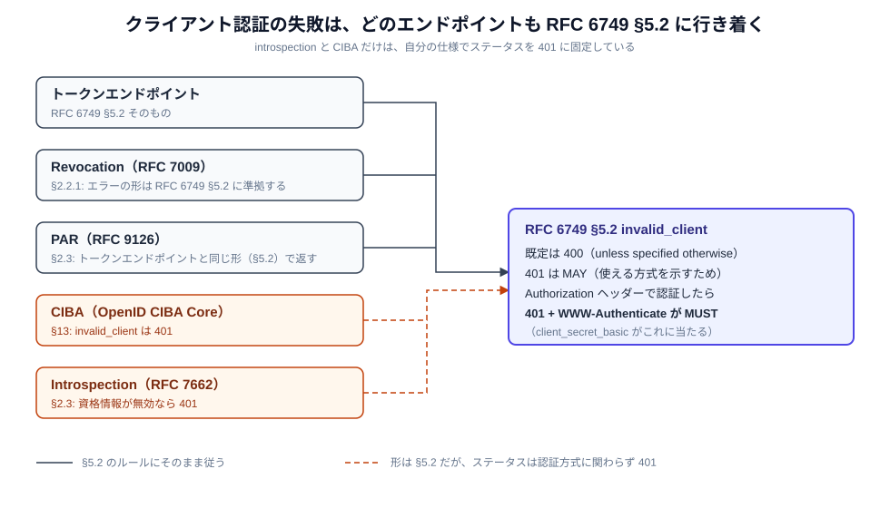

# クライアント認証に失敗したときの応答

クライアント認証に失敗したとき、認可サーバーは `invalid_client` を返します。ただし HTTP ステータスが 400 か 401 か、`WWW-Authenticate` ヘッダーを付けるかどうかは、**どのエンドポイントか**と**クライアントがどの方式で認証しようとしたか**で変わります。このドキュメントでは、複数の RFC にまたがるこのルールを整理します。



---

## どの RFC が何を決めているか

クライアント認証をするエンドポイントは、どれもエラーの形を RFC 6749 §5.2 に合わせます。ただし Introspection と CIBA は、`invalid_client` のステータスを自分の仕様で 401 に決めています。

| エンドポイント | 根拠 | 原文 |
|---|---|---|
| トークン | RFC 6749 §5.2 | 次の節 |
| Revocation | RFC 7009 §2.2.1 | "The error presentation conforms to the definition in Section 5.2 of [RFC6749]." |
| PAR | RFC 9126 §2.3 | "the authorization server returns an error response with the same format as is specified for error responses from the token endpoint in Section 5.2 of [RFC6749]" |
| CIBA | CIBA Core 1.0 §13 | "HTTP 401 Unauthorized: invalid_client — Client authentication failed (e.g., invalid client credentials, unknown client, no client authentication included, or unsupported authentication method)." |
| Introspection | RFC 7662 §2.3 | "If the protected resource uses OAuth 2.0 client credentials to authenticate to the introspection endpoint and its credentials are invalid, the authorization server responds with an HTTP 401 (Unauthorized) as described in Section 5.2 of OAuth 2.0 [RFC6749]." |

---

## RFC 6749 §5.2 の読み方

> The authorization server responds with an HTTP 400 (Bad Request) status code (unless specified otherwise) …
>
> invalid_client … The authorization server MAY return an HTTP 401 (Unauthorized) status code to indicate which HTTP authentication schemes are supported. If the client attempted to authenticate via the "Authorization" request header field, the authorization server MUST respond with an HTTP 401 (Unauthorized) status code and include the "WWW-Authenticate" response header field matching the authentication scheme used by the client.

エラー応答の既定は 400 で、`invalid_client` でも 401 は MAY です。401 が MUST になるのは、**`Authorization` ヘッダーで認証しようとしたとき**だけです。そのときは、クライアントが使ったのと同じスキームの `WWW-Authenticate` を付けます。

| 認証方式 | 資格情報の置き場所 | `invalid_client` のステータス |
|---|---|---|
| `client_secret_basic` | `Authorization` ヘッダー | **401 + `WWW-Authenticate: Basic`（MUST）** |
| `client_secret_post` | ボディ | 400（401 は MAY） |
| `private_key_jwt` / `client_secret_jwt` | ボディ（`client_assertion`） | 400（401 は MAY） |
| `tls_client_auth` / `self_signed_tls_client_auth` | TLS | 400（401 は MAY） |
| `attest_jwt_client_auth` | `OAuth-Client-Attestation` ヘッダー（`Authorization` ではない） | 400（401 は MAY） |

条件は「クライアントがどの方式で**登録されているか**」ではなく、「そのリクエストで**`Authorization` ヘッダーを使ったか**」です。`client_secret_post` で登録されたクライアントが Basic を送ってきた場合も、存在しない `client_id` で Basic を送ってきた場合も、このルールが当てはまります。

### `WWW-Authenticate: Basic` には `realm` が要る

Basic スキームのチャレンジでは `realm` パラメータが必須です。

> The authentication parameter 'realm' is REQUIRED（RFC 7617 §2）

```http
HTTP/1.1 401 Unauthorized
WWW-Authenticate: Basic realm="https://idp.example.com"
```

`realm` は保護空間の名前で、値はサーバーが決めます。

### 1 つのリクエストで使える認証方式は 1 つ

> The client MUST NOT use more than one authentication method in each request.（RFC 6749 §2.3）

`client_secret_post` で登録したクライアントが、ボディのシークレットに加えて Basic ヘッダーも送るのは、この規定に反します。

---

## Introspection だけの特別ルール（RFC 7662 §2.3）

RFC 7662 §2.3 は 2 つのことを決めています。

1. **認証方式に関わらず 401**。§5.2 の「既定は 400」を上書きします。
2. **`active: false` は認可されたクエリだけに使う**。認証エラーには使いません。

> Note that a properly formed and authorized query for an inactive or otherwise invalid token (or a token the protected resource is not allowed to know about) is not considered an error response by this specification. In these cases, the authorization server MUST instead respond with an introspection response with the "active" field set to "false" as described in Section 2.2.

| 状況 | 応答 |
|---|---|
| Resource Server の認証は成功し、トークンが無効（期限切れ・失効・未知） | `200` + `{"active": false}`。エラー応答ではない |
| Resource Server 自身の資格情報が無効 | `401` + `{"error": "invalid_client"}`。`active` は返さない |

`active` は RFC 7662 で唯一の必須フィールドなので、そこだけを見る Resource Server は多くあります。認証エラーに `active: false` を返すと、Resource Server は「自分の資格情報が壊れている」ことを「トークンが無効」と読み、原因に気づけません。

---

## 例外: `use_attestation_challenge` は 400

Attestation-Based Client Authentication の `use_attestation_challenge` だけは、認可サーバーが 400 を返すと決められています。

> An Authorization Server that requires a Challenge that the Client did not provide, or that rejects the Challenge contained in the Client Attestation PoP JWT, MUST respond with an HTTP 400 (Bad Request) status code and the error code `use_attestation_challenge`（draft-ietf-oauth-attestation-based-client-auth-11 §6.1）

同じ draft の `invalid_client_attestation` と `use_fresh_attestation` には専用のステータスがなく、RFC 6749 のルールに従います（§7.4）。

---

## まとめ

| 状況 | ステータス | `WWW-Authenticate` |
|---|---|---|
| `Authorization` ヘッダー（Basic）で認証しようとして失敗 | 401（MUST） | `Basic realm="…"`（MUST） |
| それ以外の方式で失敗（トークン・Revocation・PAR） | 400 が既定、401 も可 | 付けなくてよい |
| それ以外の方式で失敗（Introspection・CIBA） | 401 | 付けなくてよい |
| Introspection で認証は成功、トークンが無効 | 200 + `active: false` | — |
| `use_attestation_challenge` | 400 | — |

---

## 参考リンク

- [RFC 6749 §2.3 Client Authentication / §5.2 Error Response](https://www.rfc-editor.org/rfc/rfc6749#section-5.2)
- [RFC 7009 §2.2.1 Error Response](https://www.rfc-editor.org/rfc/rfc7009#section-2.2.1)
- [RFC 7617 §2 The 'Basic' Authentication Scheme](https://www.rfc-editor.org/rfc/rfc7617#section-2)
- [RFC 7662 §2.3 Error Response](https://www.rfc-editor.org/rfc/rfc7662#section-2.3)
- [RFC 9126 §2.3 Error Response](https://www.rfc-editor.org/rfc/rfc9126#section-2.3)
- [OpenID CIBA Core 1.0 §13 Authentication Error Response](https://openid.net/specs/openid-client-initiated-backchannel-authentication-core-1_0.html#rfc.section.13)
- [draft-ietf-oauth-attestation-based-client-auth-11 §6.1 / §7.4](https://www.ietf.org/archive/id/draft-ietf-oauth-attestation-based-client-auth-11.html)
