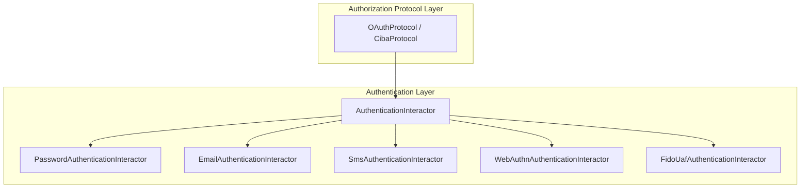

# Authentication Flow

## Overview

The Authentication Flow in idp-server provides a flexible and extensible authentication architecture designed for multi-tenant environments.
It supports a wide range of authentication methods, including Multi-Factor Authentication (MFA).

Each authentication interaction is delegated to a dedicated interactor, enabling clear separation of logic for various factors such as:

* Password-based authentication
* Email / SMS One-Time Passwords (OTP)
* Passkey / WebAuthn authentication
* FIDO UAF
* Custom authenticators per tenant

These authenticators can be composed and chained based on tenant-defined authentication policies that depend on client, user attributes, scopes, or requested ACR values.
The flow ensures session integrity, transaction logging, and emits detailed security events for each step.

## Component Diagram (Mermaid)



---

## Java API Layer

```java
public AuthenticationInteractionRequestResult interact(
    TenantIdentifier tenantIdentifier,
    AuthorizationRequestIdentifier authorizationRequestIdentifier,
    AuthenticationInteractionType type,
    AuthenticationInteractionRequest request,
    RequestAttributes requestAttributes) {
    
}
```
- Entry point for processing an authentication interaction.
- Responsible for resolving tenant, protocol, and retrieving the authorization request/session.
- Delegates interaction to a suitable `AuthenticationInteractor`.

---

## Use Case Layer

```java
AuthenticationInteractor authenticationInteractor = authenticationInteractors.get(type);
AuthenticationInteractionRequestResult result =
    authenticationInteractor.interact(
        tenant,
        authorizationIdentifier,
        type,
        request,
        authenticationTransaction,
        userQueryRepository);
```
- Each interactor implements one type of authentication step.
- After performing the interaction (e.g. send email OTP, verify password), returns a result.
- Updates the `AuthenticationTransaction` based on the result.

---

## Protocol Layer

```java
OAuthProtocol oAuthProtocol = oAuthProtocols.get(tenant.authorizationProtocolProvider());
AuthorizationRequest authorizationRequest =
    oAuthProtocol.get(tenant, authorizationRequestIdentifier);
```
- Protocol-specific logic (OAuth, OIDC, FAPI).
- Handles `authorize` behavior once interaction is complete.

---

## Code Reference

- API Entry: `OAuthFlowEntryService.interact(...)`
- Interactors: `org.idp.server.core.authentication.*.*Interactor`
- Transaction management: `AuthenticationTransaction.update(...)`
- Session update: `OAuthSession.didAuthentication(...)`
- Events: `SecurityEventPublisher.publish(...)`
