# Authorization Flow

This document describes how the **idp-server** handles OAuth2.0 and OpenID Connect authorization flows, including token issuance, validation, and lifecycle handling.

## Overview

The idp-server supports multiple OAuth2/OIDC flows:

- Authorization Code Flow (with PKCE)
- Client Credentials Flow
- Resource Owner Password Credentials Flow (optional)
- CIBA (Client-Initiated Backchannel Authentication)
- Refresh Token Grant

---

## Diagram: Authorization Flow (Layered View)

```mermaid
flowchart TD
  A[🌐 OAuthV1Api SpringBoot] --> B[🧩 OAuthFlowEntryService use-cases]
  B --> C[🔁 OAuthProtocols]
  C --> D[🧠 DefaultOAuthProtocol core]

  D --> D1[🔍 OAuthRequestHandler]
  D --> D2[✅ OAuthAuthorizeHandler]
  D --> D3[🚫 OAuthDenyHandler]
  D --> D4[📤 OAuthHandler logout, view-data]

  B --> E[📦 AuthenticationTransactionRepository]
  B --> F[💾 OAuthSessionDelegate]
  B --> G[📢 OAuthFlowEventPublisher]
```



This layered modular structure ensures extensibility, tenant-specific protocol behavior, and security auditability.

---

## Implementation Details

The authorization flow in `idp-server` is implemented in a layered structure as follows:

### 1. API Layer - `OAuthV1Api` (SpringBoot Adapter)

This class provides REST endpoints for initiating and managing authorization requests:

- `GET /{tenant-id}/api/v1/authorizations`: Start authorization request
- `POST /{id}/authorize`: Authorize the request
- `POST /{id}/deny`: Deny the request
- `POST /{id}/{mfa-type}`: Handle MFA interaction
- `POST /{id}/federations/{type}/{provider}`: Handle federated login
- Delegates all logic to the `OAuthFlowApi` interface.

---

### 2. Use Case Layer - `OAuthFlowEntryService`

Implements `OAuthFlowApi`. Responsibilities include:

- Parsing requests via `OAuthRequest`
- Finding the right `OAuthProtocol` implementation
- Registering and updating `AuthenticationTransaction`
- Handling session lifecycle via `OAuthSessionDelegate`
- Publishing security events (e.g., `authorize`, `deny`, `mfa`, `federation`)

---

### 3. Protocol Layer - `OAuthProtocol` Interface

The actual protocol logic (e.g., Authorization Code Flow, OIDC) lives here.

The default implementation is `DefaultOAuthProtocol` which uses:

- `OAuthRequestHandler` → Parses, verifies, persists `AuthorizationRequest`
- `OAuthAuthorizeHandler` → Issues `AuthorizationCode`, generates response
- `OAuthDenyHandler` → Creates `OAuthDenyResponse`
- `OAuthHandler` → Fetches request info and handles logout

The request validation and verification logic is extensible per spec (OIDC, FAPI, etc).

---

### 4. Protocol Dispatcher - `OAuthProtocols`

Maps a tenant’s `AuthorizationProtocolProvider` to an appropriate `OAuthProtocol`.

This allows dynamic protocol switching and future support for profiles other authorization engine.

---

### 🔐 Profile Resolution & Request Verification

When a new authorization request is received, the server determines the **authorization profile** (e.g., OAuth2, OIDC, FAPI) and applies corresponding validation logic.

This step is handled by the `OAuthRequestVerifier`, which performs:

#### 1. Base Profile Verification

Based on the resolved `AuthorizationProfile`, the request is validated by one of the following:

- `OAuth2RequestVerifier`
- `OidcRequestVerifier`
- `FapiBaselineVerifier`
- `FapiAdvanceVerifier`

These verifiers check the core requirements for each profile according to RFCs and security guidelines.

#### 2. Extension Verification

After base verification, additional validators may run depending on the request content:

- `PckeVerifier` – Validates PKCE parameters (`code_challenge`, etc.)
- `RequestObjectVerifier` – Validates signed or encrypted `request` / `request_uri`
- `OAuthAuthorizationDetailsVerifier` – Validates `authorization_details` (RAR)
- `JarmVerifier` – Validates JARM-signed responses
- `OAuthVerifiableCredentialVerifier` – Handles OIDC4VC specific checks

These are applied **dynamically** depending on request type (`OAuthRequestPattern`) and parameters.

---

### 📘 Code Reference

```java
public class OAuthRequestVerifier {

  static Map<AuthorizationProfile, AuthorizationRequestVerifier> baseVerifiers = new HashMap<>();
  static List<AuthorizationRequestExtensionVerifier> extensionVerifiers = new ArrayList<>();

  static {
    baseVerifiers.put(AuthorizationProfile.OAUTH2, new OAuth2RequestVerifier());
    baseVerifiers.put(AuthorizationProfile.OIDC, new OidcRequestVerifier());
    baseVerifiers.put(AuthorizationProfile.FAPI_BASELINE, new FapiBaselineVerifier());
    baseVerifiers.put(AuthorizationProfile.FAPI_ADVANCE, new FapiAdvanceVerifier());
    extensionVerifiers.add(new PckeVerifier());
    extensionVerifiers.add(new RequestObjectVerifier());
    extensionVerifiers.add(new OAuthAuthorizationDetailsVerifier());
    extensionVerifiers.add(new JarmVerifier());
    extensionVerifiers.add(new OAuthVerifiableCredentialVerifier());
  }

  public void verify(OAuthRequestContext context) {
    AuthorizationRequestVerifier baseRequestVerifier = baseVerifiers.get(context.profile());
    if (Objects.isNull(baseRequestVerifier)) {
      throw new UnSupportedException(
          String.format("idp server unsupported profile (%s)", context.profile().name()));
    }
    baseRequestVerifier.verify(context);
    extensionVerifiers.forEach(
        verifier -> {
          if (verifier.shouldNotVerify(context)) {
            return;
          }
          verifier.verify(context);
        });
  }
}
```


