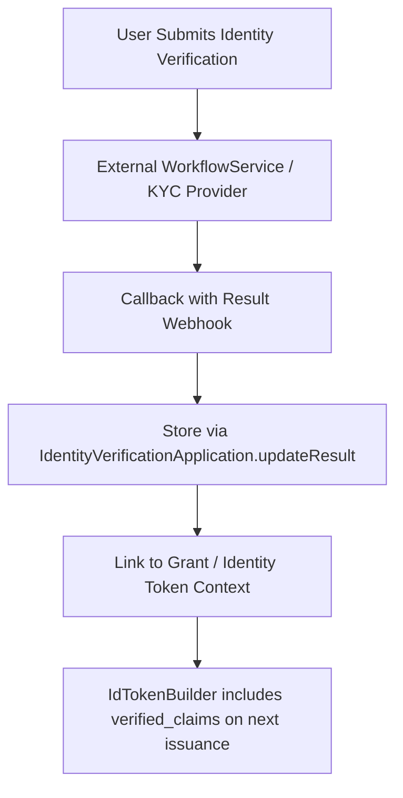

# Identity Verification (OIDC4IDA)

## 1. Overview

Identity Verification is a core component of high-assurance authentication systems. It ensures that the individual accessing a service has been properly identified using official and trustworthy methods, such as document-based verification or face recognition.

In the context of OpenID Connect, identity verification results can be conveyed to relying parties via the verified_claims field in the ID Token, following the OIDC for Identity Assurance (OIDC4IDA) specification.

This process is commonly implemented as eKYC (electronic Know Your Customer) and is widely used in:

* 🏦 Financial services (e.g., account opening, lending)
* 📱 Telecom (e.g., SIM registration)
* 🏛 Government services (e.g., MyNumber, digital ID)
* 💼 Employment and education onboarding

### Purpose of Identity Verification

* 🔐 Provide high trust in digital identity
* ⚖️ Comply with legal and regulatory frameworks (AML/CFT, FATF, eIDAS, etc.)
* 📄 Digitally verify official documents (e.g., passport, ID card)
* 🔄 Reuse verified identity attributes across different services (portable eKYC)

---

## 2. eKYC Integration Notes

- `identity_verification_application` tracks application state and result
- Trust framework and evidence type must be pre-agreed by the tenant (e.g., `de_aml`, `jp_my_number`)
- Supports **asynchronous** flow via webhook, or **synchronous** response API
- Webhook result can contain:
    - Document types (e.g., `id_document`, `utility_bill`)
    - Method (`pipp`, `sripp`, `face-to-face`)
    - Confidence score and verification timestamp

Example evidence entry:
```json
{
  "type": "id_document",
  "method": "sripp",
  "document": {
    "type": "passport",
    "issuer": "JP"
  },
  "time": "2025-04-01T11:00:00Z"
}
```

## 3. Structure of `verified_claims`

```json
"verified_claims": {
  "verification": {
    "trust_framework": "de_aml",
    "time": "2025-04-01T12:00:00Z",
    "evidence": [
      {
        "type": "id_document",
        "method": "pipp",
        "time": "2025-04-01T11:00:00Z"
      }
    ]
  },
  "claims": {
    "given_name": "Taro",
    "family_name": "Yamada",
    "birthdate": "1990-01-01"
  }
}
```

### Explanation

| Field             | Description                                                     |
| ----------------- | --------------------------------------------------------------- |
| `trust_framework` | Indicates the legal or regulatory framework used (e.g. `eidas`) |
| `evidence`        | One or more pieces of evidence used for verification            |
| `claims`          | Verified attributes like name, birthdate, address               |

---

## 4. Verification Flow



### Sequence

1. The user submits identity documents (e.g., passport, MyNumber, etc.)
2. The system sends data to an external verifier (KYC provider)
3. Once verification is complete, a webhook callback provides the result
4. The system records verification metadata and updates the linked grant
5. Upon the next token issuance, `verified_claims` are embedded if policy permits

---

## 5. Implementation Notes

* Verification state is managed via `IdentityVerificationApplication`
* Grant metadata stores verification results
* `IdTokenBuilder` conditionally includes `verified_claims`
* Each tenant can customize accepted `trust_framework` and `evidence`
* Supports integration with both async and sync external verification APIs

---

## 6. Use Cases

* eKYC onboarding
* Financial services (AML compliance)
* Government-issued identity binding
* Employment / education credentialing

This modular approach enables interoperability with identity verification ecosystems while ensuring privacy, extensibility, and regulatory alignment.
