# Core Concepts Overview

`idp-server` is a modern, multi-tenant Identity Provider (IdP) designed to support OAuth 2.0 / OIDC / FAPI / CIBA /
Verifiable Credentials issuance / external integrations.

Below is a high-level architecture diagram.

```mermaid
graph TD
subgraph UserSide
browser[🧑‍💻 Web Browser]
end

subgraph Frontend
frontend[🌐 React / Next.js]
end

subgraph RpBackend
rp[🎯 RP Backend]
end

subgraph Backend
backend[🔧 Spring Boot API]
idp[🔥🚀 IdP Engine]
authz[🔐 AuthZProvider]
hook[📡 Hook Executors]
authn[🛡️ Authentication Interactors]
cred[🏷️ Credential Issuers]
federation[🌐 Federatable OIDC Providers]
ssf[📬 SSF Notifier]
datasource[🗄 DataSource]
end

subgraph External
slack[🔔 Slack Webhook]
webhook[🔄 Generic Webhook Endpoint]
oidc[🌍 External OIDC Provider]
publicvc[🌟 Public Credential Issuer]
end

browser --> frontend
frontend --> backend
rp --> backend
backend --> idp
idp --> datasource

idp --> authz
idp --> authn
idp --> hook
idp --> cred
idp --> federation
idp --> ssf

hook --> slack
hook --> webhook
federation --> oidc
cred --> publicvc
```



## Layer Responsibilities

### Frontend

* Next.js-based admin UI and user-facing sign-in UI
* Theme and hostname can be customized per tenant

### API Gateway

* Routing via NGINX, ALB, or other gateway
* Domain isolation per tenant

### Backend

* idp-server: Handles authorization, authentication, MFA, federation, VC issuance, and hooks
* Worker: Executes queued asynchronous tasks (e.g., FIDO key deletion, VC notifications)

### External Systems

* Integrates with external systems (FIDO servers, VC issuers, Slack, Webhooks)

### Storage

* PostgreSQL: Main DB (JSONB structure, tenant separation)
* Redis: Optional use for session, queue, and caching

## Interfaces and Extension Points

`idp-server` is highly extensible, offering safe mechanisms to inject custom logic.

### 1. SPI-based Extension (Service Provider Interface)

* Uses Java `ServiceLoader` to dynamically register implementations
* Requires only a service declaration file in `META-INF/services`

**Examples:** ``, `AuthenticationInteractor`, `SecurityEventHookExecutor`

```java
public interface SecurityEventHookExecutor {

    SecurityEventHookType type();

    default boolean shouldNotExecute(
            Tenant tenant,
            SecurityEvent securityEvent,
            SecurityEventHookConfiguration hookConfiguration) {
        return !hookConfiguration.hasTrigger(securityEvent.type().value());
    }

    SecurityEventHookResult execute(
            Tenant tenant, SecurityEvent securityEvent, SecurityEventHookConfiguration configuration);
}

```

→ Enables custom Slack or external API notifications

---

### 2. Settings-driven DI (Dependency Injection)

* Behavior is driven by `.settings.json` files
* Auth methods, MFA, and federation logic can vary per tenant/client/user

```json
{
  "authentication_methods": [
    "password",
    "passkey"
  ],
  "mfa": {
    "enabled": true,
    "methods": [
      "email",
      "fido"
    ]
  }
}
```

---

### 3. Extension Interfaces

| Interface                      | Purpose                                                                      |
|--------------------------------|------------------------------------------------------------------------------|
| `AuthenticationInteractor`     | Implements custom authentication logic per method (e.g., password, WebAuthn) |
| `SecurityEventHookExecutor`    | Publishes or notifies on security events (e.g., to webhook, Slack)           |
| `FederationInteractor`         | Controls SSO federation behavior (e.g., Google, Azure AD)                    |
| `OidcSsoExecutor`              | Handles external OIDC authentication and federated login flow                |
| `FidoUafExecutor`              | (Future) Executes FIDO UAF authentication if supported                       |
| `EmailSender`                  | Sends email-based OTPs, MFA, or notification messages                        |
| `AuthenticationDeviceNotifier` | Push notification sender (e.g., FCM or APNs for device-based auth)           |
| `SmsAuthenticationExecutor`    | Sends and verifies SMS-based authentication codes                            |
| `UserHintResolver`             | Resolves a user based on a hint (e.g., `login_hint`, `id_token_hint`)        |
| `ProtocolProvider`             | Supplies the `OAuthProtocol` or `CibaProtocol` implementation                |

---

These interfaces make it easy to safely replace or inject external integrations for IdP federation, hooks,
authentication, VC issuance, and data storage logic.

## Planned Extensions

* Distributed async processing with Kafka or Amazon SQS
* Cloud Spanner support for scalable relational storage
* Built-in observability with Datadog or Prometheus

---

Next, we will introduce detailed component breakdowns and authentication/authorization flow diagrams.
