# Event & Hook System

This document describes the **event-driven architecture** and **hook execution system** of `idp-server`, designed for extensibility, observability, and security enforcement in modern Identity workflows.

---

## 🎯 Objectives

- Emit structured events for all major authentication and authorization activities.
- Allow tenant-specific hook execution (e.g., Slack, Webhook, Audit).
- Enable easy integration with external systems (SIEM, alerting, BI).
- Isolate core flow logic from side-effect execution.

---

## 🔽 Diagram: Hook Execution Overview

```mermaid
flowchart TD
  A[🔐 SecurityEventPublisher] --> B[📨 EventHandler]
  B --> C1[🪝 SlackHookExecutor]
  B --> C2[🔄 WebhookExecutor]
  B --> C3[📄 AuditLogger]
  C1 --> D1[✅ Slack Notification]
  C2 --> D2[✅ Webhook POST]
  C3 --> D3[📝 DB or log etc]
```



---

## 🧩 Core Concepts

### 1. Security Events

- Represent meaningful actions within the identity lifecycle (e.g., `oauth_authorize`, `mfa_failure`, `federation_callback_success`, etc).
- Each event includes:
    - `tenant_id`
    - `event_type` (enum)
    - `timestamp`
    - `subject` (if available)
    - `requestAttributes` (IP, UA, traceId, etc)
    - `eventPayload` (JSON map)

### 2. SecurityEventPublisher

- Core class responsible for publishing events during flow execution.
- Used directly in services like `OAuthFlowEntryService`, `TokenEntryService`, etc.

```java
eventPublisher.publish(
  tenant,
  authorizationRequest,
  user,
  DefaultSecurityEventType.oauth_authorize,
  requestAttributes);
```

---

## 🔌 Hook Execution Pipeline

### 1. SecurityEventHookConfiguration

- Per-tenant hook configuration, stored as JSON.
- Example: Slack

```json
{
  "type": "SLACK",
  "triggers": [
    "user_signup"
  ],
  "details": {
    "base": {
      "description": "slack common notification",
      "incoming_webhook_url": "https://hooks.slack.com/services/xxx",
      "message_template": "🔐 type: ${trigger} / user: ${user.id} / tenant: ${tenant.id} / client: ${client.id}"
    },
    "overlays": {
      "user_deletion": {
        "description": "slack user_deletion notification",
        "incoming_webhook_url": "https://hooks.slack.com/services/xxx",
        "message_template": "⚠ user_deletion: ${user.email}"
      }
    }
  }
}

```

### 2. SecurityEventHookExecutor

- Executes registered hooks in **parallel** or **fallback chain** mode.
- Implements `HookExecutionResult` to record success/failure per target.

### 3. SecurityEventHookResult

- Result of each hook execution attempt:
    - `hookType`
    - `status` (`success`, `failure`)
    - `error` (if any)
    - `payload`

---

## 🗂️ Persistence

- `security_event_hook_results` table tracks all hook execution results (for auditing):

```sql
CREATE TABLE security_event_hook_results
(
  id CHAR(36) NOT NULL,
  tenant_id CHAR(36) NOT NULL,
  security_event_id CHAR(36) NOT NULL,
  security_event_type  VARCHAR(255) NOT NULL,
  security_event_hook VARCHAR(255) NOT NULL,
  security_event_payload JSONB NOT NULL,
  status VARCHAR(255) NOT NULL,
  created_at TIMESTAMP DEFAULT now() NOT NULL,
  updated_at TIMESTAMP DEFAULT now() NOT NULL,
  PRIMARY KEY (id)
);
```

---

## 🧪 Testability

- All hooks are defined via interface (`HookExecutor`)
- Use mock web servers (e.g., WireMock) to simulate remote integrations
- Retry and fallback strategy configurable

---

## 🛣️ Future Enhancements

- Retry policy (exponential backoff)
- Dead letter queue for failed hook executions
- Kafka-based event stream support
- Fine-grained per-event-type hook selection

---
