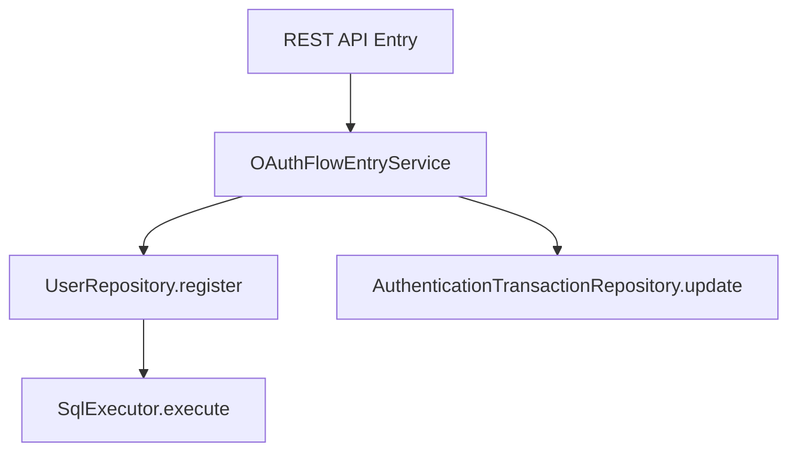

# Transaction Management

## 1. Overview

The `idp-server` implements its own **framework-independent transaction management layer** to support portability across
different application stacks (e.g., Spring Boot, Quarkus, Jakarta EE). This allows transaction propagation and boundary
control without being tightly coupled to a specific DI or web framework.

---

## 2. Custom Transaction Annotation

```java

@Transaction
public class OAuthFlowEntryService implements OAuthFlowApi {
    // transactional service logic
}
```

- The `@Transaction` annotation marks a class or method as transactional.
- This is processed by an external adapter (e.g., Spring AOP, interceptor) which begins and ends the transaction.
- Supports **declarative transaction boundary control**.

---

## 3. Transaction Propagation

The current `@Transaction` system supports the following propagation behavior:

| Propagation Type | Supported | Description                                                                               |
|------------------|-----------|-------------------------------------------------------------------------------------------|
| REQUIRED         | ✅ Yes     | Creates a new transaction if none exists. Throws error if a transaction already exists.   |
| REQUIRES_NEW     | ❌ No      | Not supported. Nested or suspended transactions are not yet implemented.                  |
| SUPPORTS         | ❌ No      | Not supported. All transactional methods must run within an explicit transaction context. |

> Note: The transaction system is framework-independent and uses ThreadLocal to manage transaction state. Multi-level
> propagation or nested transactions are not yet supported.


---

## 4. Adapter Integration

Each runtime environment can implement its own handler for the `@Transaction` annotation:

- **Spring Boot**: via `@Transactional` mapped from custom annotation
- **Standalone Java**: via manual `TransactionManager.begin()` / `commit()` / `rollback()`
- **Jakarta EE**: via interceptor binding

---

## 5. Sample Flow



All database calls within the flow are covered by a single transaction scope defined at the service level.

---

## 6. Error Handling and Rollback

On exception (e.g., runtime or checked exception wrapped by the framework), the transaction is automatically rolled
back.

- Integration with centralized exception handler is recommended
- Custom rollback rules can be configured per adapter

---

## 7. Implementation Classes

- `@Transaction` annotation: in `org.idp.server.basic.datasource`
- Adapter entrypoints: e.g., `TenantAwareEntryServiceProxy`
- Repository interface: designed for command/query separation (`register()`, `update()`)

---

This modular transaction architecture ensures portability, extensibility, and safe data consistency across all identity
and authorization flows.

## 8. Row-Level Security (RLS) Integration

To ensure strict tenant-based data isolation, `idp-server` uses **PostgreSQL Row-Level Security (RLS)** in combination with its custom transaction management layer.

### 🔐 Key Concepts

* All multi-tenant tables define RLS policies like:

  ```sql
  CREATE POLICY rls_<table_name>
    ON <table_name>
    USING (tenant_id = current_setting('app.tenant_id')::uuid);
  ```

* Enforcement is enabled with:

  ```sql
  ALTER TABLE <table_name> FORCE ROW LEVEL SECURITY;
  ```

### 🔧 RLS Context Propagation

The `TransactionManager` ensures the correct tenant context is applied to each DB connection:

```java
private static void setTenantId(Connection conn, String tenantIdentifier) {
    stmt.execute("SET app.tenant_id = '" + tenantIdentifier + "'");
}
```

* This sets the session-level variable `app.tenant_id` used by RLS policies.
* It **must be set before any SQL execution**, including metadata queries.
* The tenant ID is passed explicitly as a `TenantIdentifier` argument into all service-level methods.

### 💡 Best Practices

* **Avoid enabling RLS on the `tenant` table** if it is required to resolve the tenant context early in the request lifecycle.

* After applying Flyway migrations, always run:

  ```sql
  GRANT SELECT, INSERT, UPDATE, DELETE ON ALL TABLES IN SCHEMA public TO idp_app_user;
  ```

* Use `ALTER DEFAULT PRIVILEGES` to ensure future tables and sequences are covered:

  ```sql
  ALTER DEFAULT PRIVILEGES FOR ROLE postgres
    IN SCHEMA public
    GRANT SELECT, INSERT, UPDATE, DELETE ON TABLES TO idp_app_user;

  ALTER DEFAULT PRIVILEGES FOR ROLE postgres
    IN SCHEMA public
    GRANT USAGE, SELECT ON SEQUENCES TO idp_app_user;
  ```

### 🔪 Debugging Tips

* List all active RLS policies:

  ```sql
  SELECT * FROM pg_policies WHERE schemaname = 'public';
  ```

* Verify user-level permissions:

  ```sql
  SELECT * FROM information_schema.role_table_grants
  WHERE grantee = 'idp_app_user' AND table_schema = 'public';
  ```

---

This design ensures **multi-tenant safety at the database level** while retaining full portability across different deployment environments.

