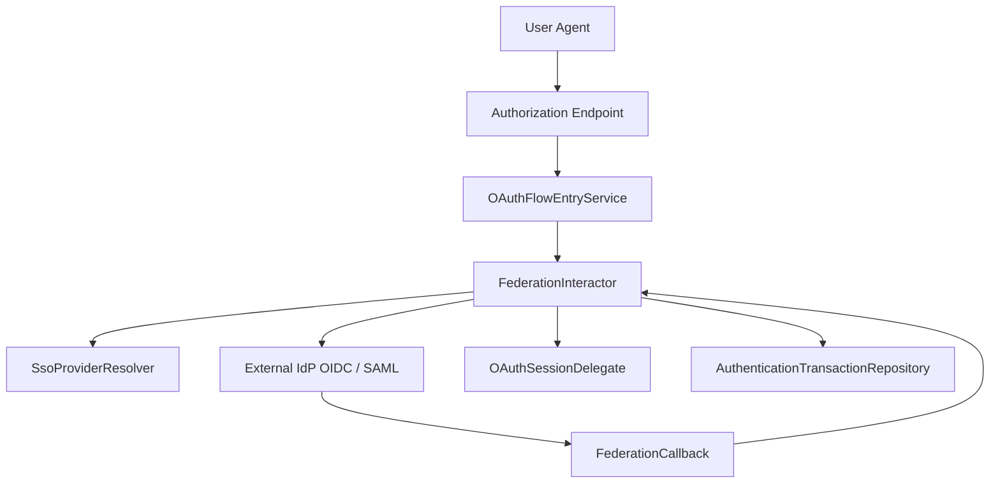

# Federation Architecture

## 1. Overview

The **federation architecture** in `idp-server` enables integration with external identity providers (IdPs) using standardized protocols such as:

- OpenID Connect (OIDC)
- SAML 2.0 (planned)

It is designed to be **pluggable and extensible**, supporting tenant-specific federated login flows while decoupling federation logic from core authorization processing.

---

## 2. Use Cases

- Enterprise SSO with providers like Google Workspace or Azure AD
- Citizen login via national digital identity systems (e.g., My Number)
- Education federations (e.g., GakuNin / eduGAIN)
- Bring Your Own IdP model for multi-tenant SaaS platforms

---

## 3. High-Level Architecture

- **SsoProviderResolver** determines the external IdP endpoint and metadata per tenant
- **FederationInteractor** coordinates the redirect to external IdP and handles the callback
- Verified user info is mapped to the internal user model and linked to the authorization request

---

## 4. Flow Summary

1. **Initiation**:  
   `POST /{id}/federations/{type}/{provider}`  
   → `OAuthFlowEntryService.requestFederation(...)`

2. **Redirect to External IdP**  
   → Built using provider-specific metadata via `SsoProviderResolver`

3. **Callback Handling**  
   → `FederationInteractor.callback(...)` verifies the response and constructs user context

4. **User Session Linking**  
   → If verification is successful, session and authentication transaction are updated

5. **Continue Authorization**  
   → Federated identity is treated like any other authentication result

---

## 5. Extensibility

Federation support is **strategy-based**:

- Each `FederationType` (e.g., OIDC, SAML) has its own `FederationInteractor`
- External IdP metadata is loaded dynamically via `SsoProvider`
- Tenant-specific routing and protocol behavior is supported

You can easily:

- Add new federation types (e.g., Wallet-based login)
- Customize mappings (claims, nameID formats, etc.)
- Inject custom behavior for identity resolution or attribute transformation

---

## 6. Future Roadmap

- ✅ OIDC Federation (currently supported)
- 🔜 SAML 2.0 Federation (via OpenSAML or similar)
- 🔜 Decentralized Identity (DID / VC-based login)
- 🔒 Federation trust chain validation
