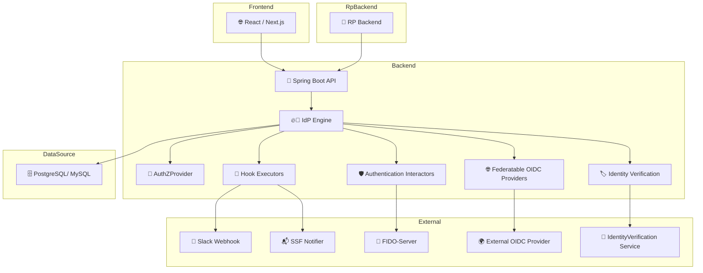
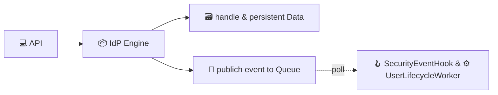

# Introduction

Welcome to **idp-server**, an open-source Identity Provider (IdP) engine designed for modern authentication and authorization needs.

## What is `idp-server`?

`idp-server` is not just an identity provider —  
**it is a full-featured, extensible identity framework** designed for modern, multi-tenant SaaS environments.  
It supports OAuth 2.0, OpenID Connect, CIBA, FAPI, and verifiable credentials.

Designed with a clear separation of concerns, `idp-server` is built as a **framework-agnostic core** —  
capable of integrating into any application stack while keeping protocol logic, authentication flows, and session control modular and customizable.

### Key Features
- Framework-independent core logic
- Fully pluggable authentication and authorization flows
- Dynamic, per-tenant configuration
- Built-in support for session control, hooks, and federation
- Production-ready support for multi-tenancy and database isolation

Yes — **idp-server is a framework**.  
It empowers developers to build enterprise-grade identity platforms with flexibility, structure, and control.

## Key Goals

- ✅ **Comprehensive Spec Coverage**: Full support for OAuth2, OIDC, and FAPI profiles.
- 🔌 **Extensible**: Clean modular design with interfaces for MFA, federation, logging, and more.
- 🏢 **Enterprise-Ready**: Multi-tenancy, security events, and audit trails are built-in.
- ⚡ **Performance-Oriented**: Minimal dependencies, efficient caching, and scalable architecture.
- 🛠️ **Self-Hosted & Open**: Your data, your control.

## Use Cases

- Ensure strong identity assurance in critical domains (e.g., government, finance, telecom) using formally verified user attributes (verified_claims)
- Custom IdP for B2B SaaS platforms
- Secure authentication layer for enterprise services
- OIDC adapter for legacy identity systems

## Architecture Overview

This diagram illustrates the high-level architecture of the idp-server system.

* Frontend: Typically implemented with React or Next.js, it interacts with the backend to initiate login, consent, and session flows.
* RP Backend: The relying party (RP) server handles OIDC client responsibilities and interacts with the IdP over standard OAuth/OIDC protocols.
* Backend: The main Spring Boot API layer delegates all identity and authorization logic to the internal idp-server engine.
* IdP Engine: Core logic for authentication (authn), authorization (authz), hooks (hook), federation, and identity verification (ida).
* DataSource: All persistent data (sessions, grants, user attributes) are stored in a PostgreSQL backend.
* External Services:
  * 🔔 Slack, 📬 SSF Notifier: For real-time security events and monitoring.
  * 🔐 FIDO-Server: For WebAuthn and Passkey authentication support.
  * 🌍 OIDC Provider: External IdPs for federated login.
  * 🌟 IdentityVerification Service: For eKYC and verified_claims inclusion.

This architecture enables extensibility and pluggability via clear component boundaries and async event-based processing.

## Async Processing: Hooks & Workers

The idp-server uses an event-driven architecture to handle asynchronous operations such as user lifecycle management and security event notifications.
When key actions occur (e.g., user creation, authorization), the system publishes events to a queue. These events are then processed by dedicated workers and hook executors, allowing external integrations (e.g., Slack, Webhooks) and background processing without blocking the main flow.

---

More details in the [Getting Started](../getting-started/index.md) section.
