# Introduction

Welcome to **idp-server**, an open-source Identity Provider (IdP) engine designed for modern authentication and authorization needs.

## What is idp-server?

`idp-server` is a lightweight, extensible, and specification-compliant Identity Provider that supports:

- OAuth 2.0 (RFC 6749)
- OpenID Connect (OIDC)
- FAPI (Financial-grade API)
- Client-Initiated Backchannel Authentication (CIBA)
- Multi-Factor Authentication (MFA)
- Verifiable Credentials (VC)
- Federation with external IdPs (OIDC / SAML)

It is built for developers who need full control, customization, and easy integration into existing systems.

## Key Goals

- ✅ **Comprehensive Spec Coverage**: Full support for OAuth2, OIDC, and FAPI profiles.
- 🔌 **Extensible**: Clean modular design with interfaces for MFA, federation, logging, and more.
- 🏢 **Enterprise-Ready**: Multi-tenancy, security events, and audit trails are built-in.
- ⚡ **Performance-Oriented**: Minimal dependencies, efficient caching, and scalable architecture.
- 🛠️ **Self-Hosted & Open**: Your data, your control.

## Use Cases

- Custom IdP for B2B SaaS platforms
- Secure authentication layer for enterprise services
- OIDC adapter for legacy identity systems
- Issuer of Verifiable Credentials under decentralized identity models

## Architecture Overview

```mermaid

graph TD
  subgraph UserSide
    browser[🧑‍💻 Web Browser]
  end

  subgraph Frontend
    frontend[🌐 React / Next.js]
  end

  subgraph RpBackend
    rp[🎯 RP Backend]
  end

  subgraph Backend
    backend[🔧 Spring Boot API]
    idp[🔥🚀 IdP Engine]
    authz[🔐 AuthZProvider]
    hook[📡 Hook Executors]
    authn[🛡️ Authentication Interactors]
    cred[🏷️ Credential Issuers]
    federation[🌐 Federatable OIDC Providers]
    ssf[📬 SSF Notifier]
    datasource[🗄 DataSource]
  end

  subgraph External
    slack[🔔 Slack Webhook]
    webhook[🔄 Generic Webhook Endpoint]
    oidc[🌍 External OIDC Provider]
    publicvc[🌟 Public Credential Issuer]
  end

  browser --> frontend
  frontend --> backend
  rp --> backend
  backend --> idp
  idp --> datasource

  idp --> authz
  idp --> authn
  idp --> hook
  idp --> cred
  idp --> federation
  idp --> ssf

  hook --> slack
  hook --> webhook
  federation --> oidc
  cred --> publicvc

```

---

More details in the [Getting Started](../getting-started/index.md) section.
