# Introduction

Welcome to **idp-server**, an open-source Identity Provider (IdP) engine designed for modern authentication and authorization needs.

## What is idp-server?

`idp-server` is a lightweight, extensible, and specification-compliant Identity Provider that supports:

- OAuth 2.0 (RFC 6749)
- OpenID Connect (OIDC)
- FAPI (Financial-grade API)
- Client-Initiated Backchannel Authentication (CIBA)
- Multi-Factor Authentication (MFA)
- OpenID Connect for Identity Assurance 1.0 (OIDC4IDA)
- Federation with external IdPs (OIDC / SAML)

It is built for developers who need full control, customization, and easy integration into existing systems.

## Key Goals

- ✅ **Comprehensive Spec Coverage**: Full support for OAuth2, OIDC, and FAPI profiles.
- 🔌 **Extensible**: Clean modular design with interfaces for MFA, federation, logging, and more.
- 🏢 **Enterprise-Ready**: Multi-tenancy, security events, and audit trails are built-in.
- ⚡ **Performance-Oriented**: Minimal dependencies, efficient caching, and scalable architecture.
- 🛠️ **Self-Hosted & Open**: Your data, your control.

## Use Cases

- Ensure strong identity assurance in critical domains (e.g., government, finance, telecom) using formally verified user attributes (verified_claims)
- Custom IdP for B2B SaaS platforms
- Secure authentication layer for enterprise services
- OIDC adapter for legacy identity systems

## Architecture Overview

```mermaid

graph TD

  subgraph Frontend
    frontend[🌐 React / Next.js]
  end

  subgraph RpBackend
    rp[🎯 RP Backend]
  end

  subgraph Backend
    backend[🔧 Spring Boot API]
    idp[🔥🚀 IdP Engine]
    authz[🔐 AuthZProvider]
    hook[📡 Hook Executors]
    authn[🛡️ Authentication Interactors]
    ida[🏷️ Identity Verification]
    federation[🌐 Federatable OIDC Providers]
    
  end
  
  subgraph DataSource
    datasource[🗄 PostgreSQL/ MySQL]
  end

  subgraph External
    slack[🔔 Slack Webhook]
    ssf[📬 SSF Notifier]
    fido[🔐 FIDO-Server]
    oidc[🌍 External OIDC Provider]
    verification[🌟 IdentityVerification Service]
  end

  frontend --> backend
  rp --> backend
  backend --> idp
  idp --> datasource

  idp --> authz
  idp --> authn
  idp --> hook
  idp --> ida
  idp --> federation

  hook --> slack
  hook --> ssf
  authn --> fido
  federation --> oidc
  ida --> verification
```

This diagram illustrates the high-level architecture of the idp-server system.

* Frontend: Typically implemented with React or Next.js, it interacts with the backend to initiate login, consent, and session flows.
* RP Backend: The relying party (RP) server handles OIDC client responsibilities and interacts with the IdP over standard OAuth/OIDC protocols.
* Backend: The main Spring Boot API layer delegates all identity and authorization logic to the internal idp-server engine.
* IdP Engine: Core logic for authentication (authn), authorization (authz), hooks (hook), federation, and identity verification (ida).
* DataSource: All persistent data (sessions, grants, user attributes) are stored in a PostgreSQL backend.
* External Services:
  * 🔔 Slack, 📬 SSF Notifier: For real-time security events and monitoring.
  * 🔐 FIDO-Server: For WebAuthn and Passkey authentication support.
  * 🌍 OIDC Provider: External IdPs for federated login.
  * 🌟 IdentityVerification Service: For eKYC and verified_claims inclusion.

This architecture enables extensibility and pluggability via clear component boundaries and async event-based processing.

## Async Processing: Hooks & Workers

```mermaid
flowchart LR
    A[💻 API] --> B[📦 IdP Engine]
B --> C[🗃️ handle & persistent Data]
B --> D[📢 publich event to Queue ]
D -.->|poll| E[🪝 SecurityEventHook & ⚙️ UserLifecycleWorker]

```

The idp-server uses an event-driven architecture to handle asynchronous operations such as user lifecycle management and security event notifications.
When key actions occur (e.g., user creation, authorization), the system publishes events to a queue. These events are then processed by dedicated workers and hook executors, allowing external integrations (e.g., Slack, Webhooks) and background processing without blocking the main flow.

---

More details in the [Getting Started](../getting-started/index.md) section.
