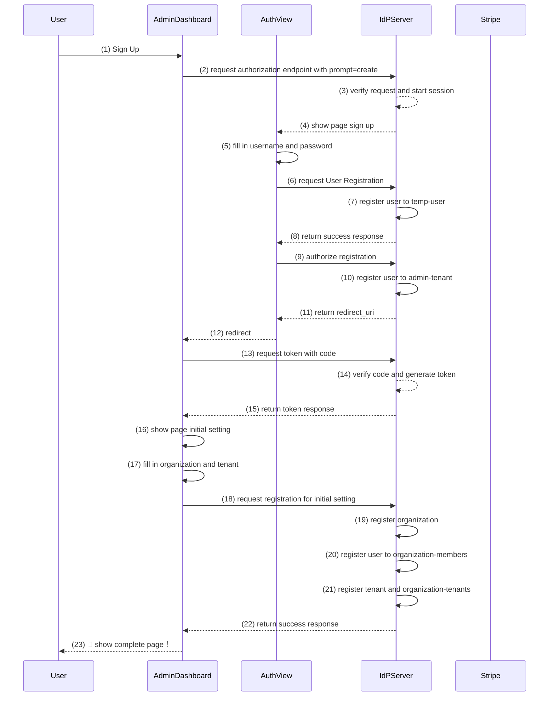

# AdminUser Signup

## 1. AdminUser Sign-Up

```mermaid
sequenceDiagram
    participant User
    participant AdminDashboard
    participant AuthView
    participant IdPServer
    participant Stripe

    User ->> AdminDashboard: (1) Sign Up
    AdminDashboard ->> IdPServer: (2) request authorization endpoint with prompt=create

    IdPServer -->> IdPServer: (3) verify request and start session
    IdPServer -->> AuthView: (4) show page sign up
    AuthView ->> AuthView: (5) fill in username and password
    AuthView ->> IdPServer: (6) request User Registration
    IdPServer ->> IdPServer: (7) register user to temp-user
    IdPServer -->> AuthView: (8) return success response
    AuthView ->> IdPServer: (9) authorize registration
    IdPServer ->> IdPServer: (10) register user to admin-tenant
    IdPServer -->> AuthView: (11) return redirect_uri
    AuthView -->> AdminDashboard: (12) redirect

    AdminDashboard ->> IdPServer: (13) request token with code
    IdPServer -->> IdPServer: (14) verify code and generate token
    IdPServer -->> AdminDashboard: (15) return token response

    AdminDashboard ->> AdminDashboard: (16) show page initial setting
    AdminDashboard ->> AdminDashboard: (17) fill in organization and tenant
    AdminDashboard ->> IdPServer: (18) request registration for initial setting
    IdPServer ->> IdPServer: (19) register organization
    IdPServer ->> IdPServer: (20) register user to organization-members
    IdPServer ->> IdPServer: (21) register tenant and organization-tenants
    IdPServer -->> AdminDashboard: (22) return success response

    AdminDashboard -->> User: (23) 🎉 show complete page！

```