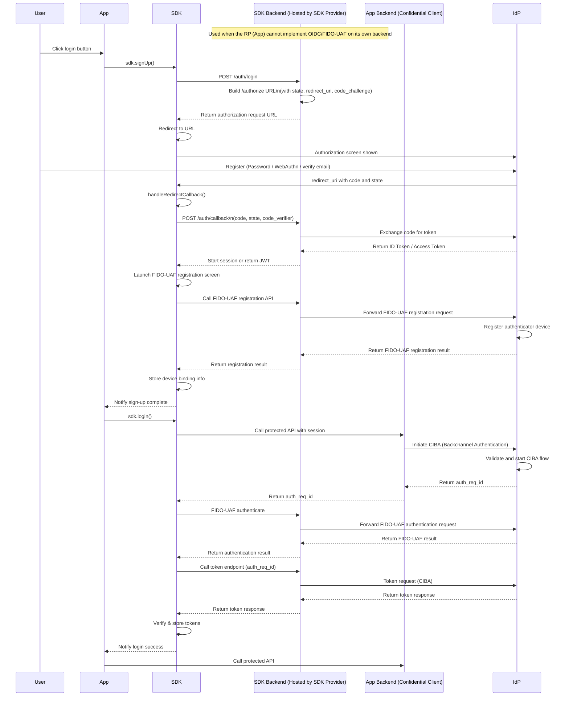

# End User Use Cases

## 1. Sign-Up

```mermaid
sequenceDiagram
    participant User
    participant App
    participant SDK
    participant SDKBackend as SDK Backend (Hosted by SDK Provider)
    participant AppBackend as App Backend (Confidential Client)
    participant IdP

    Note over SDKBackend: Used when the RP (App) cannot implement OIDC/FIDO-UAF on its own backend

    User ->> App: Click login button
    App ->> SDK: sdk.signUp()
    SDK ->> SDKBackend: POST /auth/login
    SDKBackend ->> SDKBackend: Build /authorize URL\n(with state, redirect_uri, code_challenge)
    SDKBackend -->> SDK: Return authorization request URL
    SDK ->> SDK: Redirect to URL
    SDK ->> IdP: Authorization screen shown
    User ->> IdP: Register (Password / WebAuthn / verify email)
    IdP ->> SDK: redirect_uri with code and state
    SDK ->> SDK: handleRedirectCallback()
    SDK ->> SDKBackend: POST /auth/callback\n(code, state, code_verifier)
    SDKBackend ->> IdP: Exchange code for token
    IdP -->> SDKBackend: Return ID Token / Access Token
    SDKBackend -->> SDK: Start session or return JWT

    SDK ->> SDK: Launch FIDO-UAF registration screen
    SDK ->> SDKBackend: Call FIDO-UAF registration API
    SDKBackend ->> IdP: Forward FIDO-UAF registration request
    IdP ->> IdP: Register authenticator device
    IdP -->> SDKBackend: Return FIDO-UAF registration result
    SDKBackend -->> SDK: Return registration result
    SDK ->> SDK: Store device binding info
    SDK -->> App: Notify sign-up complete

    App ->> SDK: sdk.login()
    SDK ->> AppBackend: Call protected API with session
    AppBackend ->> IdP: Initiate CIBA (Backchannel Authentication)
    IdP ->> IdP: Validate and start CIBA flow
    IdP -->> AppBackend: Return auth_req_id
    AppBackend -->> SDK: Return auth_req_id
    SDK ->> SDKBackend: FIDO-UAF authenticate
    SDKBackend ->> IdP: Forward FIDO-UAF authentication request
    IdP -->> SDKBackend: Return FIDO-UAF result
    SDKBackend -->> SDK: Return authentication result
    SDK ->> SDKBackend: Call token endpoint (auth_req_id)
    SDKBackend ->> IdP: Token request (CIBA)
    IdP -->> SDKBackend: Return token response
    SDKBackend -->> SDK: Return token response
    SDK ->> SDK: Verify & store tokens
    SDK -->> App: Notify login success

    App ->> AppBackend: Call protected API

```